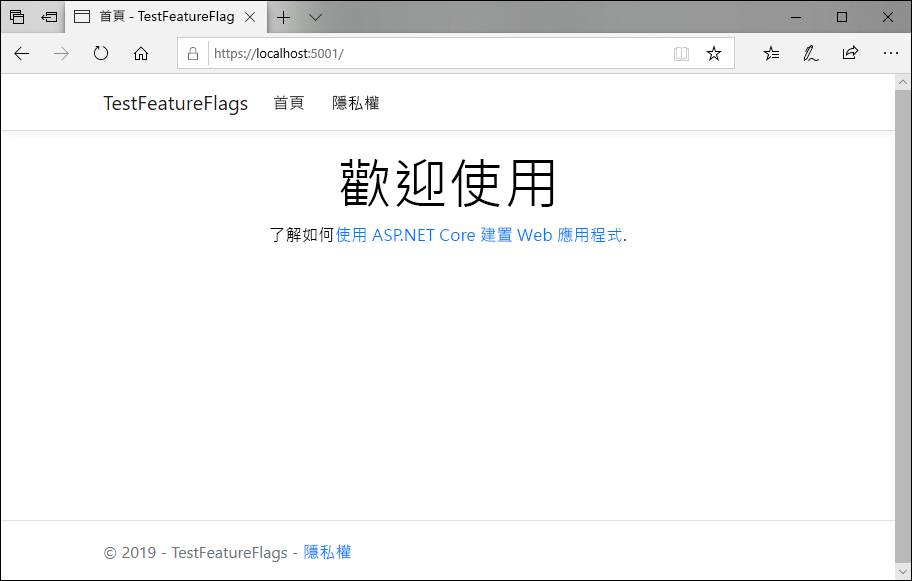
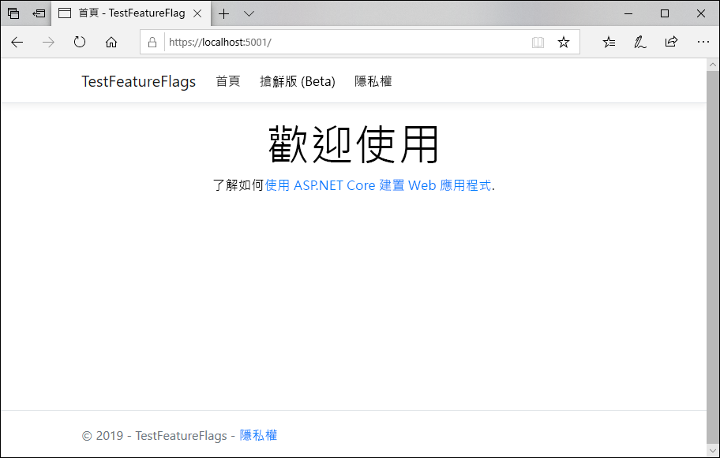

# <a name="quickstart-add-feature-flags-to-an-aspnet-core-app"></a>快速入門：將功能旗標新增至 ASP.NET Core 應用程式

您可以將應用程式連線至 Azure 應用程式組態，以在 ASP.NET Core 中啟用功能管理。 您可以使用此受控服務來儲存所有功能旗標和集中控制其狀態。 本快速入門說明如何將應用程式組態納入 ASP.NET Core Web 應用程式中，以建立功能管理的端對端實作。

.NET Core 功能管理程式庫可透過全方位的功能旗標支援來擴充架構。 這些程式庫會建置在 .NET Core 組態系統之上。 並且可透過 .NET Core 組態提供者完美地與應用程式組態整合。

您可以使用任何程式碼編輯器來進行本快速入門中的步驟。 於 Windows、macOS 和 Linux 平台上所提供的 [Visual Studio Code](https://code.visualstudio.com/) 是項不錯的選擇。

## <a name="prerequisites"></a>必要條件

若要進行本快速入門，請安裝 [.NET Core SDK](https://dotnet.microsoft.com/download)。

[!INCLUDE [quickstarts-free-trial-note](../../includes/quickstarts-free-trial-note.md)]

## <a name="create-an-app-configuration-store"></a>建立應用程式組態存放區

[!INCLUDE [azure-app-configuration-create](../../includes/azure-app-configuration-create.md)]

6. 選取 [功能管理員]   > [+建立]  以新增下列功能旗標：

    | Key | State |
    |---|---|
    | Beta | 關閉 |

## <a name="create-an-aspnet-core-web-app"></a>建立 ASP.NET Core Web 應用程式

您會使用 [.NET Core 命令列介面 (CLI)](https://docs.microsoft.com/dotnet/core/tools/) 來建立新的 ASP.NET Core MVC Web 應用程式專案。 使用 .NET Core CLI 而非 Visual Studio 的好處，在於 .NET Core CLI 在 Windows、macOS 和 Linux 平台上都可供使用。

1. 為您的專案建立新資料夾。 本快速入門會將其命名為 TestFeatureFlags  。

1. 在新的資料夾中，執行下列命令以建立新的 ASP.NET Core MVC Web 應用程式專案：

   ```    
   dotnet new mvc
   ```

## <a name="add-secret-manager"></a>新增祕密管理員

將[祕密管理員工具](https://docs.microsoft.com/aspnet/core/security/app-secrets) \(機器翻譯\) 新增至您的專案。 祕密管理員工具能儲存專案樹狀結構外開發工作的敏感性資料。 此作法能協助避免於原始程式碼內意外共用應用程式祕密。

1. 開啟 .csproj  檔案。
1. 新增 `UserSecretsId` 元素 (如下列範例所示)，並將其值取代為您自己的值 (此值通常是 GUID)：

    ```xml
    <Project Sdk="Microsoft.NET.Sdk.Web">

    <PropertyGroup>
        <TargetFramework>netcoreapp2.1</TargetFramework>
        <UserSecretsId>79a3edd0-2092-40a2-a04d-dcb46d5ca9ed</UserSecretsId>
    </PropertyGroup>

    <ItemGroup>
        <PackageReference Include="Microsoft.AspNetCore.App" />
        <PackageReference Include="Microsoft.AspNetCore.Razor.Design" Version="2.1.2" PrivateAssets="All" />
    </ItemGroup>

    </Project>
    ```

1. 儲存檔案。

## <a name="connect-to-an-app-configuration-store"></a>連線至應用程式組態存放區

1. 透過執行下列命令，將參考新增至 `Microsoft.Azure.AppConfiguration.AspNetCore` NuGet 套件：

    ```
    dotnet add package Microsoft.Azure.AppConfiguration.AspNetCore --version 2.0.0-preview-009200001-7
    ```

1. 執行下列命令以還原您專案的套件：

    ```
    dotnet restore
    ```

1. 將名為 ConnectionStrings:AppConfig  的祕密新增至祕密管理員。

    此祕密會包含用來存取應用程式組態存放區的連接字串。 請以應用程式組態存放區的連接字串取代下列命令中的 `<your_connection_string>` 值。

    此命令必須在和 *.csproj* 檔案相同的目錄中執行。

    ```
    dotnet user-secrets set ConnectionStrings:AppConfig <your_connection_string>
    ```

    祕密管理員僅可用來在本機測試 Web 應用程式。 例如，當您將應用程式部署至 [Azure App Service](https://azure.microsoft.com/services/app-service) 時，您會使用 App Service 中名為**連接字串**的應用程式設定，而不會使用祕密管理員來儲存連接字串。

    您可以使用應用程式組態 API 來存取此秘密。 在所有支援的平台上，應用程式組態 API 的組態名稱中都適用冒號 (:)。 請參閱[取決於環境的組態](https://docs.microsoft.com/aspnet/core/fundamentals/configuration)。

1. 開啟 Program.cs  ，並將參考新增至 .NET Core 應用程式組態提供者：

    ```csharp
    using Microsoft.Extensions.Configuration.AzureAppConfiguration;
    ```

1. 藉由呼叫 `config.AddAzureAppConfiguration()` 方法將 `CreateWebHostBuilder` 方法更新為使用應用程式設定。

    ```csharp
    public static IWebHostBuilder CreateWebHostBuilder(string[] args) =>
        WebHost.CreateDefaultBuilder(args)
            .ConfigureAppConfiguration((hostingContext, config) =>
            {
                var settings = config.Build();
                config.AddAzureAppConfiguration(options => {
                    options.Connect(settings["ConnectionStrings:AppConfig"])
                           .UseFeatureFlags();
                });
            })
            .UseStartup<Startup>();
    ```

1. 開啟 Startup.cs  ，並將參考新增至 .NET Core 功能管理員：

    ```csharp
    using Microsoft.FeatureManagement.AspNetCore;
    ```

1. 藉由呼叫 `services.AddFeatureManagement()` 方法更新 `ConfigureServices` 方法，以新增功能旗標支援。 (選擇性) 您可以呼叫 `services.AddFeatureFilter<FilterType>()`，以納入要用於功能旗標的任何篩選條件：

    ```csharp
    public void ConfigureServices(IServiceCollection services)
    {
        services.AddFeatureManagement();
    }
    ```

1. 更新 `Configure` 方法，以新增中介軟體，讓功能旗標值依週期性間隔重新整理，同時讓 ASP.NET Core Web 應用程式繼續接收要求。

    ```csharp
    public void Configure(IApplicationBuilder app, IHostingEnvironment env)
    {
        app.UseAzureAppConfiguration();
        app.UseMvc();
    }
    ```

1. 新增 MyFeatureFlags.cs  檔案：

    ```csharp
    namespace TestFeatureFlags
    {
        public enum MyFeatureFlags
        {
            Beta
        }
    }
    ```

1. 將 BetaController.cs  新增至 *Controllers* 目錄：

    ```csharp
    using Microsoft.AspNetCore.Mvc;
    using Microsoft.FeatureManagement;
    using Microsoft.FeatureManagement.Mvc;

    namespace TestFeatureFlags.Controllers
    {
        public class BetaController: Controller
        {
            private readonly IFeatureManager _featureManager;

            public BetaController(IFeatureManagerSnapshot featureManager)
            {
                _featureManager = featureManager;
            }

            [FeatureGate(MyFeatureFlags.Beta)]
            public IActionResult Index()
            {
                return View();
            }
        }
    }
    ```

1. 在 *Views* 目錄中開啟 _ViewImports.cshtml  ，並新增功能管理員標記協助程式：

    ```html
    @addTagHelper *, Microsoft.FeatureManagement.AspNetCore
    ```

1. 在 *Views*\\*Shared* 目錄中開啟 _Layout.cshtml  ，並將 `<body>` > `<header>` 底下的 `<nav>` 條碼列取代為下列程式碼：

    ```html
    <nav class="navbar navbar-expand-sm navbar-toggleable-sm navbar-light bg-white border-bottom box-shadow mb-3">
        <div class="container">
            <a class="navbar-brand" asp-area="" asp-controller="Home" asp-action="Index">TestFeatureFlags</a>
            <button class="navbar-toggler" type="button" data-toggle="collapse" data-target=".navbar-collapse" aria-controls="navbarSupportedContent"
            aria-expanded="false" aria-label="Toggle navigation">
            <span class="navbar-toggler-icon"></span>
            </button>
            <div class="navbar-collapse collapse d-sm-inline-flex flex-sm-row-reverse">
                <ul class="navbar-nav flex-grow-1">
                    <li class="nav-item">
                        <a class="nav-link text-dark" asp-area="" asp-controller="Home" asp-action="Index">Home</a>
                    </li>
                    <feature name="Beta">
                    <li class="nav-item">
                        <a class="nav-link text-dark" asp-area="" asp-controller="Beta" asp-action="Index">Beta</a>
                    </li>
                    </feature>
                    <li class="nav-item">
                        <a class="nav-link text-dark" asp-area="" asp-controller="Home" asp-action="Privacy">Privacy</a>
                    </li>
                </ul>
            </div>
        </div>
    </nav>
    ```

1. 在 *Views* 下建立 *Beta* 目錄，並在其中新增 Index.cshtml  ：

    ```html
    @{
        ViewData["Title"] = "Beta Home Page";
    }

    <h1>
        This is the beta website.
    </h1>
    ```

## <a name="build-and-run-the-app-locally"></a>於本機建置並執行應用程式

1. 若要使用 .NET Core CLI 來建置應用程式，請在命令殼層中執行下列命令：

    ```
    dotnet build
    ```

1. 建置成功完成後，請執行下列命令以在本機執行 Web 應用程式：

    ```
    dotnet run
    ```

1. 開啟瀏覽器視窗，並前往 `https://localhost:5001` (這是本機所裝載 Web 應用程式的預設 URL)。

    

1. 登入 [Azure 入口網站](https://portal.azure.com)。 選取 [所有資源]  ，然後選取您在快速入門中建立的應用程式組態存放區執行個體。

1. 選取 [功能管理員]  ，然後將 Beta  金鑰的狀態變更為 [開啟]  ：

    | Key | State |
    |---|---|
    | Beta | 另一 |

1. 重新整理瀏覽器頁面，以查看新的組態設定。

    

## <a name="clean-up-resources"></a>清除資源

[!INCLUDE [azure-app-configuration-cleanup](../../includes/azure-app-configuration-cleanup.md)]

## <a name="next-steps"></a>後續步驟

在本快速入門中，您已建立新的應用程式組態存放區，並透過[功能管理程式庫](https://go.microsoft.com/fwlink/?linkid=2074664)用它來管理 ASP.NET Core Web 應用程式中的功能。

- 深入了解[功能管理](./concept-feature-management.md)。
- [管理功能旗標](./manage-feature-flags.md)。
- [在 ASP.NET Core 應用程式中使用功能旗標](./use-feature-flags-dotnet-core.md)。
