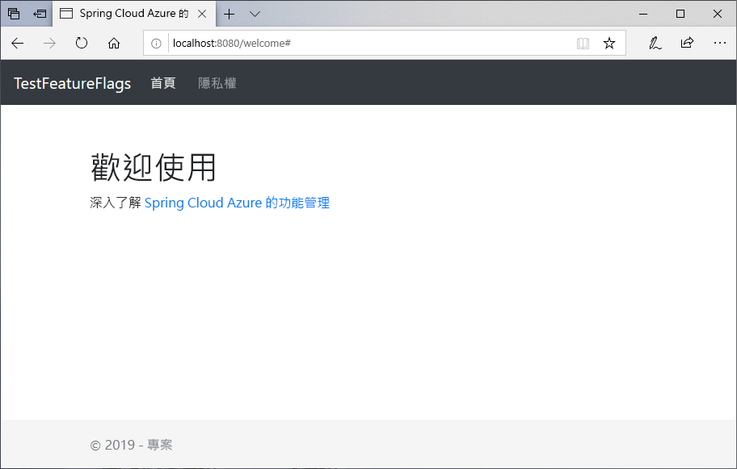
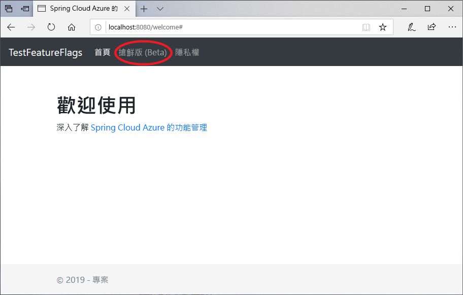

# <a name="quickstart-add-feature-flags-to-a-spring-boot-app"></a>快速入門：將功能旗標新增至 Spring Boot 應用程式

在本快速入門中，您會將 Azure 應用程式組態納入 Spring Boot Web 應用程式中，以建立功能管理的端對端實作。 您可以使用應用程式組態服務來集中儲存所有功能旗標及控制其狀態。

Spring Boot 功能管理程式庫可透過全方位的功能旗標支援來擴充架構。 這些程式庫**不會**相依於任何 Azure 程式庫。 它們可透過 Spring Boot 組態提供者完美地與應用程式組態整合。

## <a name="prerequisites"></a>必要條件

- Azure 訂用帳戶 - [建立免費帳戶](https://azure.microsoft.com/free/)
- 受支援的 [Java 開發套件 JDK](https://docs.microsoft.com/java/azure/jdk) 第 8 版。
- [Apache Maven](https://maven.apache.org/download.cgi) 3.0 版或更新版本。

## <a name="create-an-app-configuration-store"></a>建立應用程式組態存放區

[!INCLUDE [azure-app-configuration-create](../../includes/azure-app-configuration-create.md)]

6. 選取 [功能管理員]   > [+建立]  以新增下列功能旗標：

    | Key | State |
    |---|---|
    | Beta | 關閉 |

## <a name="create-a-spring-boot-app"></a>建立 Spring Boot 應用程式

您會使用 [Spring Initializr](https://start.spring.io/) 來建立新的 Spring Boot 專案。

1. 瀏覽至 <https://start.spring.io/>。

2. 指定下列選項：

   - 使用 **Java** 產生 **Maven** 專案。
   - 指定 **Spring Boot** 版本，應等於或大於 2.0。
   - 指定應用程式的**群組**和**成品**名稱。
   - 新增 **Web** 相依性。

3. 在指定先前的選項之後，選取 [產生專案]  。 出現提示時，將專案下載至本機電腦上的路徑。

## <a name="add-feature-management"></a>新增功能管理

1. 當您在本機系統上擷取檔案之後，就可以開始編輯簡單的 Spring Boot 應用程式。 在應用程式的根目錄中尋找 pom.xml  檔案。

2. 在文字編輯器中開啟 pom.xml  檔案，並將 Spring Cloud Azure 組態 Starter 和功能管理新增至 `<dependencies>` 的清單：

    ```xml
    <dependency>
        <groupId>com.microsoft.azure</groupId>
        <artifactId>spring-cloud-starter-azure-appconfiguration-config</artifactId>
        <version>1.1.0.M4</version>
    </dependency>
    <dependency>
        <groupId>com.microsoft.azure</groupId>
        <artifactId>spring-cloud-azure-feature-management-web</artifactId>
        <version>1.1.0.M4</version>
    </dependency>
    <dependency>
            <groupId>org.springframework.boot</groupId>
            <artifactId>spring-boot-starter-thymeleaf</artifactId>
    </dependency>
    ```

> [!Note]
> 有一個非 Web 功能管理程式庫不會相依於 Spring Web。 請參閱其他[文件](https://github.com/microsoft/spring-cloud-azure/tree/master/spring-cloud-azure-feature-management)以了解差異。 此外，未使用應用程式組態時，請參閱[功能旗標宣告](https://github.com/microsoft/spring-cloud-azure/tree/master/spring-cloud-azure-feature-management#feature-flag-declaration)。

## <a name="connect-to-an-app-configuration-store"></a>連線至應用程式組態存放區

1. 開啟位於應用程式資源目錄下的 `bootstrap.properties`，然後將下列幾行新增至該檔案。 新增應用程式組態資訊。

    ```properties
    spring.cloud.azure.appconfiguration.stores[0].name= ${APP_CONFIGURATION_CONNECTION_STRING}
    ```

2. 在您組態存放區的應用程式組態入口網站中，移至 [存取金鑰]。 選取 [唯讀金鑰] 索引標籤。在此索引標籤中，複製其中一個連接字串的值，並將它新增為變數名稱為 `APP_CONFIGURATION_CONNECTION_STRING` 的新環境變數。

3. 開啟主要的應用程式 Java 檔案，並新增 `@EnableConfigurationProperties` 來啟用這項功能。

    ```java
    @SpringBootApplication
    @EnableConfigurationProperties(MessageProperties.class)
    public class AzureConfigApplication {
        public static void main(String[] args) {
            SpringApplication.run(AzureConfigApplication.class, args);
        }
    }
    ```

4. 在應用程式的 package 目錄中建立名為 HelloController.java  的新 Java 檔案。 加入下列幾行：

    ```java
    @Controller
    @ConfigurationProperties("controller")
    public class HelloController {

        private FeatureManager featureManager;

        public HelloController(FeatureManager featureManager) {
            this.featureManager = featureManager;
        }

        @GetMapping("/welcome")
        public String mainWithParam(Model model) {
            model.addAttribute("Beta", featureManager.isEnabled("Beta"));
            return "welcome";
        }
    }
    ```

5. 在應用程式的範本目錄中，建立名為 *welcome.html* 的新 HTML 檔案。 加入下列幾行：

    ```html
    <!DOCTYPE html>
    <html lang="en" xmlns:th="http://www.thymeleaf.org">
    <head>
        <meta charset="utf-8">
        <meta name="viewport" content="width=device-width, initial-scale=1, shrink-to-fit=no">
        <title>Feature Management with Spring Cloud Azure</title>

        <link rel="stylesheet" href="/css/main.css">
        <link rel="stylesheet" href="https://stackpath.bootstrapcdn.com/bootstrap/4.3.1/css/bootstrap.min.css" integrity="sha384-ggOyR0iXCbMQv3Xipma34MD+dH/1fQ784/j6cY/iJTQUOhcWr7x9JvoRxT2MZw1T" crossorigin="anonymous">

        <script src="https://code.jquery.com/jquery-3.3.1.slim.min.js" integrity="sha384-q8i/X+965DzO0rT7abK41JStQIAqVgRVzpbzo5smXKp4YfRvH+8abtTE1Pi6jizo" crossorigin="anonymous"></script>
        <script src="https://cdnjs.cloudflare.com/ajax/libs/popper.js/1.14.7/umd/popper.min.js" integrity="sha384-UO2eT0CpHqdSJQ6hJty5KVphtPhzWj9WO1clHTMGa3JDZwrnQq4sF86dIHNDz0W1" crossorigin="anonymous"></script>
        <script src="https://stackpath.bootstrapcdn.com/bootstrap/4.3.1/js/bootstrap.min.js" integrity="sha384-JjSmVgyd0p3pXB1rRibZUAYoIIy6OrQ6VrjIEaFf/nJGzIxFDsf4x0xIM+B07jRM" crossorigin="anonymous"></script>

    </head>
    <body>
        <header>
        <!-- Fixed navbar -->
        <nav class="navbar navbar-expand-md navbar-dark fixed-top bg-dark">
            <a class="navbar-brand" href="#">TestFeatureFlags</a>
            <button class="navbar-toggler" aria-expanded="false" aria-controls="navbarCollapse" aria-label="Toggle navigation" type="button" data-target="#navbarCollapse" data-toggle="collapse">
            <span class="navbar-toggler-icon"></span>
            </button>
            <div class="collapse navbar-collapse" id="navbarCollapse">
            <ul class="navbar-nav mr-auto">
                <li class="nav-item active">
                <a class="nav-link" href="#">Home <span class="sr-only">(current)</span></a>
                </li>
                <li class="nav-item" th:if="${Beta}">
                <a class="nav-link" href="#">Beta</a>
                </li>
                <li class="nav-item">
                <a class="nav-link" href="#">Privacy</a>
                </li>
            </ul>
            </div>
        </nav>
        </header>
        <div class="container body-content">
            <h1 class="mt-5">Welcome</h1>
            <p>Learn more about <a href="https://github.com/microsoft/spring-cloud-azure/blob/master/spring-cloud-azure-feature-management/README.md">Feature Management with Spring Cloud Azure</a></p>

        </div>
        <footer class="footer">
            <div class="container">
            <span class="text-muted">&copy; 2019 - Projects</span>
        </div>

        </footer>
    </body>
    </html>

    ```

6. 在 static 下建立名為 CSS 的新資料夾，並在其內部建立名為 *main.css* 的新 CSS 檔案。 加入下列幾行：

    ```css
    html {
    position: relative;
    min-height: 100%;
    }
    body {
    margin-bottom: 60px;
    }
    .footer {
    position: absolute;
    bottom: 0;
    width: 100%;
    height: 60px;
    line-height: 60px;
    background-color: #f5f5f5;
    }

    body > .container {
    padding: 60px 15px 0;
    }

    .footer > .container {
    padding-right: 15px;
    padding-left: 15px;
    }

    code {
    font-size: 80%;
    }
    ```

## <a name="build-and-run-the-app-locally"></a>於本機建置並執行應用程式

1. 使用 Maven 建置 Spring Boot 應用程式並加以執行；例如：

    ```shell
    mvn clean package
    mvn spring-boot:run
    ```

2. 開啟瀏覽器視窗，並前往 `https://localhost:8080` (這是本機所裝載 Web 應用程式的預設 URL)。

    

3. 在應用程式組態入口網站中選取 [功能管理員]  ，然後將 Beta  金鑰的狀態變更為 [開啟]  ：

    | Key | State |
    |---|---|
    | Beta | 另一 |

4. 重新整理瀏覽器頁面，以查看新的組態設定。

    

## <a name="clean-up-resources"></a>清除資源

[!INCLUDE [azure-app-configuration-cleanup](../../includes/azure-app-configuration-cleanup.md)]

## <a name="next-steps"></a>後續步驟

在本快速入門中，您已建立新的應用程式組態存放區，並透過[功能管理程式庫](https://go.microsoft.com/fwlink/?linkid=2074664)用它來管理 Spring Boot Web 應用程式中的功能。

- 深入了解[功能管理](./concept-feature-management.md)。
- [管理功能旗標](./manage-feature-flags.md)。
- [在 Spring Boot Core 應用程式中使用功能旗標](./use-feature-flags-spring-boot.md)。
