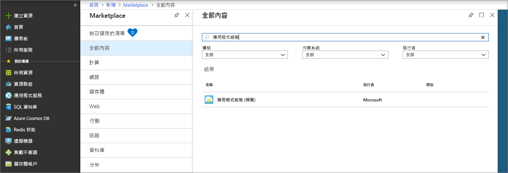
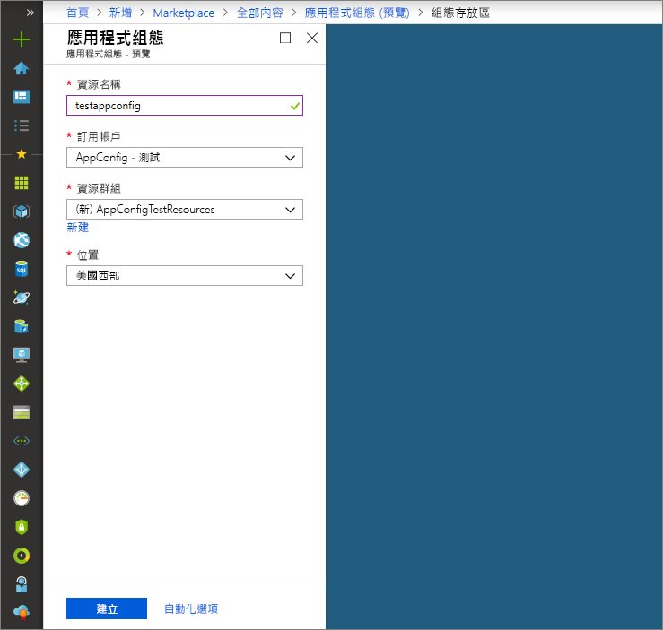

# <a name="quickstart-create-a-java-spring-app-with-app-configuration"></a>快速入門：使用應用程式設定建立 Java Spring 應用程式

Azure 應用程式設定是 Azure 中的受控設定服務。 您能用以輕鬆地在與程式碼分開的單一位置，儲存和管理您所有的應用程式設定。 本快速入門會示範如何將該服務納入 Java Spring 應用程式中。

您可以使用任何程式碼編輯器來進行本快速入門中的步驟。 於 Windows、macOS 和 Linux 平台上所提供的 [Visual Studio Code](https://code.visualstudio.com/) 是項不錯的選擇。

## <a name="prerequisites"></a>必要條件

若要進行本快速入門，請安裝支援的 [Java Development Kit (JDK)](https://aka.ms/azure-jdks) 第 8 版和 [Apache Maven](https://maven.apache.org/) 3.0 版或更新版本。

[!INCLUDE [quickstarts-free-trial-note](../../includes/quickstarts-free-trial-note.md)]

## <a name="create-an-app-configuration-store"></a>建立應用程式設定存放區

1. 若要建立新的應用程式設定存放區，請登入 [Azure 入口網站](https://aka.ms/azconfig/portal)。 在頁面的左上角，選取 [+ 建立資源]。 在 [搜尋 Marketplace] 方塊中，輸入**應用程式設定**，然後按 Enter。

    

2. 從搜尋結果中選取 [應用程式設定]，然後選取 [建立]。

3. 在 [應用程式設定] > [建立] 頁面上，輸入下列設定。

    | 設定 | 建議的值 | 說明 |
    |---|---|---|
    | **資源名稱** | 全域唯一的名稱 | 輸入要對應用程式設定存放區資源使用的唯一資源名稱。 名稱必須是介於 1 到 63 個字元的字串，而且只能包含數字、字母和 `-` 字元。 名稱的開頭或結尾不能是 `-` 字元，且連續的 `-` 字元無效。  |
    | **訂用帳戶** | 您的訂用帳戶 | 選取您要用來測試應用程式設定的 Azure 訂用帳戶。 如果您的帳戶僅有一個訂用帳戶，則會自動加以選取，而且不會顯示 [訂用帳戶] 下拉式清單。 |
    | **資源群組** | *AppConfigTestResources* | 為應用程式設定存放區資源選取或建立資源群組。 此群組可用於組織多個資源，以便能夠藉由刪除資源群組來同時刪除多個資源。 如需詳細資訊，請參閱[使用資源群組管理您的 Azure 資源](https://docs.microsoft.com/azure/azure-resource-manager/resource-group-overview)。 |
    | **位置** | *美國中部* | 使用 [位置] 來指定 SignalR 資源的裝載所在地理位置。 為獲得最佳效能，請在與應用程式其他元件相同的區域中建立資源。 |

    

4. 選取 [建立] 。 部署可能需要幾分鐘的時間才能完成。

5. 完成部署之後，請選取 [設定] > [存取金鑰]。 記下主要唯讀或主要讀寫索引鍵連接字串。 稍後，您會使用此連接字串來設定您的應用程式，使其與您建立的應用程式設定存放區進行通訊。 連接字串使用的格式如下：

        Endpoint=<your_endpoint>;Id=<your_id>;Secret=<your_secret>

    在應用程式中使用整個字串。

6. 選取 [索引鍵/值總管] > [+ 建立] 來新增下列索引鍵/值組：

    | Key | 值 |
    |---|---|
    | /application/config.message | 您好 |

    目前會先讓 [標籤] 和 [內容類型] 保持空白。

## <a name="create-a-spring-boot-app"></a>建立 Spring Boot 應用程式

您會使用 [Spring Initializr](https://start.spring.io/) 來建立新的 Spring Boot 專案。

1. 瀏覽至 <https://start.spring.io/> 。

2. 指定下列選項：

   * 使用 **Java** 產生 **Maven** 專案。
   * 指定 **Spring Boot** 版本，應等於或大於 2.0。
   * 指定應用程式的**群組**和**成品**名稱。
   * 新增 **Web** 相依性。

3. 在指定先前的選項之後，選取 [產生專案]。 出現提示時，將專案下載至本機電腦上的路徑。

## <a name="connect-to-an-app-configuration-store"></a>連線至應用程式設定存放區

1. 當您在本機系統上擷取檔案之後，就可以開始編輯簡單的 Spring Boot 應用程式。 在應用程式的根目錄中尋找 pom.xml 檔案。

2. 在文字編輯器中開啟 pom.xml 檔案，並將 Spring Cloud Azure 設定 Starter 新增至 `<dependencies>` 的清單中：

    ```xml
    <dependency>
        <groupId>com.microsoft.azure</groupId>
        <artifactId>spring-cloud-starter-azure-appconfiguration-config</artifactId>
        <version>1.1.0.M1</version>
    </dependency>
    ```

3. 在應用程式的 package 目錄中建立名為 MessageProperties.java 的新 Java 檔案。 加入下列幾行：

    ```java
    @ConfigurationProperties(prefix = "config")
    public class MessageProperties {
        private String message;

        public String getMessage() {
            return message;
        }

        public void setMessage(String message) {
            this.message = message;
        }
    }
    ```

4. 在應用程式的 package 目錄中建立名為 HelloController.java 的新 Java 檔案。 加入下列幾行：

    ```java
    @RestController
    public class HelloController {
        private final MessageProperties properties;

        public HelloController(MessageProperties properties) {
            this.properties = properties;
        }

        @GetMapping
        public String getMessage() {
            return "Message: " + properties.getMessage();
        }
    }
    ```

5. 開啟主要的應用程式 Java 檔案，並新增 `@EnableConfigurationProperties` 來啟用這項功能。

    ```java
    @SpringBootApplication
    @EnableConfigurationProperties(MessageProperties.class)
    public class AzureConfigApplication {
        public static void main(String[] args) {
            SpringApplication.run(AzureConfigApplication.class, args);
        }
    }
    ```

6. 在應用程式的資源目錄下建立名為 `bootstrap.properties` 的新檔案，然後將下列幾行新增至該檔案。 以適當的應用程式設定存放區屬性取代範例值。

    ```properties
    spring.cloud.azure.appconfiguration.stores[0].connection-string=[your-connection-string]
    ```

## <a name="build-and-run-the-app-locally"></a>於本機建置並執行應用程式

1. 使用 Maven 建置 Spring Boot 應用程式並加以執行；例如：

    ```shell
    mvn clean package
    mvn spring-boot:run
    ```
2. 在您的應用程式執行之後，使用 *curl* 來測試您的應用程式；例如：

      ```shell
      curl -X GET http://localhost:8080/
      ```
    您會看到您在應用程式設定存放區中輸入的訊息。

## <a name="clean-up-resources"></a>清除資源

[!INCLUDE [azure-app-configuration-cleanup](../../includes/azure-app-configuration-cleanup.md)]

## <a name="next-steps"></a>後續步驟

在本快速入門中，您已建立新的應用程式設定存放區，並將其與 Java Spring 應用程式搭配使用。 如需詳細資訊，請參閱 [Azure 上的 Spring](https://docs.microsoft.com/java/azure/spring-framework/)。

若要深入了解如何使用應用程式設定，請繼續進行下一個示範驗證的教學課程。

> [!div class="nextstepaction"]
> [適用於 Azure 資源整合的受控識別](./integrate-azure-managed-service-identity.md)