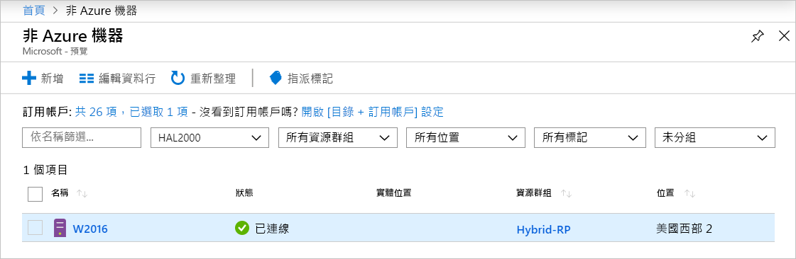
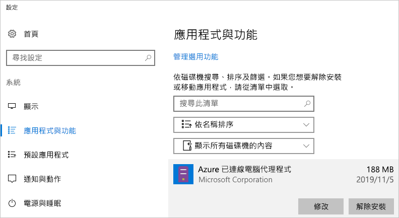

# <a name="quickstart-connect-machines-to-azure-using-azure-arc-for-servers---powershell"></a>快速入門：使用適用於伺服器的 Azure Arc 將機器連線至 Azure - PowerShell

如果您沒有 Azure 訂用帳戶，請在開始前建立[免費帳戶](https://azure.microsoft.com/free/?WT.mc_id=A261C142F)。

## <a name="prerequisites"></a>必要條件

檢閱[適用於伺服器的 Azure Arc 概觀](overview.md)中的受支援用戶端和必要網路設定。

## <a name="create-a-service-principal-for-onboarding-at-scale"></a>建立服務主體以進行大規模上線

服務主體是特殊的有限管理身分識別，僅可獲得將機器連線至 Azure 所需的最小權限。 這比使用更強大的帳戶 (例如租用戶系統管理員) 還要安全。 服務主體只會在上線期間使用。 連線所需的伺服器之後，您就可以安全地刪除服務主體。

> [!NOTE]
> 建議執行此步驟，但非必要。

### <a name="steps-to-create-the-service-principal"></a>建立服務主體的步驟

在此範例中，我們將使用 [Azure PowerShell](/powershell/azure/install-az-ps) 來建立服務主體名稱 (SPN)。 或者，您可以針對此工作，遵循[使用 Azure 入口網站來建立服務主體](../../active-directory/develop/howto-create-service-principal-portal.md)之下所列的步驟。

`Azure Connected Machine Onboarding` 角色只包含上線所需的權限。 您可以定義 SPN 的權限，以允許其範圍涵蓋資源群組或訂用帳戶。

您必須儲存 [`New-AzADServicePrincipal`](/powershell/module/az.resources/new-azadserviceprincipal) Cmdlet 的輸出，否則將無法擷取稍後步驟中所要使用的密碼。

```azurepowershell-interactive
$sp = New-AzADServicePrincipal -DisplayName "Arc-for-servers" -Role "Azure Connected Machine Onboarding"
$sp
```

```output
Secret                : System.Security.SecureString
ServicePrincipalNames : {ad9bcd79-be9c-45ab-abd8-80ca1654a7d1, https://Arc-for-servers}
ApplicationId         : ad9bcd79-be9c-45ab-abd8-80ca1654a7d1
ObjectType            : ServicePrincipal
DisplayName           : Hybrid-RP
Id                    : 5be92c87-01c4-42f5-bade-c1c10af87758
Type                  :
```

現在，使用 PowerShell 來擷取密碼。

```azurepowershell-interactive
$credential = New-Object pscredential -ArgumentList "temp", $sp.Secret
$credential.GetNetworkCredential().password
```

從輸出中複製 **password** 和 **ApplicationId** (從上一個步驟)，並將其儲存在安全的地方，例如伺服器設定工具的秘密存放區。 如果忘記或遺失 SPN 密碼，您可使用 [`New-AzADSpCredential`](/powershell/module/azurerm.resources/new-azurermadspcredential) Cmdlet 加以重設。

在安裝代理程式上線指令碼中：

* **ApplicationId** 屬性用於安裝代理程式中所使用的 `--service-principal-id` 參數。
* **password** 屬性用於安裝代理程式中的 `--service-principal-secret` 參數。

## <a name="manually-install-the-agent-and-connect-to-azure"></a>手動安裝代理程式並連線至 Azure

下列指南可讓您藉由登入機器並執行步驟，將機器連線至 Azure。 您也可以[從入口網站](quickstart-onboard-portal.md)，將機器連線到 Azure。

### <a name="download-and-install-the-agent"></a>下載並安裝代理程式

安裝代理程式套件時需要目標伺服器的根或本機系統管理員存取權，但不需要 Azure 存取權。

#### <a name="linux"></a>Linux

對於 **Linux** 伺服器，系統會使用散發所慣用的套件格式 (.RPM 或 .DEB)，透過 [Microsoft 的套件存放庫](https://packages.microsoft.com)來散發代理程式。

> [!NOTE]
> 在公開預覽期間，只發行了一個套件，其適用於 Ubuntu 16.04 或 18.04。

<!-- What about this aks? -->
最簡單的選項是註冊套件存放庫，然後使用散發的套件管理員來安裝套件。
位於 [https://aka.ms/azcmagent](https://aka.ms/azcmagent) 的 bash 指令碼會執行下列動作：

1. 設定主機電腦以從 `packages.microsoft.com` 進行下載。
2. 安裝混合式資源提供者套件。
3. 如果您指定 `--proxy`，可選擇性地設定 Proxy 作業的代理程式。

此指令碼也包含已支援和不支援散發的檢查，以及偵測安裝所需的權限。

下列範例會下載並安裝代理程式，而不需任何的條件式檢查。

```bash
# Download the installation package
wget https://aka.ms/azcmagent -O ~/Install_linux_azcmagent.sh

# Install the connected machine agent. Omit the '--proxy "{proxy-url}"' parameters if proxy is not needed
bash ~/Install_linux_azcmagent.sh--proxy "{proxy-url}"
```

> [!NOTE]
> 如果您不想參考 Microsoft 的套件存放庫，您可以從該處將套件檔案複製到您的內部存放庫。

#### <a name="windows"></a>Windows

若為 **Windows**，代理程式會封裝在 Windows Installer (`.MSI`) 檔案中，而且可從裝載於 [https://download.microsoft.com](https://download.microsoft.com) 的 [https://aka.ms/AzureConnectedMachineAgent](https://aka.ms/AzureConnectedMachineAgent) 進行下載。

```powershell
# Download the package
Invoke-WebRequest -Uri https://aka.ms/AzureConnectedMachineAgent -OutFile AzureConnectedMachineAgent.msi

# Install the package
msiexec /i AzureConnectedMachineAgent.msi /l*v installationlog.txt /qn | Out-String
```

> [!NOTE]
> 在 Linux 上，再次執行安裝指令碼將會自動升級為最新版本。 在 Windows 上，您必須先將「Azure 連線的機器代理程式」解除安裝，才能再次執行安裝程式以進行升級。

### <a name="connecting-to-azure"></a>連線到 Azure

安裝後，您可以使用稱為 `azcmagent.exe` 的命令列工具來管理和設定代理程式。 此代理程式位於 Linux 上的 `/opt/azcmagent/bin` 和 Windows 上的 `$env:programfiles\AzureConnectedMachineAgent` 之下。

在 Windows 上，以系統管理員身分在目標節點上開啟 PowerShell 並執行：

```powershell
& "$env:ProgramFiles\AzureConnectedMachineAgent\azcmagent.exe" connect `
  --service-principal-id "{your-spn-appid}" `
  --service-principal-secret "{your-spn-password}" `
  --resource-group "{your-resource-group-name}" `
  --tenant-id "{your-tenant-id}" `
  --location "{location-of-your-resource-group}" `
  --subscription-id "{your-subscription-id}"
```

在 Linux 上，開啟殼層並執行

<!-- Same command for linux?-->
```bash
azcmagent connect \
  --service-principal-id "{your-spn-appid}" \
  --service-principal-secret "{your-spn-password}" \
  --resource-group "{your-resource-group-name}" \
  --tenant-id "{your-tenant-id}" \
  --location "{location-of-your-resource-group}" \
  --subscription-id "{your-subscription-id}"
```

參數：

* `tenant-id`：租用戶 GUID。 選取 [Azure Active Directory]   -> [屬性]   -> [目錄識別碼]  ，即可在 Azure 入口網站中找到它。
* `subscription-id`：訂用帳戶的 GUID，在 Azure 中，您想要讓機器連線到該訂用帳戶。
* `resource-group`：您想要讓機器連線的資源群組。
* `location`：請參閱 [Azure 區域和位置](https://azure.microsoft.com/global-infrastructure/regions/)。 此位置可與資源群組的位置相同或不同。 若為公開預覽版，則會在 [美國西部2]  和 [西歐]  支援此服務。
* `resource-name`：(*選擇性*) 用於內部部署機器的 Azure 資源表示法。 如果您未指定此值，將會使用電腦主機名稱。

您可以在 [Azcmagent 參考](azcmagent-reference.md)中找到有關 'azcmagent' 工具的詳細資訊。
<!-- Isn't this still needed to view machines? -->

順利完成時，您的機器就會連線到 Azure。 您可造訪 [https://aka.ms/hybridmachineportal](https://aka.ms/hybridmachineportal)，以在 Azure 入口網站中檢視您的機器。



### <a name="proxy-server-configuration"></a>Proxy 伺服器設定

#### <a name="linux"></a>Linux

<!-- New proxy name? -->

針對 **Linux**，如果伺服器需要 Proxy 伺服器，您可以執行下列其中一項：

* 使用 `--proxy`，執行上述[安裝代理程式](#download-and-install-the-agent)一節中的 `install_linux_hybrid_agent.sh` 指令碼。
* 如果您已安裝代理程式，請執行命令 `/opt/azcmagent/bin/hybridrp_proxy add http://{proxy-url}:{proxy-port}`，這會設定 Proxy 並重新啟動代理程式。

#### <a name="windows"></a>Windows

針對 **Windows**，如果伺服器需要 Proxy 伺服器才能存取網際網路資源，您應該執行下列命令來設定 Proxy 伺服器環境變數。 這可讓代理程式使用 Proxy 伺服器來存取網際網路。

```powershell
# If a proxy server is needed, execute these commands with actual proxy URL
[Environment]::SetEnvironmentVariable("https_proxy", "http://{proxy-url}:{proxy-port}", "Machine")
$env:https_proxy = [System.Environment]::GetEnvironmentVariable("https_proxy","Machine")
# The agent service needs to be restarted after the proxy environment variable is set in order for the changes to take effect.
Restart-Service -Name himds
```

> [!NOTE]
> 公開預覽版不支援已驗證的 Proxy。

## <a name="clean-up"></a>清除

若要讓機器與適用於伺服器 Azure Arc 中斷連線，您必須執行兩個步驟。

1. 在[入口網站](https://aka.ms/hybridmachineportal)中選取機器，按一下省略符號 (`...`)，然後選取 [刪除]  。
1. 將代理程式從機器解除安裝。

   在 Windows 上，您可以使用 [應用程式與功能] 控制台來解除安裝代理程式。
  
  

   如果您想要透過指令碼進行解除安裝，您可以使用下列範例來擷取 **PackageId**，並使用 `msiexec /X` 來解除安裝代理程式。

   在登錄機碼 `HKEY_LOCAL_MACHINE\Software\Microsoft\Windows\CurrentVersion\Uninstall`之下查看並尋找 **PackageId**。 然後，您可以使用 `msiexec` 來解除安裝代理程式。

   下列範例示範如何解除安裝代理程式。

   ```powershell
   Get-ChildItem -Path HKLM:\Software\Microsoft\Windows\CurrentVersion\Uninstall | `
   Get-ItemProperty | `
   Where-Object {$_.DisplayName -eq "Azure Connected Machine Agent"} | `
   ForEach-Object {MsiExec.exe /Quiet /X "$($_.PsChildName)"}
   ```

   在 Linux 上，執行下列命令來解除安裝代理程式。

   ```bash
   sudo apt purge hybridagent
   ```

## <a name="next-steps"></a>後續步驟

> [!div class="nextstepaction"]
> [將原則指派給已連線的機器](../../governance/policy/assign-policy-portal.md)
