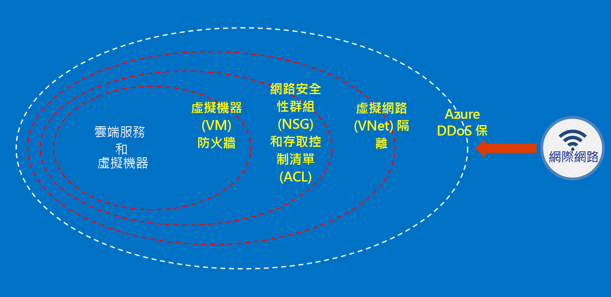

# 什麼是 Azure Australia？

在 2014 年，Azure 在澳大利亞推出，共有兩個區域：澳大利亞東部 (雪梨) 和澳大利亞東南部 (墨爾本)。 在 2018 年 4 月，推出了兩個位於位於坎培拉的新 Azure 區域 – 澳大利亞中部和澳大利亞中部 2。 澳大利亞中部和澳大利亞中部 2 區域是特意設計來滿足政府和重要國家基礎結構的需求，並提供特殊化連線能力和彈性，讓您可以系統設置在雲端旁邊，其安全性和復原能力層級只有秘密分類的網路才需要。 Azure Australia 是政府和重要國家基礎結構數位轉型的平台，而且是澳大利亞唯一可用且特別為這些需求所設計的任務關鍵性雲端。

對於在 [Microsoft Azure Australia](https://azure.microsoft.com/global-infrastructure/australia/) 內連線至、取用及操作澳大利亞政府資料和系統，澳大利亞政府有特定需求。 此頁面上的資源也會提供適用於所有客戶的一般指引，其特定著重於安全設定和操作。

請參閱 [Microsoft 服務信任入口網站](https://aka.ms/au-irap)的澳大利亞頁面，以取得 Azure Australia 資訊安全登錄評定人 (IRAP) 評量、認證並包含在認證雲端服務清單 (CCSL) 上的最新資訊。 在澳大利亞頁面上，您也會找到 Government 和重要基礎結構提供者專屬的其他 Microsoft 建議。

## Azure Australia 中的客戶資料保護原則

Azure Australia 提供了各種功能和服務，供您建置雲端解決方案以符合受管制/受控制資料的需求。 符合規範的客戶解決方案無非是現成 Azure Australia 功能的有效實作，再結合穩固的資料安全性作法。

當您在 Azure Australia 中裝載解決方案時，Microsoft 會在雲端基礎結構層級處理其中的許多需求。

下圖顯示 Azure 的深度防禦模型。 例如，Microsoft 會提供基本的雲端基礎結構 DDoS 以及客戶功能，如適用於客戶專屬應用程式需求的安全性設備或高階 DDoS 服務。

這些文章概述用來保護您的服務和應用程式的基本原則，並提供如何套用這些原則的指引和最佳做法。 換句話說，客戶應如何聰明使用 Azure Australia，以符合處理政府敏感性和分類資訊的解決方案所需的義務和責任。

針對要遷移至 Azure 的澳大利亞政府機關，提供了兩種文件類別。

## Azure Australia 中的安全性

身分識別、角色型存取控制、透過加密和版權管理的資料保護，以及有效監視和設定控制都是您需要實作的重要元素。 在這一節中，有一系列文章說明 Azure 的內建功能，以及其與 ISM 和 .ASD Essential 8 的關聯性。

您可以透過 Azure Australia 中的 [概念] -> [安全性]  之下的功能表存取這些文章。

## Azure Australia 中的閘道

政府機關的另一個重要步驟就是建立周邊安全性功能。 這些功能稱為安全網際網路閘道 (SIG)，在使用 Azure 時，您必須負責確保這些保護已就緒。 Microsoft 不會操作 SIG；不過，藉由結合可保護所有客戶的邊緣網路服務，以及您的 Azure 環境內部署的特定服務，您就可以操作同等功能。

您可以透過 Azure Australia 中的 [概念] -> [閘道]  之下的功能表存取這些文章。

## 後續步驟

* 如果您的主要焦點在於保護您在 Azure 中的資料，請從[資料安全性](secure-your-data.md)著手。
* 如果您的主要焦點是在 Azure 中建立閘道，請從[閘道稽核、記錄和可見度](gateway-log-audit-visibility.md)著手。
