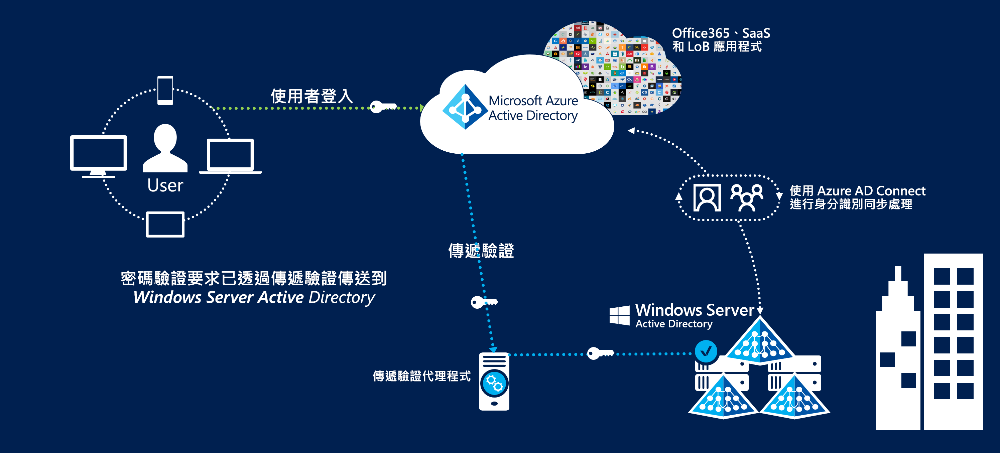
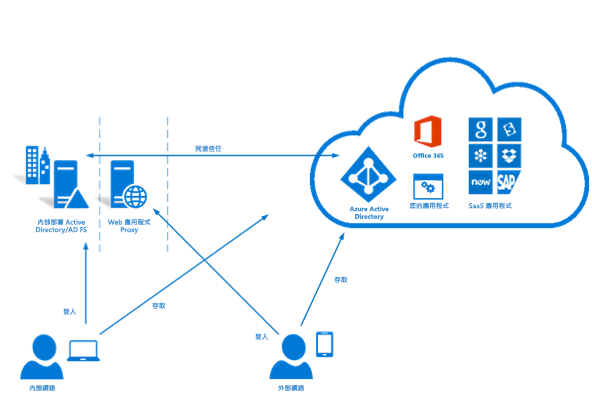

# Azure Australia 中的身分識別同盟

身分識別管理以及與公用雲端供應項目同盟是使用雲端的最關鍵初期步驟之一。 Microsoft 的 Azure Active Directory 服務會儲存使用者資訊，以供存取雲端服務，而且是取用其他 Azure 服務的必要條件。

本文涵蓋實作 Azure Active Directory、從 Active Directory Domain Services 網域同步處理使用者，以及實作安全驗證的主要設計重點。 特別將焦點放在 Australian Cyber Security Center 的資訊安全性手冊 (ISM) 和 Azure 認證報告中的建議。

Azure Active Directory 中儲存的資訊分類應該告知其設計方式的決策。 下列摘錄是由 [ACSC 認證報告 – Microsoft Azure](https://aka.ms/au-irap) 提供：

>**ACSC 認證報告 – Microsoft Azure** 當聯邦實體將其 Active Directory 的使用方式和資料內容分類為「受保護」時，Azure Active Directory (Azure AD) 必須使用 Active Directory 同盟服務進行設定。 雖然「未分類」散佈限制標記 (UDLM) 分類的 Active Directory 資料不需要同盟，但聯邦實體仍可實作同盟，以減輕與澳大利亞外部所提供服務相關聯的風險。

因此，同步處理的資訊內容，以及用於驗證使用者的機制，是此處所述的兩項主要考量。

## 主要設計考量

### 使用者同步

部署 Azure AD Connect 時，必須針對要同步處理的資料進行幾項決策。 Azure AD Connect 是以 Microsoft Identity Manager 為基礎，可提供健全的功能集來[轉換](https://docs.microsoft.com/azure/active-directory/hybrid/how-to-connect-sync-best-practices-changing-default-configuration)不同目錄的資料。

Microsoft 諮詢服務可用於進行現有 Windows Server Active Directory 的 ADRAP 評估。 ADRAP 有助於在使用 Azure Active Directory 同步處理之前，判斷任何可能需要更正的問題。 Microsoft 頂級支援合約通常包含此服務。

[IDFix 工具](https://docs.microsoft.com/office365/enterprise/install-and-run-idfix)會在使用 Azure AD 同步處理之前，掃描您的內部部署 Active Directory 網域是否有問題。 IDFix 是實作 Azure AD Connect 前的第一個重要步驟。 雖然 IDFix 掃描可識別大量問題，但其中有許多問題可透過指令碼快速解決，或使用 Azure AD Connect 中的資料轉換來暫時解決。

Azure AD 要求使用者有可在外部路由傳送的最上層網域，才能啟用驗證。 如果您的網域有無法在外部路由傳送的 UPN 尾碼，您必須將 AD Connect 中的[替代登入識別碼](https://docs.microsoft.com/azure/active-directory/hybrid/plan-connect-userprincipalname)設定為使用者的郵件屬性。 然後，使用者會使用其電子郵件地址 (而不是其網域登入) 來登入 Azure 服務。

使用者帳戶上的 UPN 尾碼也可以使用 PowerShell 之類的工具來改變；不過，其對於其他連線的系統可能會有預料外的結果，而且不再被視為最佳做法。

在決定哪些屬性要同步處理至 Azure Active Directory 時，最安全的方式是假設所有屬性都是必要的。 目錄很少會包含實際「受保護」的資料，不過建議進行稽核。 如果在目錄中找到「受保護」的資料，請評估省略或轉換屬性的影響。 Microsoft Cloud Services [需要](https://docs.microsoft.com/azure/active-directory/hybrid/reference-connect-sync-attributes-synchronized)一份屬性清單作為實用指南。

### Authentication

請務必了解可用的選項，以及如何將其用來確保終端使用者的安全。
Microsoft 提供[三個原生解決方案](https://docs.microsoft.com/azure/active-directory/hybrid/plan-connect-user-signin)，以根據 Azure Active Directory 驗證使用者：

* 密碼雜湊同步處理 - Active Directory Domain Services 提供的雜湊密碼會由 Azure AD Connect 同步處理至 Azure Active Directory。
* [傳遞驗證](https://docs.microsoft.com/azure/active-directory/hybrid/how-to-connect-pta) - 密碼會保留在 Active Directory Domain Services 中。 使用者會透過代理程式向 Active Directory Domain Services 驗證。 Azure AD 內不會儲存任何密碼。
* [同盟 SSO](https://docs.microsoft.com/azure/active-directory/hybrid/how-to-connect-fed-whatis) - Azure Active Directory 會與 Active Directory 同盟服務同盟，而在登入期間，Azure 會將使用者引導至 Active Directory 同盟服務進行驗證。 Azure AD 內不會儲存任何密碼。

密碼雜湊同步處理可使用於「官方:敏感性」和以下資料儲存於目錄的案例。 正在儲存「受保護」資料的案例會需要兩個其餘選項之一。

這三個選項都支援[密碼回寫](https://docs.microsoft.com/azure/active-directory/authentication/concept-sspr-writeback)，因而停用 [ACSC 取用者指南](https://aka.ms/au-irap)建議。 不過，組織應評估停用密碼回寫對於生產力提升的風險，以及使用自助式密碼重設所降低的支援投入量。

#### 傳遞驗證 (PTA)

傳遞驗證是在 IRAP 評估完成後發行，因此應個別進行評估，才能判斷解決方案如何符合貴組織的風險設定檔。 因為安全性狀態已改善，所以建議使用傳遞驗證，而不是由 Microsoft 同盟。

傳遞驗證會提出幾個要考量的設計因素：

* 傳遞驗證代理程式必須能夠建立對 Microsoft 雲端服務的連出連線。
* 安裝一個以上的代理程式，以確保服務具有高度可用性。 最佳做法是至少部署三個代理程式，最多部署 12 個代理程式。
* 最佳做法是避免將代理程式直接安裝在 Active Directory 網域控制站上。 根據預設，使用傳遞驗證來部署 Azure AD Connect 時，會將代理程式安裝在 AD Connect 伺服器上。
* 傳遞驗證是比 Active Directory 同盟服務更低層級的維護選項，因為它不需要專用的伺服器基礎結構、憑證管理或輸入防火牆規則。

#### Active Directory 同盟服務 (ADFS)

Active Directory 同盟服務已包含在 IRAP 評估內，且經過核准可在「受保護」的環境中使用。

Active Directory 同盟服務提供幾個要考量的設計因素：

* 對於來自網際網路或位於最低 Microsoft 服務端點的 HTTPS 流量，同盟服務需要網路輸入。
* 同盟服務會使用 PKI 和憑證，其需要持續的管理和更新。
* 同盟服務應部署在專用的伺服器上，而且需要相關的網路基礎結構，才能從外部安全地存取。

### Multi-Factor Authentication (MFA)

有關多重要素驗證的 ISM 一節會根據您的風險設定檔，建議在下列案例中進行實作：

* 驗證標準使用者
* 驗證具特殊權限的帳戶
* 驗證使用者遠端存取
* 執行特殊權限動作的使用者

Azure Active Directory 提供可針對所有或部分使用者 (例如，僅限具特殊權限的帳戶) 啟用的 Multi-Factor Authentication。 Microsoft 也提供稱為「條件式存取」的解決方案，讓您更精確地控制如何套用 Multi-Factor Authentication (例如，只有在使用者從遠端 IP 位址範圍登入時)。

Azure Multi-Factor Authentication 支援下列 ISM 可接受的驗證形式：

* 撥打電話
* 手機簡訊
* Microsoft Authenticator 應用程式
* 支援的硬體 Token

Privileged Identity Management 是 Azure Active Directory 的一個元件，可在使用者提升其權限以符合第四項建議時，用於強制使用多重要素驗證。

## 後續步驟

請檢閱[角色型存取控制和 Privileged Identity Management](role-privileged.md)相關文章。
