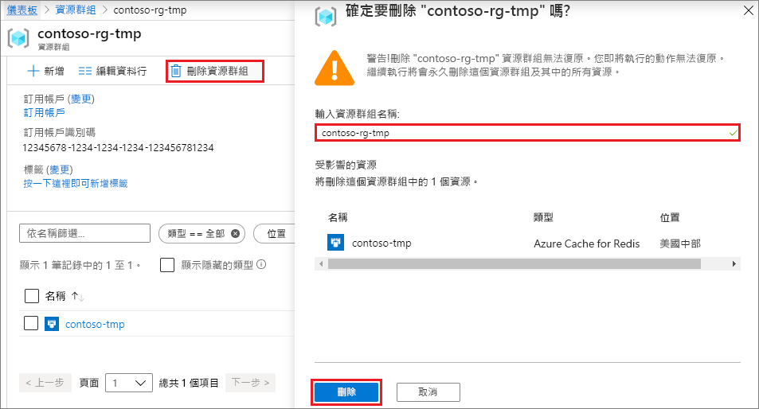

# <a name="quickstart-create-a-python-app-that-uses-azure-cache-for-redis"></a>快速入門：建立可使用 Azure Cache for Redis 的 Python 應用程式

在本文中，您會將 Azure Cache for Redis 納入 Python 應用程式中，以便存取可從 Azure 內任何應用程式存取的安全、專用快取。

## <a name="prerequisites"></a>Prerequisites

- Azure 訂用帳戶 - [建立免費帳戶](https://azure.microsoft.com/free/)
- [Python 2 或3](https://www.python.org/downloads/)

## <a name="create-an-azure-cache-for-redis-instance"></a>建立 Azure Cache for Redis 執行個體
[!INCLUDE [redis-cache-create](../../includes/redis-cache-create.md)]

[!INCLUDE [redis-cache-create](../../includes/redis-cache-access-keys.md)]

## <a name="install-redis-py"></a>安裝 redis-py

[redis-py](https://github.com/andymccurdy/redis-py) \(英文\) 是 Azure Cache for Redis 的 Python 介面。 使用 Python 套件工具 *pip*，從命令提示字元中安裝 *redis-py* 套件。 

下列範例使用 Python 3 的 *pip3*，在 Windows 10 上，從系統管理員命令提示字元中安裝 *redis-py*。


## <a name="read-and-write-to-the-cache"></a>讀取和寫入快取

從命令列中執行 Python，然後使用下列程式碼來測試您的快取。 將 `<Your Host Name>` 和 `<Your Access Key>` 取代為您 Azure Cache for Redis 執行個體的值。 您的主機名稱格式為 *\<DNS name>.redis.cache.windows.net*。

```python
>>> import redis
>>> r = redis.StrictRedis(host='<Your Host Name>',
        port=6380, db=0, password='<Your Access Key>', ssl=True)
>>> r.set('foo', 'bar')
True
>>> r.get('foo')
b'bar'
```

> [!IMPORTANT]
> 如果是 Azure Cache for Redis 3.0 版或更新版本，即會強制執行 SSL 憑證檢查。 連線至 Azure Cache for Redis 時，必須明確設定 ssl_ca_certs。 如果是 RH Linux，則可於 */etc/pki/tls/certs/ca-bundle.crt* 憑證模組中找到 ssl_ca_certs。

## <a name="create-a-python-sample-app"></a>建立 Python 範例應用程式

建立新的文字檔、新增下列指令碼，然後將檔案儲存為 *PythonApplication1.py*。 將 `<Your Host Name>` 和 `<Your Access Key>` 取代為您 Azure Cache for Redis 執行個體的值。 您的主機名稱格式為 *\<DNS name>.redis.cache.windows.net*。

```python
import redis

myHostname = "<Your Host Name>"
myPassword = "<Your Access Key>"

r = redis.StrictRedis(host=myHostname, port=6380,
                      password=myPassword, ssl=True)

result = r.ping()
print("Ping returned : " + str(result))

result = r.set("Message", "Hello!, The cache is working with Python!")
print("SET Message returned : " + str(result))

result = r.get("Message")
print("GET Message returned : " + result.decode("utf-8"))

result = r.client_list()
print("CLIENT LIST returned : ")
for c in result:
    print("id : " + c['id'] + ", addr : " + c['addr'])
```

使用 Python 執行 *PythonApplication1.py*。 您應該會看到類似下列範例的結果：


## <a name="clean-up-resources"></a>清除資源

如果您已完成此快速入門中所建立的 Azure 資源群組和資源，則您可刪除它們以避免衍生費用。

> [!IMPORTANT]
> 刪除資源群組是無法回復的動作，而資源群組及其中的所有資源都會永久刪除。 如果您在想要保留的現有資源群組中建立了 Azure Cache for Redis 執行個體，您可從快取的 [概觀]  頁面中選取 [刪除]  ，只刪除快取。 

刪除資源群組及其 Azure 執行個體的 Redis 快取：

1. 從 [Azure 入口網站](https://portal.azure.com)中，搜尋並選取 [資源群組]  。
1. 在 [依名稱篩選]  文字方塊中，輸入包含您快取執行個體的資源群組名稱，然後從搜尋結果中選取它。 
1. 在資源群組頁面上，選取 [刪除資源群組]  。
1. 輸入資源群組名稱，然後選取 [刪除]  。
   
   

## <a name="next-steps"></a>後續步驟

> [!div class="nextstepaction"]
> [建立可使用 Azure Cache for Redis 的簡單 ASP.NET Web 應用程式。](./cache-web-app-howto.md)

