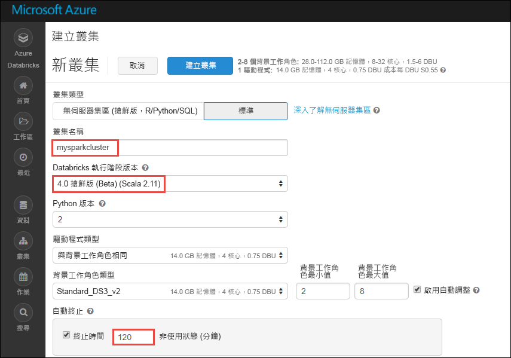
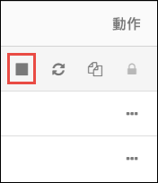

# 教學課程：使用 Azure Databricks 對串流資料進行情感分析

在本教學課程中，您會了解如何使用 Azure Databricks 近乎即時地對資料的串流執行情感分析。 您會使用 Azure 事件中樞設定資料擷取系統。 您會使用 Spark 事件中樞連接器將訊息從事件中樞取用到 Azure Databricks。 最後，您會使用 Microsoft 認知服務 API 來對串流資料執行情感分析。

本教學課程結束時，您將已從 Twitter 獲得含有 "Azure" 一詞的串流推文，並會對這些推文執行情感分析。

下圖顯示此應用程式流程：

本教學課程涵蓋下列工作：

> [!div class="checklist"]
> * 建立 Azure Databricks 工作區
> * 在 Azure Databricks 中建立 Spark 叢集
> * 建立 Twitter 應用程式來存取串流資料
> * 在 Azure Databricks 中建立 Notebook
> * 連結事件中樞與 Twitter API 的程式庫
> * 建立 Microsoft 認知服務帳戶並取出存取金鑰
> * 將推文傳送至事件中樞
> * 從事件中樞讀取推文
> * 對推文執行情感分析

如果您沒有 Azure 訂用帳戶，請在開始之前先[建立免費帳戶](https://azure.microsoft.com/free/)。

## 必要條件

開始本教學課程之前，請確定您符合下列需求：
- Azure 事件中樞命名空間。
- 命名空間內的事件中樞。
- 用來存取事件中樞命名空間的連接字串。 連接字串的格式會類似 `Endpoint=sb://<namespace>.servicebus.windows.net/;SharedAccessKeyName=<key name>;SharedAccessKey=<key value>`。
- 事件中樞的共用存取原則名稱和原則金鑰。

您可以藉由完成[建立 Azure 事件中樞命名空間和事件中樞](../event-hubs/event-hubs-create.md)一文中的步驟，以符合這些需求。

## 登入 Azure 入口網站

登入 [Azure 入口網站](https://portal.azure.com/)。

## 建立 Azure Databricks 工作區

在本節中，您會使用 Azure 入口網站建立 Azure Databricks 工作區。

1. 在 Azure 入口網站中，選取 [建立資源] > [資料 + 分析] > [Azure Databricks]。

    

3. 在 [Azure Databricks 服務] 底下，提供值以建立 Databricks 工作區。

    

    提供下列值：

    |屬性  |說明  |
    |---------|---------|
    |**工作區名稱**     | 提供您 Databricks 工作區的名稱        |
    |**訂用帳戶**     | 從下拉式清單中選取您的 Azure 訂用帳戶。        |
    |**資源群組**     | 指定您是要建立新的資源群組，還是使用現有資源群組。 資源群組是存放 Azure 方案相關資源的容器。 如需詳細資訊，請參閱 [Azure 資源群組概觀](../azure-resource-manager/resource-group-overview.md)。 |
    |**位置**     | 選取 [美國東部 2]。 如需其他可用的區域，請參閱[依區域提供的 Azure 服務](https://azure.microsoft.com/regions/services/)。        |
    |定價層     |  選擇 [標準] 或 [進階]。 如需這些定價層的詳細資訊，請參閱 [Databricks 定價頁面](https://azure.microsoft.com/pricing/details/databricks/)。       |

    選取 [釘選到儀表板]，然後選取 [建立]。

4. 建立帳戶需要幾分鐘的時間。 建立帳戶期間，入口網站右側會顯示 [提交 Azure Databricks 部署] 圖格。 您可能需要在儀表板上向右捲動以查看此圖格。 另外在畫面頂端附近還會顯示一個進度列。 您可以查看任何進度區域。

    

## 在 Databricks 中建立 Spark 叢集

1. 在 Azure 入口網站中，移至您所建立的 Databricks 工作區，然後選取 [啟動工作區]。

2. 系統會將您重新導向至 Azure Databricks 入口網站。 在入口網站中選取 [叢集]。

    

3. 在 [新增叢集] 頁面上，提供值以建立叢集。

    

    接受下列值以外的所有其他預設值：

    * 輸入叢集的名稱。
    * 針對本文，使用 **4.0 搶鮮版 (Beta)** 執行階段建立叢集。
    * 請確定您選取 **在活動 ___ 分鐘後終止** 核取方塊。 請提供用來終止叢集的叢集未使用持續時間 (以分鐘為單位)。

    選取 [建立叢集]。 叢集在執行後，您就可以將 Notebook 連結至叢集，並執行 Spark 作業。

## 建立 Twitter 應用程式

若要收到推文的串流，您必須在 Twitter 中建立應用程式。 請依照下列步驟建立 Twitter 應用程式，並記錄要完成本教學課程所需的值。

1. 從網頁瀏覽器移至 [Twitter 應用程式管理](https://apps.twitter.com/) ，然後選取 [建立新的應用程式]。

    

2. 在 [建立應用程式] 頁面上，提供新應用程式的詳細資料，然後選取 [建立 Twitter 應用程式]。

    

3. 在應用程式頁面上，選取 [金鑰和存取權杖] 索引標籤，並複製 [取用者金鑰] 和 [取用者秘密] 的值。 此外，請選取 [建立我的存取權杖] 來產生存取權杖。 複製 [存取權杖] 和 [存取權杖祕密] 的值。

    

儲存您所擷取的 Twitter 應用程式值。 在本教學課程後續的內容中，您會需要這些值。

## 將程式庫連結至 Spark 叢集

在本教學課程中，您會使用 Twitter API 將推文傳送至事件中樞。 您也會使用 [Apache Spark 事件中樞連接器](https://github.com/Azure/azure-event-hubs-spark)來讀取資料並將資料寫入至 Azure 事件中樞。 若要在叢集中使用這些 API，請將其作為程式庫新增至 Azure Databricks，然後讓這些 API 與您的 Spark 叢集產生關聯。 下列指示說明如何將程式庫新增至工作區中的 [共用] 資料夾。

1.  在 Azure Databricks 工作區中，選取 [工作區]，然後以滑鼠右鍵按一下 [共用]。 從快顯功能表中，選取 [建立] > [程式庫]。

    

2. 在 [新增程式庫] 頁面上，於 [來源] 中選取 [Maven 座標]。 在 [座標] 中輸入您要新增之套件的座標。 以下是本教學課程所使用之程式庫的 Maven 座標：

    * Spark 事件中樞連接器 - `com.microsoft.azure:azure-eventhubs-spark_2.11:2.3.1`
    * Twitter API - `org.twitter4j:twitter4j-core:4.0.6`

    

3. 選取 [建立程式庫]。

4. 選取程式庫新增所在的資料夾，然後選取程式庫名稱。

    

5. 在程式庫頁面上，選取要在其中使用程式庫的叢集。 在程式庫成功地與叢集產生關聯後，狀態會立即變更為 [已連結]。

    

6. 對 Twitter 套件 `twitter4j-core:4.0.6` 重複執行這些步驟。

## 取得認知服務存取金鑰

在本教學課程中，您會使用 [Microsoft 認知服務文字分析 API](../cognitive-services/text-analytics/overview.md) 近乎即時地對推文的串流執行情感分析。 在使用 API 之前，您必須先在 Azure 上建立 Microsoft 認知服務帳戶，並擷取存取金鑰以便使用文字分析 API。

1. 登入 [Azure 入口網站](https://portal.azure.com/)。

2. 選取 [+ 建立資源]。

3. 在 Azure Marketplace 底下選取 [AI + 認知服務] > [文字分析 API]。

    

4. 在 [建立] 對話方塊中提供下列值：

    

    - 輸入認知服務帳戶的名稱。
    - 選取據以建立帳戶的 Azure 訂用帳戶。
    - 選取 Azure 位置。
    - 選取服務的定價層。 如需認知服務定價的詳細資訊，請參閱[定價頁面](https://azure.microsoft.com/pricing/details/cognitive-services/)。
    - 指定您是要建立新的資源群組，還是選取現有資源群組。

    選取 [建立] 。

5. 建立帳戶之後，從 [概觀] 索引標籤選取 [顯示存取金鑰]。

    

    此外，複製端點 URL 的一部分，如螢幕擷取畫面所示。 教學課程中需要用到此 URL。

6. 在 [管理金鑰] 下，針對您要使用的金鑰選取 [複製] 圖示。

    

7. 儲存您在此步驟中所擷取之端點 URL 和存取金鑰的值。 稍後在本教學課程中需要用到。

## 在 Databricks 中建立 Notebook

在本節中，您會在 Databricks 工作區中建立兩個具有下列名稱的 Notebook

- **SendTweetsToEventHub** - 生產者 Notebook，可供用來從 Twitter 取得推文，再將推文串流至事件中樞。
- **AnalyzeTweetsFromEventHub** - 取用者 Notebook，可供用來從事件中樞讀取推文並執行情感分析。

1. 在左側窗格中，選取 [工作區]。 從 [工作區] 下拉式清單選取 [建立]，然後選取 [Notebook]。

    

2. 在 [建立 Notebook] 對話方塊中輸入 **SendTweetsToEventHub**，選取 [Scala] 作為語言，然後選取您先前建立的 Spark 叢集。

    

    選取 [建立] 。

3. 重複上述步驟以建立 **AnalyzeTweetsFromEventHub** Notebook。

## 將推文傳送至事件中樞

在 **SendTweetsToEventHub** Notebook 中貼上下列程式碼，並將預留位置取代為您稍早所建立之事件中樞命名空間和 Twitter 應用程式的值。 此 Notebook 會將含有關鍵字 "Azure" 的推文即時串流到事件中樞。

    import java.util._
    import scala.collection.JavaConverters._
    import com.microsoft.azure.eventhubs._
    import java.util.concurrent._

    val namespaceName = "<EVENT HUBS NAMESPACE>"
    val eventHubName = "<EVENT HUB NAME>"
    val sasKeyName = "<POLICY NAME>"
    val sasKey = "<POLICY KEY>"
    val connStr = new ConnectionStringBuilder()
                .setNamespaceName(namespaceName)
                .setEventHubName(eventHubName)
                .setSasKeyName(sasKeyName)
                .setSasKey(sasKey)

    val pool = Executors.newFixedThreadPool(1)
    val eventHubClient = EventHubClient.create(connStr.toString(), pool)

    def sendEvent(message: String) = {
      val messageData = EventData.create(message.getBytes("UTF-8"))
      eventHubClient.get().send(messageData)
      System.out.println("Sent event: " + message + "\n")
    }

    import twitter4j._
    import twitter4j.TwitterFactory
    import twitter4j.Twitter
    import twitter4j.conf.ConfigurationBuilder

    // Twitter configuration!
    // Replace values below with yours

    val twitterConsumerKey = "<CONSUMER KEY>"
    val twitterConsumerSecret = "<CONSUMER SECRET>"
    val twitterOauthAccessToken = "<ACCESS TOKEN>"
    val twitterOauthTokenSecret = "<TOKEN SECRET>"

    val cb = new ConfigurationBuilder()
      cb.setDebugEnabled(true)
      .setOAuthConsumerKey(twitterConsumerKey)
      .setOAuthConsumerSecret(twitterConsumerSecret)
      .setOAuthAccessToken(twitterOauthAccessToken)
      .setOAuthAccessTokenSecret(twitterOauthTokenSecret)

    val twitterFactory = new TwitterFactory(cb.build())
    val twitter = twitterFactory.getInstance()

    // Getting tweets with keyword "Azure" and sending them to the Event Hub in realtime!

    val query = new Query(" #Azure ")
    query.setCount(100)
    query.lang("en")
    var finished = false
    while (!finished) {
      val result = twitter.search(query)
      val statuses = result.getTweets()
      var lowestStatusId = Long.MaxValue
      for (status <- statuses.asScala) {
        if(!status.isRetweet()){
          sendEvent(status.getText())
        }
        lowestStatusId = Math.min(status.getId(), lowestStatusId)
        Thread.sleep(2000)
      }
      query.setMaxId(lowestStatusId - 1)
    }

    // Closing connection to the Event Hub
    eventHubClient.get().close()

若要執行 Notebook，請按 **SHIFT + ENTER**。 您會看到如下列程式碼片段所示的輸出。 輸出中的每個事件都是擷取至事件中樞的推文。

    Sent event: @Microsoft and @Esri launch Geospatial AI on Azure https://t.co/VmLUCiPm6q via @geoworldmedia #geoai #azure #gis #ArtificialIntelligence

    Sent event: Public preview of Java on App Service, built-in support for Tomcat and OpenJDK
    https://t.co/7vs7cKtvah
    #cloudcomputing #Azure

    Sent event: 4 Killer #Azure Features for #Data #Performance https://t.co/kpIb7hFO2j by @RedPixie

    Sent event: Migrate your databases to a fully managed service with Azure SQL Database Managed Instance | #Azure | #Cloud https://t.co/sJHXN4trDk

    Sent event: Top 10 Tricks to #Save Money with #Azure Virtual Machines https://t.co/F2wshBXdoz #Cloud

    ...
    ...

## 從事件中樞讀取推文

在 **AnalyzeTweetsFromEventHub** Notebook 中貼上下列程式碼，並將預留位置取代為您稍早所建立之 Azure 事件中樞的值。 此 Notebook 會讀取您稍早使用 **SendTweetsToEventHub** Notebook 串流至事件中樞的推文。

    import org.apache.spark.eventhubs._

    // Build connection string with the above information
    val connectionString = ConnectionStringBuilder("<EVENT HUBS CONNECTION STRING>")
      .setEventHubName("<EVENT HUB NAME>")
      .build

    val customEventhubParameters =
      EventHubsConf(connectionString)
      .setMaxEventsPerTrigger(5)

    val incomingStream = spark.readStream.format("eventhubs").options(customEventhubParameters.toMap).load()

    incomingStream.printSchema

    // Sending the incoming stream into the console.
    // Data comes in batches!
    incomingStream.writeStream.outputMode("append").format("console").option("truncate", false).start().awaitTermination()

您會獲得下列輸出︰

    root
     |-- body: binary (nullable = true)
     |-- offset: long (nullable = true)
     |-- seqNumber: long (nullable = true)
     |-- enqueuedTime: long (nullable = true)
     |-- publisher: string (nullable = true)
     |-- partitionKey: string (nullable = true)

    -------------------------------------------
    Batch: 0
    -------------------------------------------
    +------+------+--------------+---------------+---------+------------+
    |body  |offset|sequenceNumber|enqueuedTime   |publisher|partitionKey|
    +------+------+--------------+---------------+---------+------------+
    |[50 75 62 6C 69 63 20 70 72 65 76 69 65 77 20 6F 66 20 4A 61 76 61 20 6F 6E 20 41 70 70 20 53 65 72 76 69 63 65 2C 20 62 75 69 6C 74 2D 69 6E 20 73 75 70 70 6F 72 74 20 66 6F 72 20 54 6F 6D 63 61 74 20 61 6E 64 20 4F 70 65 6E 4A 44 4B 0A 68 74 74 70 73 3A 2F 2F 74 2E 63 6F 2F 37 76 73 37 63 4B 74 76 61 68 20 0A 23 63 6C 6F 75 64 63 6F 6D 70 75 74 69 6E 67 20 23 41 7A 75 72 65]                              |0     |0             |2018-03-09 05:49:08.86 |null     |null        |
    |[4D 69 67 72 61 74 65 20 79 6F 75 72 20 64 61 74 61 62 61 73 65 73 20 74 6F 20 61 20 66 75 6C 6C 79 20 6D 61 6E 61 67 65 64 20 73 65 72 76 69 63 65 20 77 69 74 68 20 41 7A 75 72 65 20 53 51 4C 20 44 61 74 61 62 61 73 65 20 4D 61 6E 61 67 65 64 20 49 6E 73 74 61 6E 63 65 20 7C 20 23 41 7A 75 72 65 20 7C 20 23 43 6C 6F 75 64 20 68 74 74 70 73 3A 2F 2F 74 2E 63 6F 2F 73 4A 48 58 4E 34 74 72 44 6B]            |168   |1             |2018-03-09 05:49:24.752|null     |null        |
    +------+------+--------------+---------------+---------+------------+

    -------------------------------------------
    Batch: 1
    -------------------------------------------
    ...
    ...

因為輸出採用二進位模式，請使用下列程式碼片段將它轉換成字串。

    import org.apache.spark.sql.types._
    import org.apache.spark.sql.functions._

    // Event Hub message format is JSON and contains "body" field
    // Body is binary, so we cast it to string to see the actual content of the message
    val messages =
      incomingStream
      .withColumn("Offset", $"offset".cast(LongType))
      .withColumn("Time (readable)", $"enqueuedTime".cast(TimestampType))
      .withColumn("Timestamp", $"enqueuedTime".cast(LongType))
      .withColumn("Body", $"body".cast(StringType))
      .select("Offset", "Time (readable)", "Timestamp", "Body")

    messages.printSchema

    messages.writeStream.outputMode("append").format("console").option("truncate", false).start().awaitTermination()

輸出現在會類似下列程式碼片段：

    root
     |-- Offset: long (nullable = true)
     |-- Time (readable): timestamp (nullable = true)
     |-- Timestamp: long (nullable = true)
     |-- Body: string (nullable = true)

    -------------------------------------------
    Batch: 0
    -------------------------------------------
    +------+-----------------+----------+-------+
    |Offset|Time (readable)  |Timestamp |Body
    +------+-----------------+----------+-------+
    |0     |2018-03-09 05:49:08.86 |1520574548|Public preview of Java on App Service, built-in support for Tomcat and OpenJDK
    https://t.co/7vs7cKtvah
    #cloudcomputing #Azure          |
    |168   |2018-03-09 05:49:24.752|1520574564|Migrate your databases to a fully managed service with Azure SQL Database Managed Instance | #Azure | #Cloud https://t.co/sJHXN4trDk    |
    |0     |2018-03-09 05:49:02.936|1520574542|@Microsoft and @Esri launch Geospatial AI on Azure https://t.co/VmLUCiPm6q via @geoworldmedia #geoai #azure #gis #ArtificialIntelligence|
    |176   |2018-03-09 05:49:20.801|1520574560|4 Killer #Azure Features for #Data #Performance https://t.co/kpIb7hFO2j by @RedPixie                                                    |
    +------+-----------------+----------+-------+
    -------------------------------------------
    Batch: 1
    -------------------------------------------
    ...
    ...

您現在已使用 Apache Spark 的事件中樞連接器，以近乎即時的方式將資料從 Azure 事件中樞串流至 Azure Databricks。 如需如何使用 Spark 事件中樞連接器的詳細資訊，請參閱[連接器文件](https://github.com/Azure/azure-event-hubs-spark/tree/master/docs)。

## 對推文執行情感分析

在本節中，您會對使用 Twitter API 所收到的推文執行情感分析。 在本節中，您會將程式碼片段新增至相同的 **AnalyzeTweetsFromEventHub** Notebook。

一開始先在 Notebook 中新增程式碼單元，然後貼上下面所提供的程式碼片段。 此程式碼片段會定義資料類型以供使用語言和情感 API。

    import java.io._
    import java.net._
    import java.util._

    class Document(var id: String, var text: String, var language: String = "", var sentiment: Double = 0.0) extends Serializable

    class Documents(var documents: List[Document] = new ArrayList[Document]()) extends Serializable {

        def add(id: String, text: String, language: String = "") {
            documents.add (new Document(id, text, language))
        }
        def add(doc: Document) {
            documents.add (doc)
        }
    }

新增程式碼單元，然後貼上下面所提供的程式碼片段。 必須有此程式碼片段才能剖析 JSON 字串。

    class CC[T] extends Serializable { def unapply(a:Any):Option[T] = Some(a.asInstanceOf[T]) }
    object M extends CC[scala.collection.immutable.Map[String, Any]]
    object L extends CC[scala.collection.immutable.List[Any]]
    object S extends CC[String]
    object D extends CC[Double]

新增程式碼單元，然後貼上下面所提供的程式碼片段。 此程式碼片段會定義一個物件，其中所包含的函式會呼叫文字分析 API 來執行語言偵測和情感分析。 請務必要將預留位置 `<PROVIDE ACCESS KEY HERE>` 和 `<PROVIDE HOST HERE>` 取代為您所擷取的認知服務帳戶值。

    import javax.net.ssl.HttpsURLConnection
    import com.google.gson.Gson
    import com.google.gson.GsonBuilder
    import com.google.gson.JsonObject
    import com.google.gson.JsonParser
    import scala.util.parsing.json._

    object SentimentDetector extends Serializable {

      // Cognitive Services API connection settings
      val accessKey = "<PROVIDE ACCESS KEY HERE>"
      val host = "<PROVIDE HOST HERE>"
      val languagesPath = "/text/analytics/v2.0/languages"
      val sentimentPath = "/text/analytics/v2.0/sentiment"
      val languagesUrl = new URL(host+languagesPath)
      val sentimenUrl = new URL(host+sentimentPath)

      def getConnection(path: URL): HttpsURLConnection = {
        val connection = path.openConnection().asInstanceOf[HttpsURLConnection]
        connection.setRequestMethod("POST")
        connection.setRequestProperty("Content-Type", "text/json")
        connection.setRequestProperty("Ocp-Apim-Subscription-Key", accessKey)
        connection.setDoOutput(true)
        return connection
      }

      def prettify (json_text: String): String = {
        val parser = new JsonParser()
        val json = parser.parse(json_text).getAsJsonObject()
        val gson = new GsonBuilder().setPrettyPrinting().create()
        return gson.toJson(json)
      }

      // Handles the call to Cognitive Services API.
      // Expects Documents as parameters and the address of the API to call.
      // Returns an instance of Documents in response.
      def processUsingApi(inputDocs: Documents, path: URL): String = {
        val docText = new Gson().toJson(inputDocs)
        val encoded_text = docText.getBytes("UTF-8")
        val connection = getConnection(path)
        val wr = new DataOutputStream(connection.getOutputStream())
        wr.write(encoded_text, 0, encoded_text.length)
        wr.flush()
        wr.close()

        val response = new StringBuilder()
        val in = new BufferedReader(new InputStreamReader(connection.getInputStream()))
        var line = in.readLine()
        while (line != null) {
            response.append(line)
            line = in.readLine()
        }
        in.close()
        return response.toString()
      }

      // Calls the language API for specified documents.
      // Returns a documents with language field set.
      def getLanguage (inputDocs: Documents): Documents = {
        try {
          val response = processUsingApi(inputDocs, languagesUrl)
          // In case we need to log the json response somewhere
          val niceResponse = prettify(response)
          val docs = new Documents()
          val result = for {
                // Deserializing the JSON response from the API into Scala types
                Some(M(map)) <- scala.collection.immutable.List(JSON.parseFull(niceResponse))
                L(documents) = map("documents")
                M(document) <- documents
                S(id) = document("id")
                L(detectedLanguages) = document("detectedLanguages")
                M(detectedLanguage) <- detectedLanguages
                S(language) = detectedLanguage("iso6391Name")
          } yield {
                docs.add(new Document(id = id, text = id, language = language))
          }
          return docs
        } catch {
              case e: Exception => return new Documents()
        }
      }

      // Calls the sentiment API for specified documents. Needs a language field to be set for each of them.
      // Returns documents with sentiment field set, taking a value in the range from 0 to 1.
      def getSentiment (inputDocs: Documents): Documents = {
        try {
          val response = processUsingApi(inputDocs, sentimenUrl)
          val niceResponse = prettify(response)
          val docs = new Documents()
          val result = for {
                // Deserializing the JSON response from the API into Scala types
                Some(M(map)) <- scala.collection.immutable.List(JSON.parseFull(niceResponse))
                L(documents) = map("documents")
                M(document) <- documents
                S(id) = document("id")
                D(sentiment) = document("score")
          } yield {
                docs.add(new Document(id = id, text = id, sentiment = sentiment))
          }
          return docs
        } catch {
            case e: Exception => return new Documents()
        }
      }
    }

    // User Defined Function for processing content of messages to return their sentiment.
    val toSentiment = udf((textContent: String) => {
      val inputDocs = new Documents()
      inputDocs.add (textContent, textContent)
      val docsWithLanguage = SentimentDetector.getLanguage(inputDocs)
      val docsWithSentiment = SentimentDetector.getSentiment(docsWithLanguage)
      if (docsWithLanguage.documents.isEmpty) {
        // Placeholder value to display when unable to perform sentiment request for text in unknown language
        (-1).toDouble
      } else {
        docsWithSentiment.documents.get(0).sentiment.toDouble
      }
    })

新增最後的程式碼單元，以使用推文的內容以及與推文相關聯的情感來準備資料框架。

    // Prepare a dataframe with Content and Sentiment columns
    val streamingDataFrame = incomingStream.selectExpr("cast (body as string) AS Content").withColumn("Sentiment", toSentiment($"Content"))

    // Display the streaming data with the sentiment
    streamingDataFrame.writeStream.outputMode("append").format("console").option("truncate", false).start().awaitTermination()

您應該會看到如下列程式碼片段的輸出：

    -------------------------------------------
    Batch: 0
    -------------------------------------------
    +--------------------------------+------------------+
    |Content                         |Sentiment         |
    +--------------------------------+------------------+
    |Public preview of Java on App Service, built-in support for Tomcat and OpenJDK
    https://t.co/7vs7cKtvah   #cloudcomputing #Azure          |0.7761918306350708|
    |Migrate your databases to a fully managed service with Azure SQL Database Managed Instance | #Azure | #Cloud https://t.co/sJHXN4trDk    |0.8558163642883301|
    |@Microsoft and @Esri launch Geospatial AI on Azure https://t.co/VmLUCiPm6q via @geoworldmedia #geoai #azure #gis #ArtificialIntelligence|0.5               |
    |4 Killer #Azure Features for #Data #Performance https://t.co/kpIb7hFO2j by @RedPixie                                                    |0.5               |
    +--------------------------------+------------------+

在 [情感] 資料行中，接近 **1** 的值表示絕佳的 Azure 體驗。 接近 **0** 的值表示使用者在使用 Microsoft Azure 時所遇到的問題。

就這麼簡單！ 您已使用 Azure Databricks 成功地以近乎即時的速度將資料串流到 Azure 事件中樞、使用事件中樞連接器取用串流資料，然後對串流資料執行情感分析。

## 清除資源

在本教學課程執行完後，您可以終止叢集。 若要這樣做，請從 Azure Databricks 工作區的左窗格中選取 [叢集]。 對於您想要終止的叢集，將游標移到 [動作] 資料行底下的省略符號上，然後選取 [終止] 圖示。

如果您不手動終止叢集，叢集將會自動停止，但前提是您已在建立叢集時選取 [在停止活動 __ 分鐘後終止] 核取方塊。 在這種情況下，叢集將會在停止活動達指定時間後自動停止。

## 後續步驟
在本教學課程中，您已了解如何使用 Azure Databricks 將資料串流到 Azure 事件中樞，然後從事件中樞即時讀取串流資料。 您已了解如何︰
> [!div class="checklist"]
> * 建立 Azure Databricks 工作區
> * 在 Azure Databricks 中建立 Spark 叢集
> * 建立 Twitter 應用程式來存取串流資料
> * 在 Azure Databricks 中建立 Notebook
> * 新增並連結事件中樞與 Twitter API 的程式庫
> * 建立 Microsoft 認知服務帳戶並取出存取金鑰
> * 將推文傳送至事件中樞
> * 從事件中樞讀取推文
> * 對推文執行情感分析

請前進到下一個教學課程，以了解如何使用 Azure Databricks 執行機器學習工作。

> [!div class="nextstepaction"]
>[使用 Azure Databricks 的機器學習服務](https://docs.azuredatabricks.net/spark/latest/mllib/decision-trees.html)
