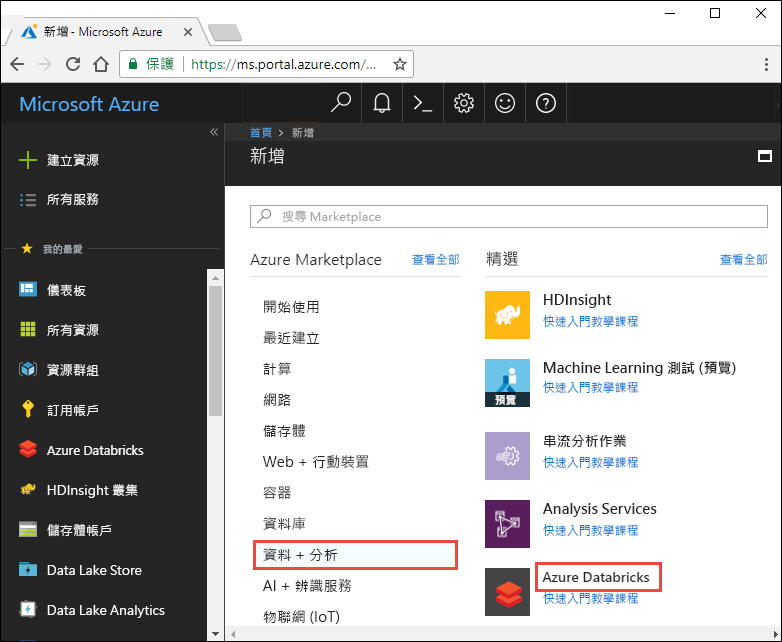
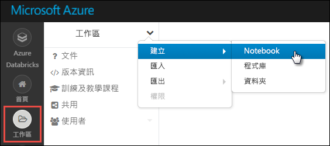

# <a name="tutorial-stream-data-into-azure-databricks-using-event-hubs"></a>教學課程：使用事件中樞將資料串流至 Azure Databricks

在本教學課程中，您會連線資料擷取系統與 Azure Databricks，以近乎即時地將資料串流到 Apache Spark 叢集。 您會使用 Azure 事件中樞設定資料擷取系統，並將其連線到 Azure Databricks 以處理流經此處的訊息。 為了存取資料流，您會使用 Twitter API 將推文擷取至事件中樞。 在 Azure Databricks 中擁有資料後，您就可以執行分析作業以進一步分析資料。 

本教學課程結束時，您將已從 Twitter 獲得串流推文 (其中含有 "Azure" 一詞)，並會在 Azure Databricks 中讀取推文。

下圖顯示此應用程式流程：


本教學課程涵蓋下列工作：

> [!div class="checklist"]
> * 建立 Azure Databricks 工作區
> * 在 Azure Databricks 中建立 Spark 叢集
> * 建立 Twitter 應用程式來存取串流資料
> * 在 Azure Databricks 中建立 Notebook
> * 連結事件中樞與 Twitter API 的程式庫
> * 將推文傳送至事件中樞
> * 從事件中樞讀取推文

如果您沒有 Azure 訂用帳戶，請在開始之前先[建立免費帳戶](https://azure.microsoft.com/free/)。

## <a name="prerequisites"></a>先決條件

開始本教學課程之前，請確定您符合下列需求：
- Azure 事件中樞命名空間。
- 命名空間內的事件中樞。
- 用來存取事件中樞命名空間的連接字串。 連接字串的格式會類似 `Endpoint=sb://<namespace>.servicebus.windows.net/;SharedAccessKeyName=<key name>;SharedAccessKey=<key value>`。
- 事件中樞的共用存取原則名稱和原則金鑰。

您可以藉由完成[建立 Azure 事件中樞命名空間和事件中樞](../event-hubs/event-hubs-create.md)一文中的步驟，以符合這些需求。

## <a name="log-in-to-the-azure-portal"></a>登入 Azure 入口網站

登入 [Azure 入口網站](https://portal.azure.com/)。

## <a name="create-an-azure-databricks-workspace"></a>建立 Azure Databricks 工作區

在本節中，您會使用 Azure 入口網站建立 Azure Databricks 工作區。

1. 在 Azure 入口網站中，選取 [建立資源] > [資料 + 分析] > [Azure Databricks]。

    

3. 在 [Azure Databricks 服務] 底下，提供值以建立 Databricks 工作區。

    

    提供下列值：

    |屬性  |說明  |
    |---------|---------|
    |**工作區名稱**     | 提供您 Databricks 工作區的名稱        |
    |**訂用帳戶**     | 從下拉式清單中選取您的 Azure 訂用帳戶。        |
    |**資源群組**     | 指定您是要建立新的資源群組，還是使用現有資源群組。 資源群組是存放 Azure 方案相關資源的容器。 如需詳細資訊，請參閱 [Azure 資源群組概觀](../azure-resource-manager/resource-group-overview.md)。 |
    |**位置**     | 選取 [美國東部 2]。 如需其他可用的區域，請參閱[依區域提供的 Azure 服務](https://azure.microsoft.com/regions/services/)。        |
    |定價層     |  選擇 [標準] 或 [進階]。 如需這些定價層的詳細資訊，請參閱 [Databricks 定價頁面](https://azure.microsoft.com/pricing/details/databricks/)。       |

    選取 [釘選到儀表板]，然後選取 [建立]。

4. 建立帳戶需要幾分鐘的時間。 建立帳戶期間，入口網站右側會顯示 [提交 Azure Databricks 部署] 圖格。 您可能需要在儀表板上向右捲動以查看此圖格。 另外在畫面頂端附近還會顯示一個進度列。 您可以查看任何進度區域。

    

## <a name="create-a-spark-cluster-in-databricks"></a>在 Databricks 中建立 Spark 叢集

1. 在 Azure 入口網站中，移至您所建立的 Databricks 工作區，然後選取 [啟動工作區]。

2. 系統會將您重新導向至 Azure Databricks 入口網站。 在入口網站中選取 [叢集]。

    

3. 在 [新增叢集] 頁面上，提供值以建立叢集。

    

    接受下列值以外的所有其他預設值：

    * 輸入叢集的名稱。
    * 針對本文，使用 **4.0** 執行階段建立叢集。
    * 請確定您選取 **在活動 ___ 分鐘後終止** 核取方塊。 請提供用來終止叢集的叢集未使用持續時間 (以分鐘為單位)。

    選取 [建立叢集]。 叢集在執行後，您就可以將 Notebook 連結至叢集，並執行 Spark 作業。

## <a name="create-a-twitter-application"></a>建立 Twitter 應用程式

若要收到推文的串流，您必須在 Twitter 中建立應用程式。 請依照下列指示建立 Twitter 應用程式，並記錄要完成本教學課程所需的值。

1. 從網頁瀏覽器移至 [Twitter 應用程式管理](https://apps.twitter.com/)，然後選取 **建立新的應用程式**。

    

2. 在 [建立應用程式] 頁面上，提供新應用程式的詳細資料，然後選取 [建立 Twitter 應用程式]。

    

3. 在應用程式頁面上，選取 [金鑰和存取權杖] 索引標籤，並複製 [取用金鑰] 和 [取用者秘密] 的值。 此外，請選取 [建立我的存取權杖] 來產生存取權杖。 複製 [存取權杖] 和 [存取權杖祕密] 的值。

    

儲存您所擷取的 Twitter 應用程式值。 在本教學課程後續的內容中，您會需要這些值。

## <a name="attach-libraries-to-spark-cluster"></a>將程式庫連結至 Spark 叢集

在本教學課程中，您會使用 Twitter API 將推文傳送至事件中樞。 您也會使用 [Apache Spark 事件中樞連接器](https://github.com/Azure/azure-event-hubs-spark)來讀取資料並將資料寫入至 Azure 事件中樞。 若要在叢集中使用這些 API，請將其作為程式庫新增至 Azure Databricks，然後讓這些 API 與您的 Spark 叢集產生關聯。 下列指示說明如何將程式庫新增至工作區中的 [共用] 資料夾。

1.  在 Azure Databricks 工作區中，選取 [工作區]，然後以滑鼠右鍵按一下 [共用]。 從快顯功能表中，選取 [建立] > [程式庫]。

    

2. 在 [新增程式庫] 頁面上，於 [來源] 中選取 [Maven 座標]。 在 [座標] 中輸入您要新增之套件的座標。 以下是本教學課程所使用之程式庫的 Maven 座標：

    * Spark 事件中樞連接器 - `com.microsoft.azure:azure-eventhubs-spark_2.11:2.3.1`
    * Twitter API - `org.twitter4j:twitter4j-core:4.0.6`

    

3. 選取 [建立程式庫]。

4. 選取程式庫新增所在的資料夾，然後選取程式庫名稱。

    

5. 在程式庫頁面上，選取要在其中使用程式庫的叢集。 在程式庫成功地與叢集產生關聯後，狀態會立即變更為 [已連結]。

    

6. 對 Twitter 套件 `twitter4j-core:4.0.6` 重複執行這些步驟。

## <a name="create-notebooks-in-databricks"></a>在 Databricks 中建立 Notebook

在本節中，您會在 Databricks 工作區中建立兩個具有下列名稱的 Notebook：

- **SendTweetsToEventHub** - 生產者 Notebook，可供用來從 Twitter 取得推文，再將推文串流至事件中樞。
- **ReadTweetsFromEventHub** - 取用者 Notebook，可供用來從事件中樞讀取推文。

1. 在左側窗格中，選取 [工作區]。 從 [工作區] 下拉式清單選取 [建立] > [Notebook]。

    

2. 在 [建立 Notebook] 對話方塊中輸入 **SendTweetsToEventHub**，選取 [Scala] 作為語言，然後選取您先前建立的 Spark 叢集。

    

    選取 [建立] 。

3. 重複上述步驟以建立 **ReadTweetsFromEventHub** Notebook。

## <a name="send-tweets-to-event-hubs"></a>將推文傳送至事件中樞

在 **SendTweetsToEventHub** Notebook 中貼上下列程式碼，並將預留位置取代為您稍早所建立之事件中樞命名空間和 Twitter 應用程式的值。 此 Notebook 會將含有關鍵字 "Azure" 的推文即時串流到事件中樞。

```scala
    import java.util._
    import scala.collection.JavaConverters._
    import com.microsoft.azure.eventhubs._
    import java.util.concurrent._

    val namespaceName = "<EVENT HUBS NAMESPACE>"
    val eventHubName = "<EVENT HUB NAME>"
    val sasKeyName = "<POLICY NAME>"
    val sasKey = "<POLICY KEY>"
    val connStr = new ConnectionStringBuilder()
                .setNamespaceName(namespaceName)
                .setEventHubName(eventHubName)
                .setSasKeyName(sasKeyName)
                .setSasKey(sasKey)

    val pool = Executors.newFixedThreadPool(1)
    val eventHubClient = EventHubClient.create(connStr.toString(), pool)

    def sendEvent(message: String) = {
      val messageData = EventData.create(message.getBytes("UTF-8"))
      eventHubClient.get().send(messageData)
      System.out.println("Sent event: " + message + "\n")
    }

    import twitter4j._
    import twitter4j.TwitterFactory
    import twitter4j.Twitter
    import twitter4j.conf.ConfigurationBuilder

    // Twitter configuration!
    // Replace values below with yours

    val twitterConsumerKey = "<CONSUMER KEY>"
    val twitterConsumerSecret = "<CONSUMER SECRET>"
    val twitterOauthAccessToken = "<ACCESS TOKEN>"
    val twitterOauthTokenSecret = "<TOKEN SECRET>"

    val cb = new ConfigurationBuilder()
      cb.setDebugEnabled(true)
      .setOAuthConsumerKey(twitterConsumerKey)
      .setOAuthConsumerSecret(twitterConsumerSecret)
      .setOAuthAccessToken(twitterOauthAccessToken)
      .setOAuthAccessTokenSecret(twitterOauthTokenSecret)

    val twitterFactory = new TwitterFactory(cb.build())
    val twitter = twitterFactory.getInstance()

    // Getting tweets with keyword "Azure" and sending them to the Event Hub in realtime!

    val query = new Query(" #Azure ")
    query.setCount(100)
    query.lang("en")
    var finished = false
    while (!finished) {
      val result = twitter.search(query)
      val statuses = result.getTweets()
      var lowestStatusId = Long.MaxValue
      for (status <- statuses.asScala) {
        if(!status.isRetweet()){
          sendEvent(status.getText())
        }
        lowestStatusId = Math.min(status.getId(), lowestStatusId)
        Thread.sleep(2000)
      }
      query.setMaxId(lowestStatusId - 1)
    }

    // Closing connection to the Event Hub
    eventHubClient.get().close()
```

若要執行 Notebook，請按 **SHIFT + ENTER**。 您會看到如下面程式碼片段的輸出。 輸出中的每個事件都是擷取至事件中樞中含有 "Azure" 一詞的推文。

    Sent event: @Microsoft and @Esri launch Geospatial AI on Azure https://t.co/VmLUCiPm6q via @geoworldmedia #geoai #azure #gis #ArtificialIntelligence

    Sent event: Public preview of Java on App Service, built-in support for Tomcat and OpenJDK
    https://t.co/7vs7cKtvah
    #cloudcomputing #Azure

    Sent event: 4 Killer #Azure Features for #Data #Performance https://t.co/kpIb7hFO2j by @RedPixie

    Sent event: Migrate your databases to a fully managed service with Azure SQL Database Managed Instance | #Azure | #Cloud https://t.co/sJHXN4trDk

    Sent event: Top 10 Tricks to #Save Money with #Azure Virtual Machines https://t.co/F2wshBXdoz #Cloud

    ...
    ...

## <a name="read-tweets-from-event-hubs"></a>從事件中樞讀取推文

在 **ReadTweetsFromEventHub** Notebook 中貼上下列程式碼，並將預留位置取代為您稍早所建立之 Azure 事件中樞的值。 此 Notebook 會讀取您稍早使用 **SendTweetsToEventHub** Notebook 串流至事件中樞的推文。

```scala
    import org.apache.spark.eventhubs._

    // Build connection string with the above information
    val connectionString = ConnectionStringBuilder("<EVENT HUBS CONNECTION STRING>")
      .setEventHubName("<EVENT HUB NAME>")
      .build

    val customEventhubParameters =
      EventHubsConf(connectionString)
      .setMaxEventsPerTrigger(5)

    val incomingStream = spark.readStream.format("eventhubs").options(customEventhubParameters.toMap).load()

    incomingStream.printSchema

    // Sending the incoming stream into the console.
    // Data comes in batches!
    incomingStream.writeStream.outputMode("append").format("console").option("truncate", false).start().awaitTermination()
```

您會獲得下列輸出︰


    root
     |-- body: binary (nullable = true)
     |-- offset: long (nullable = true)
     |-- seqNumber: long (nullable = true)
     |-- enqueuedTime: long (nullable = true)
     |-- publisher: string (nullable = true)
     |-- partitionKey: string (nullable = true)

    -------------------------------------------
    Batch: 0
    -------------------------------------------
    +------+------+--------------+---------------+---------+------------+
    |body  |offset|sequenceNumber|enqueuedTime   |publisher|partitionKey|
    +------+------+--------------+---------------+---------+------------+
    |[50 75 62 6C 69 63 20 70 72 65 76 69 65 77 20 6F 66 20 4A 61 76 61 20 6F 6E 20 41 70 70 20 53 65 72 76 69 63 65 2C 20 62 75 69 6C 74 2D 69 6E 20 73 75 70 70 6F 72 74 20 66 6F 72 20 54 6F 6D 63 61 74 20 61 6E 64 20 4F 70 65 6E 4A 44 4B 0A 68 74 74 70 73 3A 2F 2F 74 2E 63 6F 2F 37 76 73 37 63 4B 74 76 61 68 20 0A 23 63 6C 6F 75 64 63 6F 6D 70 75 74 69 6E 67 20 23 41 7A 75 72 65]                              |0     |0             |2018-03-09 05:49:08.86 |null     |null        |
    |[4D 69 67 72 61 74 65 20 79 6F 75 72 20 64 61 74 61 62 61 73 65 73 20 74 6F 20 61 20 66 75 6C 6C 79 20 6D 61 6E 61 67 65 64 20 73 65 72 76 69 63 65 20 77 69 74 68 20 41 7A 75 72 65 20 53 51 4C 20 44 61 74 61 62 61 73 65 20 4D 61 6E 61 67 65 64 20 49 6E 73 74 61 6E 63 65 20 7C 20 23 41 7A 75 72 65 20 7C 20 23 43 6C 6F 75 64 20 68 74 74 70 73 3A 2F 2F 74 2E 63 6F 2F 73 4A 48 58 4E 34 74 72 44 6B]            |168   |1             |2018-03-09 05:49:24.752|null     |null        |
    +------+------+--------------+---------------+---------+------------+

    -------------------------------------------
    Batch: 1
    -------------------------------------------
    ...
    ...

因為輸出採用二進位模式，請使用下列程式碼片段將它轉換成字串。

```scala
    import org.apache.spark.sql.types._
    import org.apache.spark.sql.functions._

    // Event Hub message format is JSON and contains "body" field
    // Body is binary, so we cast it to string to see the actual content of the message
    val messages =
      incomingStream
      .withColumn("Offset", $"offset".cast(LongType))
      .withColumn("Time (readable)", $"enqueuedTime".cast(TimestampType))
      .withColumn("Timestamp", $"enqueuedTime".cast(LongType))
      .withColumn("Body", $"body".cast(StringType))
      .select("Offset", "Time (readable)", "Timestamp", "Body")

    messages.printSchema

    messages.writeStream.outputMode("append").format("console").option("truncate", false).start().awaitTermination()
```

輸出現在會類似下列程式碼片段：

    root
     |-- Offset: long (nullable = true)
     |-- Time (readable): timestamp (nullable = true)
     |-- Timestamp: long (nullable = true)
     |-- Body: string (nullable = true)

    -------------------------------------------
    Batch: 0
    -------------------------------------------
    +------+-----------------+----------+-------+
    |Offset|Time (readable)  |Timestamp |Body
    +------+-----------------+----------+-------+
    |0     |2018-03-09 05:49:08.86 |1520574548|Public preview of Java on App Service, built-in support for Tomcat and OpenJDK
    https://t.co/7vs7cKtvah
    #cloudcomputing #Azure          |
    |168   |2018-03-09 05:49:24.752|1520574564|Migrate your databases to a fully managed service with Azure SQL Database Managed Instance | #Azure | #Cloud https://t.co/sJHXN4trDk    |
    |0     |2018-03-09 05:49:02.936|1520574542|@Microsoft and @Esri launch Geospatial AI on Azure https://t.co/VmLUCiPm6q via @geoworldmedia #geoai #azure #gis #ArtificialIntelligence|
    |176   |2018-03-09 05:49:20.801|1520574560|4 Killer #Azure Features for #Data #Performance https://t.co/kpIb7hFO2j by @RedPixie                                                    |
    +------+-----------------+----------+-------+
    -------------------------------------------
    Batch: 1
    -------------------------------------------
    ...
    ...

就這麼簡單！ 您已使用 Azure Databricks 成功地以近乎即時的速度將資料串流至 Azure 事件中樞。 然後，您又使用適用於 Apache Spark 的事件中樞連接器取用串流資料。 如需如何使用 Spark 事件中樞連接器的詳細資訊，請參閱[連接器文件](https://github.com/Azure/azure-event-hubs-spark/tree/master/docs)。

## <a name="clean-up-resources"></a>清除資源

在本教學課程執行完後，您可以終止叢集。 若要這樣做，請從 Azure Databricks 工作區的左窗格中選取 [叢集]。 對於您想要終止的叢集，將游標移到 [動作] 資料行底下的省略符號上，然後選取 [終止] 圖示。


如果您不手動終止叢集，叢集將會自動停止，但前提是您已在建立叢集時選取 [在停止活動 __ 分鐘後終止] 核取方塊。 在這種情況下，叢集將會在停止活動達指定時間後自動停止。

## <a name="next-steps"></a>後續步驟
在本教學課程中，您已了解如何：

> [!div class="checklist"]
> * 建立 Azure Databricks 工作區
> * 在 Azure Databricks 中建立 Spark 叢集
> * 建立 Twitter 應用程式來產生串流資料
> * 在 Azure Databricks 中建立 Notebook
> * 新增事件中樞與 Twitter API 的程式庫
> * 將推文傳送至事件中樞
> * 從事件中樞讀取推文

請前進到下一個教學課程，以了解如何使用 Azure Databricks 和 [Microsoft 認知服務 API](../cognitive-services/text-analytics/overview.md) 對串流資料執行情感分析。

> [!div class="nextstepaction"]
>[使用 Azure Databricks 對串流資料進行情感分析](databricks-sentiment-analysis-cognitive-services.md)
