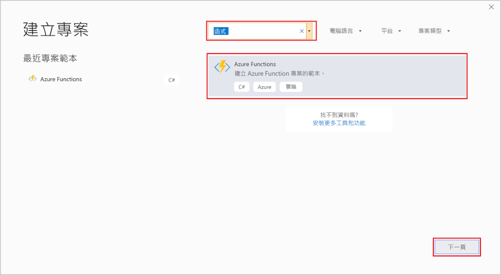
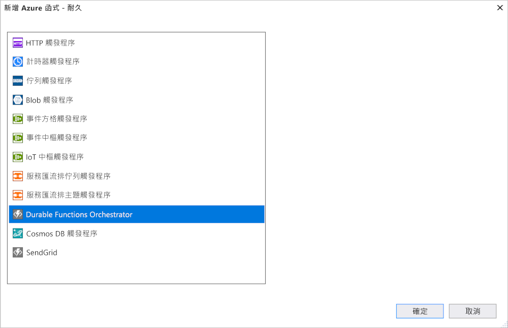

# <a name="create-your-first-durable-function-in-c"></a>使用 C\# 建立第一個耐久函式

*Durable Functions* 是 [Azure Functions](../functions-overview.md) 的擴充功能，可讓您在無伺服器環境中撰寫具狀態函式。 此擴充功能會為您管理狀態、設定檢查點和重新啟動。

在本文中，您將了解如何使用 Visual Studio 2017 Tools for Azure Functions 在本機建立及測試 "hello world" 耐久函式。  此函式會協調對其他函式的呼叫並鏈結在一起。 接著會將函式程式碼發佈至 Azure。 這些工具可在 Visual Studio 2017 的 Azure 開發工作負載中取得。


## <a name="prerequisites"></a>必要條件

若要完成本教學課程：

* 安裝 [Visual Studio 2017](https://azure.microsoft.com/downloads/)。 確定也已經安裝 **Azure 開發**工作負載。

* 確定您有[最新的 Azure Functions 工具](../functions-develop-vs.md#check-your-tools-version)。

* 確認您已安裝且正在執行 [Azure 儲存體模擬器](../../storage/common/storage-use-emulator.md)。

[!INCLUDE [quickstarts-free-trial-note](../../../includes/quickstarts-free-trial-note.md)]

## <a name="create-a-function-app-project"></a>建立函式應用程式專案

Azure Functions 範本可建立可發佈至 Azure 中函式應用程式的專案。 函式應用程式可讓您將多個函式群組為邏輯單位，以便您管理、部署和共用資源。

1. 在 Visual Studio 中，從 [檔案] 功能表中選取 [新增]  >  [專案]。

2. 在 [新增專案] 對話方塊中，選取 [已安裝]，展開 [Visual C#]  >  [雲端]，選取 [Azure Functions]，輸入專案的 [名稱]，然後按一下 [確定]。 函式應用程式名稱必須是有效的 C# 命名空間，因此不會使用底線、連字號或任何其他非英數字元。

    

3. 使用影像下方資料表中所指定的設定。

    

    | 設定      | 建議的值  | 說明                      |
    | ------------ |  ------- |----------------------------------------- |
    | **版本** | Azure Functions 2.x <br />(.NET Core) | 建立函式專案，該專案會使用可支援 .NET Core 的 Azure Functions 2.x 版執行階段。 Azure Functions 1.x 支援 .NET Framework。 如需詳細資訊，請參閱[如何設定 Azure Functions 執行階段目標版本](../functions-versions.md)。   |
    | **範本** | 空白 | 建立空白的函式應用程式。 |
    | **儲存體帳戶**  | 儲存體模擬器 | 需要儲存體帳戶，才能管理耐久函式應用程式狀態。 |

4. 按一下 [確定] 以建立空白的函式專案。 此專案具有執行您的函式所需的基本組態檔。

## <a name="add-functions-to-the-app"></a>將函式新增至應用程式

下列步驟會使用範本在您的專案中建立耐久函式程式碼。

1. 在 Visual Studio 中以滑鼠右鍵按一下專案，然後選取 [新增] > [新增 Azure Function]。

    

2. 確認已從 [新增] 功能表中選取 **Azure Function**，並且為您的 C# 檔案命名。  按 [新增] 。

3. 選取 [Durable Functions 協調器] 範本，然後按一下 [確定]。

      

新的耐久函式會新增至應用程式。  開啟新的 .cs 檔案以檢視內容。 此耐久函式是簡單的函式鏈結範例，包含下列方法：  

| 方法 | FunctionName | 說明 |
| -----  | ------------ | ----------- |
| **`RunOrchestrator`** | `<file-name>` | 管理耐久協調流程。 在此情況下，協調流程會啟動、建立清單，以及將三個函式呼叫的結果新增至清單。  完成三個函式呼叫後，它會傳回清單。 |
| **`SayHello`** | `<file-name>_Hello` | 此函數會傳回 hello。 這個函式包含要進行協調的商務邏輯。 |
| **`HttpStart`** | `<file-name>_HttpStart` | [HTTP 觸發的函式](../functions-bindings-http-webhook.md)，該函式會啟動協調流程執行個體並傳回檢查狀態回應。 |

您現在已建立函式專案和耐久函式，可以在本機電腦上進行測試。

## <a name="test-the-function-locally"></a>在本機測試函式

Azure Functions Core Tools 可讓您在本機開發電腦上執行 Azure Functions 專案。 第一次從 Visual Studio 啟動函式時，系統會提示您安裝這些工具。

1. 若要測試您的函式，請按 F5。 如果出現提示，接受來自 Visual Studio 之下載及安裝 Azure Functions Core (CLI) 工具的要求。 您可能也需要啟用防火牆例外狀況，工具才能處理 HTTP 要求。

2. 從 Azure Functions 執行階段輸出複製函式的 URL。

    

3. 將 HTTP 要求的 URL 貼到瀏覽器的網址列中，然後執行要求。 下圖顯示瀏覽器中對於函式傳回之本機 GET 要求所做出的回應︰

    

    回應是 HTTP 函式的初始結果，讓我們知道耐久協調流程已成功啟動。  這還不是協調流程的最終結果。  回應包含一些實用的 URL。  讓現在我們查詢協調流程的狀態。

4. 複製 `statusQueryGetUri` 的 URL 值並將它貼在瀏覽器的網址列中，然後執行要求。

    此要求會查詢協調流程執行個體的狀態。 您應會取得如下所示的最終回應。  這表示執行個體已完成，而且包含耐久函式的輸出或結果。

    ```json
    {
        "instanceId": "d495cb0ac10d4e13b22729c37e335190",
        "runtimeStatus": "Completed",
        "input": null,
        "customStatus": null,
        "output": [
            "Hello Tokyo!",
            "Hello Seattle!",
            "Hello London!"
        ],
        "createdTime": "2018-11-08T07:07:40Z",
        "lastUpdatedTime": "2018-11-08T07:07:52Z"
    }
    ```

5. 若要停止偵錯，請按 **Shift + F5**。

確認函式在本機電腦上正確執行之後，就可以將專案發佈到 Azure。

## <a name="publish-the-project-to-azure"></a>將專案發佈到 Azure

您的 Azure 訂用帳戶中必須具有函式應用程式，才可以發佈您的專案。 您可以直接從 Visual Studio 建立函式應用程式。

[!INCLUDE [Publish the project to Azure](../../../includes/functions-vstools-publish.md)]

## <a name="test-your-function-in-azure"></a>在 Azure 中測試您的函式

1. 從發行設定檔頁面複製函式應用程式的基底 URL。 使用新的基底 URL，取代在本機測試函式時所使用之 URL 的 `localhost:port` 部分。

    呼叫耐久函式 HTTP 觸發程序的 URL 應採用下列格式：

        http://<APP_NAME>.azurewebsites.net/api/<FUNCTION_NAME>_HttpStart

2. 將 HTTP 要求的新 URL 貼到瀏覽器的網址列。 在使用已發佈的應用程式之前，您應會取得如同以往的相同狀態回應。

## <a name="next-steps"></a>後續步驟

您已使用 Visual Studio 來建立及發佈 C# 耐久函式應用程式。

> [!div class="nextstepaction"]
> [了解常見的耐久函式模式。](durable-functions-concepts.md)
