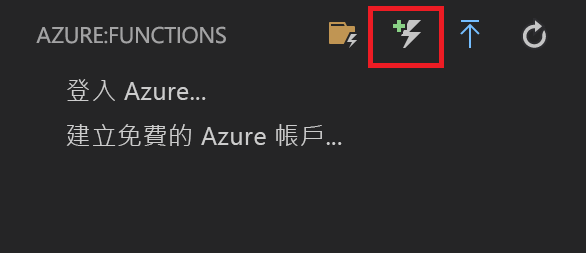
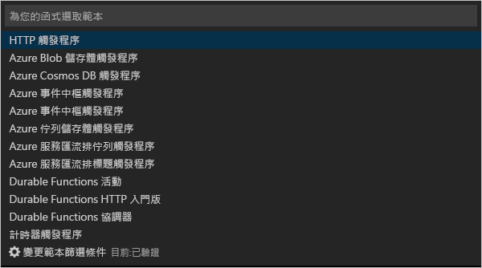
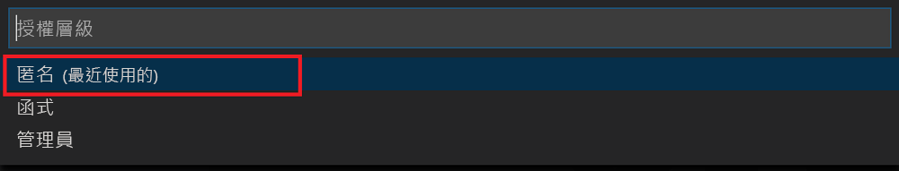

# <a name="create-your-first-durable-function-in-javascript"></a>使用 JavaScript 建立第一個耐久函式

*Durable Functions* 是 [Azure Functions](../functions-overview.md) 的擴充功能，可讓您在無伺服器環境中撰寫具狀態函式。 此擴充功能會為您管理狀態、設定檢查點和重新啟動。

在本文中，您會了解如何使用 Visual Studio Code Azure Functions 擴充功能，在本機建立及測試 "hello world" 耐久函式。  此函式會協調對其他函式的呼叫並鏈結在一起。 接著會將函式程式碼發佈至 Azure。


## <a name="prerequisites"></a>必要條件

若要完成本教學課程：

* 安裝 [Visual Studio Code](https://code.visualstudio.com/download)。

* 確定您有[最新的 Azure Functions 工具](../functions-develop-vs.md#check-your-tools-version)。

* 在 Windows 電腦上，確認您已安裝且正在執行 [Azure 儲存體模擬器](../../storage/common/storage-use-emulator.md)。 在 Mac 或 Linux 電腦上，您必須使用實際的 Azure 儲存體帳戶。

* 確定您已安裝 [Node.js](https://nodejs.org/) 8.0 版或更新版本。

[!INCLUDE [quickstarts-free-trial-note](../../../includes/quickstarts-free-trial-note.md)]

[!INCLUDE [functions-install-vs-code-extension](../../../includes/functions-install-vs-code-extension.md)]

[!INCLUDE [functions-create-function-app-vs-code](../../../includes/functions-create-function-app-vs-code.md)]

## <a name="install-the-durable-functions-npm-package"></a>安裝 Durable Functions npm 套件

1. 在函式應用程式的根目錄中執行 `durable-functions`，以安裝 `npm install durable-functions` npm 套件。

## <a name="create-a-starter-function"></a>建立入門函式

首先，建立 HTTP 觸發的函式，該函式會啟動耐久函式協調流程。

1. 從 [Azure: 函式] 中，選擇 [建立函式] 圖示。

    

2. 選取具有函式應用程式專案的資料夾，然後選取 [HTTP 觸發程序] 函式範本。

    

3. 輸入 `HttpStart` 作為函式名稱，並按下 Enter，然後選取 [匿名] 驗證。

    

    系統隨即會使用由 HTTP 觸發的函式範本，以您所選的語言來建立函式。

4. 以下面的 JavaScript 取代 index.js：

    [!code-javascript[Main](~/samples-durable-functions/samples/javascript/HttpStart/index.js)]

5. 以下面的 JSON 取代 function.json：

    [!code-json[Main](~/samples-durable-functions/samples/javascript/HttpStart/function.json)]

我們現已在我們的耐久函式中建立進入點。 讓我們新增協調器。

## <a name="create-an-orchestrator-function"></a>建立協調器函式

接下來，您會建立另一個函式作為協調器。 為了方便起見，我們會使用 HTTP 觸發程序函式範本。 函式程式碼本身會由協調器程式碼所取代。

1. 重複上一節的步驟，以使用 HTTP 觸發程序範本建立第二個函式。 這次將函式命名為 `OrchestratorFunction`。

2. 開啟新函式的 index.js 檔案，並以下列程式碼取代內容：

    [!code-json[Main](~/samples-durable-functions/samples/javascript/E1_HelloSequence/index.js)]

3. 開啟 function.json 檔案，並以下列 JSON 取代它：

    [!code-json[Main](~/samples-durable-functions/samples/javascript/E1_HelloSequence/function.json)]

我們已新增協調器來協調活動函式。 讓我們現在新增參考的活動函式。

## <a name="create-an-activity-function"></a>建立活動函式

1. 重複上一節的步驟，以使用 HTTP 觸發程序範本建立第三個函式。 但這次將函式命名為 `E1_SayHello`。

2. 開啟新函式的 index.js 檔案，並以下列程式碼取代內容：

    [!code-javascript[Main](~/samples-durable-functions/samples/javascript/E1_SayHello/index.js)]

3. 以下面的 JSON 取代 function.json：

    [!code-json[Main](~/samples-durable-functions/samples/csx/E1_SayHello/function.json)]

我們現在已新增要開始協調流程以及將活動函式鏈結在一起所需的所有元件。

## <a name="test-the-function-locally"></a>在本機測試函式

Azure Functions Core Tools 可讓您在本機開發電腦上執行 Azure Functions 專案。 第一次從 Visual Studio Code 啟動函式時，系統會提示您安裝這些工具。  

1. 在 Windows 電腦上，啟動 Azure 儲存體模擬器，並確定 local.settings.json 的 **AzureWebJobsStorage** 屬性設定為 `UseDevelopmentStorage=true`。 

    針對 Storage Emulator 5.8，請確定 local.settings.json 的 **AzureWebJobsSecretStorageType** 屬性設定為 `files`。 在 Mac 或 Linux 電腦上，您必須將 **AzureWebJobsStorage** 屬性設定為現有 Azure 儲存體帳戶的連接字串。 您稍後會在本文中建立儲存體帳戶。

2. 若要測試您的函式，可在函式程式碼中設定中斷點，並按 F5 以啟動函式應用程式專案。 Core Tools 的輸出會顯示在**終端機**面板中。 如果這是您第一次使用 Durable Functions，則會安裝Durable Functions 擴充功能 且建置可能需要幾秒鐘的時間。

    > [!NOTE]
    > JavaScript Durable Functions 需要 **1.7.0** 版或更新版的 **Microsoft.Azure.WebJobs.Extensions.DurableTask** 擴充功能。 確認 `extensions.csproj` 檔案中 Durable Functions 擴充功能的版本符合此需求。 如果不相符，請停止您的函式應用程式、變更版本，然後按 F5 重新啟動您的函式應用程式。

3. 在**終端機**面板中，複製 HTTP 觸發函式的 URL 端點。

    

4. 將 `{functionName}` 取代為 `OrchestratorFunction`。

5. 使用 [Postman](https://www.getpostman.com/) 或 [cURL](https://curl.haxx.se/) 之類的工具，將 HTTP POST 要求傳送至 URL 端點。

   回應是 HTTP 函式的初始結果，讓我們知道耐久協調流程已成功啟動。 這還不是協調流程的最終結果。 回應包含一些實用的 URL。 讓現在我們查詢協調流程的狀態。

6. 複製 `statusQueryGetUri` 的 URL 值並將它貼在瀏覽器的網址列中，然後執行要求。 或者，您也可以繼續使用 Postman 來發出 GET 要求。

   此要求會查詢協調流程執行個體的狀態。 您應該會取得最終回應，內容指出執行個體已完成，並包含耐久函式的輸出或結果。 如下所示： 

    ```json
    {
        "instanceId": "d495cb0ac10d4e13b22729c37e335190",
        "runtimeStatus": "Completed",
        "input": null,
        "customStatus": null,
        "output": [
            "Hello Tokyo!",
            "Hello Seattle!",
            "Hello London!"
        ],
        "createdTime": "2018-11-08T07:07:40Z",
        "lastUpdatedTime": "2018-11-08T07:07:52Z"
    }
    ```

7. 若要停止偵錯，請在 VS Code 中按 **Shift + F5**。

確認函式在本機電腦上正確執行之後，就可以將專案發佈到 Azure。

[!INCLUDE [functions-create-function-app-vs-code](../../../includes/functions-sign-in-vs-code.md)]

[!INCLUDE [functions-publish-project-vscode](../../../includes/functions-publish-project-vscode.md)]

## <a name="test-your-function-in-azure"></a>在 Azure 中測試您的函式

1. 從 [輸出] 面板中複製 HTTP 觸發程序的 URL。 呼叫 HTTP URL 觸發函式的 URL 應採用下列格式：

        http://<functionappname>.azurewebsites.net/orchestrators/<functionname>

2. 將 HTTP 要求的新 URL 貼到瀏覽器的網址列。 在使用已發佈的應用程式之前，您應會取得如同以往的相同狀態回應。

## <a name="next-steps"></a>後續步驟

您已使用 Visual Studio Code 來建立及發佈 JavaScript 耐久函式應用程式。

> [!div class="nextstepaction"]
> [了解常見的耐久函式模式](durable-functions-concepts.md)
