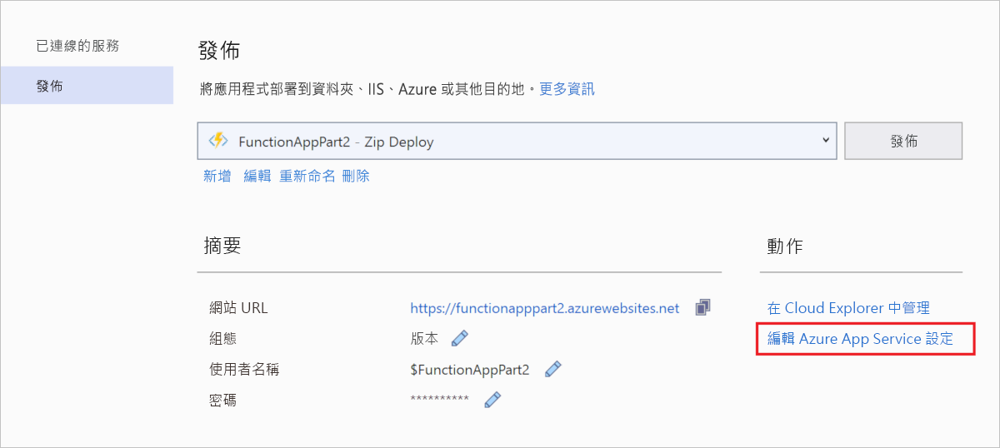
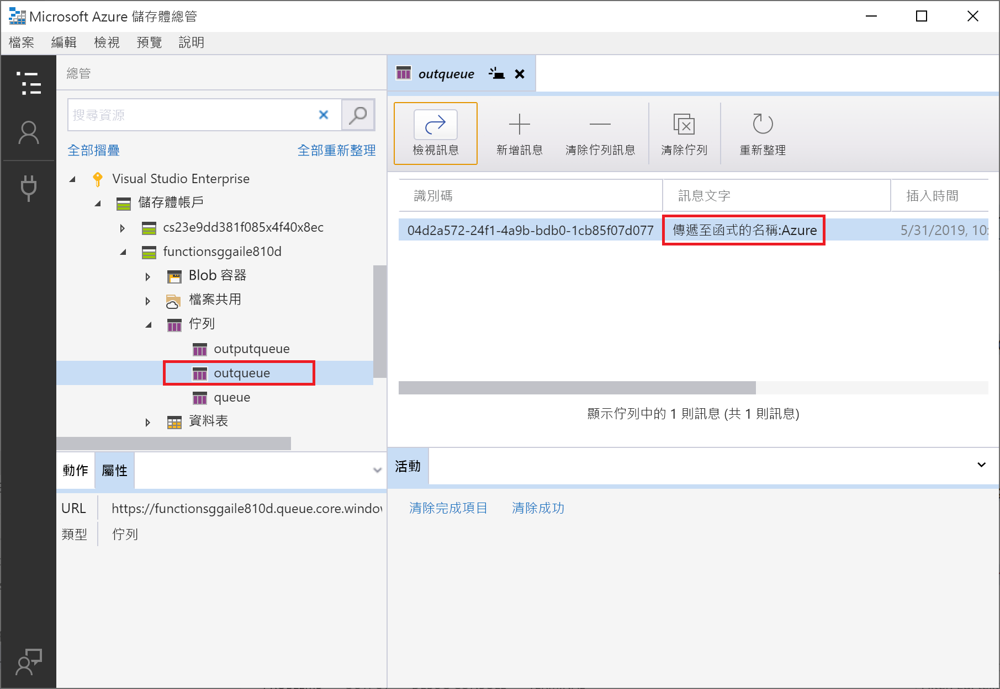

# <a name="connect-functions-to-azure-storage-using-visual-studio"></a>使用 Visual Studio 將函式連線至 Azure 儲存體

[!INCLUDE [functions-add-storage-binding-intro](../../includes/functions-add-storage-binding-intro.md)]

此文章說明如何使用 Visual Studio 將您在[先前的快速入門文章]中建立的函式連線至 Azure 儲存體。 您新增至此函式的輸出繫結，會將資料從 HTTP 要求寫入至位於 Azure 佇列儲存體佇列中的訊息。 

大部分的繫結都需要函式用來存取繫結服務的預存連接字串。 為了方便作業，您可以使用您以函式應用程式建立的儲存體帳戶。 此帳戶的連線已儲存在名為 `AzureWebJobsStorage` 的應用程式設定中。  

## <a name="prerequisites"></a>必要條件

開始本文之前，您必須： 

 - 完成 [Visual Studio 快速入門的第1部分][./functions-create-first-function-vs-code.md]。 

- 從 Visual Studio 登入您的 Azure 訂用帳戶。

## <a name="download-the-function-app-settings"></a>下載函式應用程式設定

在[先前的快速入門文章](functions-create-first-function-vs-code.md)中，您已在 Azure 中建立函式應用程式與必要的儲存體帳戶。 此帳戶的連接字串會安全地儲存在 Azure 的應用程式設定中。 在本文中，您會將訊息寫入至相同帳戶中的儲存體佇列。 在本機執行函式時若要連線至儲存體帳戶，您必須將應用程式設定下載到 local.settings.json  檔案。 

1. 在 [方案總管]  中，以滑鼠右鍵按一下專案並選取 [發佈]  。 

1. 在 [動作]  之下，選取 [編輯 Azure App Service 設定]  。 

    

1. 在 [AzureWebJobsStorage]  之下，將 [遠端]  字串值複製到 [本機]  ，然後選取 [確定]  。 

使用 `AzureWebJobsStorage` 設定進行連線的儲存體繫結，現在可以在本機執行時連線到您的佇列儲存體。

## <a name="register-binding-extensions"></a>註冊繫結延伸模組

由於您是使用佇列儲存體輸出繫結，所必須先安裝儲存體繫結擴充才能執行專案。 除了 HTTP 和計時器觸發程序以外，繫結皆會以擴充套件的形式實作。 

1. 從 [工具]  功能表中，選取 [NuGet 封裝管理員]   > [封裝管理員主控台]  。 

1. 在主控台中，執行下列 [Install-Package](/nuget/tools/ps-ref-install-package) 命令以安裝儲存體擴充功能：

    ```Command
    Install-Package Microsoft.Azure.WebJobs.Extensions.Storage -Version 3.0.6
    ````

現在，您可以將儲存體輸出繫結新增至您的專案。

## <a name="add-an-output-binding"></a>新增輸出繫結

[!INCLUDE [functions-add-storage-binding-csharp-library](../../includes/functions-add-storage-binding-csharp-library.md)]

## <a name="add-code-that-uses-the-output-binding"></a>新增會使用輸出繫結的程式碼

在定義繫結之後，您即可使用繫結的 `name` 來以函式簽章中屬性的形式存取它。 藉由使用輸出繫結，您無須使用 Azure 儲存體 SDK 程式碼來進行驗證、取得佇列參考或寫入資料。 Functions 執行階段和佇列輸出繫結會為您進行這些工作。

[!INCLUDE [functions-add-storage-binding-csharp-library-code](../../includes/functions-add-storage-binding-csharp-library-code.md)]

## <a name="run-the-function-locally"></a>在本機執行函式

[!INCLUDE [functions-run-function-test-local-vs](../../includes/functions-run-function-test-local-vs.md)]

您第一次使用輸出繫結時，Functions 執行階段會在儲存體帳戶中建立名為 `outqueue` 的新佇列。 您將使用 Cloud Explorer 來確認佇列已連同新訊息一起被建立。

## <a name="examine-the-output-queue"></a>檢查輸出佇列

1. 在 Visual Studio 的 [檢視]  功能表中，選取 [Cloud Explorer]  。

1. 在 [Cloud Explorer]  中，展開您的 Azure 訂用帳戶和 [儲存體帳戶]  ，然後展開您的函式所使用的儲存體帳戶。 如果您不記得儲存體帳戶名稱，請檢查 local.settings.json  檔案中的 `AzureWebJobsStorage` 連接字串設定。  

1. 展開 [佇列]  節點，然後按兩下名為 **outqueue** 的佇列，以在 Visual Studio 中查看佇列的內容。 

   佇列包含訊息，該訊息將您執行 HTTP 觸發程序函式時建立的輸出繫結排入佇列。 如果您已叫用預設 `name` 值為 *Azure* 的函式，則佇列訊息是 *Name passed to the function:Azure*。

    

1. 再次執行函式並傳送另一個要求，您將會看到新的訊息出現在佇列中。  

現在，您可以將更新的函式應用程式重新發行至 Azure。

## <a name="redeploy-and-verify-the-updated-app"></a>重新部署並驗證更新的應用程式

1. 在 [方案總管]  中，以滑鼠右鍵按一下專案並選取 [發佈]  ，然後選擇 [發佈]  將專案重新發佈至 Azure。

1. 部署完成後，您便可以再次使用瀏覽器來測試重新部署的函式。 如同以往，將查詢字串 `&name=<yourname>` 附加至 URL。

1. 再次[檢視儲存體佇列中的訊息](#examine-the-output-queue)，以確認輸出繫結會再次在佇列中產生新訊息。

## <a name="clean-up-resources"></a>清除資源

[!INCLUDE [Clean-up resources](../../includes/functions-quickstart-cleanup.md)]

## <a name="next-steps"></a>後續步驟

您已更新 HTTP 觸發的函式，以將資料寫入至儲存體佇列。 若要深入了解函式的開發，請參閱[使用 Visual Studio 開發 Azure Functions](functions-develop-vs.md)。

接下來，您應為函式應用程式啟用 Application Insights 監視：

> [!div class="nextstepaction"]
> [啟用 Application Insights 整合](functions-monitoring.md#manually-connect-an-app-insights-resource)

[Azure Storage Explorer]: https://storageexplorer.com/
[先前的快速入門文章]: functions-create-your-first-function-visual-studio.md
