# 建立 Azure Cosmos DB 所觸發的函式

了解如何建立在 Azure Cosmos DB 中新增或變更資料時觸發的函式。 如需 Azure Cosmos DB 的詳細資訊，請參閱 [Azure Cosmos DB：使用 Azure Functions 的無伺服器資料庫計算](..\cosmos-db\serverless-computing-database.md)。

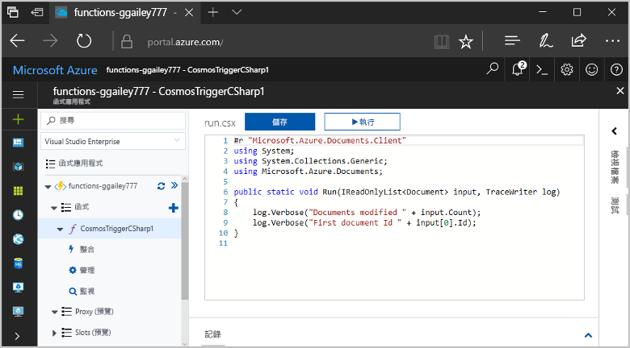

## 必要條件

若要完成本教學課程：

+ 如果您沒有 Azure 訂用帳戶，請在開始前建立 [免費帳戶](https://azure.microsoft.com/free/?WT.mc_id=A261C142F) 。

> [!NOTE]
> [!INCLUDE [SQL API support only](../../includes/functions-cosmosdb-sqlapi-note.md)]

## 建立 Azure Cosmos DB 帳戶

在建立觸發程序之前，您必須先擁有使用 SQL API 的 Azure Cosmos DB 帳戶。

[!INCLUDE [cosmos-db-create-dbaccount](../../includes/cosmos-db-create-dbaccount.md)]

## 建立 Azure 函數應用程式

[!INCLUDE [Create function app Azure portal](../../includes/functions-create-function-app-portal.md)]

接下來，您要在新的函式應用程式中建立函式。

## 建立 Azure Cosmos DB 觸發程序

1. 展開函式應用程式，然後按一下 [Functions] 旁的 [+] 按鈕。 如果這是函式應用程式中的第一個函式，請依序選取 [入口網站內] 和 [繼續]。 否則，請移至步驟三。

   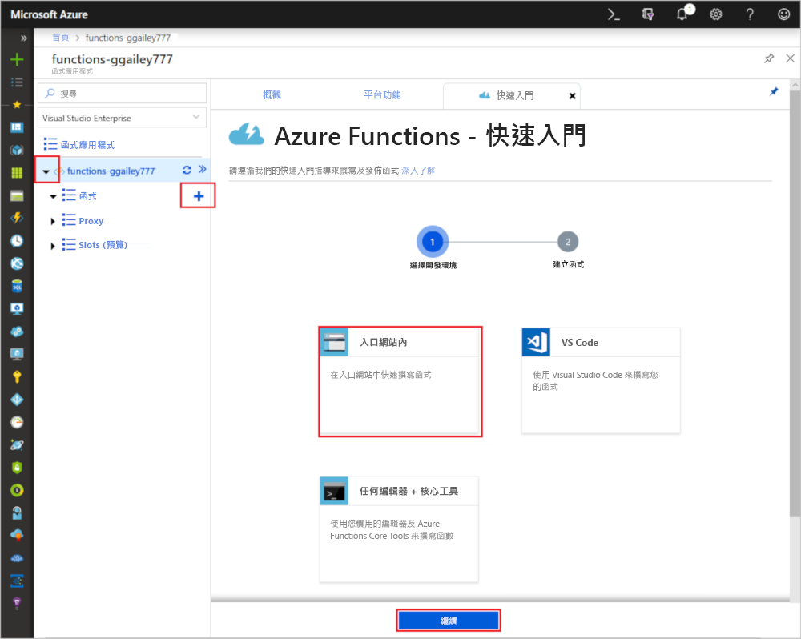

1. 依序選擇 [更多範本] 和 [完成並檢視範本]。

    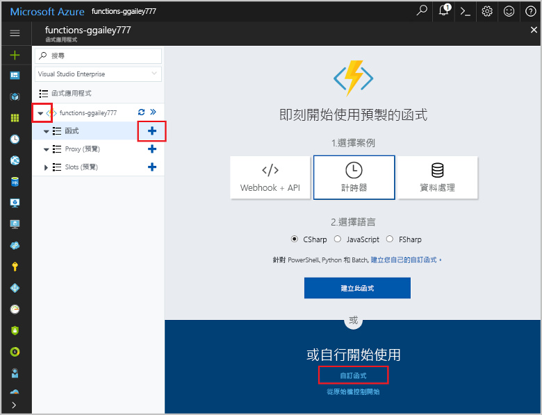

1. 在 [搜尋] 欄位中，輸入 `cosmos`，然後選擇 [Azure Cosmos DB 觸發程序] 範本。

1. 如果出現提示，請選取 [安裝]，以在函式應用程式中安裝 Azure 儲存體延伸模組的任何相依性。 安裝成功之後，請選取 [繼續]。

    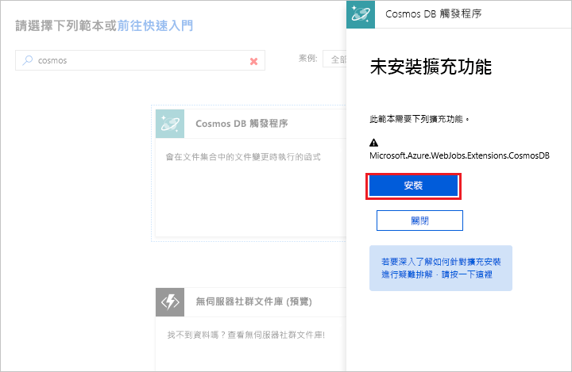

1. 使用下圖下方之表格內指定的設定來設定新的觸發程序。

    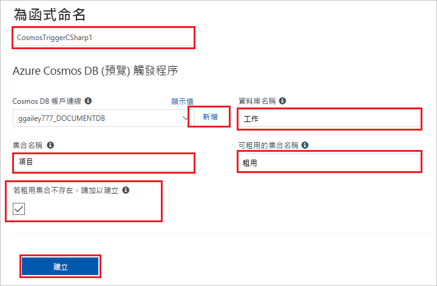

    | 設定      | 建議的值  | 說明                                |
    | ------------ | ---------------- | ------------------------------------------ |
    | **名稱** | 預設值 | 使用範本所建議的預設函式名稱。|
    | **Azure Cosmos DB 帳戶連線** | 新增設定 | 選取 [新增]，然後選擇 [訂用帳戶]、稍早建立的 [資料庫帳戶] 以及 [選取]。 這會建立適用於帳戶連線的應用程式設定。 繫結會使用此設定來連線至資料庫。 |
    | **集合名稱** | 項目 | 要監視的集合名稱。 |
    | **建立租用集合 (如果不存在)** | 已檢查 | 集合尚未存在，因此加以建立。 |
    | **資料庫名稱** | 工作 | 含有要監視之集合的資料庫名稱。 |

1. 按一下 [建立]，以建立 Azure Cosmos DB 觸發的函式。 建立函式之後，會顯示以範本為基礎的函式程式碼。  

    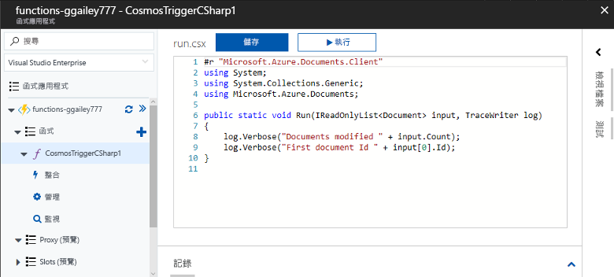

    此函式範本會將文件數和第一個文件識別碼寫入記錄。

接下來，連線到 Azure Cosmos DB 帳戶，並在 `Tasks` 資料庫中建立 `Items` 集合。

## 建立項目集合

1. 在瀏覽器的新索引標籤中，開啟 [Azure 入口網站](https://portal.azure.com)的第二個執行個體。

1. 在入口網站的左側，展開圖示列，在搜尋欄位中輸入 `cosmos`，然後選取 [Azure Cosmos DB]。

    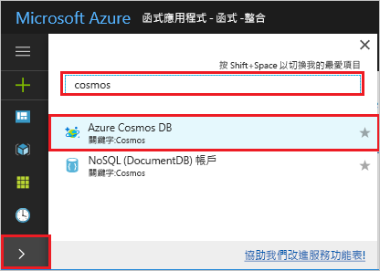

1. 選擇您的 Azure Cosmos DB 帳戶，然後選取 [資料總管]。 

1. 在 [集合] 中，選擇 [taskDatabase]，然後選取 [新增集合]。

    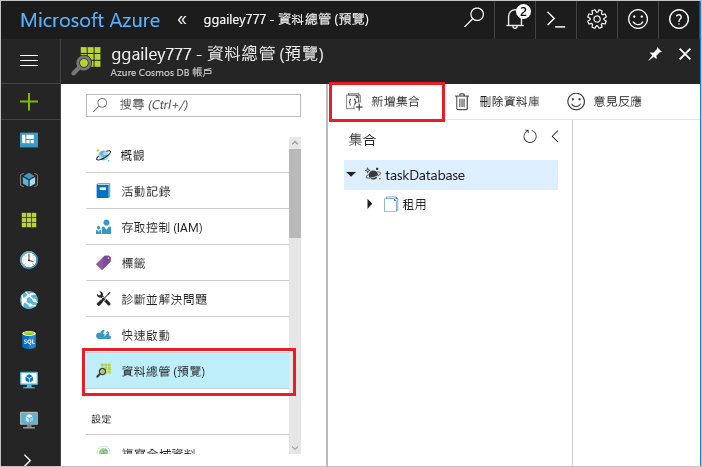

1. 在 [新增集合] 中，使用下圖下方之表格中所示的設定。 

    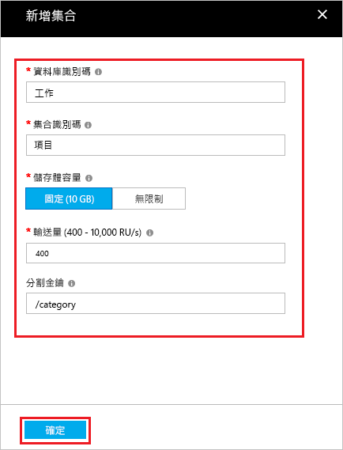

    | 設定|建議的值|說明 |
    | ---|---|--- |
    | **資料庫識別碼** | 工作 |新資料庫的名稱。 這必須符合您函式繫結中定義的名稱。 |
    | **集合識別碼** | 項目 | 新集合的名稱。 這必須符合您函式繫結中定義的名稱。  |
    | **儲存體容量** | 固定 (10 GB)|使用預設值。 此值是資料庫的儲存體容量。 |
    | **輸送量** |400 RU| 使用預設值。 如果您想要降低延遲，稍後可以相應增加輸送量。 |
    | **[分割區索引鍵](../cosmos-db/partition-data.md#best-practices-when-choosing-a-partition-key)** | /類別|可將資料平均分散到每個資料分割的資料分割索引鍵。 選取正確的資料分割索引鍵對於建立高效能集合來說很重要。 | 

1. 按一下 [確定] 以建立 [項目] 集合。 集合可能會在很短的時間內建立。

當函式繫結中指定的集合存在之後，您就能將文件新增至這個新集合，藉以測試函式。

## 測試函式

1. 在 [資料總管] 中展開新的 [taskCollection] 集合、選擇 [文件]，然後選取 [新增文件]。

    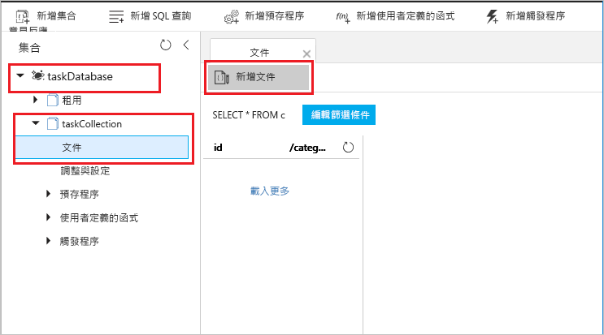

1. 使用以下內容來取代新文件的內容，然後選擇 [儲存]。

        {
            "id": "task1",
            "category": "general",
            "description": "some task"
        }

1. 切換至第一個瀏覽器索引標籤，其中包含您在入口網站中的函式。 展開函式記錄，並確認新文件已經觸發函式。 查看已將 `task1` 文件識別碼值寫入記錄。 

    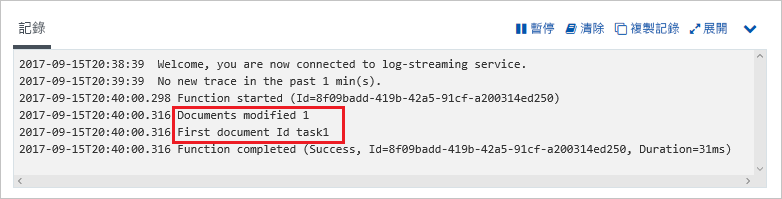

1. (選擇性) 返回您的文件、進行變更，然後按一下 [更新]。 接著，返回函式記錄，並確認更新也已觸發函式。

## 清除資源

[!INCLUDE [Next steps note](../../includes/functions-quickstart-cleanup.md)]

## 後續步驟

您已建立要在 Azure Cosmos DB 中新增或修改文件時執行的函式。

[!INCLUDE [Next steps note](../../includes/functions-quickstart-next-steps.md)]

如需 Azure Cosmos DB 觸發程序的詳細資訊，請參閱[適用於 Azure Functions 的 Azure Cosmos DB 繫結](functions-bindings-cosmosdb.md)。
