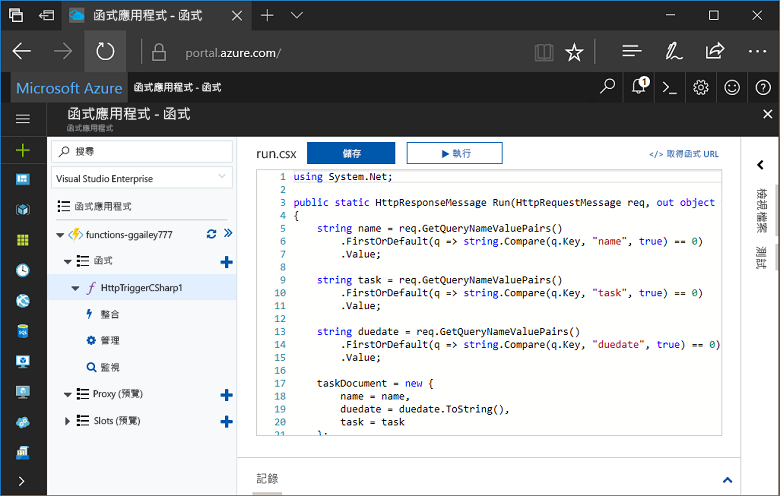
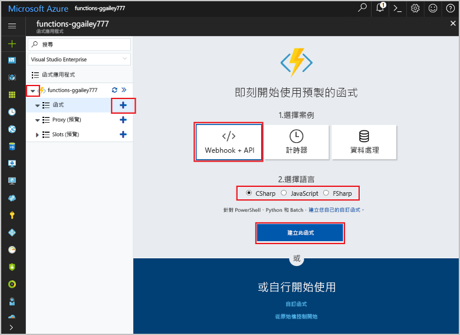
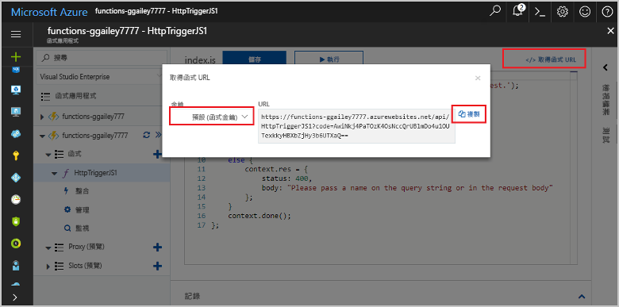

# 在 Azure 入口網站中建立您的第一個函式

Azure Functions 可讓您在[無伺服器](https://azure.microsoft.com/overview/serverless-computing/)環境中執行程式碼，而不需要先建立 VM 或發佈 Web 應用程式。 在本主題中，請學習如何使用 Functions 在 Azure 入口網站中建立「hello world」函式。

[!INCLUDE [quickstarts-free-trial-note](../../includes/quickstarts-free-trial-note.md)]

## 登入 Azure

使用您的 Azure 帳戶登入 Azure 入口網站 (<http://portal.azure.com>)。

## 建立函數應用程式

您必須擁有函式應用程式以便主控函式的執行。 函式應用程式可讓您將多個函式群組為邏輯單位，以方便您管理、部署和共用資源。 

[!INCLUDE [Create function app Azure portal](../../includes/functions-create-function-app-portal.md)]

接下來，您要在新的函式應用程式中建立函式。

## 建立由 HTTP 觸發的函式

1. 展開新的函式應用程式，然後按一下 [Functions] 旁的 **+** 按鈕。

2.  在 [即刻開始使用] 頁面上，選取 [WebHook + API]，並**選擇您的函式語言**，然後按一下 [建立此函式]。 
   
    

系統隨即會使用由 HTTP 觸發之函式的範本，以您所選的語言來建立函式。 本主題會顯示入口網站中的 C# 指令碼函式，但是您可以使用任何[支援的語言](supported-languages.md)建立函式。 

現在，您可以藉由傳送 HTTP 要求來執行新的函式。

## 測試函式

1. 在新的函式中，按一下右上方的 [</> 取得函式 URL]，選取 [預設 (函式索引鍵)]，然後按一下 [複製]。 

    

2. 將函式 URL 貼入瀏覽器的網址列中。 將查詢字串值 `&name=<yourname>` 新增至此 URL 的結尾，並按鍵盤上的 `Enter` 鍵執行要求。 您應該會看到函式傳回的回應顯示在瀏覽器中。  

    以下範例會顯示 Edge 瀏覽器中的回應 (其他瀏覽器可能會包含顯示的 XML)：

    

    要求 URL 預設會包含所需金鑰，以便透過 HTTP 存取您的函式。   

3. 當函式執行時，系統會將追蹤資訊寫入到記錄中。 若要查看上次執行的追蹤輸出，請在入口網站中返回您的函式，然後按一下畫面底部的箭號來展開**記錄**。 

   

## 清除資源

[!INCLUDE [Clean-up resources](../../includes/functions-quickstart-cleanup.md)]

## 後續步驟

您已使用簡單的 HTTP 觸發函式建立了函式應用程式。  

[!INCLUDE [Next steps note](../../includes/functions-quickstart-next-steps.md)]

如需詳細資訊，請參閱 [Azure Functions HTTP 和 webhook 繫結](functions-bindings-http-webhook.md)。

