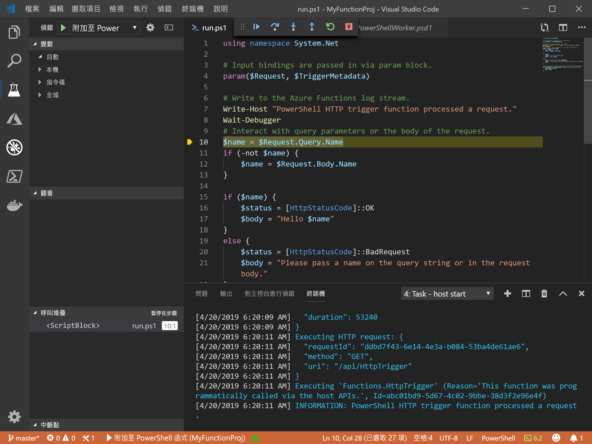
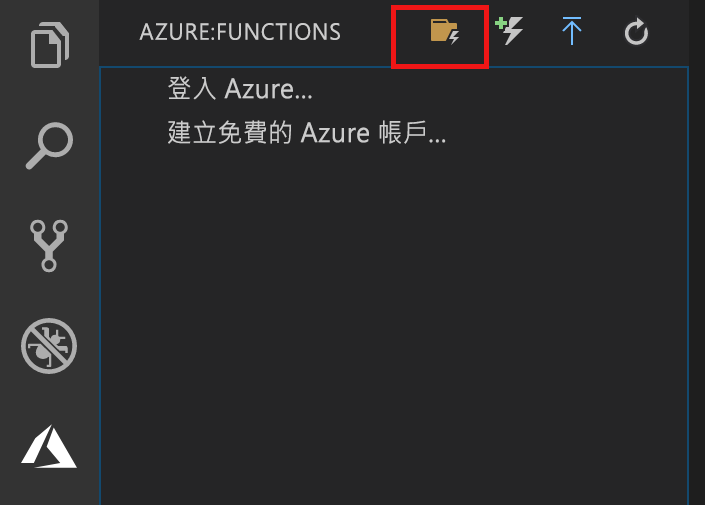
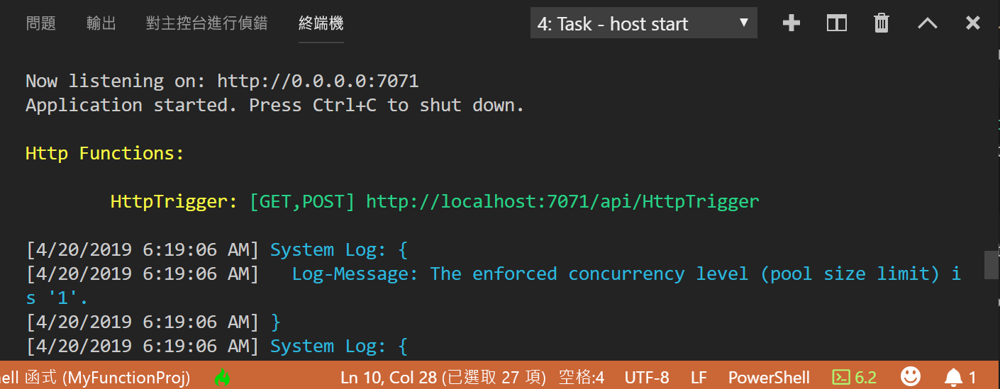

# <a name="create-your-first-powershell-function-in-azure-preview"></a>在 Azure 中建立您的第一個 PowerShell 函式 (預覽)

[!INCLUDE [functions-powershell-preview-note](../../includes/functions-powershell-preview-note.md)]

本快速入門文章會逐步說明如何使用 Visual Studio Code 建立您的第一個[無伺服器](https://azure.com/serverless) PowerShell 函式。



您可使用[適用於 Visual Studio Code 的 Azure Functions 擴充功能]在本機建立 PowerShell 函式，然後將它部署到 Azure 中的新函式應用程式。 此擴充功能目前為預覽狀態。 若要進一步了解，請參閱[適用於 Visual Studio Code 的 Azure Functions 擴充功能]的擴充功能頁面。

> [!NOTE]  
> 目前預設停用 [Azure Functions 擴充功能][適用於 Visual Studio Code 的 Azure Functions 擴充功能]的 PowerShell 支援。 啟用 PowerShell 支援是本文中的其中一個步驟。

以 macOS、Windows 和 Linux 為基礎的作業系統支援下列步驟。

## <a name="prerequisites"></a>必要條件

若要完成本快速入門：

* 安裝 [PowerShell Core](/powershell/scripting/install/installing-powershell-core-on-windows)

* 在其中一個[支援的平台](https://code.visualstudio.com/docs/supporting/requirements#_platforms)上安裝 [Visual Studio Code](https://code.visualstudio.com/)。 

* 安裝[適用於 Visual Studio Code 的 PowerShell 擴充功能](https://marketplace.visualstudio.com/items?itemName=ms-vscode.PowerShell)。

* 安裝 [.NET Core SDK 2.2+](https://www.microsoft.com/net/download) (Azure Functions Core Tools 所需且適用於所有支援的平台上)。

* 安裝 2.x 版的 [Azure Functions Core Tools](functions-run-local.md#v2)。

* 您也需要作用中的 Azure 訂用帳戶。

[!INCLUDE [quickstarts-free-trial-note](../../includes/quickstarts-free-trial-note.md)]

[!INCLUDE [functions-install-vs-code-extension](../../includes/functions-install-vs-code-extension.md)] 

## <a name="create-a-function-app-project"></a>建立函式應用程式專案

Visual Studio Code 中的 Azure Functions 專案範本會建立可發佈至 Azure 中函式應用程式的專案。 函式應用程式可讓您將多個函式群組為邏輯單位，以便您管理、部署和共用資源。 

1. 在 Visual Studio Code 中，選取 Azure 標誌以顯示 **[Azure：** 函式] 區域，然後選取 [建立新專案] 圖示。

    

1. 選擇 Functions 專案工作區的位置，然後選擇 [選取]  。

    > [!NOTE]
    > 本文主要設計為在工作區以外的地方完成。 在此案例中，請勿選取屬於工作區的專案資料夾。

1. 選取 [Powershell (預覽)]  作為函式應用程式專案的語言，然後選取 [Azure Functions v2]  。

1. 選擇 [HTTP 觸發程序]  作為您第一個函式的範本，使用 `HTTPTrigger` 作為函式名稱，然後選擇 [函式]  授權層級。

    > [!NOTE]
    > 在 Azure 中呼叫函式端點時，[函式]  授權層級需要[函式金鑰](functions-bindings-http-webhook.md#authorization-keys)值。 這讓任何人更難以呼叫您的函式。

1. 出現提示時，請選擇 [新增到工作區]  。

Visual Studio Code 會在新的工作區中建立 PowerShell 函式應用程式專案。 此專案包含 [host.json](functions-host-json.md) 和 [local.settings.json](functions-run-local.md#local-settings-file) 組態檔，其套用於專案中的所有函式。 這個 [PowerShell 專案](functions-reference-powershell.md#folder-structure)與在 Azure 中執行的函式應用程式相同。

## <a name="run-the-function-locally"></a>在本機執行函式

Azure Functions Core Tools 與 Visual Studio Code 整合，可讓您在本機執行和偵錯 Azure Functions 專案。  

1. 若要偵錯您的函式，請在您連結偵錯工具之前，先將呼叫插入函式程式碼中的 [`Wait-Debugger`] Cmdlet，然後按 F5 來啟動函式應用程式專案並連結偵錯工具。 Core Tools 的輸出會顯示在**終端機**面板中。

1. 在**終端機**面板中，複製 HTTP 觸發函式的 URL 端點。

    

1. 將查詢字串 `?name=<yourname>` 附加至此 URL，然後使用 `Invoke-RestMethod` 執行要求，如下所示：

    ```powershell
    PS > Invoke-RestMethod -Method Get -Uri http://localhost:7071/api/HttpTrigger?name=PowerShell
    Hello PowerShell
    ```

    您也可以在瀏覽器中執行 GET 要求。

    當您呼叫 HttpTrigger 端點，但未在本文中傳遞 `name` 參數作為查詢參數，則函式會傳回 500 錯誤。 當您檢閱 run.ps1 中的程式碼時，您會看到這個錯誤按設計發生。

1. 若要停止偵錯，請按 Shift + F5。

確認函式在本機電腦上正確執行之後，就可以將專案發佈到 Azure。

> [!NOTE]
> 請記得先移除對 `Wait-Debugger` 的任何呼叫，再將函式發佈至 Azure。 

> [!NOTE]
> 在 Azure 中建立函數應用程式時，只會提示輸入函式應用程式名稱。 將 azureFunctions.advancedCreation 設為 true，系統會提示您輸入所有其他值。

[!INCLUDE [functions-publish-project-vscode](../../includes/functions-publish-project-vscode.md)]

## <a name="test"></a>在 Azure 中執行函式

若要確認您已發佈的函式是在 Azure 中執行，請執行下列 PowerShell 命令，並以上一個步驟中 HTTPTrigger 函式的 URL 取代 `Uri` 參數。 如同以往，將查詢字串 `&name=<yourname>` 附加至 URL，如下列範例所示：

```powershell
PS > Invoke-WebRequest -Method Get -Uri "https://glengatest-vscode-powershell.azurewebsites.net/api/HttpTrigger?code=nrY05eZutfPqLo0som...&name=PowerShell"

StatusCode        : 200
StatusDescription : OK
Content           : Hello PowerShell
RawContent        : HTTP/1.1 200 OK
                    Content-Length: 16
                    Content-Type: text/plain; charset=utf-8
                    Date: Thu, 25 Apr 2019 16:01:22 GMT

                    Hello PowerShell
Forms             : {}
Headers           : {[Content-Length, 16], [Content-Type, text/plain; charset=utf-8], [Date, Thu, 25 Apr 2019 16:01:22 GMT]}
Images            : {}
InputFields       : {}
Links             : {}
ParsedHtml        : mshtml.HTMLDocumentClass
RawContentLength  : 16
```

## <a name="next-steps"></a>後續步驟

您已透過 Visual Studio Code，使用簡單的 HTTP 觸發函式建立 PowerShell 函式應用程式。 您也可以深入了解如何使用 Azure Functions Core Tools [在本機偵錯 PowerShell 函式](functions-debug-powershell-local.md)。 請參閱 [Azure Functions PowerShell 開發人員指南](functions-reference-powershell.md)。

> [!div class="nextstepaction"]
> [啟用 Application Insights 整合](functions-monitoring.md#manually-connect-an-app-insights-resource)

[Azure portal]: https://portal.azure.com
[Azure Functions Core Tools]: functions-run-local.md
[適用於 Visual Studio Code 的 Azure Functions 擴充功能]: https://marketplace.visualstudio.com/items?itemName=ms-azuretools.vscode-azurefunctions
[`Wait-Debugger`]: /powershell/module/microsoft.powershell.utility/wait-debugger?view=powershell-6
