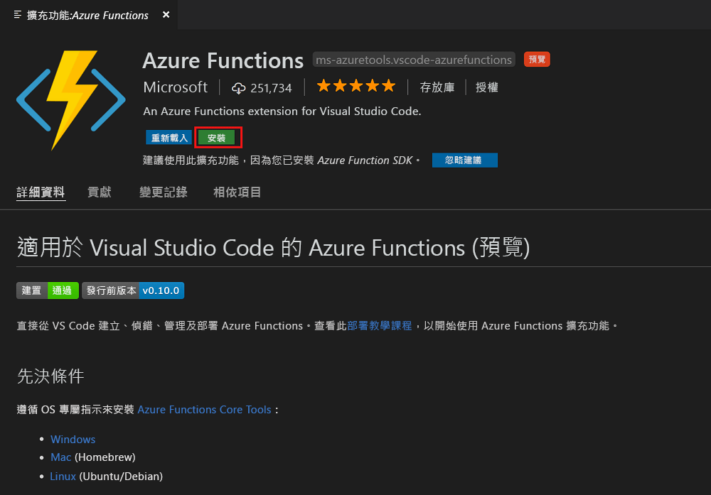
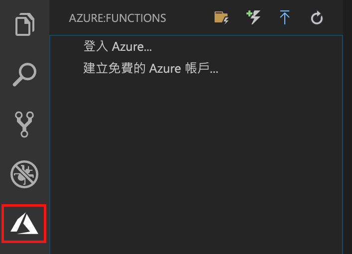
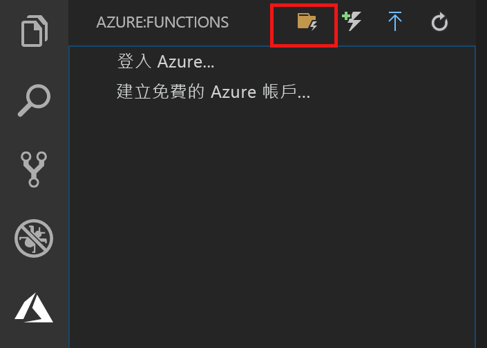
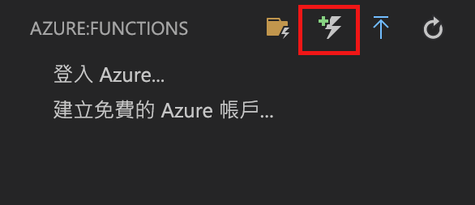
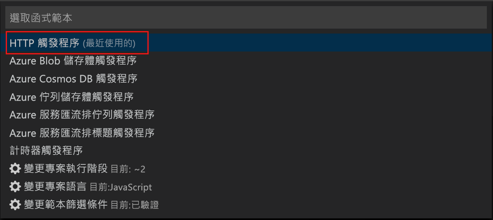
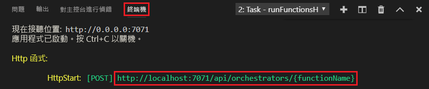
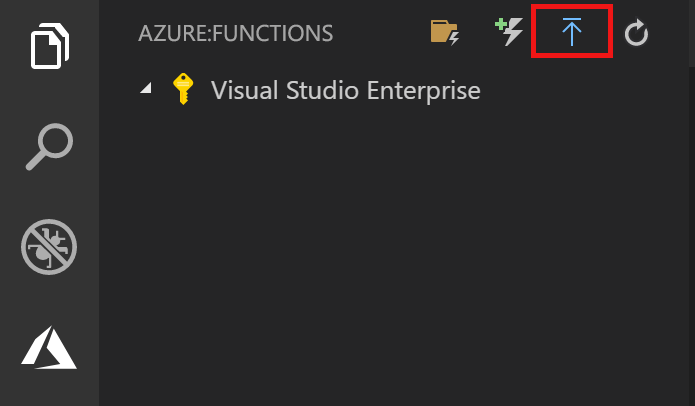
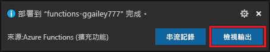
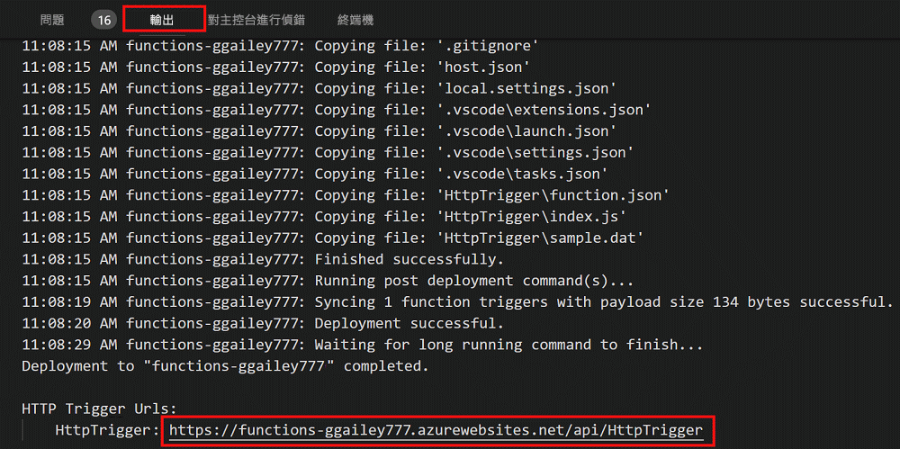

# 使用 Visual Studio Code 建立第一個函式

Azure Functions 可讓您在[無伺服器](https://azure.microsoft.com/solutions/serverless/)環境中執行程式碼，而不需要先建立 VM 或發佈 Web 應用程式。

在本文中，您將了解如何使用[適用於 Visual Studio Code 的 Azure Functions 擴充功能]，在使用 Microsoft Visual Studio Code 的本機電腦上建立和測試 "hello world" 函式。 然後將函式程式碼從 Visual Studio Code 發佈至 Azure。

擴充功能目前支援 C#、JavaScript 和 Java 函式。 本文中的步驟可能會因為您為 Azure Functions 專案選擇的語言不同而有所差異。 此擴充功能目前為預覽狀態。 若要進一步了解，請參閱[適用於 Visual Studio Code 的 Azure Functions 擴充功能]的擴充功能頁面。

## 必要條件

若要完成本快速入門：

* 在其中一個[支援的平台](https://code.visualstudio.com/docs/supporting/requirements#_platforms)上安裝 [Visual Studio Code](https://code.visualstudio.com/)。 本文已在執行 macOS (High Sierra) 的裝置上進行開發與測試。

* 安裝 2.x 版的 [Azure Functions Core Tools](functions-run-local.md#v2) (仍是預覽版)。

* 安裝所選語言的特定需求：

    | 語言 | 分機 |
    | -------- | --------- |
    | **C#** | [C# for Visual Studio Code](https://marketplace.visualstudio.com/items?itemName=ms-vscode.csharp) [.NET Core CLI 工具](https://docs.microsoft.com/dotnet/core/tools/?tabs=netcore2x)*   |
    | **Java** | [適用於 Java 的偵錯工具](https://marketplace.visualstudio.com/items?itemName=vscjava.vscode-java-debug) [JDK 1.8](http://www.oracle.com/technetwork/java/javase/downloads/index.html) [Maven 3+](https://maven.apache.org/) |
    | **JavaScript** | [Node 8.0+](https://nodejs.org/)  |

    \* 也是 Core Tools 的必要條件。

[!INCLUDE [quickstarts-free-trial-note](../../includes/quickstarts-free-trial-note.md)]

## 安裝 Azure Function 擴充功能

Azure Functions 擴充功能主要用來建立、測試及部署要放在 Azure 中的函式。

1. 在 Visual Studio Code 中，開啟 [擴充功能] 並搜尋 `azure functions`，或是，[在 Visual Studio Code 中開啟此連結](vscode:extension/ms-azuretools.vscode-azurefunctions)。

1. 選取 [安裝] 來將擴充功能安裝到 Visual Studio Code。 

    

1. 重新啟動 Visual Studio Code，然後選取 [活動] 工作列上的 Azure 圖示。 您應該會在提要欄位中看到 Azure Functions 區域。

    

## 建立 Azure Functions 專案

Visual Studio Code 中的 Azure Functions 專案範本會建立可發佈至 Azure 中函式應用程式的專案。 函式應用程式可讓您將多個函式群組為邏輯單位，以便您管理、部署和共用資源。

1. 在 Visual Studio Code 中，選取 Azure 標誌以顯示 [Azure：函式] 區域，然後選取 [建立新專案] 圖示。

    

1. 選擇您專案工作區的位置，然後選擇 [選取]。

    > [!NOTE]
    > 本文主要設計為在工作區以外的地方完成。 在此案例中，請勿選取屬於工作區的專案資料夾。

1. 為您的函式應用程式專案選取語言。 本文使用 JavaScript。
    

1. 出現提示時，請選擇 [新增到工作區]。

Visual Studio Code 會在新的工作區中建立函式應用程式專案。 此專案包含 [host.json](functions-host-json.md) 和 [local.settings.json](functions-run-local.md#local-settings-file) 組態檔，以及任何特定語言的專案檔。 您也可以在專案資料夾中取得新的 Git 存放庫。

## 建立由 HTTP 觸發的函式

1. 從 [Azure：函式] 中，選擇 [建立函式] 圖示。

    

1. 選取具有函式應用程式專案的資料夾，然後選取 [HTTP 觸發程序] 函式範本。

    

1. 輸入 `HTTPTrigger` 作為函式名稱，並按下 Enter，然後選取 [匿名] 驗證。

    

    系統隨即會使用由 HTTP 觸發的函式範本，以您所選的語言來建立函式。

    

您可以藉由修改 function.json 檔案，將輸入和輸出繫結新增至您的函式。 如需詳細資訊，請參閱 [Azure Functions 觸發程序和繫結概念](functions-triggers-bindings.md)。

您現在已建立函式專案和 HTTP 觸發的函式，可以在本機電腦上進行測試。

## 在本機測試函式

Azure Functions Core Tools 可讓您在本機開發電腦上執行 Azure Functions 專案。 第一次從 Visual Studio Code 啟動函式時，系統會提示您安裝這些工具。  

1. 若要測試您的函式，可在函式程式碼中設定中斷點，並按 F5 以啟動函式應用程式專案。 Core Tools 的輸出會顯示在**終端機**面板中。

1. 在**終端機**面板中，複製 HTTP 觸發函式的 URL 端點。

    

1. 將 HTTP 要求的 URL 貼到瀏覽器的網址列。 將查詢字串 `?name=<yourname>` 附加至此 URL 並執行要求。 觸及中斷點時，執行就會暫停。

    

1. 當您繼續此執行時，下圖顯示瀏覽器中對 GET 要求所做出的回應︰

    

1. 若要停止偵錯，請按 Shift + F1。

確認函式在本機電腦上正確執行之後，就可以將專案發佈到 Azure。

## 登入 Azure

您必須先登入 Azure，才能發佈您的應用程式。

1. 在 [Azure：函式] 區域中，選擇 [登入 Azure...]。如果您還沒有帳戶，您可以建立**免費的 Azure 帳戶**。

    

1. 出現提示時，選取 [複製及開啟]，或複製顯示的程式碼並在瀏覽器中開啟 <https://aka.ms/devicelogin>。

1. 在 [裝置登入] 頁面中貼上複製的程式碼，確認登入 Visual Studio Code，然後選取 [繼續]。  

1. 使用您的 Azure 帳戶認證完成登入。 順利登入之後，您可以關閉瀏覽器。

## 將專案發佈到 Azure

Visual Studio Code 可讓您將函式專案直接發佈到 Azure。 在這過程中，您會在 Azure 訂用帳戶中建立函式應用程式和相關的資源。 函式應用程式會為函式提供執行內容。 專案會封裝並部署到您 Azure 訂用帳戶中的新函式應用程式。 

本文假設您要建立新的函式應用程式。 發佈至現有的函式應用程式會覆寫該應用程式在 Azure 中的內容。

1. 在 [Azure：函式] 區域中，選取 [部署至函式應用程式] 圖示。

    

1. 選擇專案資料夾，也就是您目前的工作區。

1. 如果您有多個訂用帳戶時，請選擇要裝載您函式應用程式的訂用帳戶，然後選擇 [+ 建立新的函式應用程式]。

1. 輸入可識別您函式應用程式的全域唯一名稱，然後按 Enter。 函式應用程式名稱的有效字元為 `a-z`、`0-9` 和 `-`。

1. 選擇 [+ 建立新的資源群組]，輸入資源群組名稱 (例如 `myResourceGroup`)，然後按 Enter 鍵。 您也可以使用現有的資源群組。

1. 選擇 [+ 建立新的儲存體帳戶]，輸入新儲存體帳戶的全域唯一名稱，以供您的函式應用程式使用，然後按 Enter。 儲存體帳戶名稱必須介於 3 到 24 個字元的長度，而且只能包含數字和小寫字母。 您也可以使用現有帳戶。

1. 在[區域](https://azure.microsoft.com/regions/)中選擇位置，此位置應靠近您或靠近函式會存取的其他服務。

    選好位置後，函式應用程式就會開始建立。 建立函式應用程式並套用部署套件之後，即會顯示通知。

1. 在通知中選取 [檢視輸出]，即可檢視建立和部署結果，包括您所建立的 Azure 資源。

    

1. 請記下 Azure 中的新函式應用程式 URL。 在專案發佈至 Azure 之後，您可以使用此 URL 來測試您的函式。

    

1. 回到 [Azure：函式] 區域中，您會看到訂用帳戶下顯示新的函式應用程式。 當您展開此節點時，您會在函式應用程式中看到函式，以及應用程式設定和函式 Proxy。

    

    從您的函式應用程式節點中輸入 Ctrl 並按一下滑鼠右鍵，以選擇要對 Azure 中函式應用程式執行的各種管理和組態工作。 您也可以選擇在 Azure 入口網站中檢視函式應用程式。

## 在 Azure 中測試您的函式

1. 從 [輸出] 面板中複製 HTTP 觸發程序的 URL。 如同以往，務必將查詢字串 `?name=<yourname>` 新增至此 URL 的結尾並執行要求。

    呼叫 HTTP URL 觸發函式的 URL 應採用下列格式：

        http://<functionappname>.azurewebsites.net/api/<functionname>?name=<yourname> 

1. 將 HTTP 要求的新 URL 貼到瀏覽器的網址列。 下圖顯示瀏覽器中對於函式傳回之遠端 GET 要求所做出的回應︰ 

    

## 後續步驟

您已透過 Visual Studio Code，使用簡單的 HTTP 觸發函式建立函式應用程式。 若要深入了解如何以特定語言開發函式，請參閱 [JavaScript](functions-reference-node.md)、[.NET](functions-dotnet-class-library.md) 或 [Java](functions-reference-java.md) 的語言參考指南。

接下來您可以深入了解如何從終端機或命令提示字元中使用 Azure Functions Core Tools 來進行本機測試和偵錯。

> [!div class="nextstepaction"]
> [程式碼和本機測試](functions-run-local.md)

[Azure Functions Core Tools]: functions-run-local.md
[適用於 Visual Studio Code 的 Azure Functions 擴充功能]: https://marketplace.visualstudio.com/items?itemName=ms-azuretools.vscode-azurefunctions
