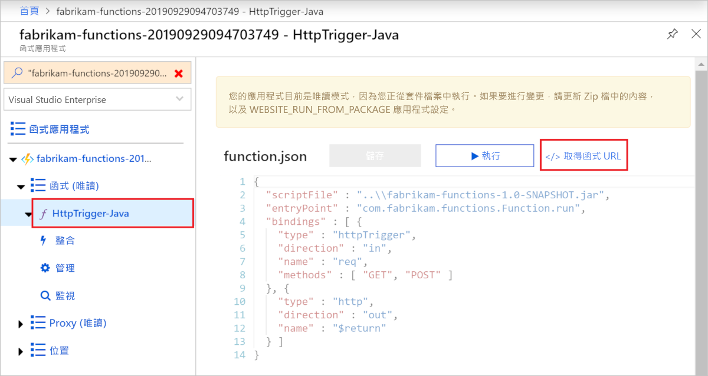

# <a name="quickstart-use-java-and-maven-to-create-and-publish-a-function-to-azure"></a>快速入門：使用 Java 和 Maven 建立函式並將其發佈至 Azure

本文說明如何使用 Maven 命令列工具來建置 Java 函式並將其發佈至 Azure Functions。 完成時，您的函式程式碼會在 Azure 的[無伺服器主控方案](functions-scale.md#consumption-plan)中執行，並由 HTTP 要求所觸發。

<!--
> [!NOTE] 
> You can also create a Kotlin-based Azure Functions project by using the azure-functions-kotlin-archetype instead. Visit the [GitHub repository](https://github.com/microsoft/azure-maven-archetypes/tree/develop/azure-functions-kotlin-archetype) for more information.
-->

## <a name="prerequisites"></a>必要條件

若要使用 Java 開發函式，您必須安裝下列項目：

- [Java Developer Kit](https://aka.ms/azure-jdks) 第 8 版
- [Apache Maven](https://maven.apache.org) 3.0 版或更新版本
- [Azure CLI]
- [Azure Functions Core Tools](./functions-run-local.md#v2) 2.6.666 版或更新版本
- Azure 訂用帳戶。

[!INCLUDE [quickstarts-free-trial-note](../../includes/quickstarts-free-trial-note.md)]


> [!IMPORTANT]
> JAVA_HOME 環境變數必須設定為 JDK 的安裝位置，才能完成本快速入門。

## <a name="generate-a-new-functions-project"></a>產生新的 Functions 專案

在空的資料夾中，執行下列命令以從 [Maven 原型](https://maven.apache.org/guides/introduction/introduction-to-archetypes.html) \(英文\) 產生 Functions 專案。

### <a name="linuxmacos"></a>Linux/macOS

```bash
mvn archetype:generate \
    -DarchetypeGroupId=com.microsoft.azure \
    -DarchetypeArtifactId=azure-functions-archetype 
```

> [!NOTE]
> 如果您遇到執行命令的問題，請查看使用哪個 `maven-archetype-plugin` 版本。 因為您在不含 `.pom` 檔案的空目錄中執行命令，如果您從舊版升級 Maven，則可能會嘗試使用來自 `~/.m2/repository/org/apache/maven/plugins/maven-archetype-plugin` 的舊版外掛程式。 若是如此，請嘗試刪除 `maven-archetype-plugin` 目錄，然後重新執行命令。

### <a name="windows"></a>Windows

```powershell
mvn archetype:generate `
    "-DarchetypeGroupId=com.microsoft.azure" `
    "-DarchetypeArtifactId=azure-functions-archetype"
```

```cmd
mvn archetype:generate ^
    "-DarchetypeGroupId=com.microsoft.azure" ^
    "-DarchetypeArtifactId=azure-functions-archetype"
```

Maven 會要求您提供在部署時完成產生專案所需的值。 當系統提示時，提供下列值：

| 值 | 說明 |
| ----- | ----------- |
| **groupId** | 此值可在所有專案中唯一識別您的專案，並遵循適用於 Java 的[套件命名規則](https://docs.oracle.com/javase/specs/jls/se6/html/packages.html#7.7)。 本快速入門中的範例會使用 `com.fabrikam.functions`。 |
| **artifactId** | 此值是 jar 的名稱 (不含版本號碼)。 本快速入門中的範例會使用 `fabrikam-functions`。 |
| **version** | 選擇 `1.0-SNAPSHOT` 的預設值。 |
| **套件** | 此值是所產生函式程式碼的 Java 套件。 使用預設值。 本快速入門中的範例會使用 `com.fabrikam.functions`。 |
| **appName** | 可在 Azure 中識別您的新函式應用程式的全域唯一名稱。 使用預設值，也就是附加隨機數字的 _artifactId_。 請記下此值，您稍後需要用到它。 |
| **appRegion** | 選擇與您接近的[區域](https://azure.microsoft.com/regions/)，或選擇與函式將會存取之其他服務接近的區域。 預設值為 `westus`。 執行此 [Azure CLI] 命令以取得所有區域的清單：<br/>`az account list-locations --query '[].{Name:name}' -o tsv` |
| **resourceGroup** | 要在其中建立函式應用程式的新[資源群組](../azure-resource-manager/resource-group-overview.md)名稱。 使用本快速入門中範例所使用的 `myResourceGroup`。 資源群組必須是您的 Azure 訂用帳戶中唯一的。|

輸入 `Y` 或按 Enter 進行確認。

Maven 會以 _artifactId_ 名稱在新資料夾中建立專案檔案，在此例中為 `fabrikam-functions`。 

在文字編輯器中，從 *src/main/java* 路徑開啟新的 Function.java 檔案，並檢閱所產生的程式碼。 此程式碼是一個 [HTTP 觸發](functions-bindings-http-webhook.md)函式，可回應要求的本文。 

## <a name="run-the-function-locally"></a>在本機執行函式

執行下列命令，可將目錄變更為新建立的專案資料夾，然後建立並執行函式專案：

```console
cd fabrikam-function
mvn clean package 
mvn azure-functions:run
```

當您在本機執行專案時，您會在 Azure Functions Core Tools 中看到如下所示的輸出：

```Output
...

Now listening on: http://0.0.0.0:7071
Application started. Press Ctrl+C to shut down.

Http Functions:

    HttpTrigger-Java: [GET,POST] http://localhost:7071/api/HttpTrigger-Java
...
```

在新的終端視窗中使用 cURL 從命令列觸發函式：

```CMD
curl -w "\n" http://localhost:7071/api/HttpTrigger-Java --data AzureFunctions
```

```Output
Hello AzureFunctions!
```
在本機執行時不需要[函式金鑰](functions-bindings-http-webhook.md#authorization-keys)。 在終端機中使用 `Ctrl+C` 可停止函式程式碼。

## <a name="deploy-the-function-to-azure"></a>將函式部署到 Azure

當您第一次部署函式應用程式時，會在 Azure 中建立函式應用程式和相關資源。 請先使用 [az login](/cli/azure/authenticate-azure-cli) Azure CLI 命令登入您的 Azure 訂用帳戶，才可部署。 

```azurecli
az login
```

> [!TIP]
> 如果您的帳戶可以存取多個訂用帳戶，請使用 [az account set](/cli/azure/account#az-account-set) 來設定此工作階段的預設訂用帳戶。 

使用下列 Maven 命令，將您的專案部署至新的函式應用程式。 

```azurecli
mvn azure-functions:deploy
```

此 `azure-functions:deploy` Maven 目標會在 Azure 中建立下列資源：

+ 資源群組。 以您提供的 _resourceGroup_ 命名。
+ 儲存體帳戶。 Functions 所需。 此名稱會根據儲存體帳戶名稱需求隨機產生。
+ App Service 方案。 在指定的 _appRegion_ 中以無伺服器方式主控您的函式應用程式。 此名稱是隨機產生的。
+ 函式應用程式。 函式應用程式是您函式的部署和執行單位。 此名稱是您的 _appName_ ，其附加隨機產生的數字。 

部署也會封裝專案檔案，並使用 [zip deployment](functions-deployment-technologies.md#zip-deploy) 將其部署至新的函式應用程式，並已啟用從套件執行模式。

部署完成時，您會看到可用來存取函式應用程式端點的 URL。 因為我們發佈的 HTTP 觸發程式會使用 `authLevel = AuthorizationLevel.FUNCTION`，所以您必須取得函式金鑰，才能透過 HTTP 呼叫函式端點。 [Azure 入口網站]是取得函式金鑰的最簡單方式。

## <a name="get-the-http-trigger-url"></a>取得 HTTP 觸發程序 URL

<!--- We can updates this to remove portal dependency after the Maven archetype returns the full URLs with keys on publish (https://github.com/microsoft/azure-maven-plugins/issues/571). -->

您可以從 Azure 入口網站取得觸發函式所需的 URL 和函式金鑰。 

1. 瀏覽至 [Azure 入口網站]、登入，在頁面頂端的 [搜尋]  中輸入您函式應用程式的 _appName_，然後按 Enter。
 
1. 在函式應用程式中，展開 [函式 (唯讀)]  ，選擇您的函式，然後選取右上方的 [</> 取得函數 URL]  。 

    

1. 選擇 [預設值 (函式金鑰)]  ，然後選取 [複製]  。 

您現在可以使用所複製的 URL 來存取您的函式。

## <a name="verify-the-function-in-azure"></a>在 Azure 中驗證函式

若要使用 `cURL` 驗證在 Azure 上執行的函式應用程式，請將下列範例中的 URL 取代為您從入口網站複製的 URL。

```azurecli
curl -w "\n" https://fabrikam-functions-20190929094703749.azurewebsites.net/api/HttpTrigger-Java?code=zYRohsTwBlZ68YF.... --data AzureFunctions
```

這會在要求本文中使用 `AzureFunctions`，將 POST 要求傳送至函式端點。 您會看見下列回應。

```Output
Hello AzureFunctions!
```

## <a name="next-steps"></a>後續步驟

您已使用 HTTP 觸發的函式建立 Java 函式專案，並在本機電腦上執行，然後部署到 Azure。 現在，請藉由下列作業擴充您的函式...

> [!div class="nextstepaction"]
> [新增 Azure 儲存體佇列輸出繫結](functions-add-output-binding-storage-queue-java.md)


[Azure CLI]: /cli/azure
[Azure 入口網站]: https://portal.azure.com