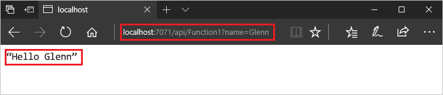
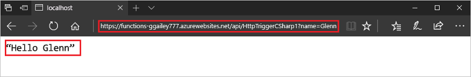

# 使用 Visual Studio 建立第一個函式

Azure Functions 可讓您在[無伺服器](https://azure.microsoft.com/solutions/serverless/)環境中執行程式碼，而不需要先建立 VM 或發佈 Web 應用程式。

在本文中，您將了解如何使用 Visual Studio 2017 Tools for Azure Functions 在本機建立及測試 "hello world" 函式。 接著會將函式程式碼發佈至 Azure。 這些工具可在 Visual Studio 2017 的 Azure 開發工作負載中取得。

本主題包含一個可示範相同基本步驟的[影片](#watch-the-video)。

## 必要條件

若要完成本教學課程：

* 安裝 [Visual Studio 2017](https://azure.microsoft.com/downloads/)，並確定也已經安裝 **Azure 開發**工作負載。

* 確定您有[最新的 Azure Functions 工具](functions-develop-vs.md#check-your-tools-version)。

[!INCLUDE [quickstarts-free-trial-note](../../includes/quickstarts-free-trial-note.md)]

## 建立函式應用程式專案

[!INCLUDE [Create a project using the Azure Functions template](../../includes/functions-vstools-create.md)]

Visual Studio 會建立一個專案，其中的類別包含所選函式類型的重複使用程式碼。 方法上的 **FunctionName** 屬性會設定函式名稱。 **HttpTrigger** 屬性會指定由 HTTP 要求觸發函式。 重複使用程式碼會傳送 HTTP 回應，其中包含要求內文或查詢字串中的值。 您可以將適當的屬性套用至方法，進而將輸入和輸出繫結新增至函式。 如需詳細資訊，請參閱 [Azure Functions C# 開發人員參考](functions-dotnet-class-library.md)的[觸發程序和繫結](functions-dotnet-class-library.md#triggers-and-bindings)一節。

您現在已建立函式專案和 HTTP 觸發的函式，可以在本機電腦上進行測試。

## 在本機測試函式

Azure Functions Core Tools 可讓您在本機開發電腦上執行 Azure Functions 專案。 第一次從 Visual Studio 啟動函式時，系統會提示您安裝這些工具。

1. 若要測試您的函式，請按 F5。 如果出現提示，接受來自 Visual Studio 之下載及安裝 Azure Functions Core (CLI) 工具的要求。 您可能也需要啟用防火牆例外狀況，工具才能處理 HTTP 要求。

2. 從 Azure Functions 執行階段輸出複製函式的 URL。

    

3. 將 HTTP 要求的 URL 貼到瀏覽器的網址列。 將查詢字串 `?name=<yourname>` 附加至此 URL 並執行要求。 下圖顯示瀏覽器中對於函式傳回之本機 GET 要求所做出的回應︰ 

    

4. 若要停止偵錯，請按 Shift + F5。

確認函式在本機電腦上正確執行之後，就可以將專案發佈到 Azure。

## 將專案發佈到 Azure

您的 Azure 訂用帳戶中必須具有函式應用程式，才可以發佈您的專案。 您可以直接從 Visual Studio 建立函式應用程式。

[!INCLUDE [Publish the project to Azure](../../includes/functions-vstools-publish.md)]

## 在 Azure 中測試您的函式

1. 從發行設定檔頁面複製函式應用程式的基底 URL。 使用新的基底 URL，取代在本機測試函式時所使用之 URL 的 `localhost:port` 部分。 如同以往，務必將查詢字串 `?name=<yourname>` 附加至此 URL 並執行要求。

    呼叫 HTTP URL 觸發函式的 URL 應採用下列格式：

        http://<functionappname>.azurewebsites.net/api/<functionname>?name=<yourname> 

2. 將 HTTP 要求的新 URL 貼到瀏覽器的網址列。 下圖顯示瀏覽器中對於函式傳回之遠端 GET 要求所做出的回應︰

    

## 觀賞影片

> [!VIDEO https://www.youtube-nocookie.com/embed/DrhG-Rdm80k]

## 後續步驟

您已透過 Visual Studio，使用簡單的 HTTP 觸發函式來建立及發佈 C# 函式應用程式。

* [了解如何新增與其他服務整合的輸入和輸出繫結。](functions-develop-vs.md#add-bindings)
* [深入了解如何將函式開發為 .NET 類別庫](functions-dotnet-class-library.md)。
