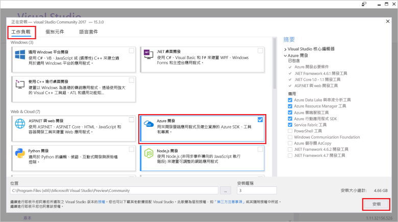

# <a name="develop-azure-functions-using-visual-studio"></a>使用 Visual Studio 來開發 Azure Functions  

Azure Functions Tools for Visual Studio 2017 是 Visual Studio 的延伸模組，可讓您開發、測試 C# 函數及將它部署到 Azure。 如果這是您第一次體驗 Azure Functions，可至 [Azure Functions 簡介](functions-overview.md)深入了解。

Azure Functions Tools 提供下列優點： 

* 在本機開發電腦上編輯、建置及執行函數。 
* 直接將 Azure Functions 專案發佈至 Azure。 
* 使用 WebJobs 屬性直接在 C# 程式碼中宣告函數繫結，而不必針對繫結定義維護個別的 function.json。
* 開發及部署預先編譯的 C# 函數。 預先編譯的函數提供的冷啟動效能比 C# 指令碼型函數更好。 
* 在 C# 中編寫函數，同時享有 Visual Studio 開發的所有優點。 

本文說明如何使用 Azure Functions Tools for Visual Studio 2017 在 C# 中開發函式。 您也會了解如何將專案發佈到 Azure 成為 .NET 組件。

> [!IMPORTANT]
> 請勿在相同函式應用程式中混用本機開發與入口網站開發。 當您從本機專案發佈至函式應用程式時，部署程序將會覆寫您在入口網站開發的任何函式。

## <a name="prerequisites"></a>必要條件

[Visual Studio 2017 15.5 版](https://www.visualstudio.com/vs/) 與更新版本的 Azure 開發工作負載中包含了 Azure Functions 工具。 請確認您的 Visual Studio 2017 安裝中包含了 **Azure 開發**工作負載：



請確定您的 Visual Studio 是最新的，且您使用的是[最新版本](#check-your-tools-version)的 Azure Functions 工具。

### <a name="other-requirements"></a>其他需求

若要建立及部署函數，您也需要：

* 有效的 Azure 訂用帳戶。 如果您還沒有 Azure 訂用帳戶，可以使用[免費帳戶](https://azure.microsoft.com/free/?WT.mc_id=A261C142F)。

* Azure 儲存體帳戶。 若要建立儲存體帳戶，請參閱[儲存體帳戶](../storage/common/storage-quickstart-create-account.md)。

### <a name="check-your-tools-version"></a>檢查您的工具版本

1. 在 [工具] 功能表中，選擇 [擴充功能和更新]。 展開 [已安裝] > [工具]，然後選擇 [Azure Functions 與 Web 工作工具]。

    

2. 記下已安裝的**版本**。 您可以比較此版本[版本資訊中](https://github.com/Azure/Azure-Functions/blob/master/VS-AzureTools-ReleaseNotes.md)所列的最新版本。 

3. 如果您的版本較舊，請依照下一節中的說明在 Visual Studio 中更新您的工具。

### <a name="update-your-tools"></a>更新您的工具

1. 在 [延伸模組和更新] 對話方塊中，展開 [更新] > [Visual Studio Marketplace]，選擇 [Azure Functions 與 Web 工作工具]，然後選取 [更新]。

       

2. 下載工具更新之後，請關閉 Visual Studio，以使用 VSIX 安裝程式觸發工具更新。

3. 在安裝程式中選擇 [確定] 以啟動，然後選擇 [修改] 以更新工具。 

4. 更新完成後，請選擇 [關閉] 並重新啟動 Visual Studio。

## <a name="create-an-azure-functions-project"></a>建立 Azure Functions 專案

[!INCLUDE [Create a project using the Azure Functions](../../includes/functions-vstools-create.md)]

專案範本會建立 C# 專案，安裝 `Microsoft.NET.Sdk.Functions` NuGet 套件，並設定目標架構。 Functions 1.x 的目標為 .NET Framework，而 Functions 2.x 的目標則為 .NET Standard。 新專案含有下列檔案：

* **host.json**：讓您設定 Functions 主機。 這些設定同時適用於在本機執行及在 Azure 中執行。 如需詳細資訊，請參閱 [host.json 參考](functions-host-json.md)。

* **local.settings.json**：維持在本機執行函數時所使用的設定。 Azure 不會使用這些設定，[Azure Functions Core Tools](functions-run-local.md) 會使用這些設定。 請使用這個檔案來指定函式所需變數的應用程式設定。 針對專案中函式繫結所需的每個連接，將新項目新增至 [值] 陣列。 如需詳細資訊，請參閱＜Azure Functions Core Tools＞一文中的[本機設定檔](functions-run-local.md#local-settings-file)。

如需詳細資訊，請參閱 [Functions 類別庫專案](functions-dotnet-class-library.md#functions-class-library-project)。

## <a name="configure-the-project-for-local-development"></a>設定專案以進行本機開發

函數執行階段會在內部使用 Azure 儲存體帳戶。 針對 HTTP 和 Webhook 以外的所有觸發程序類型，您必須將 **Values.AzureWebJobsStorage** 機碼設定為有效的 Azure 儲存體帳戶連接字串。 函式應用程式也可以針對專案所需的 **AzureWebJobsStorage** 連線設定，使用 [Azure 儲存體模擬器](../storage/common/storage-use-emulator.md)。 若要使用模擬器，將 **AzureWebJobsStorage** 的值設定為 `UseDevelopmentStorage=true`。 您必須在部署前將此設定變更為實際的儲存體連線。

設定儲存體帳戶連接字串：

1. 在 Visual Studio 中，開啟 [Cloud Explorer]，展開 [儲存體帳戶] > 「您的儲存體帳戶」，然後選取 [屬性] 並複製 [主要連接字串] 值。

2. 在您的專案中，開啟 local.settings.json 檔案並將 **AzureWebJobsStorage** 機碼的值設定為您所複製的連接字串。

3. 重複上一步，針對函數所需的其他任何連接，將唯一機碼新增至 [值] 陣列。

## <a name="create-a-function"></a>建立函式

在預先編譯的函數中，函數所使用的繫結是透過在程式碼中套用屬性來定義的。 當您使用 Azure Functions Tools 從提供的範本建立函數時，會為您套用這些屬性。 

1. 在 [方案總管] 中，於專案節點上按一下滑鼠右鍵，然後選取 [新增]  > [新項目]。 選取 [Azure 函數]，輸入類別的 [名稱]，然後按一下 [新增]。

2. 選擇您的觸發程序，設定繫結屬性，然後按一下 [建立]。 下列範例顯示建立佇列儲存體觸發之函數時的設定。 

    

    這個觸發程序範例會使用連接字串，具有名為 **QueueStorage** 的索引鍵。 此連接字串設定必須在 [local.settings.json 檔案](functions-run-local.md#local-settings-file)中定義。

3. 檢查新加入的類別。 您會看到靜態 [執行] 方法，它是使用 **FunctionName** 屬性來屬性化。 這個屬性指出該方法是函數的進入點。

    例如，下列 C# 類別代表基本佇列儲存體觸發的函數：

    ````csharp
    using System;
    using Microsoft.Azure.WebJobs;
    using Microsoft.Azure.WebJobs.Host;

    namespace FunctionApp1
    {
        public static class Function1
        {
            [FunctionName("QueueTriggerCSharp")]
            public static void Run([QueueTrigger("myqueue-items", Connection = "QueueStorage")]string myQueueItem, TraceWriter log)
            {
                log.Info($"C# Queue trigger function processed: {myQueueItem}");
            }
        }
    }
    ````
    會將繫結特定屬性套用至提供給進入點方法的每個繫結參數。 屬性會將繫結資訊作為參數使用。 在上述範例中，第一個參數套用了 **QueueTrigger** 屬性，指出佇列觸發的函數。 佇列名稱和連接字串設定名稱會作為參數傳遞至 **QueueTrigger** 屬性。 如需詳細資訊，請參閱 [Azure Functions 的 Azure 佇列儲存體繫結](functions-bindings-storage-queue.md#trigger---c-example)。
    
您可以使用上述程序，對函式應用程式專案新增更多函式。 專案中的每個函式都可以有不同的觸發程序，但函式必須只有一個觸發程序。 如需詳細資訊，請參閱 [Azure Functions 觸發程序和繫結概念](functions-triggers-bindings.md)。

## <a name="add-bindings"></a>新增繫結

和觸發程序一樣，輸入和輸出繫結會新增至函式作為繫結屬性。 請將繫結新增至函式，如下所示：

1. 確定您已[設定用於進行本機開發的專案](#configure-the-project-for-local-development)。

2. 為特定繫結新增適當的 NuGet 擴充功能套件。 如需詳細資訊，請參閱＜觸發程序和繫結＞一文中的[使用 Visual Studio 的本機 C# 開發](functions-triggers-bindings.md#local-csharp)。 繫結專屬的 NuGet 套件需求可於繫結的參考文章中找到。 例如，您可以在[事件中樞繫結參考文章](functions-bindings-event-hubs.md)中尋找事件中樞觸發程序的套件需求。

3. 如果有繫結所需的應用程式設定，請將其新增至[本機設定檔案](functions-run-local.md#local-settings-file)中的**值**集合。 當函式在本機執行時，就會使用這些值。 當函式在 Azure 中的函式應用程式中執行時，則會使用[函式應用程式設定](#function-app-settings)。

4. 在方法簽章中新增適當的繫結屬性。 在下列範例中，佇列訊息會觸發函式，而且輸出繫結會在不同的佇列中，使用相同文字建立新的佇列訊息。

    ```csharp
    public static class SimpleExampleWithOutput
    {
        [FunctionName("CopyQueueMessage")]
        public static void Run(
            [QueueTrigger("myqueue-items-source", Connection = "AzureWebJobsStorage")] string myQueueItem, 
            [Queue("myqueue-items-destination", Connection = "AzureWebJobsStorage")] out string myQueueItemCopy,
            TraceWriter log)
        {
            log.Info($"CopyQueueMessage function processed: {myQueueItem}");
            myQueueItemCopy = myQueueItem;
        }
    }
    ```
佇列儲存體的連接是從 `AzureWebJobsStorage` 設定中取得的。 如需詳細資訊，請參閱特定繫結的參考文章。 

[!INCLUDE [Supported triggers and bindings](../../includes/functions-bindings.md)]

## <a name="testing-functions"></a>測試函式

Azure Functions Core Tools 可讓您在本機開發電腦上執行 Azure Functions 專案。 第一次從 Visual Studio 啟動函式時，系統會提示您安裝這些工具。

若要測試您的函式，請按 F5。 如果出現提示，接受來自 Visual Studio 之下載及安裝 Azure Functions Core (CLI) 工具的要求。 您可能也需要啟用防火牆例外狀況，工具才能處理 HTTP 要求。

隨著專案的執行，您可以像測試部署函數一樣測試程式碼。 如需詳細資訊，請參閱[在 Azure Functions 中測試程式碼的策略](functions-test-a-function.md)。 在偵錯模式下執行時，會依預期在 Visual Studio 中遇到中斷點。 

如需如何測試佇列觸發函數的範例，請參閱[佇列觸發函數快速入門教學課程](functions-create-storage-queue-triggered-function.md#test-the-function)。  

若要深入了解如何使用 Azure Functions Core Tools，請參閱[在本機撰寫和測試 Azure Functions 程式碼](functions-run-local.md)。

## <a name="publish-to-azure"></a>發佈至 Azure

[!INCLUDE [Publish the project to Azure](../../includes/functions-vstools-publish.md)]

## <a name="function-app-settings"></a>函數應用程式設定

您在 local.settings.json 中所新增的所有設定，也必須新增至 Azure 中的函式應用程式。 當您發行專案時，不會自動上傳這些設定。

將必要設定上傳至 Azure 中函式應用程式的最簡單方式，是使用**管理應用程式設定...** 連結，該連結會在您成功發行專案之後顯示。 


這會顯示函式應用程式的 [應用程式設定] 對話方塊，您可以在其中新增新的應用程式設定或修改現有的設定。


您也可以使用下列其中一種方式管理應用程式設定：

* [使用 Azure 入口網站](functions-how-to-use-azure-function-app-settings.md#settings)。
* [使用 Azure Functions Core Tools 中的 `--publish-local-settings` 發行選項](functions-run-local.md#publish)。
* [使用 Azure CLI](/cli/azure/functionapp/config/appsettings#az-functionapp-config-appsettings-set)。 

## <a name="next-steps"></a>後續步驟

如需 Azure Functions Tools 的詳細資訊，請參閱 [Visual Studio 2017 Tools for Azure Functions](https://blogs.msdn.microsoft.com/webdev/2017/05/10/azure-function-tools-for-visual-studio-2017/) \(英文\) 部落格文章的＜常見問題＞一節。

若要深入了解 Azure Functions Core Tools，請參閱[在本機撰寫和測試 Azure Functions 程式碼](functions-run-local.md)。

若要深入了解如何將函式開發為 .NET 類別庫，請參閱 [Azure Functions C# 開發人員參考](functions-dotnet-class-library.md)。 本文也會連結至範例以示範如何使用屬性宣告 Azure Functions 所支援的各種繫結類型。    
