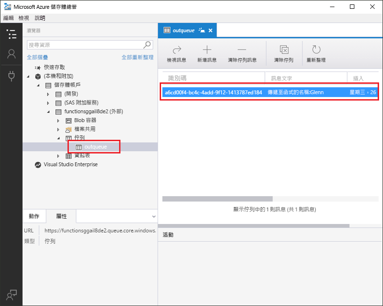
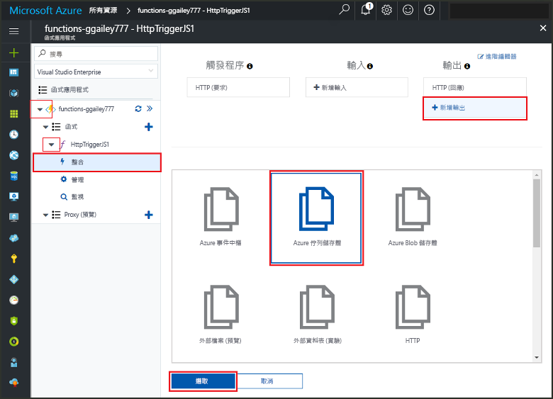
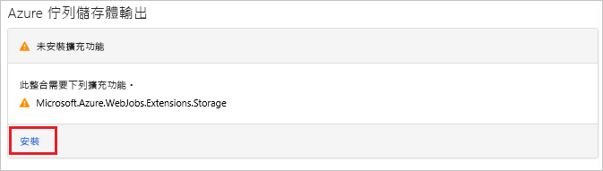
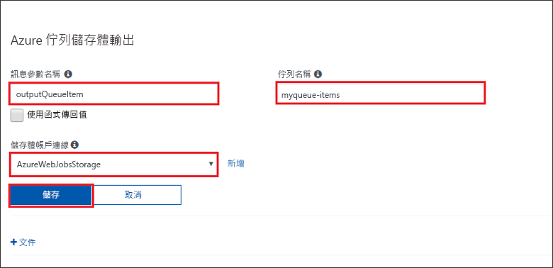
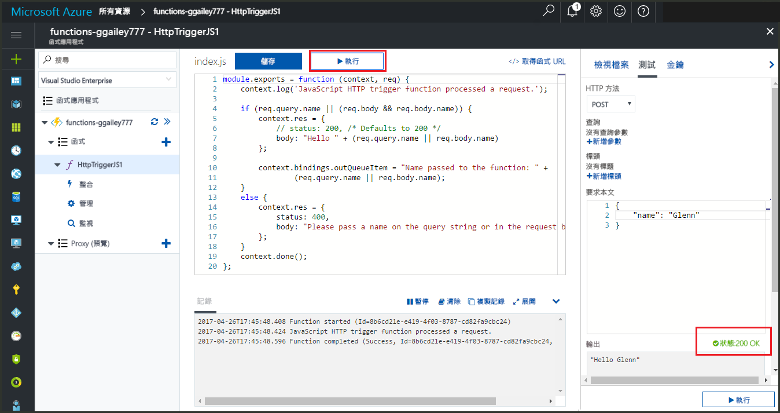
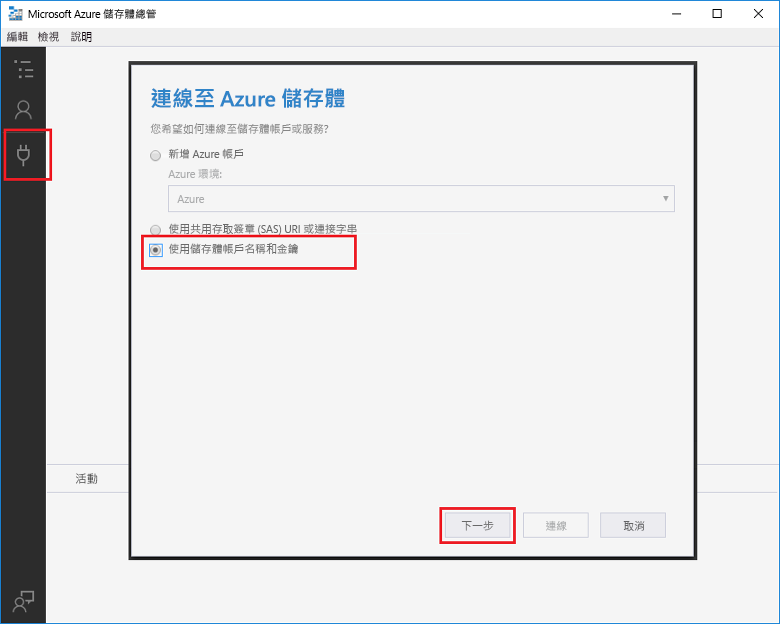
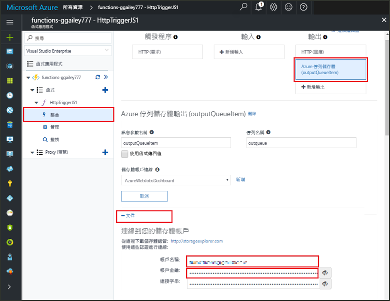
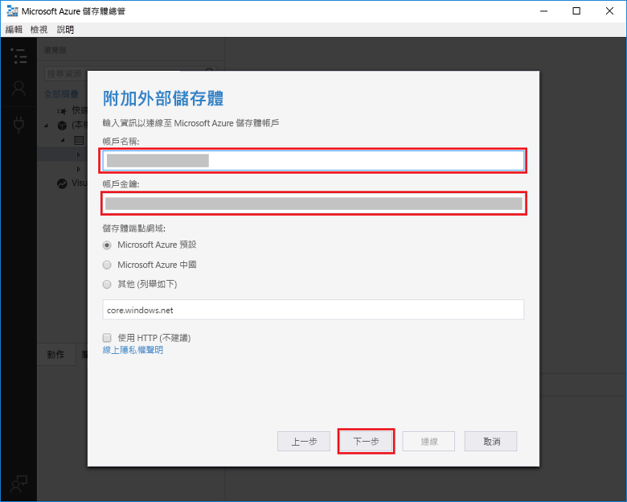

# <a name="add-messages-to-an-azure-storage-queue-using-functions"></a>使用 Functions 在 Azure 儲存體佇列中新增訊息

在 Azure Functions 中，輸入和輸出繫結會提供宣告式方法，以便從您的程式碼可用之外部服務製作資料。 在本快速入門中，您會使用輸出繫結，在函式由 HTTP 要求觸發時於佇列中建立訊息。 您可以使用 Azure 儲存體總管來檢視您的函式建立的佇列訊息：



## <a name="prerequisites"></a>必要條件

若要完成本快速入門：

* 請遵循[從 Azure 入口網站建立您的第一個函式](functions-create-first-azure-function.md)中的指示，但是不要進行**清除資源**步驟。 該快速入門會建立您可以在這裡使用的函式應用程式和函式。

* 安裝 [Microsoft Azure 儲存體總管](http://storageexplorer.com/)。 這是您用來檢查您的輸出繫結建立之佇列訊息的工具。

## <a name="add-binding"></a>新增輸出繫結

在本節中，您會使用入口網站 UI 來將佇列儲存體輸出繫結新增至您稍早建立的函式。 這個繫結可以撰寫最少的程式碼，以在佇列中建立訊息。 您不需要為以下工作撰寫程式碼，例如開啟儲存體連線、建立佇列，或取得佇列的參考。 Azure Functions 執行階段和佇列輸出繫結會為您進行這些工作。

1. 在 Azure 入口網站中，針對您在[從 Azure 入口網站建立您的第一個函式](functions-create-first-azure-function.md)中建立的函式應用程式，開啟函式應用程式分頁。 若要這樣做，請選取 [所有服務] > [函式應用程式]，然後選取您的函式應用程式。

1. 選取您在稍早的快速入門中建立的函式。

1. 選取 [整合 > 新的輸出 > Azure 佇列儲存體]。

1. 按一下 [選取] 。

    

1. 如果出現**延伸模組未安裝**訊息，請選擇 [安裝]，以在函式應用程式中安裝儲存體繫結延伸模組。 這可能需要數分鐘的時間。

    

1. 在 [Azure 佇列儲存體輸出] 底下，使用此螢幕擷取畫面後續的表格中所指定的設定： 

    

    | 設定      |  建議的值   | 說明                              |
    | ------------ |  ------- | -------------------------------------------------- |
    | **訊息參數名稱** | outputQueueItem | 輸出繫結參數的名稱。 | 
    | **儲存體帳戶連線** | AzureWebJobsStorage | 您可以使用應用程式函式已在使用的儲存體帳戶連線，或建立新的連線。  |
    | **佇列名稱**   | outqueue    | 儲存體帳戶中的連線目標佇列名稱。 |

1. 按一下 [儲存] 來新增繫結。

您已定義了輸出繫結，接下來您需要將程式碼更新為使用繫結來對佇列新增訊息。  

## <a name="add-code-that-uses-the-output-binding"></a>新增會使用輸出繫結的程式碼

在本節中，您會將撰寫訊息的程式碼新增至輸出佇列。 此訊息包含值，該值會傳遞至查詢字串中的 HTTP 觸發程序。 例如，如果查詢字串包含 `name=Azure`，則佇列訊息會是「Name passed to the function: Azure」。

1. 選取函式以在編輯器中顯示函式程式碼。

1. 根據您的函式語言更新函式程式碼：

    # <a name="ctabcsharp"></a>[C\#](#tab/csharp)

    將 **outputQueueItem** 參數新增至方法簽章，如下列範例所示。

    ```cs
    public static async Task<IActionResult> Run(HttpRequest req,
        ICollector<string> outputQueueItem, ILogger log)
    {
        ...
    }
    ```

    在 `return` 陳述式前面的函式所包含的本文中，新增使用參數的程式碼以建立佇列訊息。

    ```cs
    outputQueueItem.Add("Name passed to the function: " + name);
    ```

    # <a name="javascripttabnodejs"></a>[JavaScript](#tab/nodejs)

    新增會使用 `context.bindings` 物件上之輸出繫結的程式碼以建立佇列訊息。 在 `context.done` 陳述式前面新增此程式碼。

    ```javascript
    context.bindings.outputQueueItem = "Name passed to the function: " + 
                (req.query.name || req.body.name);
    ```

    ---

1. 選取 [儲存] 來儲存變更。

## <a name="test-the-function"></a>測試函式

1. 儲存程式碼的變更後，選取 [執行]。 

    

    請注意，**要求本文**包含 `name` 值：Azure。 這個值會出現在叫用函式時建立的佇列訊息中。
    
    除了在這裡選取 [執行] 之外，您可以呼叫函式，方法是在瀏覽器中輸入 URL，並且在查詢字串中指定 `name` 值。 瀏覽器方法會顯示在[先前的快速入門](functions-create-first-azure-function.md#test-the-function)中。

2. 檢查記錄以確定函式已成功。 

您第一次使用輸出繫結時，Functions 執行階段會在儲存體帳戶中建立名為 **outqueue** 的新佇列。 您將使用儲存體總管，確認已建立佇列以及其中的訊息。

### <a name="connect-storage-explorer-to-your-account"></a>將儲存體總管連線到您的帳戶

如果您已安裝儲存體總管並且連線到您在本快速入門使用的儲存體帳戶，請略過本節。

2. 執行 [Microsoft Azure 儲存體總管](http://storageexplorer.com/)工具，選取左側的 [連線] 圖示，選擇 [使用儲存體帳戶名稱和金鑰]，然後選取 [下一步]。

    

1. 在 Azure 入口網站中的函式應用程式分頁上，選取您的函式，然後選取 [整合]。

1. 選取您在先前步驟中新增的 **Azure 佇列儲存體**輸出繫結。

1. 展開分頁底部的 [文件] 區段。 

   入口網站會顯示您可以在儲存體總管中用來連線至儲存體帳戶的認證。

   

1. 從入口網站複製 [帳戶名稱] 值，並且將它貼至儲存體總管的 [帳戶名稱] 方塊中。
 
1. 按一下 [帳戶金鑰] 旁的顯示/隱藏圖示以顯示值，然後複製 [帳戶金鑰] 值並且將它貼至儲存體總管的 [帳戶金鑰] 方塊中。
  
3. 選取 [下一步 > 連線]。

   

### <a name="examine-the-output-queue"></a>檢查輸出佇列

4. 在儲存體總管中，選取您用於本快速入門的儲存體帳戶。

1. 展開 [佇列] 節點，然後選取名為 **outqueue** 的佇列。 

   佇列包含訊息，該訊息將您執行 HTTP 觸發程序函式時建立的輸出繫結排入佇列。 如果您叫用具有預設 `name` 值為 Azure 的函式，佇列訊息是：Name passed to the function: Azure。

    

2. 再次執行函式，您會看到新的訊息出現在佇列中。  

## <a name="clean-up-resources"></a>清除資源

[!INCLUDE [Clean up resources](../../includes/functions-quickstart-cleanup.md)]

## <a name="next-steps"></a>後續步驟

在本快速入門中，您將輸出繫結新增至現有函式。 如需佇列儲存體繫結的詳細資訊，請參閱 [Azure Functions 儲存體佇列繫結](functions-bindings-storage-queue.md)。 

[!INCLUDE [Next steps note](../../includes/functions-quickstart-next-steps.md)]
