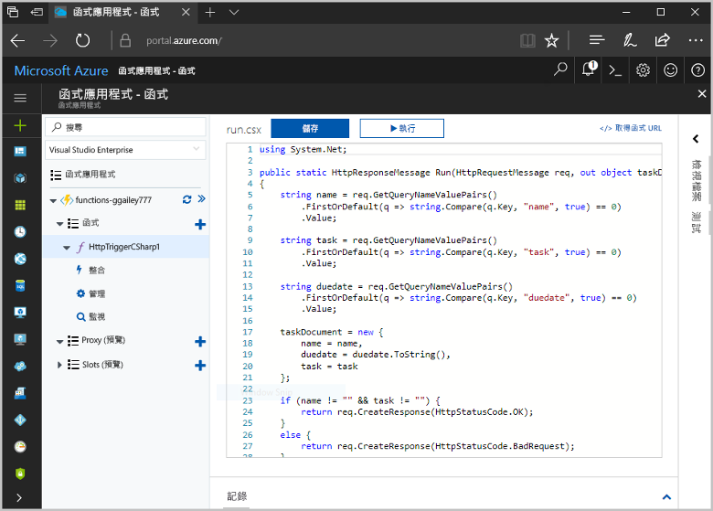
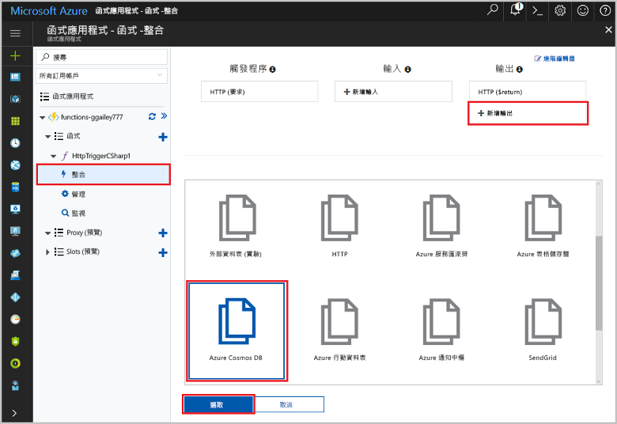
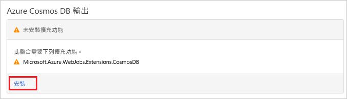
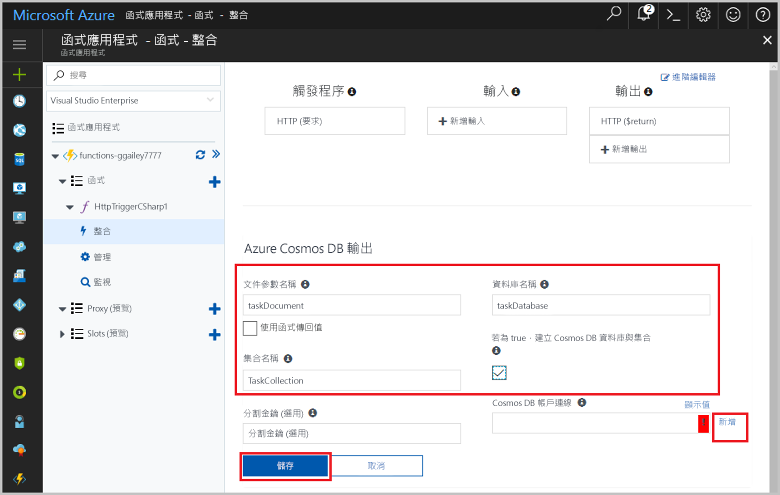
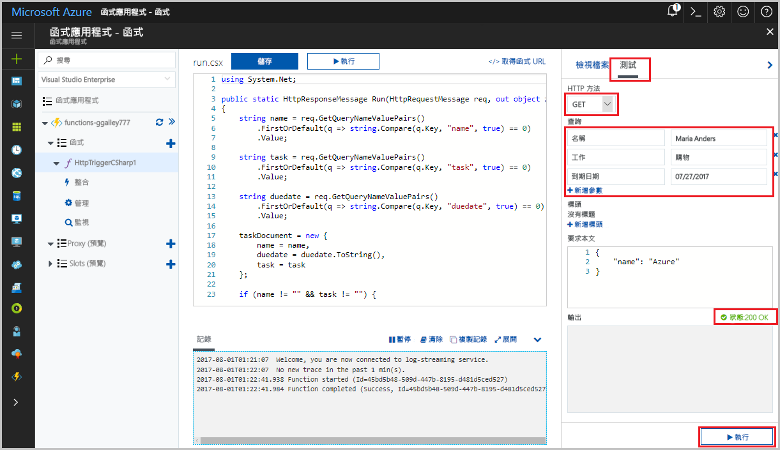
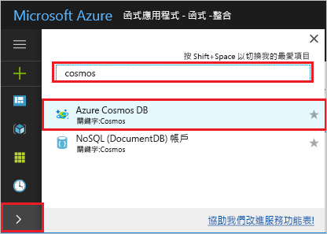
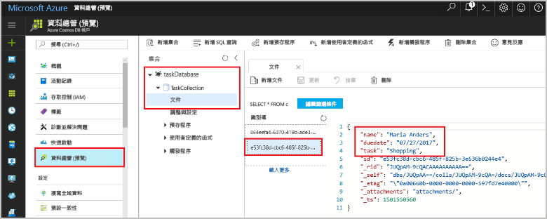

# <a name="store-unstructured-data-using-azure-functions-and-azure-cosmos-db"></a>使用 Azure Functions 和 Azure Cosmos DB 儲存非結構化資料

[Azure Cosmos DB](https://azure.microsoft.com/services/cosmos-db/) 是儲存非結構化和 JSON 資料的好方法。 Cosmos DB 與 Azure Functions 結合，能夠讓儲存資料輕鬆快速，所使用的程式碼比起在關聯式資料庫中儲存資料所需的程式碼更少。

> [!NOTE]
> 此時，Azure Cosmos DB 觸發程序、輸入繫結，以及輸出繫結只會使用 SQL API 和圖形 API 帳戶。

在 Azure Functions 中，輸入和輸出繫結會提供宣告式方法，以便從函式連線到外部服務資料。 在本文中，了解如何更新現有的函式，以新增可在 Azure Cosmos DB 文件中儲存非結構化資料的輸出繫結。



## <a name="prerequisites"></a>必要條件

若要完成本教學課程：

[!INCLUDE [Previous quickstart note](../../includes/functions-quickstart-previous-topics.md)]

## <a name="create-an-azure-cosmos-db-account"></a>建立 Azure Cosmos DB 帳戶

在建立輸出繫結之前，您必須先擁有使用 SQL API 的 Azure Cosmos DB 帳戶。

[!INCLUDE [cosmos-db-create-dbaccount](../../includes/cosmos-db-create-dbaccount.md)]

## <a name="add-an-output-binding"></a>新增輸出繫結

1. 在入口網站中，瀏覽至您先前建立的函式應用程式，然後展開函式應用程式和函式。

1. 選取 [整合] 和 [+ 新增輸出]，其位於頁面的右上方。 選擇 [Azure Cosmos DB]，然後按一下 [選取]。

    

1. 如果您收到**延伸模組未安裝**訊息，請選擇 [安裝] 以在函式應用程式中安裝 Azure Cosmos DB 繫結延伸模組。 安裝作業可能需要數分鐘的時間。

    

1. 使用表格中所指定的 [Azure Cosmos DB 輸出] 設定：

    

    | 設定      | 建議的值  | 說明                                |
    | ------------ | ---------------- | ------------------------------------------ |
    | **文件參數名稱** | taskDocument | 該名稱參考程式碼中的 Cosmos DB 物件。 |
    | **資料庫名稱** | taskDatabase | 用於儲存文件的資料庫名稱。 |
    | **集合名稱** | TaskCollection | 資料庫集合的名稱。 |
    | **如果為 true，就會建立 Cosmos DB 資料庫和集合** | 已檢查 | 集合尚未存在，因此加以建立。 |
    | **Azure Cosmos DB 帳戶連線** | 新增設定 | 選取 [新增]，然後選擇 [訂用帳戶]、稍早建立的 [資料庫帳戶] 以及 [選取]。 建立適用於帳戶連線的應用程式設定。 繫結會使用此設定來連線至資料庫。 |
    | **集合輸送量** |400 RU| 如果您想要降低延遲，稍後可以相應增加輸送量。 |

1. 選取 [儲存] 以建立繫結。

## <a name="update-the-function-code"></a>更新函式程式碼

將現有函式程式碼取代為下列採用您所選語言的程式碼：

# <a name="ctabcsharp"></a>[C\#](#tab/csharp)

使用下列程式碼來取代現有的 C# 函式：

```csharp
#r "Newtonsoft.Json"

using Microsoft.AspNetCore.Mvc;
using Microsoft.AspNetCore.Http;

public static IActionResult Run(HttpRequest req, out object taskDocument, ILogger log)
{
    string name = req.Query["name"];
    string task = req.Query["task"];
    string duedate = req.Query["duedate"];

    // We need both name and task parameters.
    if (!string.IsNullOrEmpty(name) && !string.IsNullOrEmpty(task))
    {
        taskDocument = new
        {
            name,
            duedate,
            task
        };

        return (ActionResult)new OkResult();
    }
    else
    {
        taskDocument = null;
        return (ActionResult)new BadRequestResult();
    }
```

# <a name="javascripttabnodejs"></a>[JavaScript](#tab/nodejs)

使用下列程式碼來取代現有的 JavaScript 函式：

```js
module.exports = async function (context, req) {

    // We need both name and task parameters.
    if (req.query.name && req.query.task) {

        // Set the output binding data from the query object.
        context.bindings.taskDocument = req.query;

        // Success.
        context.res = {
            status: 200
        };
    }
    else {
        context.res = {
            status: 400,
            body: "The query options 'name' and 'task' are required."
        };
    }
};
```
---

此程式碼範例會讀取 HTTP 要求查詢字串，並將它們指派給 `taskDocument` 物件中的欄位。 `taskDocument` 繫結會從此繫結參數傳送物件資料，以便儲存在繫結的文件資料庫中。 第一次執行函式時會建立資料庫。

## <a name="test-the-function-and-database"></a>測試函式和資料庫

1. 展開右側視窗，然後選取 [測試]。 在 [查詢] 之下，按一下 [+ 新增參數] 並將下列參數新增至查詢字串：

    + `name`
    + `task`
    + `duedate`

1. 按一下 [執行] 並確認會傳回 200 狀態。

    

1. 在 Azure 入口網站的左側，展開圖示列，在搜尋欄位中輸入 `cosmos`，然後選取 [Azure Cosmos DB]。

    

1. 選擇您的 Azure Cosmos DB 帳戶，然後選取 [資料總管]。

1. 展開 [集合] 節點，選取新文件，並確認文件包含您的查詢字串值，以及一些額外的中繼資料。

    

您已將繫結成功新增至可在 Azure Cosmos DB 中儲存非結構化資料的 HTTP 觸發程序。

[!INCLUDE [Clean-up section](../../includes/clean-up-section-portal.md)]

## <a name="next-steps"></a>後續步驟

[!INCLUDE [functions-quickstart-next-steps](../../includes/functions-quickstart-next-steps.md)]

如需繫結至 Cosmos DB 資料庫的詳細資訊，請參閱 [Azure Functions Cosmos DB 繫結](functions-bindings-cosmosdb.md)。
