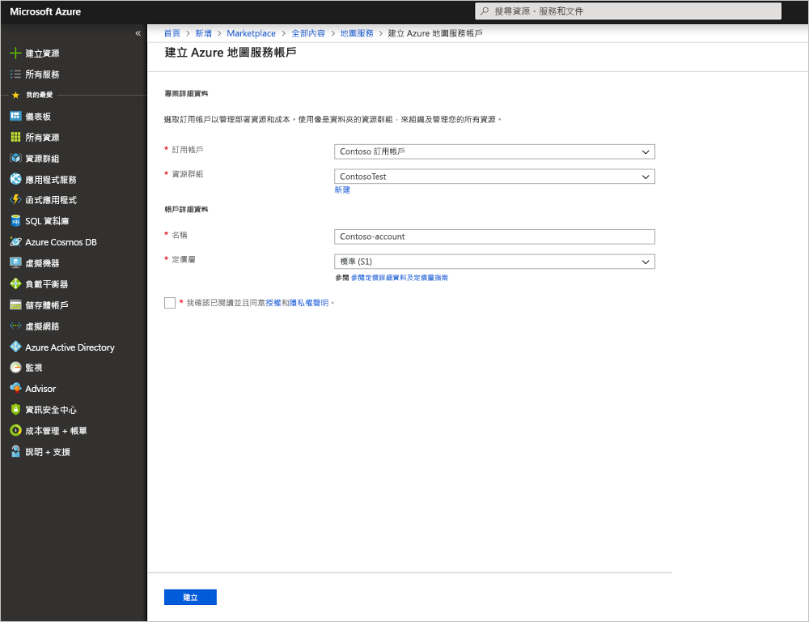

# 使用 Azure 地圖服務啟動互動式地圖搜尋

此文章示範 Azure 地圖服務建立地圖的功能，為使用者建立提供互動式搜尋體驗的地圖。 它會引導您完成建立自己地圖帳戶的基本步驟，並取得用於示範 Web 應用程式中的金鑰。

如果您沒有 Azure 訂用帳戶，請在開始前建立 [免費帳戶](https://azure.microsoft.com/free/?WT.mc_id=A261C142F) 。

## 登入 Azure 入口網站

登入 [Azure 入口網站](https://portal.azure.com/)。

## 建立帳戶並取得金鑰

1. 按一下 [Azure 入口網站](https://portal.azure.com)左上角的 [建立資源]。
2. 在 [搜尋 Marketplace] 方塊中，輸入**地圖**。
3. 從 [結果] 中，選取 [地圖服務]。 按一下地圖下方顯示的 [建立] 按鈕。
4. 在 [建立地圖服務帳戶] 頁面上輸入下列值：
    - 新帳戶的 [名稱]。
    - 您想要使用於此帳戶的 [訂用帳戶]。
    - 此帳戶的 [資源群組]。 您可以選擇 [建立新的] 或 [使用現有的] 資源群組。
    - 選取 [資源群組位置]。
    - 閱讀 [授權] 和 [隱私權聲明]，然後選取核取方塊以接受條款。
    - 最後，按一下 [建立] 按鈕。

    

5. 成功建立您的帳戶之後，請將它開啟並尋找帳戶功能表的設定區段。 按一下 [金鑰] 以檢視 Azure 地圖服務帳戶的主要與次要金鑰。 將 [主要金鑰] 值複製到本機剪貼簿，下一節將使用此值。

## 下載應用程式

1. 下載或複製 [interactiveSearch.html](https://github.com/Azure-Samples/azure-maps-samples/blob/master/src/interactiveSearch.html) 檔案的內容。
2. 將此檔案的內容在本機另存為 **AzureMapDemo.html**，並在文字編輯器中開啟。
3. 搜尋字串 `<insert-key>`，並以上一節中所取得的 [主要金鑰] 值取代它。

## 啟動應用程式

1. 在您選擇的瀏覽器中開啟 **AzureMapDemo.html** 檔案。
2. 查看地圖所顯示的洛杉磯市。 縮放地圖大小，以查看地圖依據縮放層級搭配較多或較少資訊縮放時，自動轉譯的情況。 
3. 變更地圖的預設中心。 在 **AzureMapDemo.html** 檔案中，搜尋名為 **center** 的變數。 以新的值 **[-74.0060, 40.7128]** 取代此變數的 [經度, 緯度] 值組。 儲存檔案並重新整理瀏覽器。
4. 試用互動式搜尋體驗。 在示範 Web 應用程式左上角的搜尋方塊中，搜尋**餐廳**。
5. 將滑鼠移到搜尋方塊下方顯示的地址/地點清單上，便可注意到地圖上對應的圖釘會彈出該地點的相關資訊。 為了保護私人公司的隱私權，在此顯示的是虛構的名稱和地址。

    

## 清除資源

教學課程會詳細說明如何利用您的帳戶使用及設定地圖。 如果您打算繼續進行教學課程，請勿清除在此快速入門中建立的資源。 如果您不打算繼續，請使用下列步驟來刪除此快速入門建立的所有資源。

1. 關閉執行 **AzureMapDemo.html** Web 應用程式的瀏覽器。
2. 從 Azure 入口網站的左側功能表中，按一下 [所有資源]，然後選取您的地圖帳戶。 在 [所有資源] 刀鋒視窗的頂端，按一下 [刪除]。

## 後續步驟

在此快速入門中，您已建立您的地圖帳戶，並啟動了示範應用程式。 若要了解如何使用地圖 API 建立自己的應用程式，請繼續下列教學課程。

> [!div class="nextstepaction"]
> [搜尋地圖上感興趣的點](./tutorial-search-location.md)

如需更多程式碼範例和互動式程式碼撰寫體驗，請參閱以下使用說明指南。

> [!div class="nextstepaction"]
> [了解如何使用 Azure 地圖服務 REST API 來搜尋地址](./how-to-search-for-address.md)

> [!div class="nextstepaction"]
> [如何使用 Azure 地圖服務的地圖控制項](./how-to-use-map-control.md)
