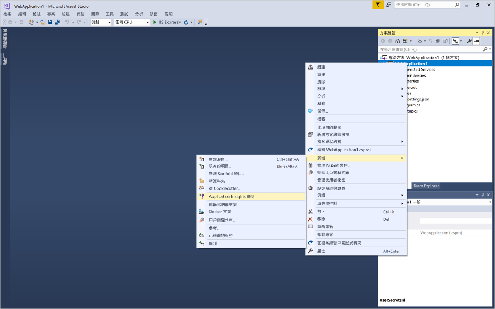
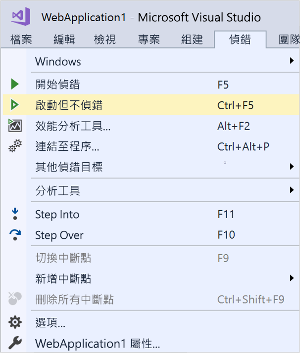
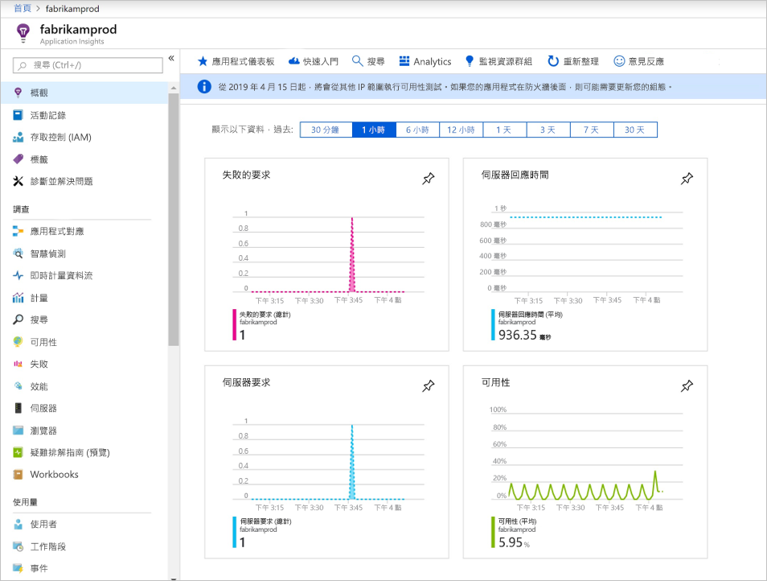
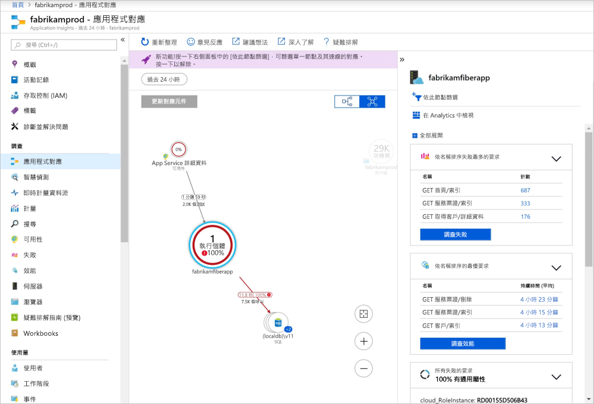
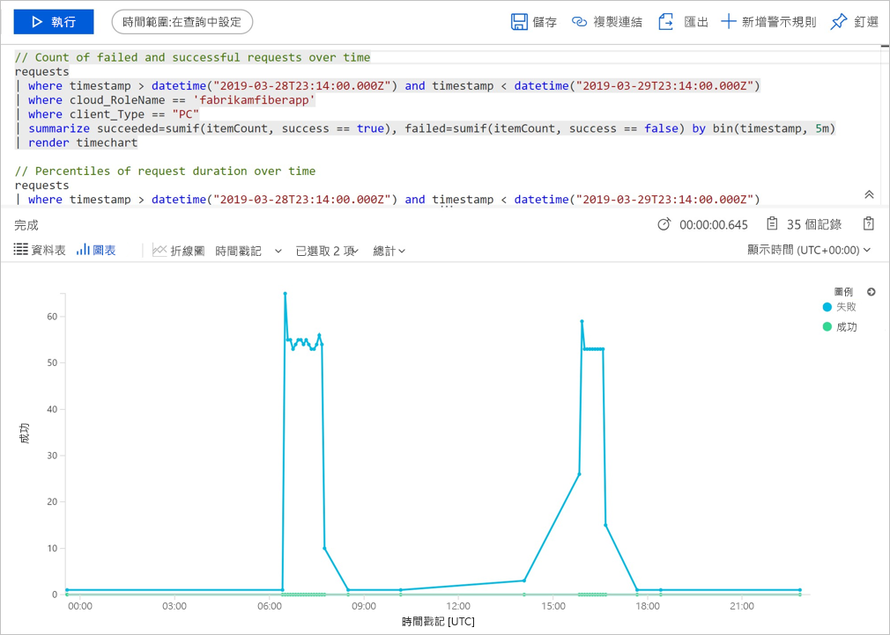
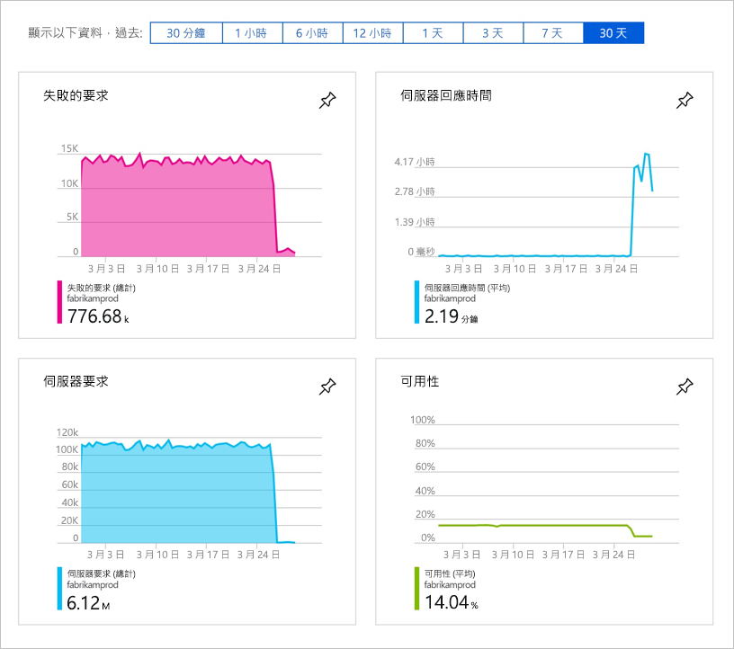

# 開始監視 ASP.NET Core Web 應用程式

Azure Application Insights 可讓您輕鬆監視 Web 應用程式的可用性、效能和使用情形。 還可讓您快速識別並診斷應用程式的錯誤，不必等使用者回報。 

本快速入門會引導您將 Application Insights SDK 新增至現有的 ASP.NET Core Web 應用程式。 若要了解如何在不需要簽出 Visual Studio 的情況下設定 Application Insights，請參閱此[文章](https://docs.microsoft.com/azure/azure-monitor/app/asp-net-core) \(英文\)。

## 必要條件

若要完成本快速入門：

- 使用下列工作負載[安裝 Visual Studio 2019](https://www.visualstudio.com/downloads/)：
  - ASP.NET 和 Web 開發
  - Azure 開發
- [安裝 .NET Core 2.0 SDK](https://www.microsoft.com/net/core)
- 您需要 Azure 訂用帳戶和現有的 .NET Core Web 應用程式。

如果您沒有 ASP.NET Core Web 應用程式，可以使用我們的逐步指南來[建立 ASP.NET Core 應用程式，並新增 Application Insights](../../azure-monitor/app/asp-net-core.md)。

如果您沒有 Azure 訂用帳戶，請在開始前建立[免費帳戶](https://azure.microsoft.com/free/)。

## 登入 Azure 入口網站

登入 [Azure 入口網站](https://portal.azure.com/)。

## 啟用 Application Insights

Application Insights 可以從任何連上網際網路的應用程式收集遙測資料，而不論應用程式在內部部署或雲端中執行。 請使用下列步驟來開始檢視此資料。

1. 選取 [建立資源]   > [開發人員工具]   > [Application Insights]  。

   > [!NOTE]
   >如果這是您第一次建立 Application Insights 資源，您可以瀏覽[建立 Application Insights 資源](https://docs.microsoft.com/azure/azure-monitor/app/create-new-resource)文件以進一步了解。

    設定方塊隨即出現，請使用下表來填寫輸入欄位。

   | 設定        |  值           | 說明  |
   | ------------- |:-------------|:-----|
   | **名稱**      | 通用唯一值 | 此名稱可識別您要監視的應用程式 |
   | **資源群組**     | myResourceGroup      | 用於裝載 App Insights 資料之新資源群組的名稱 |
   | **位置** | 美國東部 | 選擇您附近或接近應用程式裝載位置的地點 |

2. 按一下頁面底部的 [新增]  。

## 設定 App Insights SDK

1. 在 Visual Studio 中開啟您的 ASP.NET Core Web 應用程式**專案** > 在 [方案總管]  中以滑鼠右鍵按一下 AppName > 選取 [新增]   > [Application Insights 遙測]  。

    

2. 按一下 [開始使用]  按鈕

3. 選取您的帳戶和訂用帳戶 > 選取您在 Azure 入口網站中建立的 [現有資源]  > 按一下[註冊]  。

4. 選取 [專案]   > [管理 NuGet 套件]   > [套件來源: nuget.org]   > [更新]  ，將 Application Insights SDK 套件更新至最新穩定版本。

5. 選取 [偵錯]   > [啟動但不偵錯]  \(Ctrl + F5) 來啟動您的應用程式

    

> [!NOTE]
> 經過 3-5 分鐘，資料就會開始出現在入口網站。 如果此應用程式是低流量測試應用程式，請記住，只在有使用中的要求或作業時，才會擷取大部分的計量。

## 在 Azure 入口網站中開始監視

1. 在 Azure 入口網站中選取 [首頁]  重新開啟 Application Insights 的 [概觀]  頁面，然後在最近使用的資源底下選取您稍早建立的資源，以檢視目前執行中應用程式的相關詳細資料。

   

2. 按一下 [應用程式對應]  ，以顯示應用程式元件之間相依性關係的視覺化配置。 每個元件會顯示負載、效能、失敗和警示等 KPI。

   

3. 按一下 [應用程式分析]  圖示  **在 Analytics 中檢視**。 這樣會開啟 **Application Insights Analytics**，它提供一種豐富查詢語言，可用於分析 Application Insights 收集的所有資料。 此案例中會為您產生查詢，可將要求計數以圖表呈現。 您可以撰寫自己的查詢來分析其他資料。

   

4. 返回 [概觀]  頁面，並檢查 [KPI 儀表板]。  此儀表板會提供應用程式健康情況的統計資料，包括連入要求數量、這些要求的持續時間，以及任何發生的失敗。 

   

5. 在左側按一下 [計量]  。 使用計量瀏覽器來調查資源的健康情況和使用量。 您可以按一下 [新增新的圖表]  來建立額外的自訂檢視，或選取 [編輯]  來修改現有圖表的類型、高度、調色盤、群組和計量。 例如，您可以製作圖表來顯示平均瀏覽器頁面載入時間，方法是從 [計量] 下拉式清單選取 [瀏覽器頁面載入時間] 並從 [彙總] 選取 [平均]。 若要深入了解 Azure 計量瀏覽器，請瀏覽[開始使用 Azure 計量瀏覽器](../../azure-monitor/platform/metrics-getting-started.md)。

     ![[計量] 索引標籤：瀏覽器頁面的平均載入時間圖表](./media/dotnetcore-quick-start/8metrics.png)

## 影片

- 關於如何從頭開始[使用 .NET Core 和 Visual Studio 設定 Application Insights](https://www.youtube.com/watch?v=NoS9UhcR4gA&t) 的外部逐步說明影片。
- 關於如何從頭開始[使用 .NET Core 和 Visual Studio Code 設定 Application Insights](https://youtu.be/ygGt84GDync) 的外部逐步說明影片。

## 清除資源
當您完成測試時，您可以刪除資源群組和所有相關資源。 若要這樣做，請依照下列步驟執行。

1. 從 Azure 入口網站的左側功能表中，依序按一下 [資源群組]  和 [myResourceGroup]  。
2. 在資源群組頁面上，按一下 [刪除]  ，在文字方塊中輸入 **myResourceGroup**，然後按一下 [刪除]  。

## 後續步驟

> [!div class="nextstepaction"]
> [尋找並診斷執行階段例外狀況](https://docs.microsoft.com/azure/application-insights/app-insights-tutorial-runtime-exceptions)
