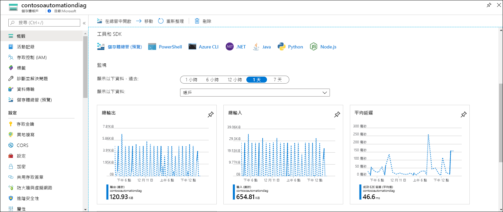
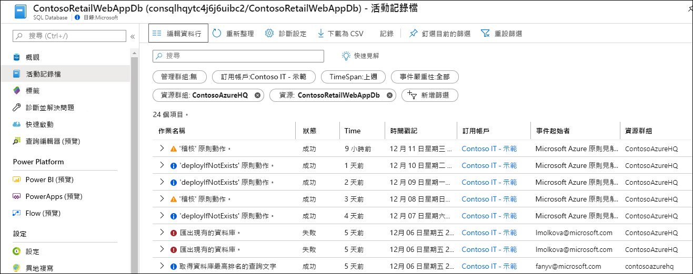
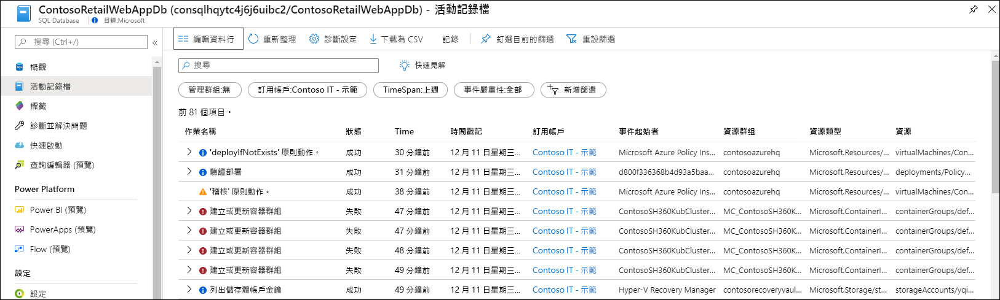
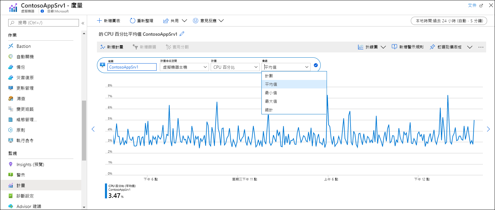
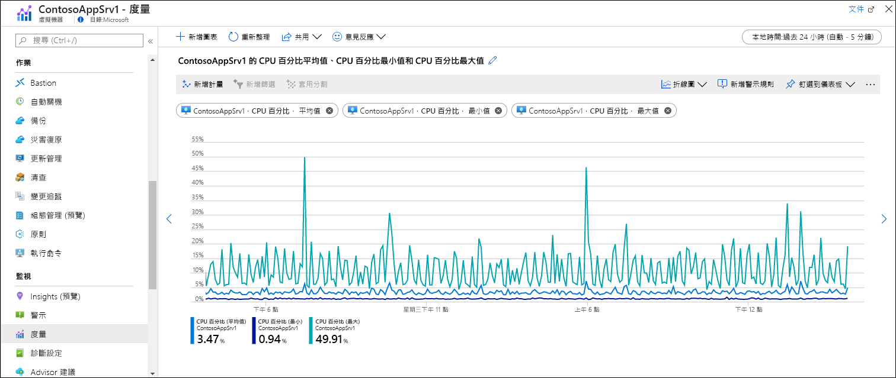

# 快速入門：使用 Azure 監視器監視 Azure 資源
[Azure 監視器](../overview.md)會在 Azure 資源建立時開始從中收集資料。 本快速入門會簡介自動收集的資源資料，以及如何在 Azure 入口網站中查看特定資源的這些資料。 稍後，您可以新增設定來收集其他資料，也可以移至 [Azure 監視器] 功能表，使用相同工具來存取針對您訂用帳戶中所有資源收集的資料。

若要深入了解如何監視從 Azure 資源收集的資料，請參閱[使用 Azure 監視器監視 Azure 資源](../insights/monitor-azure-resource.md)。

## 登入 Azure 入口網站

登入 Azure 入口網站：[https://portal.azure.com](https://portal.azure.com)。 

## 概觀分頁
許多服務都會在其 [概觀]  頁面上包含監視資料，以便快速瀏覽其作業。 這通常會以 Azure 監視器計量中儲存的平台計量子集為基礎。

1. 在您的訂用帳戶中尋找 Azure 資源。
2. 移至 [概觀]  頁面，並注意其中是否顯示任何效能資料。 Azure 監視器會提供此資料。 以下範例是 Azure 儲存體帳戶的 [概觀]  頁面，您可以看到有多個計量顯示。

    

3. 您可以按一下任何圖表，以在計量瀏覽器中開啟資料，如下所述。

## 檢視活動記錄
活動記錄能讓您了解訂用帳戶中每個 Azure 資源上的作業。 其中包括建立或修改資源的時間、作業啟動時間，或特定作業的發生時間等資訊。

1. 在資源功能表的頂端選取 [活動記錄]  。
2. 目前的篩選會設定為與資源相關的事件。 如果您看不到任何事件，請嘗試變更 [時間範圍]  來增加時間範圍。

    

4. 如果您想要查看訂用帳戶中其他資源的事件，請變更篩選中的準則，或甚至是移除篩選屬性。

    

## 檢視計量
計量為數值，描述資源在特定時間的某個方面。 Azure 監視器會以每一分鐘的時間間隔，自動從所有 Azure 資源收集平台計量。 您可以使用計量瀏覽器來查看這些計量。

1. 在資源功能表的 [監視]  區段中，選取 [計量]  。 這會開啟計量瀏覽器，並將範圍設定為您的資源。
2. 按一下 [新增計量]  以在圖表中新增計量。
   
   
   
4. 從下拉式清單中選取**計量**，然後選取 [彙總]  。 這會定義收集的值將如何在每個時間間隔內取樣。

    

5. 按一下 [新增計量]  ，將額外的計量和彙總組合新增至圖表。

    

## 後續步驟
在本快速入門中，您已檢視了 Azure 監視器自動收集的 Azure 資源活動記錄和計量。 資源記錄可讓您深入了解資源的詳細作業，但必須加以設定才能進行收集。 請繼續進行將資源記錄收集到 Log Analytics 工作區的教學課程，以便使用記錄查詢來分析這些記錄。

> [!div class="nextstepaction"]
> [使用 Azure 監視器收集資源記錄並加以分析](tutorial-resource-logs.md)
