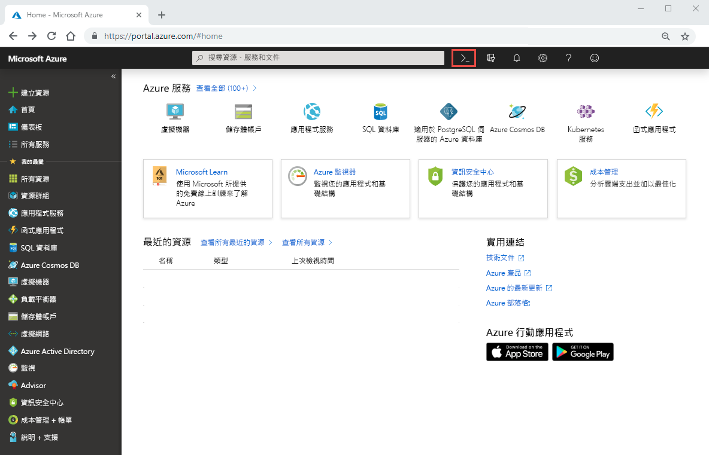
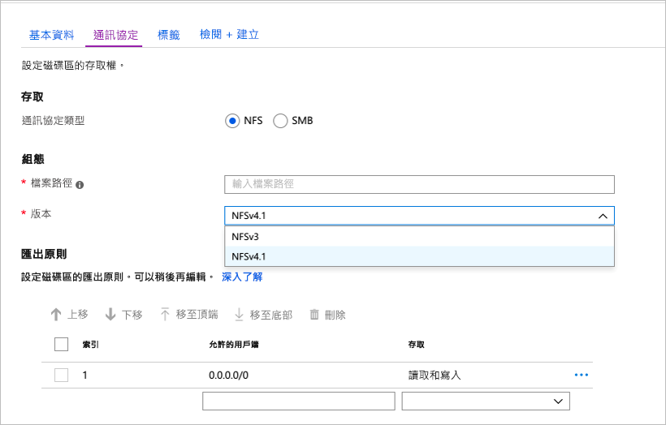
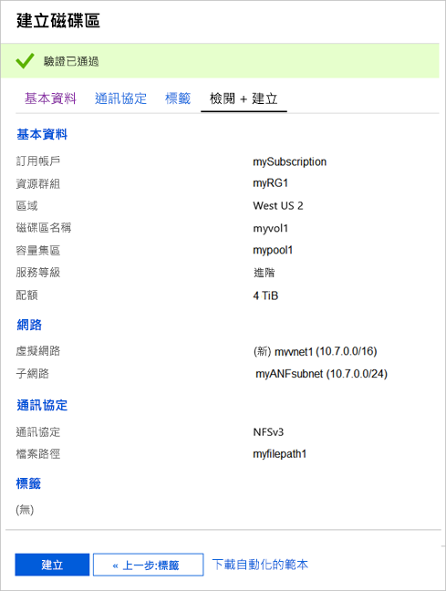
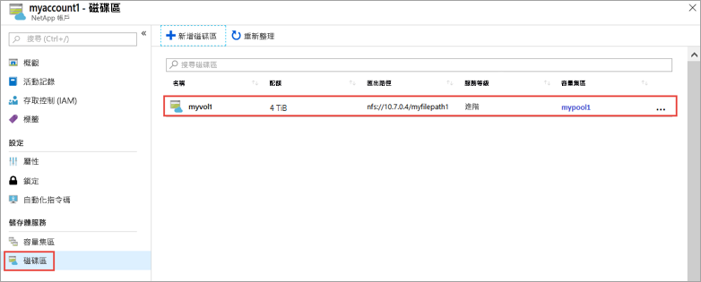
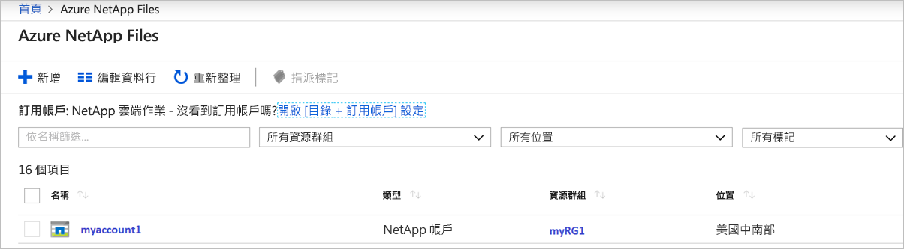
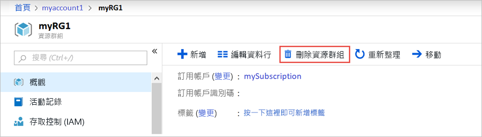
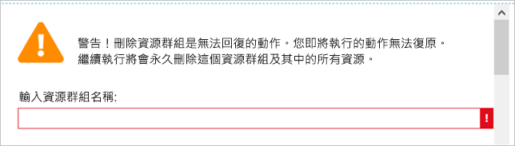

# 快速入門：設定 Azure NetApp Files 並建立 NFS 磁碟區 

本文將示範如何快速設定 Azure NetApp Files 並建立磁碟區。 

在本快速入門中，您會設定下列項目：

- 註冊 Azure NetApp Files 和 NetApp 資源提供者
- 一個 NetApp 帳戶
- 一個容量集區
- 一個適用於 Azure NetApp Files 的 NFS 磁碟區

如果您沒有 Azure 訂用帳戶，請在開始前建立 [免費帳戶](https://azure.microsoft.com/free/?WT.mc_id=A261C142F) 。

## 開始之前 

> [!IMPORTANT] 
> 您必須具備 Azure NetApp Files 服務的存取權。  若要要求服務的存取權，請參閱 [Azure NetApp 檔案等候清單提交頁面](https://forms.office.com/Pages/ResponsePage.aspx?id=v4j5cvGGr0GRqy180BHbR8cq17Xv9yVBtRCSlcD_gdVUNUpUWEpLNERIM1NOVzA5MzczQ0dQR1ZTSS4u) \(英文\)。  您必須等候 Azure NetApp Files 團隊發出官方確認電子郵件，然後再繼續。 

## 註冊 Azure NetApp Files 和 NetApp 資源提供者

1. 在 Azure 入口網站中，按一下右上角的 Azure Cloud Shell 圖示。

    

2. 指定已列入 Azure NetApp Files 白名單的訂用帳戶：
    
        az account set --subscription <subscriptionId>

3. 註冊 Azure 資源提供者： 
    
        az provider register --namespace Microsoft.NetApp --wait  

    註冊程序可能需要一些時間才能完成。

## 建立 NetApp 帳戶

1. 在 Azure 入口網站的搜尋方塊中，輸入 **Azure NetApp Files**，然後從顯示的清單中選取 [Azure NetApp Files (預覽)]  。

      

2. 按一下 [+ 新增]  以建立新的 NetApp 帳戶。

     

3. 在 [新增 NetApp 帳戶] 視窗中，提供下列資訊： 
   1. 輸入 **myaccount1** 作為帳戶名稱。 
   2. 選取您的訂用帳戶。
   3. 選取 [新建]  來建立新的資源群組。 輸入 **myRG1** 作為資源群組名稱。 按一下 [確定]  。 
   4. 選取您的帳戶位置。  

        

      

4. 按一下 [建立]  以建立新的 NetApp 帳戶。

## 設定容量集區

1. 從 Azure NetApp Files 管理刀鋒視窗中，選取您的 NetApp 帳戶 (**myaccount1**)。

      

2. 從您 NetApp 帳戶的 Azure NetApp Files 管理刀鋒視窗中，按一下 [容量集區]  。

      

3. 按一下 [+ 新增集區]  。 

      

4. 提供容量集區的資訊： 
    1. 請輸入 **mypool1** 作為集區名稱。
    2. 選取 [進階]  作為服務等級。 
    3. 指定 **4 (TiB)** 作為集區大小。 

5. 按一下 [確定]  。

## 建立適用於 Azure NetApp Files 的 NFS 磁碟區

1. 從您 NetApp 帳戶的 Azure NetApp Files 管理刀鋒視窗中，按一下 [磁碟區]  。

      

2. 按一下 [+ 新增磁碟區]  。

      

3. 在 [建立磁碟區] 視窗中，提供磁碟區的資訊： 
   1. 輸入 **myvol1** 作為磁碟區名稱。 
   3. 選取您的容量集區 (**mypool1**)。
   4. 針對配額，請使用預設值。 
   5. 在 [虛擬網路] 下，按一下 [新建]  來建立新的 Azure 虛擬網路 (Vnet)。  然後填寫下列資訊︰
       * 輸入 **myvnet1** 作為 Vnet 名稱。
       * 針對您的設定來指定位址空間，例如 10.7.0.0/16
       * 輸入 **myANFsubnet** 作為子網路名稱。
       * 指定子網路位址範圍，例如 10.7.0.0/24。 請注意，您無法與其他資源共用專用子網路。
       * 針對子網路委派，請選取 [Microsoft.NetApp/磁碟區]  。
       * 按一下 [確定]  以建立 Vnet。
   6. 在子網路中，選取新建立的 Vnet (**myvnet1**) 作為委派子網路。

        

        

4. 按一下 [通訊協定]  ，然後選取 **NFS** 作為磁碟區的通訊協定類型。   

    輸入 **myfilepath1**，作為用來建立磁碟區匯出路徑的檔案路徑。 

    

5. 按一下 [檢閱 + 建立]  。

      

5. 檢閱磁碟區的資訊，然後按一下 [建立]  。  
    建立的磁碟區會出現在 [磁碟區] 刀鋒視窗中。

      

## 清除資源

完成之後可以選擇刪除資源群組。 刪除資源群組是無法回復的動作。  

> [!IMPORTANT]
> 資源群組內的所有資源都將永久刪除且無法復原。 

1. 在 Azure 入口網站的搜尋方塊中，輸入 **Azure NetApp Files**，然後從顯示的清單中選取 [Azure NetApp Files]  。

2. 在訂用帳戶清單中，按一下您想要刪除的資源群組 (myRG1)。 

    

3. 在 [資源群組] 頁面中，按一下 [刪除資源群組]  。

     

    隨即開啟一個視窗，其中顯示有關資源將會與資源群組一起刪除的警告。

4. 輸入資源群組名稱 (myRG1) 以確認您想要永久刪除該資源群組和所有資源，然後按一下 [刪除]  。

     

## 後續步驟  

> [!div class="nextstepaction"]
> [使用 Azure NetApp Files 管理磁碟區](azure-netapp-files-manage-volumes.md)  
