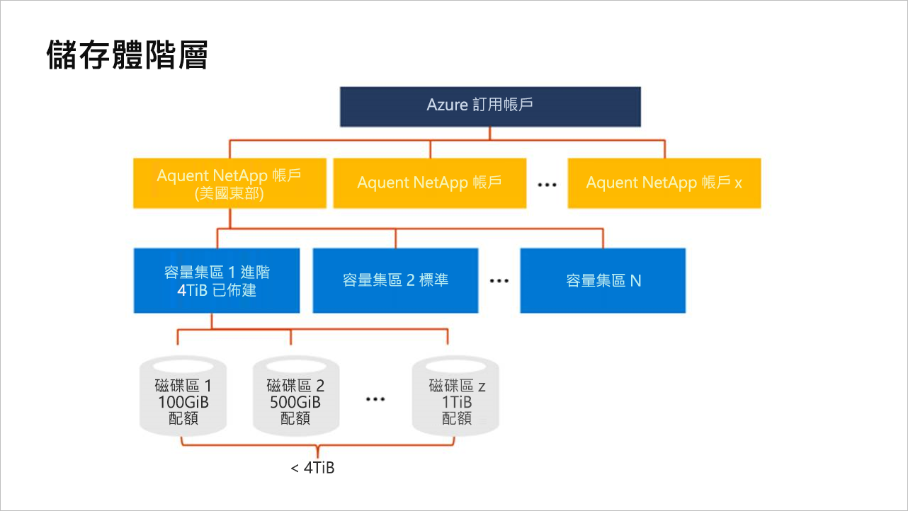

# 了解 Azure NetApp Files 的儲存體階層

在 Azure NetApp Files 中建立磁碟區之前，您必須先購買及設定佈建容量的集區。  若要設定容量集區，您必須具有 NetApp 帳戶。 了解儲存體階層有助於設定和管理您的 Azure NetApp Files 資源。

## NetApp 帳戶

- NetApp 帳戶可充當組成容量集區的系統管理群組。  
- NetApp 帳戶與一般 Azure 儲存體帳戶不同。 
- NetApp 帳戶的範圍具有區域性。   
- 您在一個區域中可以有多個 NetApp 帳戶，但是每個 NetApp 帳戶都只繫結至單一區域。

## 容量集區

- 容量集區是依據其佈建容量進行測量。  
- 容量是以您購買的固定 SKU (例如 4-TiB 容量) 進行佈建。
- 單一容量集區的大小下限為 4 TiB，大小上限為 500 TiB。 
- 容量集區只能有一個服務等級。  
  目前只有進階服務等級可用。
- 每個容量集區都只能屬於一個 NetApp 帳戶。 不過，您的 NetApp 帳戶內可以有多個容量集區。  
- 容量集區不能跨越 NetApp 帳戶移動。   
  例如，在下方[儲存體階層的概念圖表](#conceptual_diagram_of_storage_hierarchy)中，容量集區 1 無法從美國東部 NetApp 帳戶移至美國西部 2 NetApp 帳戶。  

## 磁碟區

- 磁碟區會依據邏輯容量耗用量進行測量，且可以調整。 單一磁碟區的大小下限為 100 GiB，大小上限為 92 TiB。
- 磁碟區的容量耗用量是根據其集區的佈建容量進行計算。
-   您在每個區域的每個 Azure 訂用帳戶中最多可以有 100 個磁碟區。 
- 每個磁碟區都只屬於一個集區，但是一個集區可以包含多個磁碟區。 
- 您可以在相同的 NetApp 帳戶內，於集區之間移動磁碟區。    
  例如，在下方[儲存體階層的概念圖表](#conceptual_diagram_of_storage_hierarchy)中，您可以將磁碟區從容量集區 1 移至容量集區 2。

## 儲存體階層的概念圖表 
下列範例顯示 Azure 訂用帳戶、NetApp 帳戶、容量集區和磁碟區之間的關係。   

## 後續步驟

- [Azure NetApp Files 的資源限制](azure-netapp-files-resource-limits.md)
- [註冊 Azure NetApp Files](azure-netapp-files-register.md)
