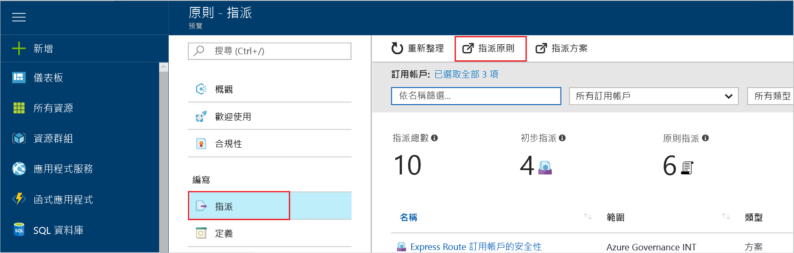
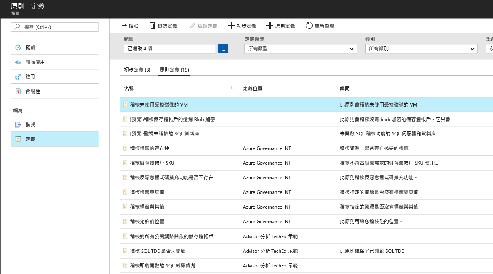
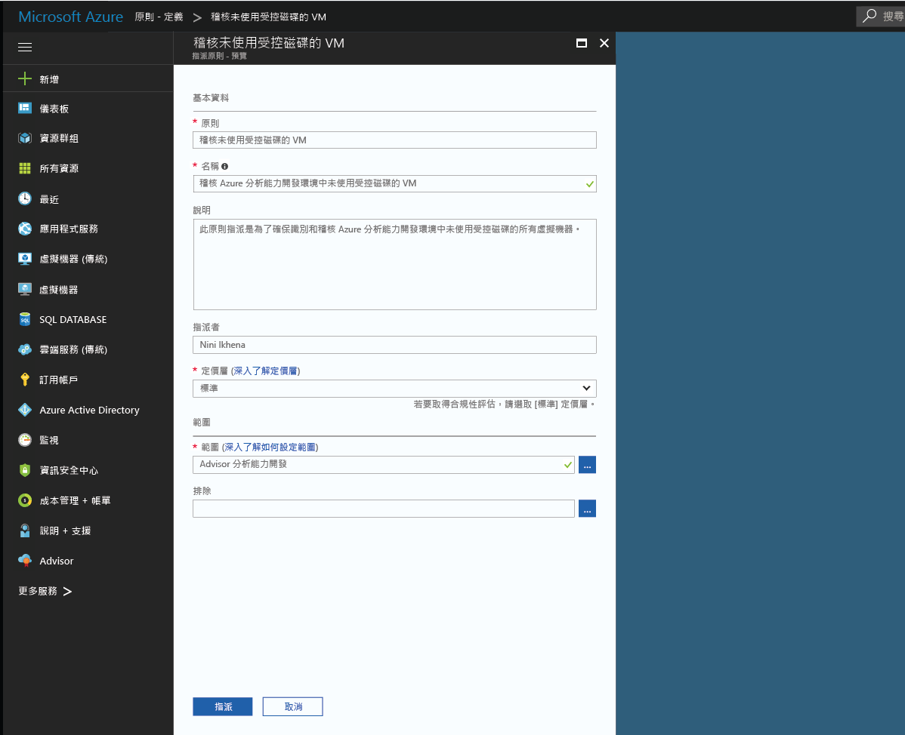
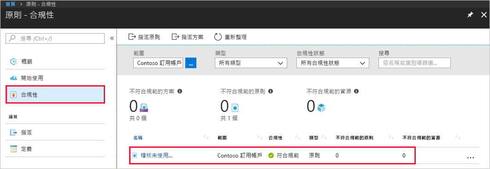

# 建立原則指派，以識別 Azure 環境中的不相容資源
了解 Azure 中合規性的第一個步驟是識別您資源的狀態。 本快速入門會逐步引導您完成程序來建立原則指派，以識別出未使用受控磁碟的虛擬機器。

在此程序結束時，您將會成功識別出未使用受控磁碟的虛擬機器。 它們不符合原則指派的規範。

如果您沒有 Azure 訂用帳戶，請在開始前建立 [免費帳戶](https://azure.microsoft.com/free/?WT.mc_id=A261C142F) 。

## 建立原則指派

在本快速入門中，您會建立一個原則指派，並且指派「稽核沒有受控磁碟的虛擬機器」原則定義。

1. 選取 Azure 原則分頁左窗格上的 [指派]。
2. 從 [指派] 窗格頂端選取 [指派原則]。

   

3. 在 [指派原則] 分頁上，按一下 [原則] 欄位旁的，以開啟可用定義的清單。

   

   Azure 原則隨附您可以使用的內建原則定義。 內建原則定義如下：

   - 強制執行標籤和其值
   - 套用標籤和其值
   - 需要 SQL Server 12.0 版

    如需所有可用內建原則的完整清單，請參閱[原則範本](json-samples.md)。

4. 搜尋您的原則定義以尋找 *Audit VMs that do not use managed disks* (稽核未使用受控磁碟的 VM) 定義。 按一下該原則，然後按一下 [選取]。

   

5. 為原則指派提供顯示**名稱**。 在此案例中，我們將使用 *Audit VMs that do not use managed disks* (稽核未使用受控磁碟的 VM)。 您也可以新增選擇性的 [描述]。 此描述可用來提供詳細資料，說明原則指派如何識別出未使用受控磁碟的所有虛擬機器。
6. 將定價層變更為**標準**，以確保原則套用至現有的資源。

   Azure 原則有兩個定價層 – 免費和標準。 使用免費層次，您只能在未來的資源上強制執行原則，而使用標準層，您也能在現有資源上強制執行這些原則，以更加了解相容性狀態。 若要深入了解定價，請參閱 [Azure 原則定價](https://azure.microsoft.com/pricing/details/azure-policy/)。

7. 選取您想要套用原則的 [範圍]。  範圍會決定在哪些資源或資源群組上強制執行原則指派。 範圍從訂用帳戶到資源群組。
8. 選取您先前註冊的訂用帳戶 (或資源群組)。 在此範例中，會使用 **Azure Analytics Capacity Dev** 訂用帳戶，但是您的選項可能有所不同。 按一下 [選取] 。

   

9. 目前將 [排除] 留空，然後按一下 [指派]。

您現在可以識別不相容的資源，以了解環境的相容性狀態。

## 識別不相容的資源

選取左窗格上的 [相容性]，然後搜尋您建立的原則指派。

如果有任何現有資源不符合這個新指派的規範，它們會顯示在 [不符合規範的資源] 下。

根據現有資源評估條件，而且結果為 true 時，這些資源都會標示為不符合原則規範。 上述範例映像會顯示不符合規範的資源。 下表顯示不同的原則動作如何與結果合規性狀態的條件評估搭配使用。 雖然您在 Azure 入口網站中沒有看到評估邏輯，但是會顯示合規性狀態結果。 合規性狀態結果是符合規範和不符合規範其中之一。

| **資源狀態** | **Action** | **原則評估** | **合規性狀態** |
| --- | --- | --- | --- |
| exists | 拒絕、稽核、附加\*、DeployIfNotExist\*、AuditIfNotExist\* | True | 不符合規範 |
| exists | 拒絕、稽核、附加\*、DeployIfNotExist\*、AuditIfNotExist\* | False | 相容 |
| 新增 | 稽核、AuditIfNotExist\* | True | 不符合規範 |
| 新增 | 稽核、AuditIfNotExist\* | False | 相容 |

\* 附加、DeployIfNotExist 和 AuditIfNotExist 動作需要 IF 陳述式為 TRUE。 這些動作也需要存在條件為 FALSE，以呈現不符合規範。 若為 TRUE，IF 條件會觸發相關資源的存在條件評估。
## 清除資源

此集合中的其他指南是以本快速入門為基礎。 如果您打算繼續進行後續的教學課程，請勿清除在此快速入門中建立的資源。 如果您不打算繼續，請使用下列步驟，在 Azure 入口網站中刪除本快速入門所建立的所有資源。
1. 選取左窗格中的 [指派]。
2. 搜尋您建立的指派，然後以滑鼠右鍵按一下它。

   

3.  選取 [刪除指派]。

## 後續步驟

在本快速入門中，您會將原則定義指派至範圍。 原則定義可確保範圍中的所有資源都符合規範，並且識別哪些資源不符合。

若要深入了解指派原則，以確保所建立的**未來**資源是相容的，請繼續進行教學課程：

> [!div class="nextstepaction"]
> [建立及管理原則](./create-manage-policy.md)
