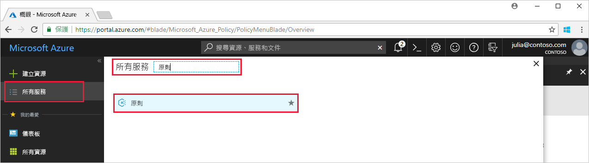

# <a name="create-and-manage-policies-to-enforce-compliance"></a>建立和管理原則來強制執行相容性

了解如何在 Azure 中建立和管理原則，對於保持符合公司標準和服務等級協定而言，相當重要。 在本教學課程中，您將了解如何使用 Azure 原則在整個組織執行與建立、指派及管理原則相關的某些常見工作，例如：

> [!div class="checklist"]
> * 指派原則來強制執行您在未來建立的資源條件
> * 建立及指派計畫定義，以追蹤多個資源的相容性
> * 解決不相容或拒絕的資源
> * 在整個組織中實作新的原則

如果您想要指派原則以識別現有資源的目前合規性狀態，快速入門文章會說明如何執行這項操作。 如果您沒有 Azure 訂用帳戶，請在開始前建立 [免費帳戶](https://azure.microsoft.com/free/?WT.mc_id=A261C142F) 。

## <a name="assign-a-policy"></a>指派原則

使用 Azure 原則強制執行相容性的第一步是指派原則定義。 原則定義會定義在何種條件下強制執行原則，以及要採取什麼動作。 在此範例中，指派稱為「需要 SQL Server 12.0 版」的內建原則定義，以強制執行所有 SQL Server 資料庫都必須是 v12.0 才能相容的條件。

1. 藉由搜尋並選取左窗格中的 [原則]，在 Azure 入口網站中啟動 Azure 原則服務。

   

2. 選取 Azure 原則分頁左窗格上的 [指派]。 指派是已指派在特定範圍內發生的原則。
3. 從 [指派] 窗格頂端選取 [指派原則]。

   

4. 在 [指派原則] 分頁上，按一下 [原則] 欄位旁的，以開啟可用定義的清單。 您可以將原則定義 [類型] 篩選為 [BuiltIn]，以檢視所有項目並閱讀其描述。

   

5. 選取 [需要 SQL Server 12.0 版]。 如果您無法立即找到它，請在搜尋方塊中輸入 [需要 SQL Server 12.0 版]，然後按 ENTER 鍵。

   

6. 系統會自動填入顯示的 [名稱]，但您可加以變更。 在此範例中，使用「需要 SQL Server 12.0 版」。 您也可以新增選擇性的 [描述]。 描述會提供有關此原則指派如何確保在此環境中建立的所有 SQL Server 都是 12.0 版的詳細資料。

7. 將定價層變更為**標準**，以確保原則套用至現有的資源。

   Azure 原則有兩個定價層 – 免費和標準。 使用免費層次，您只能在未來的資源上強制執行原則，而使用標準層，您也能在現有資源上強制執行這些原則，以更加了解相容性狀態。 因為 Azure 原則是預覽版本，所以尚未發行定價模式，因此您選取「標準」也不會收到帳單。 若要深入了解定價，請參閱 [Azure 原則定價](https://azure.microsoft.com/pricing/details/azure-policy)。

8. 選取 [範圍]：您先前註冊的訂用帳戶 (或資源群組)。 範圍會決定在哪些資源或資源群組上強制執行原則指派。 範圍從訂用帳戶到資源群組。

   此範例使用 **Azure Analytics Capacity Dev** 訂用帳戶。 您的訂用帳戶不同。

10. 選取 [指派]。

## <a name="implement-a-new-custom-policy"></a>實作新的自訂原則

既然您已指派內建原則定義，可以進一步利用 Azure 原則。 接下來，建立新的自訂原則，藉由確保在您的環境中建立的 VM 不是 G 系列來節省成本。 如此一來，每次您組織中的使用者嘗試建立 G 系列的 VM 時，要求就會遭到拒絕。

1. 選取左窗格中 [製作] 底下的 [定義]。

   

2. 選取 [+ 原則定義]。
3. 輸入以下資訊：

   - 原則定義的名稱 - 需要小於 G 系列的 VM SKU
   - 原則定義目的的描述 – 此原則定義會強制讓此範圍中建立的所有 VM，具有比 G 系列小的 SKU，以降低成本。
   - 原則定義所在的訂用帳戶。 在此例中，原則定義位於 **Advisor Analytics Capacity Dev** 中。 您的訂用帳戶清單不同。
   - 從現有選項進行選擇，或為此原則定義建立新類別。
   - 複製下列 json 程式碼，然後針對您的需求進行更新：
      - 原則參數。
      - 原則規則/條件，在此情況下 – VM SKU 大小等於 G 系列
      - 原則效果，在此情況下 – **拒絕**。

    以下是 json 應該會有的外觀。 將修改過的程式碼貼到 Azure 入口網站中。

    ```json
{
    "policyRule": {
      "if": {
        "allOf": [
          {
            "field": "type",
            "equals": "Microsoft.Compute/virtualMachines"
          },
          {
            "field": "Microsoft.Compute/virtualMachines/sku.name",
            "like": "Standard_G*"
          }
        ]
      },
      "then": {
        "effect": "deny"
      }
    }
}
    ```

    原則規則中欄位屬性的值必須是下列其中一項：Name、Type、Location、Tags 或別名。 例如： `"Microsoft.Compute/VirtualMachines/Size"`。

    若要檢視更多 json 程式碼範例，請參閱 [Azure 原則的範本](json-samples.md)一文。

4. 選取 [ **儲存**]。

## <a name="create-a-policy-definition-with-rest-api"></a>使用 REST API 來建立原則定義

您可以使用「適用於原則定義的 REST API」來建立原則。 REST API 可讓您建立和刪除原則定義，以及取得現有定義的相關資訊。
若要建立原則定義，請使用下列範例：

```
PUT https://management.azure.com/subscriptions/{subscription-id}/providers/Microsoft.authorization/policydefinitions/{policyDefinitionName}?api-version={api-version}

```
納入如下範例的要求內文：

```
{
  "properties": {
    "parameters": {
      "allowedLocations": {
        "type": "array",
        "metadata": {
          "description": "The list of locations that can be specified when deploying resources",
          "strongType": "location",
          "displayName": "Allowed locations"
        }
      }
    },
    "displayName": "Allowed locations",
    "description": "This policy enables you to restrict the locations your organization can specify when deploying resources.",
    "policyRule": {
      "if": {
        "not": {
          "field": "location",
          "in": "[parameters('allowedLocations')]"
        }
      },
      "then": {
        "effect": "deny"
      }
    }
  }
}
```

## <a name="create-a-policy-definition-with-powershell"></a>使用 PowerShell 來建立原則定義

繼續進行 PowerShell 範例之前，請確定您已安裝最新版的 Azure PowerShell。 原則參數是於 3.6.0 版中加入。 如果您使用舊版本，範例會傳回找不到參數的錯誤。

您可以使用 `New-AzureRmPolicyDefinition` cmdlet 建立原則定義。

若要從檔案建立原則定義，請將路徑傳遞至檔案。 針對外部檔案，請使用下列範例：

```
$definition = New-AzureRmPolicyDefinition `
    -Name denyCoolTiering `
    -DisplayName "Deny cool access tiering for storage" `
    -Policy 'https://raw.githubusercontent.com/Azure/azure-policy-samples/master/samples/Storage/storage-account-access-tier/azurepolicy.rules.json'
```

針對本機檔案，請使用下列範例：

```
$definition = New-AzureRmPolicyDefinition `
    -Name denyCoolTiering `
    -Description "Deny cool access tiering for storage" `
    -Policy "c:\policies\coolAccessTier.json"
```

若要建立具有內嵌規則的原則定義，請使用下列範例：

```
$definition = New-AzureRmPolicyDefinition -Name denyCoolTiering -Description "Deny cool access tiering for storage" -Policy '{
  "if": {
    "allOf": [
      {
        "field": "type",
        "equals": "Microsoft.Storage/storageAccounts"
      },
      {
        "field": "kind",
        "equals": "BlobStorage"
      },
      {
        "not": {
          "field": "Microsoft.Storage/storageAccounts/accessTier",
          "equals": "cool"
        }
      }
    ]
  },
  "then": {
    "effect": "deny"
  }
}'
```

輸出會儲存在於原則指派期間使用的 `$definition` 物件中。
下列範例建立了包含參數的原則定義：

```
$policy = '{
    "if": {
        "allOf": [
            {
                "field": "type",
                "equals": "Microsoft.Storage/storageAccounts"
            },
            {
                "not": {
                    "field": "location",
                    "in": "[parameters(''allowedLocations'')]"
                }
            }
        ]
    },
    "then": {
        "effect": "Deny"
    }
}'

$parameters = '{
    "allowedLocations": {
        "type": "array",
        "metadata": {
          "description": "The list of locations that can be specified when deploying storage accounts.",
          "strongType": "location",
          "displayName": "Allowed locations"
        }
    }
}'

$definition = New-AzureRmPolicyDefinition -Name storageLocations -Description "Policy to specify locations for storage accounts." -Policy $policy -Parameter $parameters
```

## <a name="view-policy-definitions"></a>檢視原則定義

若要查看訂用帳戶中的所有原則定義，請使用下列命令：

```
Get-AzureRmPolicyDefinition
```

它會傳回所有可用的原則定義，包括內建原則。 每個原則都以下列格式傳回：

```
Name               : e56962a6-4747-49cd-b67b-bf8b01975c4c
ResourceId         : /providers/Microsoft.Authorization/policyDefinitions/e56962a6-4747-49cd-b67b-bf8b01975c4c
ResourceName       : e56962a6-4747-49cd-b67b-bf8b01975c4c
ResourceType       : Microsoft.Authorization/policyDefinitions
Properties         : @{displayName=Allowed locations; policyType=BuiltIn; description=This policy enables you to
                     restrict the locations your organization can specify when deploying resources. Use to enforce
                     your geo-compliance requirements.; parameters=; policyRule=}
PolicyDefinitionId : /providers/Microsoft.Authorization/policyDefinitions/e56962a6-4747-49cd-b67b-bf8b01975c4c
```

## <a name="create-a-policy-definition-with-azure-cli"></a>使用 Azure CLI 來建立原則定義

您可以使用 Azure CLI 搭配原則定義命令來建立原則定義。
若要建立具有內嵌規則的原則定義，請使用下列範例：

```
az policy definition create --name denyCoolTiering --description "Deny cool access tiering for storage" --rules '{
  "if": {
    "allOf": [
      {
        "field": "type",
        "equals": "Microsoft.Storage/storageAccounts"
      },
      {
        "field": "kind",
        "equals": "BlobStorage"
      },
      {
        "not": {
          "field": "Microsoft.Storage/storageAccounts/accessTier",
          "equals": "cool"
        }
      }
    ]
  },
  "then": {
    "effect": "deny"
  }
}'
```

## <a name="view-policy-definitions"></a>檢視原則定義

若要查看訂用帳戶中的所有原則定義，請使用下列命令：

```
az policy definition list
```

它會傳回所有可用的原則定義，包括內建原則。 每個原則都以下列格式傳回：

```
{                                                            
  "description": "This policy enables you to restrict the locations your organization can specify when deploying resources. Use to enforce your geo-compliance requirements.",                      
  "displayName": "Allowed locations",
  "id": "/providers/Microsoft.Authorization/policyDefinitions/e56962a6-4747-49cd-b67b-bf8b01975c4c",
  "name": "e56962a6-4747-49cd-b67b-bf8b01975c4c",
  "policyRule": {
    "if": {
      "not": {
        "field": "location",
        "in": "[parameters('listOfAllowedLocations')]"
      }
    },
    "then": {
      "effect": "Deny"
    }
  },
  "policyType": "BuiltIn"
}
```

## <a name="create-and-assign-an-initiative-definition"></a>建立並指派計畫定義

使用計畫定義，您可以群組數個原則定義，以達成一個總體目標。 您建立計畫定義，以確保定義範圍內的資源保持與組成計畫定義的原則定義相容。  請參閱 [Azure 原則概觀](./azure-policy-introduction.md)，以取得計畫定義的詳細資訊。

### <a name="create-an-initiative-definition"></a>建立計畫定義

1. 選取左窗格中 [製作] 底下的 [定義]。

   

2. 選取分頁頂端的 [計畫定義]，這個選項會帶您前往 [計畫定義] 表單。
3. 輸入計畫的名稱和說明。

   在此範例中，確保資源都符合保障安全的原則定義。 因此，計畫的名稱會是**保障安全**，描述是：**已經建立計畫以處理與保護資源安全相關聯的所有原則定義**。

   

4. 瀏覽 [可用定義] 的清單，並選取您想要新增至該計畫的原則定義。 針對我們的**保障安全**計畫，**新增**下列內建原則定義：
   - 需要 SQL Server 12.0 版
   - 在資訊安全中心監視未受保護的 Web 應用程式。
   - 監視整個資訊安全中心的寬鬆網路。
   - 監視資訊安全中心的可能應用程式白名單。
   - 監視資訊安全中心的未加密 VM 磁碟。

   

   從清單中選取原則定義之後，您會在 [原則和參數] 底下看到它，如上圖所示。

5. 使用 [定義位置] 來選取要儲存定義的訂用帳戶。 選取 [ **儲存**]。

### <a name="assign-an-initiative-definition"></a>指派計畫定義

1. 移至 [製作] 底下的 [定義] 索引標籤。
2. 搜尋您建立的**保障安全**計畫定義。
3. 選取計畫定義，然後選取 [指派]。

   

4. 輸入下列範例資訊，以填寫 [指派] 表單。 您可以使用自己的資訊。
   - 名稱：保障安全指派
   - 描述：此計畫指派適合在 **Azure Advisor Capacity Dev** 訂用帳戶中強制執行此原則定義群組。
   - 定價層：標準
   - 您想要套用此指派的範圍：**Azure Advisor Capacity Dev**。 您可以選擇自己的訂用帳戶和資源群組。

5. 選取 [指派]。

## <a name="exempt-a-non-compliant-or-denied-resource-using-exclusion"></a>使用排除來免除不相容或拒絕的資源

遵循上述範例，在指派原則定義需要 SQL Server 12.0 版之後，使用 12.0 以外版本建立的 SQL Server 就會遭到拒絕。 在本節中，您可藉由要求排除特定資源，逐步解決建立 SQL Server 的被拒絕嘗試。 排除基本上可防止原則強制執行。 在下列範例中，允許使用任何 SQL Server 版本。 排除可以套用至資源群組，或者您可將排除範圍縮小為個別的資源。

1. 選取左窗格中的 [指派]。
2. 瀏覽所有原則指派，並開啟 [需要 SQL Server 12.0 版] 指派。
3. 針對您嘗試建立 SQL Server 的資源群組中的資源，**選取**排除。 在此範例中，排除 Microsoft.Sql/servers/databases：azuremetrictest/testdb 和 azuremetrictest/testdb2。

   

   您解決被拒絕資源的其他方法包括：如果您有強烈的理由需要建立的 SQL Server，則洽詢與原則相關聯的連絡人，如果您有存取權就直接編輯原則。

4. 按一下 [指派]。

在本節中，您藉由要求排除資源，解決了拒絕您嘗試建立 SQL Server 的問題。

## <a name="clean-up-resources"></a>清除資源

如果您打算繼續進行後續的教學課程，請勿清除在此指南中建立的資源。 如果您不打算繼續，請使用下列步驟來刪除前面建立的任何指派或定義：

1. 選取左窗格中的 [定義] \(或 [指派]，如果您嘗試刪除指派)。
2. 搜尋您剛剛建立的新計畫或原則定義 (或指派)。
3. 選取定義或指派結尾的省略符號，然後選取 [刪除定義] \(或 [刪除指派])。

## <a name="next-steps"></a>後續步驟

在本教學課程中，您已成功完成下列項目：

> [!div class="checklist"]
> * 指派原則來強制執行您在未來建立的資源條件
> * 建立及指派計畫定義，以追蹤多個資源的相容性
> * 解決不相容或拒絕的資源
> * 在整個組織中實作新的原則

若要深入了解原則定義的結構，請閱讀這篇文章：

> [!div class="nextstepaction"]
> [Azure 原則定義結構](policy-definition.md)
