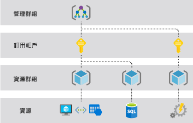

# Azure Resource Manager 概觀

Azure Resource Manager 是 Azure 的部署和管理服務。 其提供管理層，可讓您建立、更新和刪除您 Azure 訂用帳戶中的資源。 您可以使用存取控制、鎖定和標記等管理功能，在部署後保護及組織您的資源。

若要了解 Azure Resource Manager 範本，請參閱[範本部署概觀](template-deployment-overview.md)。

## 一致的管理層

當使用者從任何 Azure 工具、API 或 SDK 傳送要求時，Resource Manager 就會收到要求。 其會驗證並授權要求。 Resource Manager 會將要求傳送至 Azure 服務，而該服務會接受要求的動作。 因為所有要求都是透過相同的 API 來處理，所以您會在所有不同工具中看到一致的結果和功能。

下圖顯示處理 Azure 要求時，Azure Resource Manager 所扮演的角色。 

透過 PowerShell、Azure CLI、REST API 和用戶端 SDK 也可以使用入口網站中的所有可用功能。 一開始透過 API 發行的功能將會在初次發行的 180 天內呈現在入口網站中。

## 術語

如果您不熟悉 Azure Resource Manager，則您可能不熟悉一些詞彙。

* **資源** - 透過 Azure 提供的可管理項目。 虛擬機器、儲存體帳戶、Web 應用程式、資料庫和虛擬網路都是資源範例。
* **資源群組** - 保留 Azure 方案相關資源的容器。 資源群組包含您要以群組的形式管理的資源。 您可根據對組織最有利的方式，決定哪些資源要放置到資源群組。 請參閱 [資源群組](#resource-groups)。
* **資源提供者** - 提供 Azure 資源的服務。 例如，Microsoft.Compute 是常見的資源提供者，可提供虛擬機器資源。 Microsoft.Storage 是另一個常見的資源提供者。 請參閱[資源提供者和類型](resource-manager-supported-services.md)。
* **Resource Manager 範本** - JavaScript 物件標記法 (JSON) 檔案，可定義一或多個要部署至資源群組或訂用帳戶的資源。 範本可用來以一致性方式重複部署資源。 請參閱[範本部署概觀](template-deployment-overview.md)。
* **宣告式語法** - 可讓您陳述「以下是我想要建立的項目」而不需要撰寫一連串程式設計命令來加以建立的語法。 Resource Manager 範本便是宣告式語法的其中一個範例。 在該檔案中，您可以定義要部署至 Azure 之基礎結構的屬性。  請參閱[範本部署概觀](template-deployment-overview.md)。

## 使用 Resource Manager 的優點

搭配 Resource Manager，您可以：

* 透過宣告式範本而非指令碼來管理基礎結構。

* 以群組形式部署、管理及監視方案的所有資源，而不是個別處理這些資源。

* 在整個開發週期上重新部署方案，並確信您的資源會部署在一致的狀態中。

* 定義之間的相依性，使得以正確的順序部署資源。

* 因為角色型存取控制 (RBAC) 會原生整合至管理平台，請將存取控制套用至資源群組中的所有服務。

* 將標籤套用至資源，以便以邏輯方式組織訂用帳戶中的所有資源。

* 檢視共用相同標籤之資源群組的成本，以釐清您的組織的計費方式。

## 了解範圍

Azure 提供四個範圍層級：[管理群組](../governance/management-groups/index.md)、訂用帳戶、[資源群組](#resource-groups)和資源。 下圖顯示這些層級的範例。

您可以在任何範圍層級套用管理設定。 您選取的層級會決定套用設定的範圍。 較低層級會從較高層級繼承設定。 例如，當您將[原則](../governance/policy/overview.md)套用到訂用帳戶時，訂用帳戶中的所有資源群組和資源都會套用該原則。 當您在資源群組上套用原則時，資源群組及其所有資源都會套用該原則。 不過，另一個資源群組沒有該原則指派。

您可以將範本部署至管理群組、訂用帳戶或資源群組。

## 資源群組

定義資源群組時，必須考慮一些重要因素：

* 群組中的所有資源應該共用相同的生命週期。 您可一起部署、更新和刪除它們。 如果類似資料庫伺服器這樣的資源必須存在於不同的部署週期，它應該位於另一個資源群組中。

* 每個資源只能存在於一個資源群組中。

* 您可以隨時在資源群組中新增或移除資源。

* 您可以將資源從一個資源群組移動到另一個群組。 如需詳細資訊，請參閱 [將資源移動到新的資源群組或訂用帳戶](resource-group-move-resources.md)。

* 資源群組可以包含位於不同區域的資源。

* 資源群組可以用來設定系統管理動作的存取控制範圍。

* 資源可與其他資源群組中的資源互動。 此互動常見於兩個資源彼此連結，但未共用相同的生命週期 (例如，連接至某個資料庫的 Web 應用程式) 時。

建立資源群組時，您需要提供該資源群組的位置。 您可能會想：「為什麼資源群組需要位置？ 而且，如果資源可以有不同於資源群組的位置，為什麼資源群組位置這麼重要？」 資源群組會儲存資源相關中繼資料。 當您指定資源群組的位置時，您便是指定中繼資料的儲存位置。 基於相容性理由，您可能需要確保您的資料存放在特定區域中。

如果資源群組的區域暫時無法使用，您就無法更新資源群組中的資源，因為中繼資料無法使用。 其他區域中的資源仍可如預期般運作，但您無法更新這些資源。 如需如何建置可靠應用程式的詳細資訊，請參閱[設計可靠的 Azure 應用程式](/azure/architecture/reliability/)。

## Azure Resource Manager 的復原

Azure Resource Manager 服務專門設計來提供復原和持續可用性。 REST API 中的 Resource Manager 和控制平面作業 (傳送給 management.azure.com 的要求)：

* 會跨區域分散。 有些服務是區域性的。

* 會在有多個可用性區域的位置中跨可用性區域 (以及區域) 分散。

* 不依賴單一邏輯資料中心。

* 永遠不會停機進行維護活動。

這項復原能力適用於透過 Resource Manager 接收要求的服務。 例如，Key Vault 便會受惠於這項復原能力。

## 後續步驟

* 針對資源提供者提供的所有作業，請參閱 [Azure REST API](/rest/api/azure/)。

* 若要了解如何移動資源，請參閱[將資源移動到新的資源群組或訂用帳戶](resource-group-move-resources.md)。

* 若要了解如何標記資源，請參閱 [使用標記來組織 Azure 資源](resource-group-using-tags.md)。

* 若要了解鎖定資源，請參閱[鎖定資源以防止非預期的變更](resource-group-lock-resources.md)。

* 如需有關建立部署範本的資訊，請參閱[範本部署概觀](template-deployment-overview.md)。
