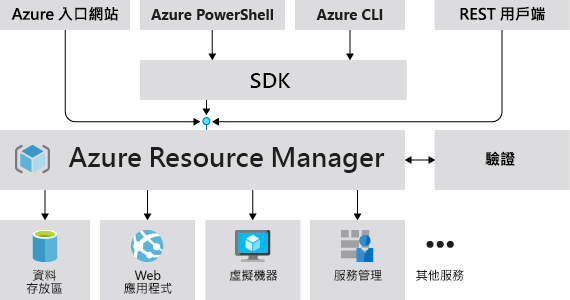
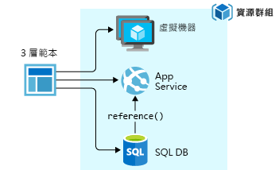
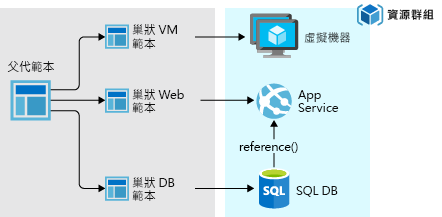
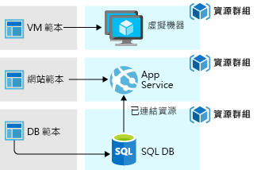

# <a name="azure-resource-manager-overview"></a>Azure Resource Manager 概觀

Azure Resource Manager 是 Azure 的部署和管理服務。 其提供一致的管理層，可讓您建立、更新和刪除您 Azure 訂用帳戶中的資源。 您可以使用其存取控制、稽核和標記功能，在部署後保護及組織您的資源。

當您透過入口網站、PowerShell、Azure CLI、REST API 或用戶端 SDK 採取動作時，Azure Resource Manager API 會處理您的要求。 因為所有要求都是透過相同的 API 來處理，所以您會在所有不同工具中看到一致的結果和功能。 透過 PowerShell、Azure CLI、REST API 和用戶端 SDK 也可以使用入口網站中的所有可用功能。 一開始透過 API 發行的功能將會在初次發行的 180 天內呈現在入口網站中。

下圖顯示這些工具如何與 Azure Resource Manager API 互動。 API 將要求傳遞給 Resource Manager 服務，由其驗證和授權要求。 然後，Resource Manager 將要求路由傳送到適當的服務。



## <a name="terminology"></a>術語

如果您不熟悉 Azure Resource Manager，則您可能不熟悉一些詞彙。

* **資源** - 透過 Azure 提供的可管理項目。 虛擬機器、儲存體帳戶、Web 應用程式、資料庫和虛擬網路都是資源範例。
* **資源群組** - 保留 Azure 方案相關資源的容器。 資源群組包含您要以群組的形式管理的資源。 您可決定如何根據對組織最有利的方式，將資源配置到資源群組。 請參閱 [資源群組](#resource-groups)。
* **資源提供者** - 提供 Azure 資源的服務。 例如，**Microsoft.Compute** 是常見的資源提供者，可提供虛擬機器資源。 **Microsoft.Storage** 是另一個常見的資源提供者。 請參閱 [資源提供者](#resource-providers)。
* **Resource Manager 範本** - JavaScript 物件標記法 (JSON) 檔案，可定義一或多個要部署至資源群組或訂用帳戶的資源。 範本可用來以一致性方式重複部署資源。 請參閱 [範本部署](#template-deployment)。
* **宣告式語法** - 可讓您陳述「以下是我想要建立的項目」而不需要撰寫一連串程式設計命令來加以建立的語法。 Resource Manager 範本便是宣告式語法的其中一個範例。 在該檔案中，您可以定義要部署至 Azure 之基礎結構的屬性。

## <a name="the-benefits-of-using-resource-manager"></a>使用 Resource Manager 的優點

Resource Manager 會提供數個優點：

* 您可以以群組形式部署、管理及監視方案的所有資源，而不是個別處理這些資源。
* 您可以在整個方案週期重複部署方案，並確信您的資源會部署在一致的狀態中。
* 您可以透過宣告式範本而非指令碼來管理基礎結構。
* 您可以定義之間的相依性，使得以正確的順序部署資源。
* 因為角色型存取控制 (RBAC) 會原生整合至管理平台，您可以將存取控制套用至資源群組中的所有服務。
* 您可以將標籤套用至資源，以便以邏輯方式組織訂用帳戶中的所有資源。
* 您可以檢視共用相同標籤之資源群組的成本，以釐清您的組織的計費方式。

## <a name="guidance"></a>指引
下列建議可協助您在使用您的方案時充分利用 Resource Manager。

* 透過 Resource Manager 範本中的宣告式語法定義和部署基礎結構，而非透過命令式指令。
* 在範本中定義所有的部署和設定步驟。 您在設定方案時應該沒有手動步驟。
* 執行命令式指令來管理您的資源，例如啟動或停止應用程式或機器。
* 利用與資源群組中相同的生命週期排列資源。 將標記用於資源的所有其他組織方式。

如需關於企業如何使用 Resource Manager 有效地管理訂用帳戶的指引，請參閱 [Azure 企業 Scaffold - 規定的訂用帳戶治理](/azure/architecture/cloud-adoption-guide/subscription-governance?toc=%2fazure%2fazure-resource-manager%2ftoc.json)。

如需建立 Resource Manager 範本的建議，請參閱 [Azure Resource Manager 範本最佳做法](template-best-practices.md)。

## <a name="resource-groups"></a>資源群組
定義資源群組時，必須考慮一些重要因素：

* 群組中的所有資源應該共用相同的生命週期。 您可一起部署、更新和刪除它們。 如果類似資料庫伺服器這樣的資源必須存在於不同的部署週期，它應該位於另一個資源群組中。
* 每個資源只能存在於一個資源群組中。
* 您可以隨時在資源群組中新增或移除資源。
* 您可以將資源從一個資源群組移動到另一個群組。 如需詳細資訊，請參閱 [將資源移動到新的資源群組或訂用帳戶](resource-group-move-resources.md)。
* 資源群組可以包含位於不同區域的資源。
* 資源群組可以用來設定系統管理動作的存取控制範圍。
* 資源可與其他資源群組中的資源互動。 此互動常見於兩個資源彼此連結，但未共用相同的生命週期 (例如，連接至某個資料庫的 Web 應用程式) 時。

建立資源群組時，您需要提供該資源群組的位置。 您可能會想：「為什麼資源群組需要位置？ 而且，如果資源可以有不同於資源群組的位置，為什麼資源群組位置這麼重要？」 資源群組會儲存資源相關中繼資料。 因此，當您指定資源群組的位置時，您便是指定中繼資料的儲存位置。 基於相容性理由，您可能需要確保您的資料存放在特定區域中。

## <a name="resource-providers"></a>資源提供者

每個資源提供者都會提供一組資源和作業，以便能運用這些資源。 例如，如果想要儲存金鑰和密碼，您會使用 **Microsoft.KeyVault** 資源提供者。 此資源提供者會提供稱為**保存庫**的資源類型來建立金鑰保存庫。

資源類型名稱的格式：**{resource-provider}/{resource-type}**。 金鑰保存庫的資源類型是 **Microsoft.KeyVault/vaults**。

在開始部署資源之前，您應該先了解可用的資源提供者。 了解資源提供者和資源的名稱可協助您定義想要部署至 Azure 的資源。 此外，您需要知道有效的位置，以及每個資源類型的 API 版本。 如需詳細資訊，請參閱[資源提供者和類型](resource-manager-supported-services.md)。

針對資源提供者提供的所有作業，請參閱 [Azure REST API](/rest/api/azure/)。

## <a name="template-deployment"></a>範本部署

利用 Resource Manager，您可以建立可定義 Azure 方案之基礎結構和組態的範本 (以 JSON 格式)。 透過範本，您可以在整個生命週期中重複部署方案，並確信您的資源會以一致的狀態部署。

若要了解範本格式和其建構方式，請參閱[了解 Azure Resource Manager 範本的結構和語法](resource-group-authoring-templates.md)。 若要檢視資源類型的 JSON 語法，請參閱[在 Azure Resource Manager 範本中定義資源](/azure/templates/)。

Resource Manager 處理範本的方式會和處理其他任何要求一樣。 它會剖析範本，並將其語法轉換成適當的資源提供者所需的 REST API 作業。 例如，當 Resource Manager 收到具有下列資源定義的範本︰

```json
"resources": [
  {
    "apiVersion": "2016-01-01",
    "type": "Microsoft.Storage/storageAccounts",
    "name": "mystorageaccount",
    "location": "westus",
    "sku": {
      "name": "Standard_LRS"
    },
    "kind": "Storage",
    "properties": {
    }
  }
]
```

它會將定義轉換成下列 REST API 作業，該作業會再傳送給 Microsoft.Storage 資源提供者︰

```HTTP
PUT
https://management.azure.com/subscriptions/{subscriptionId}/resourceGroups/{resourceGroupName}/providers/Microsoft.Storage/storageAccounts/mystorageaccount?api-version=2016-01-01
REQUEST BODY
{
  "location": "westus",
  "properties": {
  }
  "sku": {
    "name": "Standard_LRS"
  },
  "kind": "Storage"
}
```

範本和資源群組的定義方式全由您決定，方案的管理方式也是如此。 比方說，您可以透過單一範本在單一資源群組中部署三層式應用程式。



但您不需要在單一的範本中定義整個基礎結構。 通常的合理作法是將您的部署需求分成一組有目標及特定目的的範本。 您可以輕鬆地將這些份本重複使用於不同的方案。 若要部署特定的方案，您會建立連結所有必要範本的主版範本。 下圖顯示如何透過包含三個巢狀範本的父範本部署三層式方案。



如果您想像的階層有不同的生命週期，您可以將這三個階層部署到不同的資源群組。 請注意，資源仍可連結至其他資源群組中的資源。



如需巢狀範本的相關資訊，請參閱[透過 Azure Resource Manager 使用連結的範本](resource-group-linked-templates.md)。

Azure Resource Manager 會分析相依性，確保以正確的順序建立資源。 如果某個資源依賴另一個資源的值 (例如需要儲存體帳戶以供磁碟使用的虛擬機器)，您必須設定相依性。 如需詳細資訊，請參閱 [定義 Azure Resource Manager 範本中的相依性](resource-group-define-dependencies.md)。

您也可以使用範本進行基礎結構的更新。 例如，您可以將資源新增至您的方案，並將組態規則新增至已部署的資源。 如果此範本定義的資源已經存在，則 Resource Manager 會更新現有資源，而不是建立新資產。

當您需要其他作業 (例如安裝不包含在安裝程式的特定軟體) 時，Resource Manager 會提供案例的延伸模組。 如果您已經使用組態管理服務，例如 DSC、Chef 或 Puppet，您可以透過使用擴充功能繼續使用該服務。 如需虛擬機器擴充功能的相關資訊，請參閱[有關虛擬機器擴充功能和功能](../virtual-machines/windows/extensions-features.md?toc=%2fazure%2fvirtual-machines%2fwindows%2ftoc.json)。

當您從入口網站建立方案，方案會自動包含部署範本。 您不必從頭建立您的範本，因為您可以從方案的範本開始，並自訂範本以符合您的特定需求。 如需範例，請參閱[快速入門：使用 Azure 入口網站建立及部署 Azure Resource Manager 範本](./resource-manager-quickstart-create-templates-use-the-portal.md)。 亦可匯出資源群組的目前狀態，或檢視特定部署所用的範本，以擷取現有資源群組的範本。 檢視[匯出的範本](./manage-resource-groups-portal.md#export-resource-groups-to-templates)有助於了解範本語法。

最後，範本會成為應用程式原始碼的一部分。 您可以檢查您的原始程式碼存放庫，並隨著您的應用程式發展加以更新。 您可以透過 Visual Studio 編輯範本。

在定義範本之後，您就可以開始將資源部署至 Azure。 若要部署資源，請參閱：

* [使用 Resource Manager 範本與 Azure PowerShell 來部署資源](resource-group-template-deploy.md)
* [使用 Resource Manager 範本與 Azure CLI 部署資源](resource-group-template-deploy-cli.md)
* [使用 Resource Manager 範本與 Azure 入口網站來部署資源](resource-group-template-deploy-portal.md)
* [使用 Resource Manager 範本和 Resource Manager REST API 部署資源](resource-group-template-deploy-rest.md)

## <a name="safe-deployment-practices"></a>安全部署實務

當您在將複雜的服務部署到 Azure 時，您可能需要將服務部署到多個區域，並且在進行下一步之前，先檢查其健康情況。 使用 [Azure 部署管理員](deployment-manager-overview.md)來協調服務的分段推出。 透過將服務分段推出，您可以在服務部署到所有區域之前，先找出潛在的問題。 如果您不需要這些預防措施，則上一節中的部署作業會是比較好的選項。

Deployment Manager 目前為個人預覽版。

[!INCLUDE [arm-tutorials-quickstarts](../../includes/resource-manager-tutorials-quickstarts.md)]

## <a name="next-steps"></a>後續步驟

在本文中，您已了解如何使用 Azure Resource Manager 在 Azure 上進行資源的部署、管理及存取控制。 請繼續前往下一篇文章，以了解如何建立第一個 Azure Resource Manager 範本。

> [!div class="nextstepaction"]
> [快速入門：使用 Azure 入口網站建立及部署 Azure Resource Manager 範本](./resource-manager-quickstart-create-templates-use-the-portal.md)
