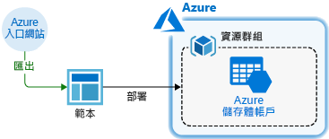
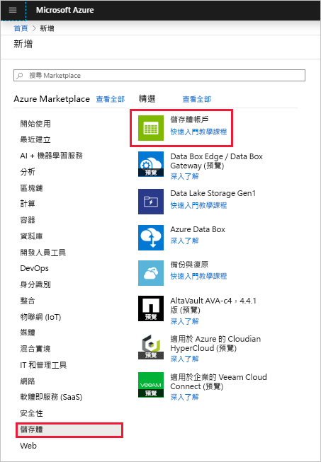
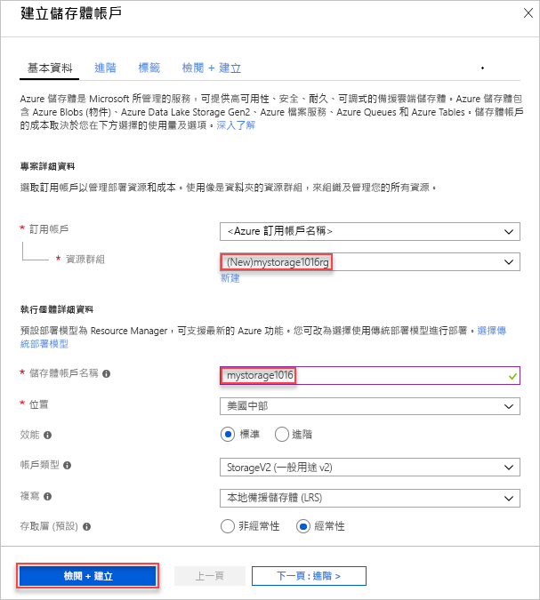
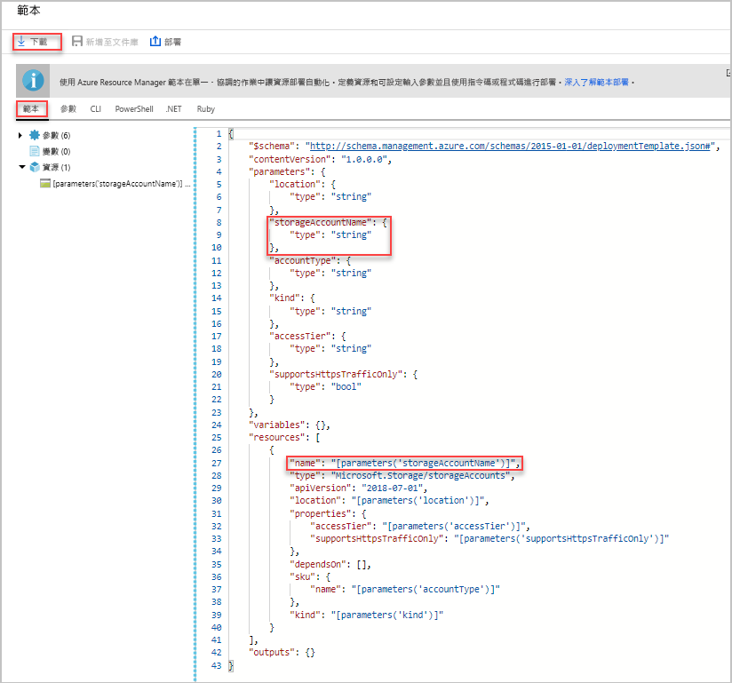
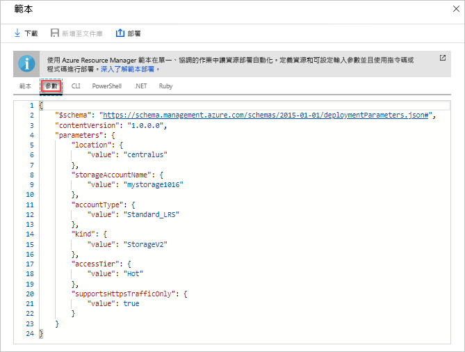
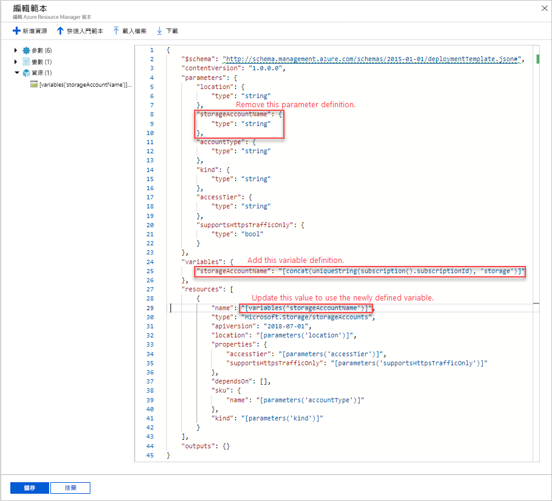
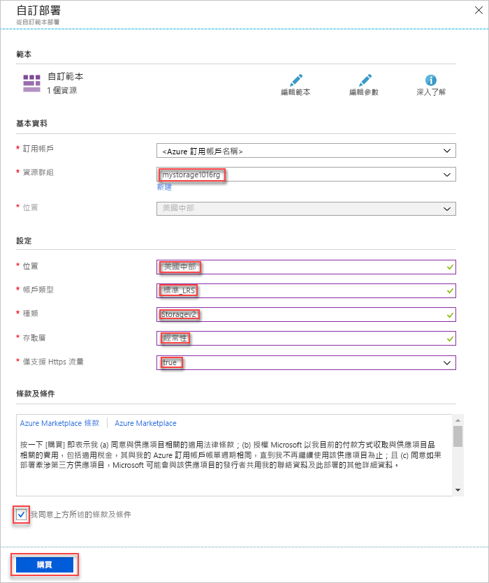
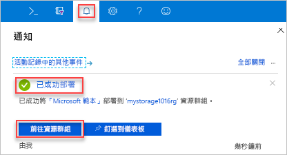
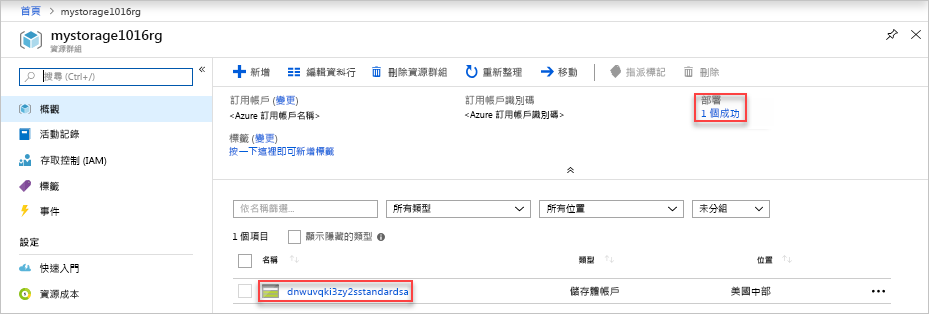

# <a name="quickstart-create-and-deploy-azure-resource-manager-templates-by-using-the-azure-portal"></a>快速入門：使用 Azure 入口網站建立及部署 Azure Resource Manager 範本

了解如何使用 Azure 入口網站產生 Resource Manager 範本，以及從入口網站編輯和部署該範本的程序。 Resource Manager 範本是 JSON 檔案，該檔案定義您需要為您的解決方案部署的資源。 若要了解部署和管理 Azure 解決方案的相關概念，請參閱 [Azure Resource Manager 概觀](resource-group-overview.md)。



完成教學課程之後，您就可以部署 Azure 儲存體帳戶。 相同的程序也可用來部署其他 Azure 資源。

如果您沒有 Azure 訂用帳戶，請在開始之前先[建立免費帳戶](https://azure.microsoft.com/free/)。

## <a name="generate-a-template-using-the-portal"></a>使用入口網站產生範本

從頭開始建立 Resource Manager 範本不是簡單的工作，尤其是當您不熟悉 Azure 部署及 JSON 格式時，更是如此。 您可以使用 Azure 入口網站來設定 Azure 儲存體帳戶等資源。 在部署資源之前，您可以先將組態匯入 Resource Manager 範本。 您可以儲存範本，並在未來重複加以使用。

許多有經驗的範本開發人員會在嘗試部署不熟悉的 Azure 資源時，使用此方法來產生範本。 如需如何使用入口網站匯出範本的詳細資訊，請參閱[將資源群組匯出至範本](./manage-resource-groups-portal.md#export-resource-groups-to-templates)。 尋找可行範本的另一種方法是在 [Azure 快速入門範本](https://azure.microsoft.com/resources/templates/)中尋找。

1. 登入 [Azure 入口網站](https://portal.azure.com)。
2. 選取 [建立資源] > [儲存體] > [儲存體帳戶 - Blob、檔案、資料表、佇列]。

    
3. 輸入以下資訊：

    |Name|值|
    |----|----|
    |**資源群組**|選取 [新建] 並指定您所選擇的資源群組名稱。 在螢幕擷取畫面上，資源群組名稱為 mystorage1016rg。 資源群組是 Azure 資源的容器。 資源群組可讓您更輕鬆地管理 Azure 資源。 |
    |**名稱**|為儲存體帳戶指定唯一名稱。 儲存體帳戶名稱必須是整個 Azure 中的唯一名稱，並只包含小寫字母和數字。 名稱必須介於 3 到 24 個字元之間。 如果您收到錯誤訊息指出「儲存體帳戶名稱 'mystorage1016' 已有人使用"」，請嘗試使用 **&lt;您的名稱>storage&lt;MMDD 格式的今天日期>**，例如 **johndolestorage1016**。 如需詳細資訊，請參閱[命名規則和限制](/azure/architecture/best-practices/naming-conventions#naming-rules-and-restrictions)。|

    您可以對其餘屬性使用預設值。

    

    > [!NOTE]
    > 部分已匯出的範本必須先進行某些編輯才可供部署。

4. 選取螢幕底部的 [檢閱 + 建立]。 在下一個步驟中，請不要選取 [建立]。
5. 選取螢幕底部的 [下載範本以便自動化]。 入口網站會顯示所產生的範本：

    

    主窗格會顯示範本。 這是具有六個最上層元素的 JSON 檔案 - `schema`、`contentVersion`、`parameters`、`variables`、`resources` 和 `output`。 如需詳細資訊，請參閱[了解 Azure Resource Manager 範本的結構和語法](./resource-group-authoring-templates.md)

    已定義六個參數。 其中一個稱為**storageAccountName**。 在上述螢幕擷取畫面中，第二個醒目提示的部分會示範如何參考範本中的這個參數。 在下一節中，您會編輯此範本，以使用為儲存體帳戶所產生的名稱。

    範本中已定義一個 Azure 資源。 類型是 `Microsoft.Storage/storageAccounts`。 請查看該資源的定義方式，以及定義結構。
6. 從畫面頂端選取 [下載]。 
7. 開啟下載的 zip 檔案，然後將 **template.json** 儲存到您的電腦。 在下一節中，您會使用範本部署工具來編輯範本。
8. 選取 [參數] 索引標籤，查看您所提供的參數值。 記下這些值，您在下一節中部署範本時需要用到。

    

    您可以同時使用範本檔案和參數檔案來建立資源，也就是此教學課程中的 Azure 儲存體帳戶。

## <a name="edit-and-deploy-the-template"></a>編輯和部署範本

Azure 入口網站可用來執行一些基本範本編輯作業。 在本快速入門中，您會使用名為「範本部署」的入口網站工具。 由於本教學課程中使用「範本部署」，因此您可以使用一個介面 (Azure 入口網站) 來完成整個教學課程。 若要編輯更複雜的範本，請考慮使用提供更多樣化編輯功能的 [Visual Studio Code](./resource-manager-quickstart-create-templates-use-visual-studio-code.md)。

Azure 會要求每個 Azure 服務都必須有唯一名稱。 如果您輸入已存在的儲存體帳戶名稱，部署可能會失敗。 若要避免發生此問題，您可以將範本修改為使用範本函式呼叫 `uniquestring()`，以產生唯一的儲存體帳戶名稱。

1. 在 Azure 入口網站中，選取 [建立資源]。
2. 在 [搜尋 Marketplace] 中，輸入**範本部署**，然後按 **ENTER**。
3. 選取 [範本部署]。

    
4. 選取 [建立] 。
5. 選取 [在編輯器中組建您自己的範本]。
6. 選取 [載入檔案]，然後依照指示來載入您在上一節中下載的 template.json。
7. 對範本進行下列三項變更：

    

   - 移除 **storageAccountName** 參數，如先前的螢幕擷取畫面所示。
   - 新增名為 **storageAccountName** 的變數，如先前的螢幕擷取畫面所示：

       ```json
       "storageAccountName": "[concat(uniqueString(subscription().subscriptionId), 'storage')]"
       ```

       此處使用兩個範本函式：`concat()` 和 `uniqueString()`。
   - 更新 **Microsoft.Storage/storageAccounts** 資源的名稱元素，以使用新定義的變數，而不使用參數：

       ```json
       "name": "[variables('storageAccountName')]",
       ```

     最終範本應顯示如下：

     ```json
     {
       "$schema": "https://schema.management.azure.com/schemas/2015-01-01/deploymentTemplate.json#",
       "contentVersion": "1.0.0.0",
       "parameters": {
           "location": {
               "type": "string"
           },
           "accountType": {
               "type": "string"
           },
           "kind": {
               "type": "string"
           },
           "accessTier": {
               "type": "string"
           },
           "supportsHttpsTrafficOnly": {
               "type": "bool"
           }
       },
       "variables": {
           "storageAccountName": "[concat(uniqueString(subscription().subscriptionId), 'storage')]"
       },
       "resources": [
           {
               "name": "[variables('storageAccountName')]",
               "type": "Microsoft.Storage/storageAccounts",
               "apiVersion": "2018-07-01",
               "location": "[parameters('location')]",
               "properties": {
                   "accessTier": "[parameters('accessTier')]",
                   "supportsHttpsTrafficOnly": "[parameters('supportsHttpsTrafficOnly')]"
               },
               "dependsOn": [],
               "sku": {
                   "name": "[parameters('accountType')]"
               },
               "kind": "[parameters('kind')]"
           }
       ],
       "outputs": {}
     }
     ```
8. 選取 [ **儲存**]。
9. 輸入下列值：

    |Name|值|
    |----|----|
    |**資源群組**|選取您在上一節中建立的資源群組名稱。 |
    |**位置**|選取儲存體帳戶的位置。 例如，**美國中部**。 |
    |**帳戶類型**|在本快速入門中請輸入 **Standard_LRS**。 |
    |**種類**|在本快速入門中請輸入 **StorageV2**。 |
    |**存取層**|在本快速入門中請輸入 **Hot**。 |
    |**僅啟用 HTTPS 流量**| 在本快速入門中請選取 **true**。 |
    |**我同意上方所述的條款及條件**|(選取)|

    以下是範例部署的螢幕擷取畫面：

    

10. 選取 [購買]。
11. 從畫面頂端選取鈴鐺圖示 (通知)，以查看部署狀態。 您應該會看到 [部署進行中]。 請等候部署完成。

    

12. 在 [通知] 窗格中選取 [移至資源群組]。 您應該會看到類似下方的畫面：

    

    您可以看到部署狀態為成功，且資源群組中只有一個儲存體帳戶。 儲存體帳戶名稱是範本所產生的唯一字串。 若要深入了解使用 Azure 儲存體帳戶的相關資訊，請參閱[快速入門：使用 Azure 入口網站上傳、下載及列出 Blob](../storage/blobs/storage-quickstart-blobs-portal.md)。

## <a name="clean-up-resources"></a>清除資源

不再需要 Azure 資源時，可藉由刪除資源群組來清除您所部署的資源。

1. 在 Azure 入口網站中，選取左側功能表上的 [資源群組]。
2. 在 [依名稱篩選] 欄位中輸入資源群組名稱。
3. 選取資源群組名稱。  您應該會看到資源群組中的儲存體帳戶。
4. 選取頂端功能表中的 [刪除資源群組]。

## <a name="next-steps"></a>後續步驟

在本教學課程中，您已了解如何從 Azure 入口網站產生範本，以及如何使用入口網站部署範本。 本快速入門中使用的範本，是具有單一 Azure 資源的簡單範本。 如果是複雜的範本，則使用 Visual Studio Code 或 Visual Studio 會較容易開發範本。 下一個快速入門也會說明如何使用 Azure PowerShell 和 Azure 命令列介面 (CLI) 來部署範本。

> [!div class="nextstepaction"]
> [使用 Visual Studio Code 建立範本](./resource-manager-quickstart-create-templates-use-visual-studio-code.md)
