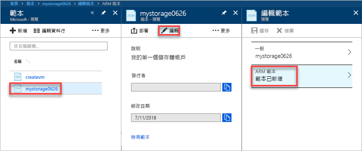

# <a name="quickstart-create-and-deploy-azure-resource-manager-templates-by-using-the-azure-portal"></a>快速入門：使用 Azure 入口網站建立及部署 Azure Resource Manager 範本

了解如何使用 Azure 入口網站產生並建立您的第一個 Azure Resource Manager 範本，以及如何從入口網站編輯和部署該範本。

Resource Manager 範本是 JSON 檔案，該檔案定義您需要為您的解決方案部署的資源。 若要建立範本，您不一定要從頭開始。 在本教學課程中，您將了解如何從 Azure 入口網站產生範本。 接著，您可以自訂範本並加以部署。

本教學課程中的指示會建立 Azure 儲存體帳戶。 您可以使用相同的程序來建立其他 Azure 資源。

如果您沒有 Azure 訂用帳戶，請在開始之前先[建立免費帳戶](https://azure.microsoft.com/free/)。

## <a name="generate-a-template-using-the-portal"></a>使用入口網站產生範本

在本節中，您會使用 Azure 入口網站建立儲存體帳戶。 在部署儲存體帳戶之前，您可以選擇根據組態瀏覽入口網站所產生的範本。 您可以儲存範本，並在未來重複加以使用。

1. 登入 [Azure 入口網站](https://portal.azure.com)。
2. 選取 [建立資源] > [儲存體] > [儲存體帳戶 - Blob、檔案、資料表、佇列]。

    
3. 輸入以下資訊： 在下一個步驟中請務必選取 [自動化選項] 而不是 [建立]，以便在範本部署之前先加以檢視。

    - **名稱**：為儲存體帳戶指定唯一名稱。 在螢幕擷取畫面上，名稱為 *mystorage0626*。
    - **資源群組**：以您選擇的名稱建立新的 Azure 資源群組。 在螢幕擷取畫面上，資源群組名稱為 *mystorage0626rg*。

    您可以對其餘屬性使用預設值。

    

    > [!NOTE]
    > 部分已匯出的範本必須先進行某些編輯才可供部署。

4. 選取畫面底部的 [自動化選項]。 入口網站會在 [範本] 索引標籤上顯示範本：

    

    主窗格會顯示範本。 這是具有四個最上層元素的 JSON 檔案。 如需詳細資訊，請參閱[了解 Azure Resource Manager 範本的結構和語法](./resource-group-authoring-templates.md)

    在 [參數] 元素下方，有五個已定義的參數。 若要查看您在部署期間提供的值，請選取 [參數] 索引標籤。

    

    這些值就是您在上一節中設定的值。 您可以同時使用範本和參數檔案，來建立 Azure 儲存體帳戶。

5. 在索引標籤頂端，有三個功能表項目：

    - **下載**：將範本和參數檔案下載到您的本機電腦。
    - **新增至程式庫**：將範本新增至程式庫，以供日後重複使用。
    - **部署**：將 Azure 儲存體帳戶部署至 Azure。

    在本教學課程中，您會使用 [新增至程式庫] 選項。

6. 選取 [新增至程式庫]。
7. 輸入 [名稱] 和 [描述]，然後選取 [儲存]。

> [!NOTE]
> 範本程式庫功能處於預覽狀態。 大部分的人會選擇將其範本儲存至本機電腦或公用儲存體，例如 Github。  

## <a name="edit-and-deploy-the-template"></a>編輯和部署範本

在本節中，您會從範本程式庫中開啟已儲存的範本、在入口網站中編輯範本，並部署修改過的範本。 若要編輯更複雜的範本，請考慮使用提供更多樣化編輯功能的 Visual Studio Code。

1. 在 Azure 入口網站中，從左側功能表中選取 [所有服務]，在篩選方塊中輸入**範本**，然後選取 [範本 (預覽)]。

    
2. 選取您在上一節中儲存的範本。 螢幕擷取畫面上使用的名稱是 *mystorage0626*。
3. 選取 [編輯]，然後選取 [範本已新增]。

    

4. 新增**變數**元素，然後新增一個變數，如下列螢幕擷取畫面所示：

    ```json
    "variables": {
        "storageAccountName": "[concat(uniquestring(resourceGroup().id), 'standardsa')]"
    },
    ```
    

    此處使用兩個函式：*concat()* 和 *uniqueString()*。 uniqueString() 可協助您建立資源的唯一名稱。

5. 移除在先前的螢幕擷取畫面中醒目提示的**名稱**參數。
6. 更新 **Microsoft.Storage/storageAccounts** 資源的名稱元素，以使用新定義的變數，而不使用參數：

    ```json
    "name": "[variables('storageAccountName')]",
    ```

    最終範本應顯示如下：

    ```json
    {
        "$schema": "https://schema.management.azure.com/schemas/2015-01-01/deploymentTemplate.json#",
        "contentVersion": "1.0.0.0",
        "parameters": {
            "location": {
                "type": "string"
            },
            "accountType": {
                "type": "string"
            },
            "kind": {
                "type": "string"
            },
            "httpsTrafficOnlyEnabled": {
                "type": "bool"
            }
        },
        "variables": {
            "storageAccountName": "[concat(uniquestring(resourceGroup().id), 'standardsa')]"
        },
        "resources": [
            {
                "apiVersion": "2018-02-01",
                "name": "[variables('storageAccountName')]",
                "location": "[parameters('location')]",
                "type": "Microsoft.Storage/storageAccounts",
                "sku": {
                    "name": "[parameters('accountType')]"
                },
                "kind": "[parameters('kind')]",
                "properties": {
                    "supportsHttpsTrafficOnly": "[parameters('httpsTrafficOnlyEnabled')]",
                    "encryption": {
                        "services": {
                            "blob": {
                                "enabled": true
                            },
                            "file": {
                                "enabled": true
                            }
                        },
                        "keySource": "Microsoft.Storage"
                    }
                },
                "dependsOn": []
            }
        ]
    }
    ```
7. 選取 [確定]，然後選取 [儲存] 以儲存變更。
8. 選取 [部署]。
9. 輸入下列值：

    - **訂用帳戶**：選取您的 Azure 訂用帳戶。
    - **資源群組**：將您的資源群組命名為唯一名稱。
    - **位置**：選取資源群組的位置。
    - **位置**：選取儲存體帳戶的位置。  您可以使用與資源群組相同的位置。
    - **帳戶類型**：在本快速入門中請輸入 **Standard_LRS**。
    - **種類**：在本快速入門中請輸入**儲存體**。
    - **僅啟用 HTTPS 流量**。  在本快速入門中請選取 **false**。
    - **我同意上方所述的條款及條件**：(選取)

    以下是範例部署的螢幕擷取畫面：

    

10. 選取 [購買]。
11. 從畫面頂端選取鈴鐺圖示 (通知)，以查看部署狀態。

## <a name="clean-up-resources"></a>清除資源

不再需要 Azure 資源時，可藉由刪除資源群組來清除您所部署的資源。

1. 在 Azure 入口網站中，選取左側功能表上的 [資源群組]。
2. 在 [依名稱篩選] 欄位中輸入資源群組名稱。
3. 選取資源群組名稱。  您應該會看到資源群組中的儲存體帳戶。
4. 選取頂端功能表中的 [刪除資源群組]。

## <a name="next-steps"></a>後續步驟

在本教學課程中，您已了解如何從 Azure 入口網站產生範本，以及如何使用入口網站部署範本。 本快速入門中使用的範本，是具有單一 Azure 資源的簡單範本。 如果是複雜的範本，則使用 Visual Studio Code 或 Visual Studio 會較容易開發範本。

> [!div class="nextstepaction"]
> [使用 Visual Studio Code 建立範本](./resource-manager-quickstart-create-templates-use-visual-studio-code.md)
