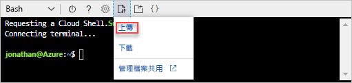
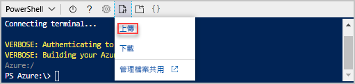

# <a name="quickstart-create-azure-resource-manager-templates-by-using-visual-studio-code"></a>快速入門：使用 Visual Studio Code 建立 Azure Resource Manager 範本

了解如何使用 Visual Studio Code 和 Azure Resource Manager Tools 擴充功能來建立及編輯 Azure Resource Manager 範本。 不需使用擴充功能，即可在 Visual Studio Code 中建立 Resource Manager 範本，但擴充功能會提供可簡化範本開發的自動完成選項。 若要了解部署和管理 Azure 解決方案的相關概念，請參閱 [Azure Resource Manager 概觀](resource-group-overview.md)。

如果您沒有 Azure 訂用帳戶，請在開始之前先[建立免費帳戶](https://azure.microsoft.com/free/)。

## <a name="prerequisites"></a>必要條件

若要完成本文，您需要：

- [Visual Studio Code](https://code.visualstudio.com/)。
- Resource Manager Tools 擴充功能。 若要安裝，請使用下列步驟：

    1. 開啟 Visual Studio Code。
    2. 按 **CTRL+SHIFT+X** 以開啟 [擴充功能] 窗格
    3. 搜尋 [Azure Resource Manager Tools]，然後選取 [安裝]。
    4. 選取 [重新載入] 以完成擴充功能安裝。

## <a name="open-a-quickstart-template"></a>開啟快速入門範本

您可以從 [Azure 快速入門範本](https://azure.microsoft.com/resources/templates/)開啟範本，而無須從頭建立範本。 Azure 快速入門範本是 Resource Manager 範本的存放庫。

本快速入門中使用的範本名為[建立標準儲存體帳戶](https://azure.microsoft.com/resources/templates/101-storage-account-create/)。 此範本會定義 Azure 儲存體帳戶資源。

1. 在 Visual Studio Code 中，選取 [檔案]>[開啟檔案]。
2. 在 [檔案名稱] 中，貼上下列 URL：

    ```url
    https://raw.githubusercontent.com/Azure/azure-quickstart-templates/master/101-storage-account-create/azuredeploy.json
    ```
3. 選取 [開啟] 以開啟檔案。
4. 選取 [檔案]>[另存新檔]，在您的本機電腦上將檔案另存為 **azuredeploy.json**。

## <a name="edit-the-template"></a>編輯範本

若要了解如何使用 Visual Studio Code 編輯範本，您可以在 `outputs` 區段中再新增一個元素。

1. 從 Visual Studio Code，檢查 **kind** 的值。 如果值為 **Storage**，將此值更新為 **StorageV2**。

    ```json
    "kind": "StorageV2",
    ```
2. 將多一個輸出新增至已匯出的範本：

    ```json
    "storageUri": {
      "type": "string",
      "value": "[reference(variables('storageAccountName')).primaryEndpoints.blob]"
    }
    ```

    完成作業時，[輸出] 區段會顯示如下：

    ```json
    "outputs": {
      "storageAccountName": {
        "type": "string",
        "value": "[variables('storageAccountName')]"
      },
      "storageUri": {
        "type": "string",
        "value": "[reference(variables('storageAccountName')).primaryEndpoints.blob]"
      }
    }
    ```

    如果您複製並貼上 Visual Studio Code 中的程式碼，請嘗試重新輸入**值**元素，以體驗 Resource Manager Tools 擴充功能的 Intellisense 功能。

    

3. 選取 [檔案]>[儲存]，以儲存檔案。

## <a name="deploy-the-template"></a>部署範本

有許多方法可用來部署範本。  在本快速入門中，您會使用 Azure Cloud Shell。 Cloud Shell 支援 Azure CLI 和 Azure PowerShell。 

1. 登入 [Azure Cloud Shell](https://shell.azure.com)

    
2. 在 Cloud Shell 的左上角，它會顯示 **PowerShell** 或 **Bash**。 若要使用 CLI，您必須開啟 Bash 工作階段。 若要執行 PowerShell，您必須開啟 PowerShell 工作階段。 選取向下箭號，以在 Bash 與 PowerShell 之間切換。 請參閱上一個螢幕擷取畫面。 切換時必須重新啟動殼層。
3. 選取 [上傳/下載檔案]，然後選取 [上傳]。

    # <a name="clitabcli"></a>[CLI](#tab/CLI)

    
   
    # <a name="powershelltabpowershell"></a>[PowerShell](#tab/PowerShell)
    
    
    
    ---

    您必須先上傳範本檔案，才能從殼層加以部署。
5. 選取您在前一節中儲存的檔案。 預設名稱為 **azuredeploy.json**。
6. 從 Cloud Shell 執行 **ls** 命令，以確認已成功上傳檔案。 您也可以使用 **cat** 命令來確認範本內容。 下圖顯示從 Bash 執行命令的情形。  您從 PowerShell 工作階段使用相同的命令。

    # <a name="clitabcli"></a>[CLI](#tab/CLI)

    
   
    # <a name="powershelltabpowershell"></a>[PowerShell](#tab/PowerShell)
    
    
    
    ---
7. 從 Cloud Shell 執行下列命令。 選取要顯示 PowerShell 程式碼或 CLI 程式碼的索引標籤。

    # <a name="clitabcli"></a>[CLI](#tab/CLI)
    ```cli
    echo "Enter the Resource Group name:" &&
    read resourceGroupName &&
    echo "Enter the name for this deployment:" &&
    read deploymentName &&
    echo "Enter the location (i.e. centralus):" &&
    read location &&
    az group create --name $resourceGroupName --location $location &&
    az group deployment create --name $deploymentName --resource-group $resourceGroupName --template-file "azuredeploy.json"
    ```
   
    # <a name="powershelltabpowershell"></a>[PowerShell](#tab/PowerShell)
    
    ```powershell
    $resourceGroupName = Read-Host -Prompt "Enter the Resource Group name"
    $deploymentName = Read-Host -Prompt "Enter the name for this deployment"
    $location = Read-Host -Prompt "Enter the location (i.e. centralus)"
    
    New-AzureRmResourceGroup -Name $resourceGroupName -Location $location
    New-AzureRmResourceGroupDeployment -Name $deploymentName -ResourceGroupName $resourceGroupName -TemplateFile "azuredeploy.json"
    ```
    
    ---

    如果您將檔案儲存為 **azuredeploy.json** 以外的名稱，請更新範本檔名。

    下列螢幕擷取畫面顯示範例部署：

    # <a name="clitabcli"></a>[CLI](#tab/CLI)

    
   
    # <a name="powershelltabpowershell"></a>[PowerShell](#tab/PowerShell)
    
    
    
    ---

    outputs 區段中的儲存體帳戶名稱和儲存體 URL 會在螢幕擷取畫面上醒目提示。 您在下一個步驟中需要此儲存體帳戶名稱。

7. 執行下列 CLI 或 PowerShell 命令，以列出新建立的儲存體帳戶：

    # <a name="clitabcli"></a>[CLI](#tab/CLI)
    ```cli
    echo "Enter the Resource Group name:" &&
    read resourceGroupName &&
    echo "Enter the Storage Account name:" &&
    read storageAccountName &&
    az storage account show --resource-group $resourceGroupName --name $storageAccountName
    ```
   
    # <a name="powershelltabpowershell"></a>[PowerShell](#tab/PowerShell)
    
    ```powershell
    $resourceGroupName = Read-Host -Prompt "Enter the Resource Group name"
    $storageAccountName = Read-Host -Prompt "Enter the Storage Account name"
    Get-AzureRmStorageAccount -ResourceGroupName $resourceGroupName -Name $storageAccountName
    ```
    
    ---

## <a name="clean-up-resources"></a>清除資源

不再需要 Azure 資源時，可藉由刪除資源群組來清除您所部署的資源。

1. 在 Azure 入口網站中，選取左側功能表中的 [資源群組]。
2. 在 [依名稱篩選] 欄位中輸入資源群組名稱。
3. 選取資源群組名稱。  您在資源群組中應該會看到共計六個資源。
4. 從頂端功能表中選取 [刪除資源群組]。

## <a name="next-steps"></a>後續步驟

此快速入門的重點，是說明如何使用 Visual Studio Code 編輯來自 Azure 快速入門範本的現有範本。 您也已了解如何從 Azure Cloud Shell 使用 CLI 或 PowerShell 來部署範本。 Azure 快速入門範本中的範本可能無法提供您所需的一切。 下一個教學課程將說明如何從範本參考中尋找相關資訊，用以建立加密的 Azure 儲存體帳戶。

> [!div class="nextstepaction"]
> [建立加密的儲存體帳戶](./resource-manager-tutorial-create-encrypted-storage-accounts.md)
