# <a name="creating-and-deploying-azure-resource-groups-through-visual-studio"></a>透過 Visual Studio 建立與部署 Azure 資源群組

使用 Visual Studio，您可以建立專案，將您的基礎結構和程式碼部署至 Azure。 例如，您可以部署 Web 主機、網站和網站的程式碼。 Visual Studio 針對部署常見案例提供許多不同的入門範本。 在此文章中，您將會部署 Web 應用程式。  

此文章說明如何使用[已安裝 Azure 部署和 ASP.NET 工作負載的 Visual Studio 2019 和更新版本](/visualstudio/install/install-visual-studio?view=vs-2019)。 如果您使用 Visual Studio 2017，您的體驗大致相同。

## <a name="create-azure-resource-group-project"></a>建立 Azure 資源群組專案

在這一節中，您會利用 **Web 應用程式**範本建立 Azure 資源群組專案。

1. 在 Visual Studio 中，選擇 [檔案]  、[新增]  和 [專案]  。 選取 [Azure 資源群組]  專案範本，然後選取 [下一步]  。

    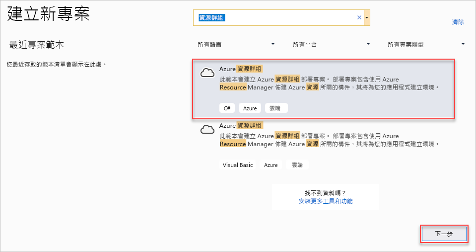

1. 為專案命名。 其他的預設設定應該沒問題，但還是請檢查一下以確認適合在您的環境使用。 完成後，請選取 [建立]  。

    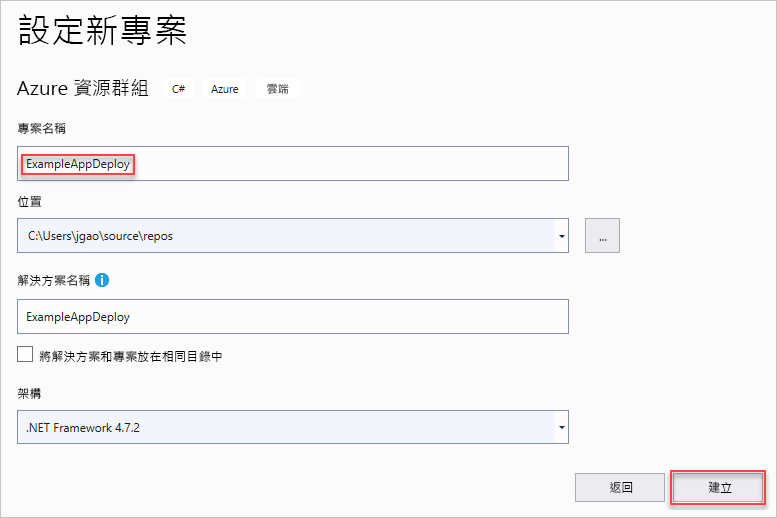

1. 選擇您想要部署至 Azure 資源管理員的範本。 請注意，根據您想要部署的專案類型，有許多不同的選項。 針對此文章，我們依序選擇 **Web 應用程式**範本和 [確定]  。

    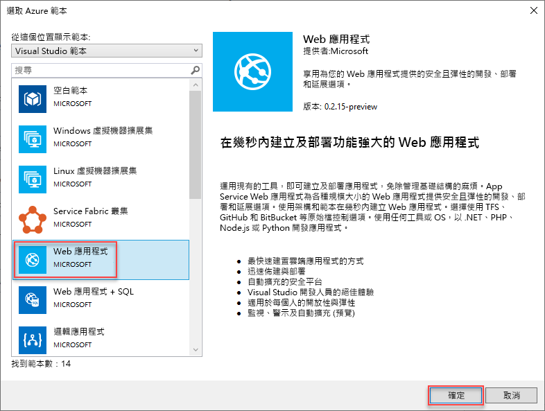

    您選擇的範本只是起點；您可以加入和移除資源，以滿足您的案例。

1. Visual Studio 會建立 Web 應用程式的資源群組部署專案。 若要查看您專案的檔案，請看部署專案中的節點。

    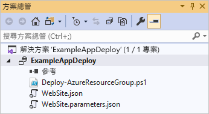

    因為您選擇 Web 應用程式範本，所以您會看到下列檔案：

   | 檔案名稱 | 說明 |
   | --- | --- |
   | Deploy-AzureResourceGroup.ps1 |執行 PowerShell 命令部署至 Azure 資源管理員的 PowerShell 指令碼。 Visual studio 會使用此 PowerShell 指令碼部署您的範本。 |
   | WebSite.json |Resource Manager 範本 (定義您想要部署至 Azure 的基礎結構)，以及在部署期間您可以提供的參數。 同時定義資源之間的相依性，讓 Resource Manager 以正確的順序部署資源。 |
   | WebSite.parameters.json |參數檔案，具有範本所需的值。 您可以傳遞參數值以自訂每個部署。 |

    所有資源群組部署專案都有這些基本檔案。 其他專案可能有其他檔案以支援其他功能。

## <a name="customize-resource-manager-template"></a>自訂資源管理員範本

您可以藉由修改資源管理員範本 (描述您想要部署的資源) 來自訂部署專案。 若要了解資源管理員範本的元素，請參閱 [撰寫 Azure 資源管理員範本](resource-group-authoring-templates.md)。

1. 若要使用您的範本，請開啟 **WebSite.json**。

1. Visual Studio 編輯器提供工具，協助您編輯 Resource Manager 範本。 [JSON 大綱]  視窗可讓您輕鬆查看在您的範本中定義的元素。

   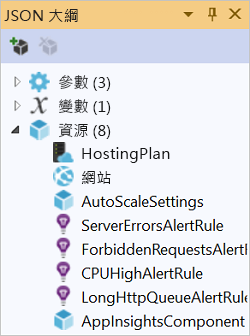

1. 在大綱中選取一個項目即可移到範本中該項目的所在位置。

   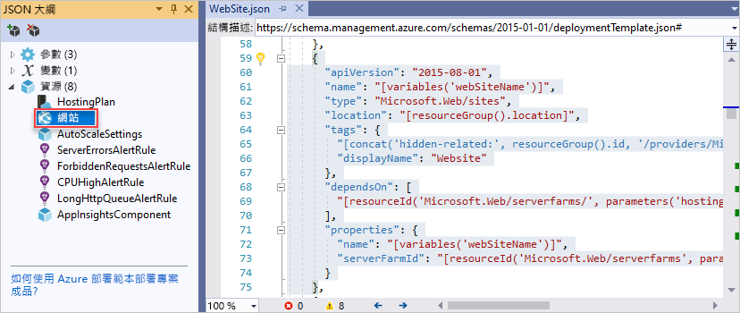

1. 您可以選取 [JSON 大綱] 視窗頂端的 [加入資源]  按鈕，或以滑鼠右鍵按一下 [資源]  然後選取 [加入新資源]  ，藉以加入新資源。

   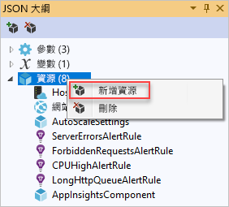

1. 選取 [儲存體帳戶]  ，並為它命名。 提供的名稱不能超過 11 個字元，而且只包含數字和小寫字母。

   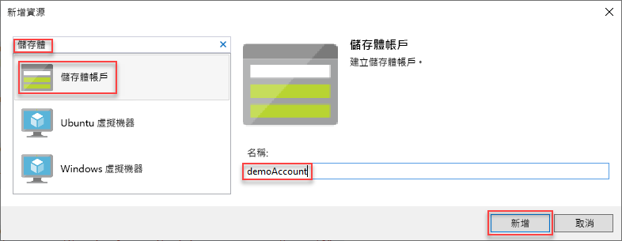

1. 請注意，不只是加入資源，也會加入儲存體帳戶類型的參數，以及儲存體帳戶名稱的變數。

   

1. 儲存體帳戶類型的參數是以允許的類型與預設類型預先定義。 您可以保留這些值，或針對您的案例進行編輯。 如果您不想要讓任何人透過此範本部署 **Premium_LRS** 儲存體帳戶，請將它從允許的類型中移除。

   ```json
   "demoaccountType": {
     "type": "string",
     "defaultValue": "Standard_LRS",
     "allowedValues": [
       "Standard_LRS",
       "Standard_ZRS",
       "Standard_GRS",
       "Standard_RAGRS"
     ]
   }
   ```

1. Visual Studio 也會提供 Intellisense，協助您了解編輯範本時可用的屬性。 例如，若要編輯 App Service 方案的屬性，請瀏覽至 **HostingPlan** 資源，並針對 [屬性]  加入值。 請注意，Intellisense 會顯示可用的值，並提供該值的描述。

   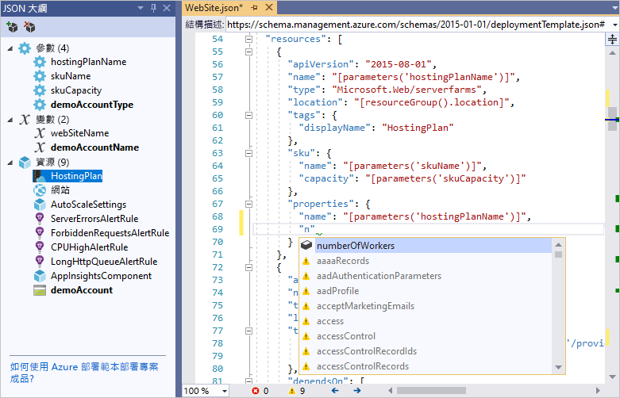

   您可以將 **numberOfWorkers** 設定為 1，然後儲存檔案。

   ```json
   "properties": {
     "name": "[parameters('hostingPlanName')]",
     "numberOfWorkers": 1
   }
   ```

1. 開啟 **WebSite.parameters.json** 檔案。 您可以在部署期間使用參數檔案來傳入值，以自訂正在部署的資源。 為主控方案命名，然後儲存檔案。

   ```json
   {
     "$schema": "https://schema.management.azure.com/schemas/2015-01-01/deploymentParameters.json#",
     "contentVersion": "1.0.0.0",
     "parameters": {
       "hostingPlanName": {
         "value": "demoHostPlan"
       }
     }
   }
   ```

## <a name="deploy-project-to-azure"></a>將專案部署到 Azure

您現在已可開始將您的專案部署到資源群組。

根據預設，專案中的 PowerShell 指令碼 (Deploy-AzureResourceGroup.ps1) 會使用 AzureRM 模組。 如果您仍然安裝 AzureRM 模組並想要繼續使用它，您可以使用此預設指令碼。 只要使用此指令碼，您就可以使用 Visual Studio 介面部署您的解決方案。

不過，如果您已移轉至新的 [Az 模組](/powershell/azure/new-azureps-module-az)，就需要將新的指令碼新增至您的專案。 若要新增使用 Az 模組的指令碼，請複製 [Deploy-AzTemplate.ps1](https://github.com/Azure/azure-quickstart-templates/blob/master/Deploy-AzTemplate.ps1) 指令碼，並將它新增至您的專案。 若要將此指令碼用於部署，您必須從 PowerShell 主控台中執行它，而不是使用 Visual Studio 部署介面來執行。

此文章中會展示這兩種方法。 此文章將預設指令碼稱為 AzureRM 模組指令碼，將新的指令碼稱為 Az 模組指令碼。

### <a name="az-module-script"></a>Az 模組指令碼

對於 Az 模組指令碼，請開啟 PowerShell 主控台並執行：

```powershell
.\Deploy-AzTemplate.ps1 -ArtifactStagingDirectory . -Location centralus -TemplateFile WebSite.json -TemplateParametersFile WebSite.parameters.json
```

### <a name="azurerm-module-script"></a>AzureRM 模組指令碼

對於 AzureRM 模組指令碼，請使用 Visual Studio：

1. 在部署專案節點的捷徑功能表上，選擇 [部署]   > [新增]  。

    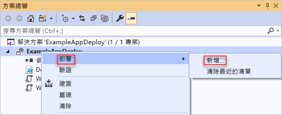

1. [部署到資源群組]  對話方塊隨即出現。 在 [資源群組]  下拉式方塊中，選擇現有資源群組或建立新群組。 選取 [部署]  。

    ![[部署到資源群組] 對話方塊](./media/vs-azure-tools-resource-groups-deployment-projects-create-deploy/show-deployment.png)

1. 您可在 [輸出]  視窗中查看部署的狀態。 部署完成時，最後一則訊息會表示成功部署，如下所示︰

   ```output
   18:00:58 - Successfully deployed template 'website.json' to resource group 'ExampleAppDeploy'.
   ```

## <a name="view-deployed-resources"></a>檢視已部署的資源

查看結果。

1. 在瀏覽器中，開啟 [Azure 入口網站](https://portal.azure.com/) 並登入您的帳戶。 若要查看資源群組，請選取 [資源群組]  ，然後選取您部署所在的資源群組。

1. 您會看到所有已部署的資源。 請注意，儲存體帳戶的名稱不完全是新增該資源時所指定的名稱。 儲存體帳戶必須是獨一無二的。 範本會在您所提供的名稱中自動新增字元字串，以建立唯一的名稱。

    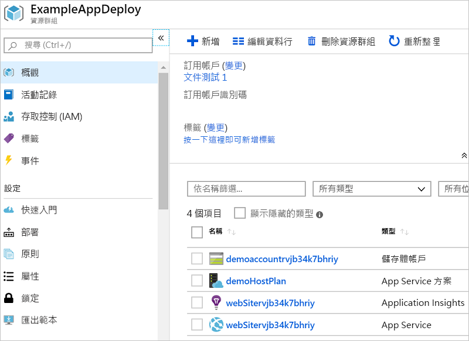

## <a name="add-code-to-project"></a>將程式碼新增至專案

此時，您已為您的應用程式部署基礎結構，但是專案尚未部署實際程式碼。

1. 將專案新增至您的 Visual Studio 方案。 以滑鼠右鍵按一下方案，然後選取 [新增]   > [新增專案]  。

    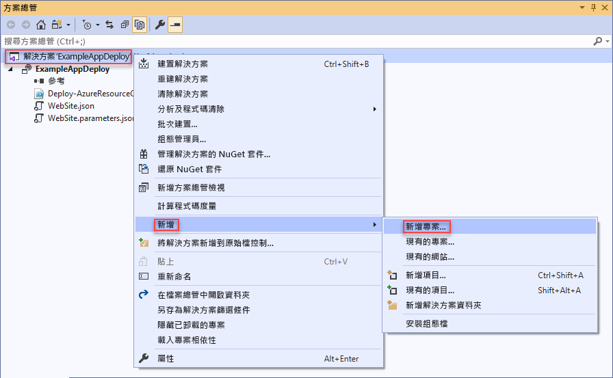

1. 新增 **ASP.NET Core Web 應用程式**。

    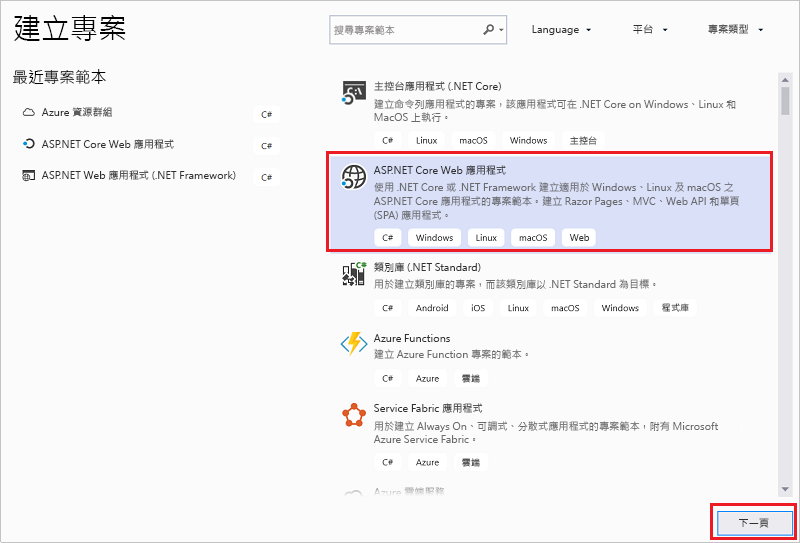

1. 為您的 Web 應用程式命名，然後選取 [建立]  。

    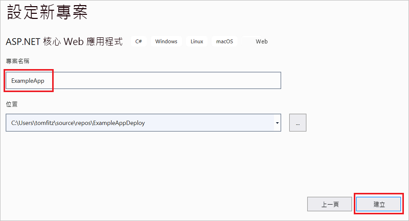

1. 依序選取 [Web 應用程式]  和 [建立]  。

    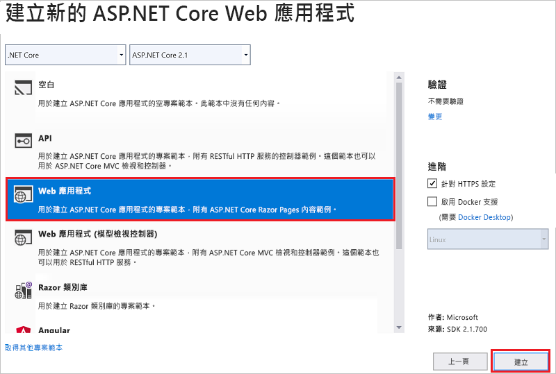

1. 在 Visual Studio 建立 Web 應用程式之後，您會在方案中看到這兩個專案。

    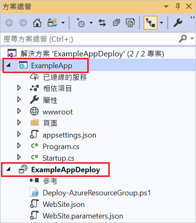

1. 現在，您必須確定資源群組專案已察覺新的專案。 回到您的資源群組專案 (ExampleAppDeploy)。 以滑鼠右鍵按一下 [參考]  ，然後選取 [新增參考]  。

    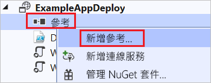

1. 選取您所建立的 Web 應用程式專案。

   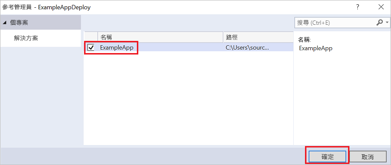

   您可以透過新增參考，將 Web 應用程式專案連結至資源群組專案，並自動設定部分屬性。 您會在參考的 [屬性]  視窗中看到這些屬性。 [包含檔案路徑]  有建立套件所在的路徑。 請注意資料夾 (ExampleApp) 和檔案 (package.zip)。 您必須知道這些值，因為您會提供這些值做為部署應用程式時的參數。

   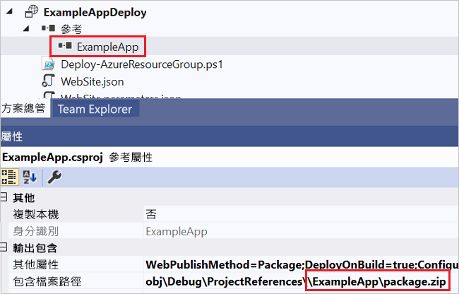

1. 請回到範例 (WebSite.json)，並將資源新增至範本。

    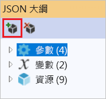

1. 這次請選取 [Web Deploy for Web Apps]  。 

    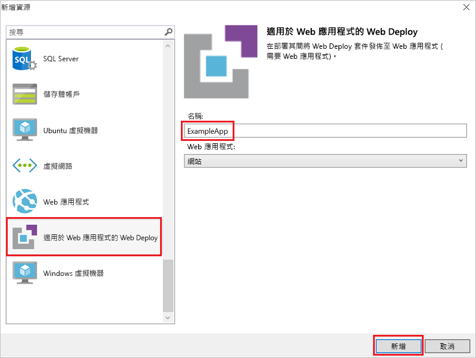

   儲存您的範本。

1. 您的範本中就會有一些新的參數。 它們是在上一個步驟中新增的。 您不需要提供 **_artifactsLocation** 或 **_artifactsLocationSasToken** 的值，因為系統會自動產生這些值。 不過，您必須將資料夾和檔案名稱設定為包含部署套件的路徑。 這些參數的名稱結尾是 **PackageFolder** 和 **PackageFileName**。 名稱的第一個部分是您所新增 Web Deploy 資源的名稱。 在此文章中，它們名為 **ExampleAppPackageFolder** 和 **ExampleAppPackageFileName**。 

   開啟 **Website.parameters.json** 並將這些參數設定為您在參考屬性中看到的值。 將資料夾名稱設為 **ExampleAppPackageFolder**。 將 zip 檔案的名稱設為 **ExampleAppPackageFileName**。

   ```json
   {
     "$schema": "https://schema.management.azure.com/schemas/2015-01-01/deploymentParameters.json#",
     "contentVersion": "1.0.0.0",
     "parameters": {
       "hostingPlanName": {
         "value": "demoHostPlan"
       },
       "ExampleAppPackageFolder": {
         "value": "ExampleApp"
       },
       "ExampleAppPackageFileName": {
         "value": "package.zip"
       }
     }
   }
   ```

## <a name="deploy-code-with-infrastructure"></a>以基礎結構部署程式碼

因為您將程式碼新增至專案，所以這次您的部署會稍微不同。 在部署期間，您可以把專案的成品暫存至 Resource Manager 可以存取的位置。 成品會暫存至儲存體帳戶。

### <a name="az-module-script"></a>Az 模組指令碼

使用 Az 模組指令碼時，需要對範本做一個小變更。 此指令碼會對成品位置加上一條斜線，但您的範本並未預期會出現那條斜線。 請開啟 WebSite.json 並尋找 MSDeploy 延伸模組的屬性。 它具有名為 **packageUri** 的屬性。 請移除成品位置和封裝資料夾之間的斜線。

它看起來應該像這樣：

```json
"packageUri": "[concat(parameters('_artifactsLocation'), parameters('ExampleAppPackageFolder'), '/', parameters('ExampleAppPackageFileName'), parameters('_artifactsLocationSasToken'))]",
```

請注意，上述範例中的 **parameters('_artifactsLocation')** 和 **parameters('ExampleAppPackageFolder')** 之間並沒有 `'/',`。

請重建專案。 建置專案可確保您需要部署的檔案已新增至暫存資料夾。

現在請開啟 PowerShell 主控台並執行：

```powershell
.\Deploy-AzTemplate.ps1 -ArtifactStagingDirectory .\bin\Debug\staging\ExampleAppDeploy -Location centralus -TemplateFile WebSite.json -TemplateParametersFile WebSite.parameters.json -UploadArtifacts -StorageAccountName <storage-account-name>
```

### <a name="azurerm-module-script"></a>AzureRM 模組指令碼

對於 AzureRM 模組指令碼，請使用 Visual Studio：

1. 若要部署，請選擇 [部署]  ，然後選擇您稍早已部署的資源群組。

    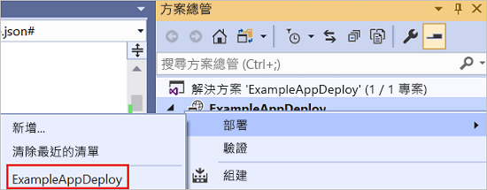

1. 對於 [成品儲存體帳戶]  ，選取與此資源群組一起部署的儲存體帳戶。

   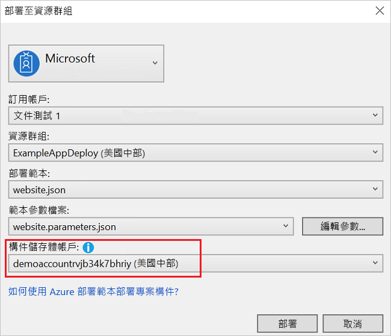

## <a name="view-web-app"></a>檢視 Web 應用程式

1. 部署完成後，請在入口網站中選取您的 Web 應用程式。 按一下 URL 以瀏覽至此網站。

   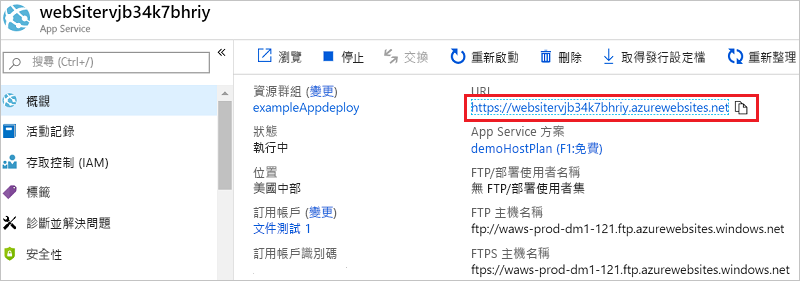

1. 請注意，您已成功部署預設的 ASP.NET 應用程式。

   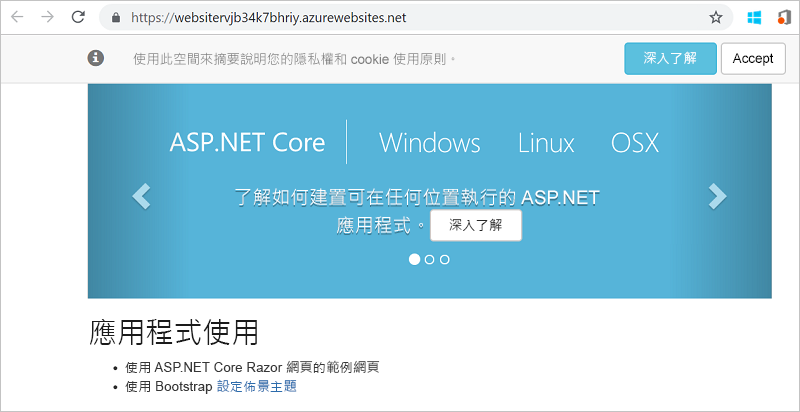

## <a name="add-operations-dashboard"></a>新增作業儀表板

您不一定要透過 Visual Studio 介面使用資源。 您可以將自訂資源新增至您的範本，以自訂您的部署。 若要說明如何新增資源，您可以新增操作儀表板來管理您部署的資源。

1. 開啟 WebSite.json 檔案，然後將以下的 JSON 新增到儲存體帳戶資源之後，但是在資源區段的結尾 `]` 之前。

   ```json
    ,{
      "properties": {
        "lenses": {
          "0": {
            "order": 0,
            "parts": {
              "0": {
                "position": {
                  "x": 0,
                  "y": 0,
                  "colSpan": 4,
                  "rowSpan": 6
                },
                "metadata": {
                  "inputs": [
                    {
                      "name": "resourceGroup",
                      "isOptional": true
                    },
                    {
                      "name": "id",
                      "value": "[resourceGroup().id]",
                      "isOptional": true
                    }
                  ],
                  "type": "Extension/HubsExtension/PartType/ResourceGroupMapPinnedPart"
                }
              },
              "1": {
                "position": {
                  "x": 4,
                  "y": 0,
                  "rowSpan": 3,
                  "colSpan": 4
                },
                "metadata": {
                  "inputs": [],
                  "type": "Extension[azure]/HubsExtension/PartType/MarkdownPart",
                  "settings": {
                    "content": {
                      "settings": {
                        "content": "__Customizations__\n\nUse this dashboard to create and share the operational views of services critical to the application performing. To customize simply pin components to the dashboard and then publish when you're done. Others will see your changes when you publish and share the dashboard.\n\nYou can customize this text too. It supports plain text, __Markdown__, and even limited HTML like images  and <a href='https://azure.microsoft.com' target='_blank'>links</a> that open in a new tab.\n",
                        "title": "Operations",
                        "subtitle": "[resourceGroup().name]"
                      }
                    }
                  }
                }
              }
            }
          }
        },
        "metadata": {
          "model": {
            "timeRange": {
              "value": {
                "relative": {
                  "duration": 24,
                  "timeUnit": 1
                }
              },
              "type": "MsPortalFx.Composition.Configuration.ValueTypes.TimeRange"
            }
          }
        }
      },
      "apiVersion": "2015-08-01-preview",
      "name": "[concat('ARM-',resourceGroup().name)]",
      "type": "Microsoft.Portal/dashboards",
      "location": "[resourceGroup().location]",
      "tags": {
        "hidden-title": "[concat('OPS-',resourceGroup().name)]"
      }
    }
   ```

1. 重新部署您的專案。

1. 部署完成後，請在入口網站中檢視您的儀表板。 選取 [儀表板]  並選擇您部署的那一個。

   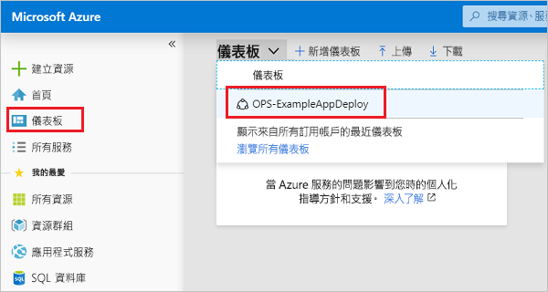

1. 您就看到自訂的儀表板。

   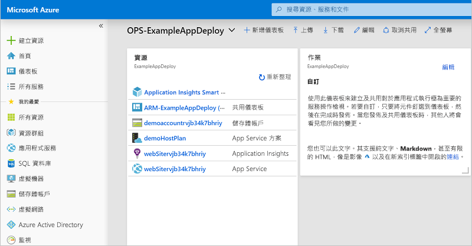

您可以使用 RBAC 群組來管理對儀表板的存取權。 部署之後，您也可以自訂儀表板的外觀。 不過，如果您重新部署資源群組，則儀表板會重設回範本中的預設狀態。 如需建立儀表板的詳細資訊，請參閱[以程式設計方式建立 Azure 儀表板](../azure-portal/azure-portal-dashboards-create-programmatically.md)。

## <a name="clean-up-resources"></a>清除資源

不再需要 Azure 資源時，可藉由刪除資源群組來清除您所部署的資源。

1. 在 Azure 入口網站中，選取左側功能表中的 [資源群組]  。

1. 選取資源群組名稱。

1. 從頂端功能表中選取 [刪除資源群組]  。

## <a name="next-steps"></a>後續步驟

在本快速入門中，您已了解如何使用 Visual Studio 來建立及部署範本。 下一個教學課程將說明如何從範本參考中尋找相關資訊，用以建立加密的 Azure 儲存體帳戶。

> [!div class="nextstepaction"]
> [建立加密的儲存體帳戶](./resource-manager-tutorial-create-encrypted-storage-accounts.md)
