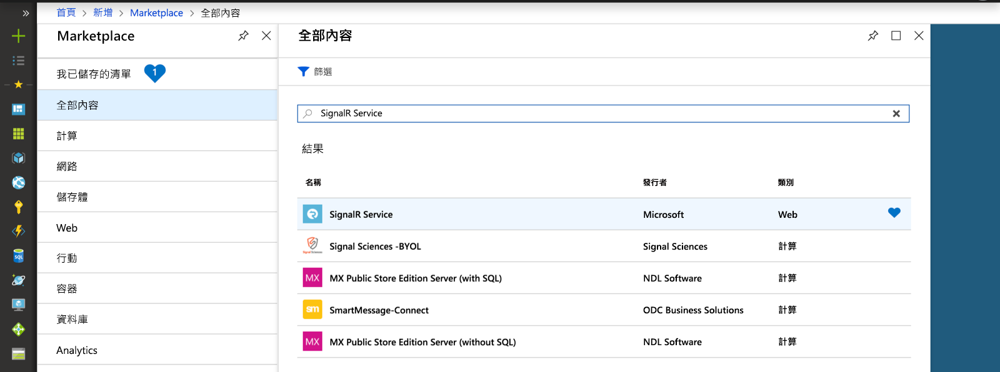
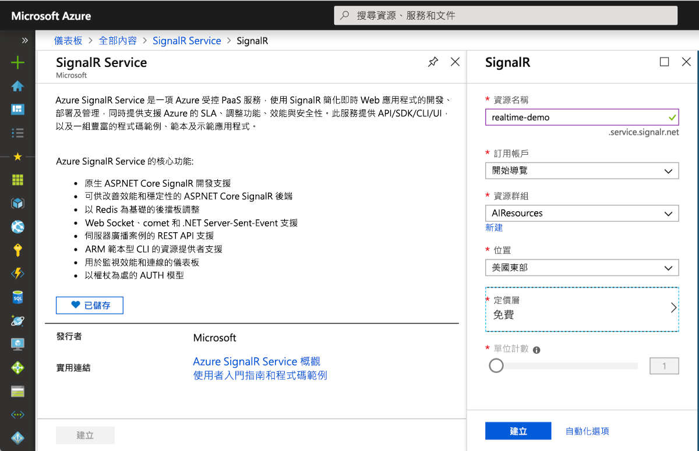

## 建立 Azure SignalR 服務執行個體

您的應用程式將會連線至 Azure 中的 SignalR 服務執行個體。

1. 選取 Azure 入口網站左上角的 [新增] 按鈕。 在 [新增] 畫面的搜尋方塊中輸入 *SignalR 服務*並按 Enter。

    

1. 從搜尋結果中選取 [SignalR 服務]  ，然後選取 [建立]  。

1. 輸入下列設定。

    | 設定      | 建議的值  | 說明                                        |
    | ------------ |  ------- | -------------------------------------------------- |
    | **資源名稱** | 全域唯一的名稱 | 能識別您的新 SignalR 服務執行個體的名稱。 有效字元是 `a-z`、`0-9` 和 `-`。  | 
    | **訂用帳戶** | 您的訂用帳戶 | 將在其下建立這個新 SignalR 服務執行個體的訂用帳戶。 | 
    | **[資源群組](../../azure-resource-manager/resource-group-overview.md)** |  myResourceGroup | 要在其中建立 SignalR 服務執行個體之新資源群組的名稱。 | 
    | **位置** | 美國西部 | 選擇您附近的[區域](https://azure.microsoft.com/regions/)。 |
    | **定價層** | 免費 | 免費試用 Azure SignalR 服務。 |
    | **單位計數** |  不適用 | 單位計數會指出您的 SignalR 服務執行個體可接受的連線數目。 它只能在標準層中設定。 |

    

1. 選取 [建立]  以開始部署 SignalR 服務執行個體。

1. 在部署執行個體之後，請在入口網站中開啟它，然後找出其 [設定] 頁面。 只有透過 Azure Functions 繫結或 REST API 使用 Azure SignalR 服務時，才要將 [服務模式] 設定變更為 [無伺服器]  。 否則，將它保留為 [傳統]  或 [預設]  。