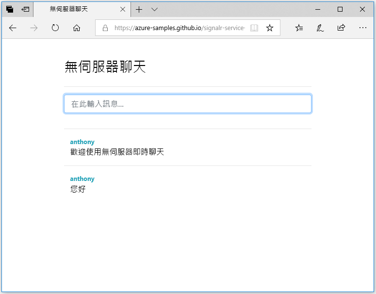

## 執行 Web 應用程式

1. GitHub 中有裝載範例的單一頁面 Web 應用程式，以方便您使用。 在瀏覽器中開啟 [https://azure-samples.github.io/signalr-service-quickstart-serverless-chat/demo/chat/](https://azure-samples.github.io/signalr-service-quickstart-serverless-chat/demo/chat/)。

    > [!NOTE]
    > HTML 檔案的來源位於 [/docs/demo/chat/index.html](https://github.com/Azure-Samples/signalr-service-quickstart-serverless-chat/blob/master/docs/demo/chat/index.html)。

1. 當系統提示您輸入函數應用程式基底 URL 時，請輸入 *http://localhost:7071*。

1. 在收到系統提示時輸入使用者名稱。

1. Web 應用程式會呼叫函數應用程式中的 *GetSignalRInfo* 函式，以擷取連線至 Azure SignalR 服務的連線資訊。 連線完成時，螢幕會出現聊天訊息輸入方塊。

1. 輸入訊息，然後按 Enter。 應用程式會將該訊息傳送至 Azure 函數應用程式中的 *SendMessage* 函式，該函式會使用 SignalR 輸出繫結將該訊息廣播至所有已連線的用戶端。 如果一切皆運作正常，該訊息應該會出現在應用程式中。

    

1. 在不同的瀏覽器視窗中開啟另一個 Web 應用程式執行個體。 您將會看見所有已傳送的訊息都會出現在該應用程式的所有執行個體中。