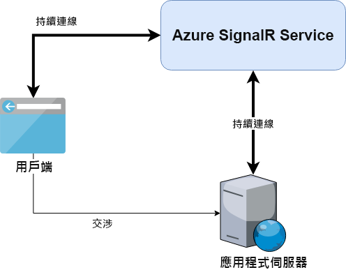

# <a name="azure-signalr-service-internals"></a>Azure SignalR Service 內部項目

Azure SignalR Service 建置在 ASP.NET Core SignalR 架構之上。 它也以預覽功能的形式支援 ASP.NET SignalR。

> 為了支援 ASP.NET SignalR，Azure SignalR Service 在 ASP.NET Core 架構之上重新實作了 ASP.NET SignalR 的資料通訊協定

只要變更幾行程式碼，您就可以輕鬆地遷移本機的 ASP.NET Core SignalR 應用程式從而與 SignalR Service 搭配運作。

下圖說明搭配使用 SignalR Service 與應用程式伺服器時的典型架構。

另外，我們也會討論其與自我裝載的 ASP.NET Core SignalR 應用程式有何不同。



## <a name="server-connections"></a>伺服器連線

自我裝載的 ASP.NET Core SignalR 應用程式伺服器會直接接聽並連接用戶端。

使用 SignalR Service 後，應用程式伺服器就不會再接受持續性的用戶端連線，而是：

1. Azure SignalR Service SDK 會針對每個中樞公開 `negotiate` 端點。
1. 此端點會回應用戶端的交涉要求，並將用戶端重新導向至 SignalR Service。
1. 用戶端最終會連線至 SignalR Service。

如需詳細資訊，請參閱[用戶端連線](#client-connections)。

一旦應用程式伺服器啟動後， 
- 如果是 ASP.NET Core SignalR，Azure SignalR Service SDK 會針對每一個中樞開啟 5 個連往 SignalR Service 的 WebSocket 連線。 
- 如果是 ASP.NET SignalR，Azure SignalR Service SDK 會針對每一個中樞開啟 5 個連往 SignalR Service 的 WebSocket 連線，並針對每一個應用程式開啟 1 個 WebSocket 連線。

5 個 WebSocket 連線是預設值，如需變更，可於[組態](https://github.com/Azure/azure-signalr/blob/dev/docs/use-signalr-service.md#connectioncount)中進行。

進出用戶端的訊息會以多工方式傳送至這些連線。

這些連線會隨時保持連線至 SignalR Service。 如果因為網路問題而導致伺服器連線中斷，
- 由這個伺服器連線提供服務的所有用戶端會中斷連線 (如需這方面的詳細資訊，請參閱[用戶端與伺服器之間的資料傳輸](#data-transmit-between-client-and-server))；
- 伺服器連線會自動開始重新連線。

## <a name="client-connections"></a>用戶端連接

當您使用 SignalR Service 時，用戶端會連線至 SignalR Service，而不是應用程式伺服器。
在用戶端與 SignalR Service 之間建立持續性連線需要兩個步驟。

1. 用戶端傳送交涉要求給應用程式伺服器。 透過 Azure SignalR Service SDK，應用程式伺服器會傳回重新導向回應，其中具有 SignalR Service 的 URL 和存取權杖。

- 如果是 ASP.NET Core SignalR，典型的重新導向回應會類似：
    ```
    {
        "url":"https://test.service.signalr.net/client/?hub=chat&...",
        "accessToken":"<a typical JWT token>"
    }
    ```
- 如果是 ASP.NET SignalR，典型的重新導向回應會類似：
    ```
    {
        "ProtocolVersion":"2.0",
        "RedirectUrl":"https://test.service.signalr.net/aspnetclient",
        "AccessToken":"<a typical JWT token>"
    }
    ```

1. 在收到重新導向回應之後，用戶端會使用新的 URL 和存取權杖來啟動一般程序，以連線到 SignalR Service。

請深入了解 ASP.NET Core SignalR 的[傳輸通訊協定](https://github.com/aspnet/SignalR/blob/release/2.2/specs/TransportProtocols.md)。

## <a name="data-transmit-between-client-and-server"></a>用戶端與伺服器之間的資料傳輸

當用戶端連線至 SignalR Service 時，服務執行階段會尋找伺服器連線來為此用戶端提供服務
- 此步驟只會進行一次，而且是用戶端與伺服器連線之間的一對一對應。
- 此對應會保留在 SignalR Service 上，直到用戶端或伺服器中斷連線。

此時，應用程式伺服器便會收到事件，其中會有來自新用戶端的資訊。 應用程式伺服器中會建立連往用戶端的邏輯連線。 系統會透過 SignalR Service 建立從用戶端至應用程式伺服器的資料通道。

SignalR Service 會將資料從用戶端傳輸到配對的應用程式伺服器。 而來自應用程式伺服器的資料則會傳送至對應的用戶端。

如您所見，Azure SignalR Service 本質上是應用程式伺服器與用戶端之間的邏輯傳輸層。 所有的持續性連線都會卸載至 SignalR Service。
應用程式伺服器只需要處理中樞類別中的商務邏輯，而不必擔心用戶端連線。