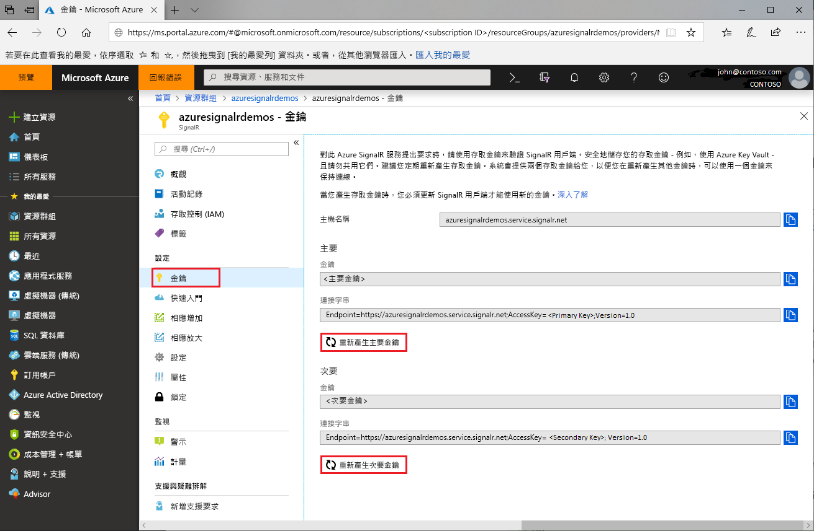

# Azure SignalR Service 的存取金鑰輪替

每個 Azure SignalR Service 執行個體有一對存取金鑰：主要和次要金鑰。 對服務提出要求時，用來驗證 SignalR 用戶端。 金鑰會與執行個體端點 url 相關聯。 保護您的金鑰安全，並定期進行輪替。 您可取得兩個存取金鑰，所以可使用一個金鑰維持連線，同時重新產生另一個金鑰。

## 輪替存取金鑰？

基於安全性理由與合規性需求，建議開發人員定期輪替存取金鑰。

## 如何重新產生存取金鑰？

1. 移至 [Azure 入口網站](https://portal.azure.com/)，並以您的認證登入。

1. 從您想要重新產生金鑰的 Azure SignalR Service 執行個體中尋找 [金鑰] 區段。

1. 按一下導覽功能表上的 [金鑰]。

1. 按一下 [重新產生主要金鑰] 或 [重新產生次要金鑰]。

將建立及顯示新的金鑰和對應的連接字串。

 

您也可以使用 [Azure CLI](/cli/azure/ext/signalr/signalr/key?view=azure-cli-latest#ext-signalr-az-signalr-key-renew) 重新產生金鑰。

## 使用新的連接字串更新組態

1. 複製新產生的連接字串。

1. 更新所有組態以使用新的連接字串。

1. 視需要重新啟動應用程式。

## 已強制重新產生存取金鑰

在某些情況下，Azure SignalR Service 可能會強制重新產生必要的存取金鑰。 此服務會透過電子郵件和入口網站通知來通知客戶。 如果您收到此通訊或因為存取金鑰而發生服務失敗，請遵循本指南來輪替金鑰。

## 後續步驟

基於安全性考量，我們建議定期輪替存取金鑰。

您已在本指南中了解如何重新產生存取金鑰。 繼續進行後續有關透過 OAuth 或 Azure Functions 驗證的教學課程。

> [!div class="nextstepaction"]
> [與 ASP.NET Core 身分識別整合](./signalr-authenticate-oauth.md)

> [!div class="nextstepaction"]
> [建置含驗證功能的無伺服器即時應用程式](./signalr-authenticate-azure-functions.md)