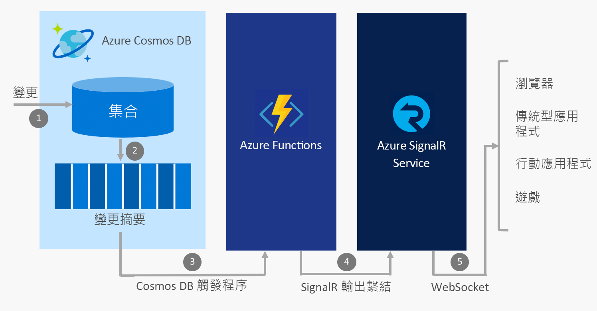

# 使用 Azure Functions 與 Azure SignalR 服務建置即時應用程式

因為 Azure SignalR 服務與 Azure Functions 都是完全受控且可調整幅度高的服務，可讓您專注於建置應用程式而不是管理基礎結構，在[無伺服器的](https://azure.microsoft.com/solutions/serverless/)環境中，通常會搭配使用這兩個服務來提供即時通訊。

## 將即時通訊與 Azure 服務服務整合

Azure Functions 可讓您使用[數種語言](../azure-functions/supported-languages.md) (包括 JavaScript、C# 與 Java) 撰寫每當雲端中發生事件時就會觸發的程式碼。 這些事件的範例包括：

* HTTP 與 Webhook 要求
* 定期計時器
* 來自 Azure 服務的事件，例如：
    - Event Grid
    - 事件中樞
    - 服務匯流排
    - Cosmos DB 變更摘要
    - 儲存體 - Blob 與佇列
    - Logic Apps 連接器，例如 Salesforce 與 SQL Server

透過使用 Azure Functions 將這些事件與 Azure SignalR 服務整合，您可以在每當事件發生時通知成千上萬的用戶端。

您可以使用 Azure Functions 與 SignalR 服務實作的一些常見即時無伺服器傳訊案例包括：

* 在即時儀表板或地圖上將 IoT 裝置遙測資料視覺化
* 當 Cosmos DB 中的文件更新時，更新應用程式中的資料
* 當新訂單在 Salesforce 中建立時，傳送應用程式內通知

## 適用於 Azure Functions 的 SignalR 服務繫結

「適用於 Azure Functions 的 SignalR 服務繫結」可讓 Azure Function 應用程式發佈訊息到連線至 SignalR 服務的用戶端。 用戶端可以使用 SignalR 用戶端 SDK (您可以在 .NET、JavaScript 與 Java 中找到此 SDK) 連線到服務。

### 範例案例

此範例說明如何以使用 Azure Functions 的 SignalR 服務繫結，來與 Azure Cosmos DB 和 SignalR 服務整合，以在 Cosmos DB 變更摘要時傳送即時訊息。

1. 在 Cosmos DB 集合中進行了變更
2. 變更事件會填入到 Cosmos DB 變更摘要
3. Azure Functions 會由變更事件使用 Cosmos DB 觸發程序來觸發
4. SignalR 服務輸出繫結會發佈訊息到 SignalR 服務
5. SignalR 服務會將訊息發佈到所有連線的用戶端

### 驗證和使用者

SignalR 服務可讓您將訊息廣播到所有用戶端，或只廣播到用戶端的子集，例如屬於單一使用者的用戶端。 「適用於 Azure Functions 的 SignalR 服務繫結」可以與 App Service 驗證結合，以使用 Azure Active Directory、Facebook 與 Twitter 等提供者來驗證使用者。 接著，您可以直接傳送訊息給這些已驗證的使用者。

## 後續步驟

在此文章中，您已了解如何搭配 SignalR 服務使用 Azure Functions，以支援各種無伺服器即時傳訊案例的概觀。 若要深入了解，請按照下列其中一個快速入門來操作。

* [Azure SignalR 服務無伺服器快速入門 - C#](signalr-quickstart-azure-functions-csharp.md)
* [Azure SignalR 服務無伺服器快速入門 - JavaScript](signalr-quickstart-azure-functions-javascript.md)

