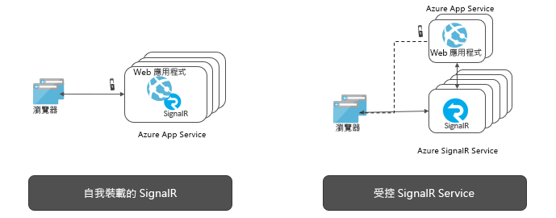

# 什麼是 Azure SignalR 服務？

Azure SignalR 服務簡化了透過 HTTP 將即時 Web 功能新增到應用程式的程序。 此即時功能可讓服務將內容更新推播至連線的用戶端，例如單一頁面的 Web 或行動應用程式。 因此，用戶端可以更新而不需要輪詢伺服器或送出新的 HTTP 更新要求。

此文章提供 Azure SignalR 服務的概觀。

## Azure SignalR 服務的用途為何？

需要即時從伺服器將資料推送到用戶端的任何案例，都可以使用 Azure SignalR Service。

通常需要從伺服器輪詢的傳統即時功能，也可以使用 Azure SignalR Service。

Azure SignalR Service 已經運用在各種不同的產業中，需要即時內容更新的應用程式類型。 我們列出適合使用 Azure SignalR Service 的一些範例：

* **高頻率資料更新：** 遊戲、投票、輪詢、拍賣。
* **儀表板和監視：** 公司儀表板、金融市場資料、立即銷售更新、多玩家遊戲排行榜和 IoT 監視。
* **聊天：** 即時聊天室、聊天機器人、線上客戶支援、即時購物助理、Messenger、遊戲中的交談等等。
* **地圖上的即時位置：** 物流追蹤、傳遞狀態追蹤、運輸狀態更新、GPS 應用程式。
* **即時目標廣告：** 個人化讀取時間推播廣告和供應項目、互動式廣告。
* **共同作業應用程式：** 共同創作、白板應用程式和小組會議軟體。
* **推播通知：** 社交網路、電子郵件、遊戲、旅遊警示。
* **即時廣播：** 即時音訊/視訊廣播、即時隱藏式輔助字幕、轉譯、事件/新聞廣播。
* **IoT 和連接的裝置：** 即時 IoT 計量、遠端控制、即時狀態，以及位置追蹤。
* **自動化：** 上游事件的即時觸發程序。

## 使用 Azure SignalR Service 優點是什麼？

**標準型：**

SignalR 為建置即時 Web 應用程式所用的數種技術提供抽象表示。 [WebSockets](https://wikipedia.org/wiki/WebSocket) 是最佳的傳輸，但是當其他選項無法使用時會使用 [Server-Sent Events (SSE)](https://wikipedia.org/wiki/Server-sent_events) 和「長輪詢」等技術。 SignalR 會根據伺服器和用戶端支援的功能，自動偵測和初始化適當的傳輸。

**原生 ASP.NET Core 支援：**

SignalR Service 使用 ASP.NET Core 和 ASP.NET 提供原生程式體驗。 使用 SignalR Service 開發新的 SignalR 應用程式，或者從現有 SignalR 型應用程式遷移至 SignalR Service，僅需要最低限度的工作。
SignalR Service 也支援 ASP.NET Core 的新功能，伺服器端 Blazor。

**廣泛的用戶端支援：**

SignalR Service 可以與廣範圍的用戶端搭配使用，例如網頁瀏覽器和行動瀏覽器、桌面應用程式、行動裝置應用程式、伺服器處理序、IoT 裝置及遊戲主控台。 SignalR Service 提供不同語言的 SDK。 除了原生 ASP.NET Core 或 ASP.NET C# SDK，SignalR Service 也提供 JavaScript 用戶端 SDK，以啟用 Web 用戶端和許多 JavaScript 架構。 也針對 Java 應用程式 (包括 Android 原生應用程式) 支援 Java 用戶端 SDK。 SignalR Service 支援 REST API，且透過與 Azure Functions 和事件方格的整合，成為無伺服器服務。

**處理大規模用戶端連線：**

SignalR Service 是專為大規模即時應用程式設計的。 SignalR Service 可讓多個執行個體一起執行，規模多達數以百萬計的用戶端連線。 服務也針對分區、高可用性或災害復原目的，支援多個全域區域。

**移除自我裝載 SignalR 的負擔：**

相較於自我裝載 SignalR 應用程式，切換到 SignalR Service 可以移除管理背板 (處理規模和用戶端連線) 的需求。 完全受控服務也會簡化 Web 應用程式，並且節省裝載成本。 SignalR Service 提供遍佈全球的世界級資料中心和網路，規模可達數以百萬計的連線，保證 SLA，同時提供符合 Azure 標準的合規性和安全性。

**針對不同的傳訊模式提供豐富的 API：**

SignalR Service 可讓伺服器傳送訊息到特定連線、所有連線、屬於特定使用者的連線子集，或置於任意群組的連線子集。

## 如何使用 Azure SignalR 服務

使用 Azure SignalR Service 進行程式設計有許多不同的方式，一些範例如下所示：

- **[調整 ASP.NET Core SignalR 應用程式](signalr-concept-scale-aspnet-core.md)** - 將 Azure SignalR 服務與 ASP.NET Core SignalR 應用程式整合，以相應放大為成千上萬個連線。
- **[建置無伺服器的即時應用程式](signalr-concept-azure-functions.md)** - 使用 Azure Functions 與 SignalR 服務的整合來以 JavaScript、C# 和 Java 等語言建置無伺服器的即時應用程式。
- **[透過 REST API 將訊息從伺服器傳送至用戶端](https://github.com/Azure/azure-signalr/blob/dev/docs/rest-api.md)** - Azure SignalR 服務提供 REST API，讓應用程式能以任何支援 REST 的程式設計語言，將訊息張貼到使用 SignalR 服務來連線的用戶端。