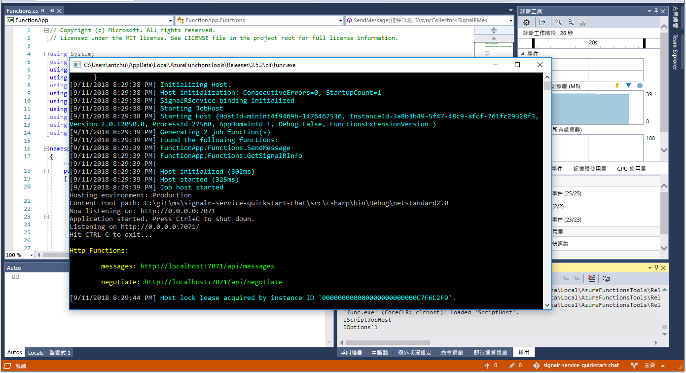

# 快速入門：使用 C# 搭配 Azure Functions 與 SignalR 服務來建立聊天室

Azure SignalR 服務可讓您輕鬆地新增即時功能到您的應用程式。 Azure Functions 是無伺服器平台，可讓您在不需要管理任何基礎結構的情況下執行您的程式碼。 在此快速入門中，了解如何使用 SignalR 服務與 Functions 來至無伺服器的即時聊天應用程式。

## 必要條件

如果尚未安裝 Visual Studio 2017，您可以下載並使用**免費的** [Visual Studio 2017 Community 版本](https://www.visualstudio.com/downloads/)。 務必在 Visual Studio 設定期間啟用 **Azure 開發**。

[!INCLUDE [quickstarts-free-trial-note](../../includes/quickstarts-free-trial-note.md)]

## 登入 Azure

使用您的 Azure 帳戶登入 Azure 入口網站 (<https://portal.azure.com/>)。

[!INCLUDE [Create instance](includes/signalr-quickstart-create-instance.md)]

[!INCLUDE [Clone application](includes/signalr-quickstart-clone-application.md)]

## 設定及執行 Azure Function 應用程式

1. 啟動 Visual Studio 並開啟複製之存放庫的 *chat\src\csharp* 資料夾中的方案。

1. 在開啟 Azure 入口網站的瀏覽器中，透過在入口網站頂端的搜尋方塊中搜尋您稍早部署的 SignalR 服務執行個體名稱，以確認該執行個體已成功建立。 選取該執行個體以開啟它。

    

1. 選取 [金鑰] 以檢視 SignalR 服務執行個體的連接字串。

1. 選取並複製主要連接字串。

1. 返回 Visual Studio，在 [方案總管] 中，將 *local.settings.sample.json* 重新命名為 *local.settings.json*。

1. 在 **local.settings.json** 中，將連接字串貼到 **AzureSignalRConnectionString** 設定的值中。 儲存檔案。

1. 開啟 **Functions.cs**。 此函數應用程式中有兩個 HTTP 觸發的函式：

    - **GetSignalRInfo** - 使用 *SignalRConnectionInfo* 輸入繫結來產生並傳回有效的連線資訊。
    - **SendMessage** - 在要求主體中接收聊天訊息，並使用 *SignalR* 輸出繫結來將訊息廣播給所有已連線的用戶端應用程式。

1. 在 [偵錯] 功能表中，選取 [開始偵錯] 以執行應用程式。

    

[!INCLUDE [Run web application](includes/signalr-quickstart-run-web-application.md)]

[!INCLUDE [Cleanup](includes/signalr-quickstart-cleanup.md)]

## 後續步驟

在此快速入門中，您已在 VS Code 中建置並執行即時無伺服器應用程式。 接著，您將了解入和從 VS Code 部署 Azure Functions。

> [!div class="nextstepaction"]
> [使用 VS Code 部署 Azure Functions](https://code.visualstudio.com/tutorials/functions-extension/getting-started)