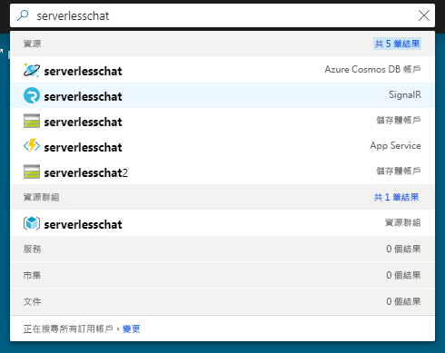
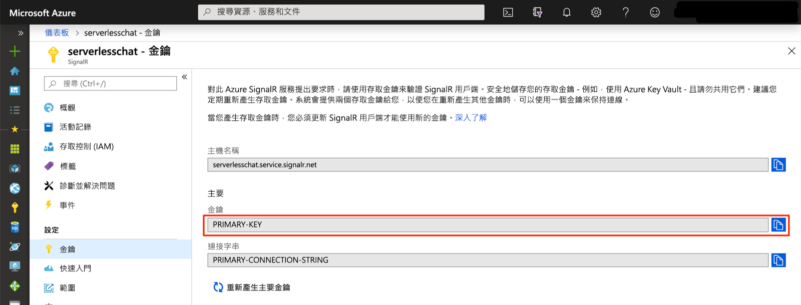

# <a name="quickstart-create-a-chat-room-with-azure-functions-and-signalr-service-using-javascript"></a>快速入門：使用 JavaScript 搭配 Azure Functions 與 SignalR 服務來建立聊天室

Azure SignalR 服務可讓您輕鬆地新增即時功能到您的應用程式。 Azure Functions 是無伺服器平台，可讓您在不需要管理任何基礎結構的情況下執行您的程式碼。 在此快速入門中，了解如何使用 SignalR 服務與 Functions 來建置無伺服器的即時聊天應用程式。


## <a name="prerequisites"></a>必要條件

此快速入門可以在 macOS、Windows 或 Linux 上執行。

請確定您已安裝程式碼編輯器，如 [Visual Studio Code](https://code.visualstudio.com/) \(英文\)。

安裝 [Azure Functions Core Tools (v2)](https://github.com/Azure/azure-functions-core-tools#installing) 以在本機執行 Azure Function 應用程式。

為了安裝延伸模組，Azure Functions Core Tools 目前需要安裝 [.NET Core SDK](https://www.microsoft.com/net/download)。 不過，建置 JavaScript Azure Function 應用程式不需要 .NET 知識。

[!INCLUDE [quickstarts-free-trial-note](../../includes/quickstarts-free-trial-note.md)]


## <a name="log-in-to-azure"></a>登入 Azure

使用您的 Azure 帳戶登入 Azure 入口網站 (<https://portal.azure.com/>)。


[!INCLUDE [Create instance](includes/signalr-quickstart-create-instance.md)]

[!INCLUDE [Clone application](includes/signalr-quickstart-clone-application.md)]


## <a name="configure-and-run-the-azure-function-app"></a>設定及執行 Azure Function 應用程式

1. 在開啟 Azure 入口網站的瀏覽器中，透過在入口網站頂端的搜尋方塊中搜尋您稍早部署的 SignalR 服務執行個體名稱，以確認該執行個體已成功建立。 選取該執行個體以開啟它。

    

1. 選取 [金鑰] 以檢視 SignalR 服務執行個體的連接字串。

1. 選取並複製主要連接字串。

    

1. 在您的程式碼編輯器中，開啟複製之存放庫中的 *chat/src/javascript* 資料夾。

1. 將 *local.settings.sample.json* 重新命名為 *local.settings.json*。

1. 在 **local.settings.json** 中，將連接字串貼到 **AzureSignalRConnectionString** 設定的值中。 儲存檔案。

1. JavaScript 函式會組織成資料夾。 在每個文件夾中有兩個檔案：*function.json* 定義函式中所使用的繫結，*index.js* 是函式的主體。 此函式應用程式中有兩個 HTTP 觸發的函式：

    - **negotiate** - 使用 *SignalRConnectionInfo* 輸入繫結來產生並傳回有效的連線資訊。
    - **messages** - 在要求主體中接收聊天訊息，並使用 *SignalR* 輸出繫結來將訊息廣播給所有已連線的用戶端應用程式。

1. 在終端機中，請確定您處於 *chat/src/javascript* 資料夾中。 使用 Azure Functions Core Tools 安裝執行應用程式所需的擴充功能。

    ```bash
    func extensions install
    ```

1. 執行函式應用程式。

    ```bash
    func start
    ```

    


[!INCLUDE [Run web application](includes/signalr-quickstart-run-web-application.md)]


[!INCLUDE [Cleanup](includes/signalr-quickstart-cleanup.md)]

## <a name="next-steps"></a>後續步驟

在此快速入門中，您已在 Visual Studio 中建置並執行即時無伺服器應用程式。 接下來，深入了解如何使用 Visual Studio 來開發和部署 Azure Functions。

> [!div class="nextstepaction"]
> [使用 Visual Studio 來開發 Azure Functions](../azure-functions/functions-develop-vs.md)