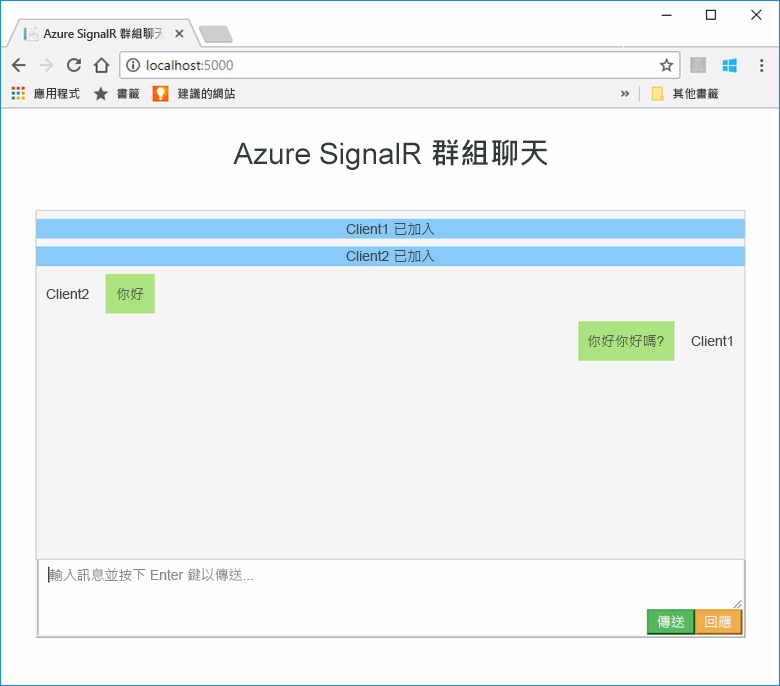

# <a name="quickstart-create-a-chat-room-by-using-signalr-service"></a>快速入門：使用 SignalR 服務建立聊天室


Azure SignalR 服務是可以協助開發人員使用即時功能輕鬆地建置 Web 應用程式的 Azure 服務。 此服務是以[適用於 ASP.NET Core 2.0 的 SignalR](https://docs.microsoft.com/aspnet/core/signalr/introduction) \(機器翻譯\) 為基礎。

本文會示範如何開始使用 Azure SignalR 服務。 在此快速入門中，您將會使用 ASP.NET Core MVC Web 應用程式建立聊天應用程式。 此應用程式會與您的 Azure SignalR 服務資源連線，以提供即時的內容更新。 您將會於本機裝載 Web 應用程式，並與多個瀏覽器用戶端連線。 每個用戶端都將能把內容更新推送至所有其他用戶端。 

您可以使用任何程式碼編輯器來完成本快速入門中的步驟。 Windows、macOS 及 Linux 平台上都有提供的 [Visual Studio Code](https://code.visualstudio.com/) \(英文\) 是一個選項。

本教學課程的程式碼可於 [AzureSignalR-samples GitHub 存放庫](https://github.com/aspnet/AzureSignalR-samples/tree/master/samples/ChatRoom)下載。 您也可以依照[建立 SignalR 服務指令碼](scripts/signalr-cli-create-service.md)中的說明，建立此快速入門中使用的 Azure 資源。

[!INCLUDE [quickstarts-free-trial-note](../../includes/quickstarts-free-trial-note.md)]


## <a name="prerequisites"></a>必要條件

* 安裝 [.NET Core SDK](https://www.microsoft.com/net/download/windows)。
* 下載或複製 [AzureSignalR-sample](https://github.com/aspnet/AzureSignalR-samples) \(英文\) GitHub 存放庫。 

## <a name="create-an-azure-signalr-resource"></a>建立 Azure SignalR 資源

[!INCLUDE [azure-signalr-create](../../includes/signalr-create.md)]

## <a name="create-an-aspnet-core-web-app"></a>建立 ASP.NET Core Web 應用程式

在本節中，您會使用 [.NET Core 命令列介面 (CLI)](https://docs.microsoft.com/dotnet/core/tools/) \(英文\) 來建立 ASP.NET Core MVC Web 應用程式專案。 使用 .NET Core CLI 而非 Visual Studio 的好處，在於 .NET Core CLI 可同時於 Windows、macOS 及 Linux 平台上取得。 

1. 為您的專案建立資料夾。 本快速入門會使用 *E:\Testing\chattest* 資料夾。

2. 在新的資料夾中，執行以下命令以建立專案：

        dotnet new mvc


## <a name="add-secret-manager-to-the-project"></a>將祕密管理員新增至專案

在本節中，您會將[祕密管理員工具](https://docs.microsoft.com/aspnet/core/security/app-secrets) \(機器翻譯\) 新增至您的專案。 祕密管理員工具能儲存專案樹狀結構外開發工作的敏感性資料。 此作法能協助避免於原始程式碼內意外共用應用程式祕密。

1. 開啟您的 *.csproj* 檔案。 新增 `DotNetCliToolReference` 元素以包含 *Microsoft.Extensions.SecretManager.Tools*。 也新增 *chattest.csproj* 的以下程式碼中顯示的 `UserSecretsId` 元素，然後儲存檔案。

    ```xml
    <Project Sdk="Microsoft.NET.Sdk.Web">
    <PropertyGroup>
        <TargetFramework>netcoreapp2.0</TargetFramework>
        <UserSecretsId>SignalRChatRoomEx</UserSecretsId>
    </PropertyGroup>
    <ItemGroup>
        <PackageReference Include="Microsoft.AspNetCore.All" Version="2.0.0" />
    </ItemGroup>
    <ItemGroup>
        <DotNetCliToolReference Include="Microsoft.VisualStudio.Web.CodeGeneration.Tools" Version="2.0.0" />
        <DotNetCliToolReference Include="Microsoft.Extensions.SecretManager.Tools" Version="2.0.0" />
    </ItemGroup>
    </Project>    
    ```

## <a name="add-azure-signalr-to-the-web-app"></a>將 Azure SignalR 新增至 Web 應用程式

1. 透過執行下列命令，將參考新增至 `Microsoft.Azure.SignalR` NuGet 套件：

        dotnet add package Microsoft.Azure.SignalR

2. 執行下列命令以還原您專案的套件：

        dotnet restore

3. 將名為 *Azure:SignalR:ConnectionString* 的祕密新增至祕密管理員。 

    此祕密將包含存取您 SignalR 服務資源的連接字串。 *Azure:SignalR:ConnectionString* 為 SignalR 在建立連線時會尋找的預設組態金鑰。 請以您 SignalR 服務資源的連接字串取代下列命令中的值。

    您必須在和 *.csproj* 檔案相同的目錄中執行此命令。

    ```
    dotnet user-secrets set Azure:SignalR:ConnectionString "<Your connection string>"    
    ```

    祕密管理員將只會用來測試於本機裝載的 Web 應用程式。 在稍後的教學課程中，您會將聊天 Web 應用程式部署至 Azure。 在 Web 應用程式部署至 Azure 之後，您將會使用應用程式設定，而非搭配祕密管理員儲存連接字串。

    此祕密可使用設定 API 來存取。 在所有支援的平台上，組態 API 的組態名稱中都適用冒號 (:)。 請參閱[取決於環境的組態](https://docs.microsoft.com/aspnet/core/fundamentals/configuration/index?tabs=basicconfiguration&view=aspnetcore-2.0)。 


4. 開啟 *Startup.cs* 並更新 `ConfigureServices` 方法，以透過呼叫 `services.AddSignalR().AddAzureSignalR()` 來使用 Azure SignalR 服務：

    ```csharp
    public void ConfigureServices(IServiceCollection services)
    {
        services.AddMvc();
        services.AddSignalR().AddAzureSignalR();
    }
    ```

    透過不傳遞參數至 `AddAzureSignalR()`，此程式碼會針對 SignalR 服務資源連接字串使用預設組態金鑰。 預設組態金鑰為 *Azure: SignalR:ConnectionString*。

5. 同時，透過在 *Startup.cs* 中以下列程式碼取代對 `app.UseStaticFiles()` 的呼叫並儲存檔案，來更新 `Configure` 方法。

    ```csharp
    app.UseFileServer();
    app.UseAzureSignalR(routes =>
    {
        routes.MapHub<Chat>("/chat");
    });
    ```            

### <a name="add-a-hub-class"></a>新增中樞類別

在 SignalR 中，中樞是一個核心元件，可公開由用戶端呼叫的一組方法。 在本節中，您會搭配兩個方法定義中樞類別： 

* `Broadcast`：此方法會將訊息廣播至所有用戶端。
* `Echo`：此方法會將訊息傳送回呼叫端。

這兩個方法都會使用由 ASP.NET Core SignalR SDK 所提供的 `Clients` 介面。 此介面可讓您存取所有已連線的用戶端，以便將內容推送至用戶端。

1. 在您的專案目錄中，新增名為 *Hub* 的資料夾。 將名為 *Chat.cs* 的新中樞程式碼檔案新增至這個新的資料夾。

2. 將下列程式碼新增至 *Chat.cs* 以定義中樞類別，然後儲存檔案。 

    如果您使用 *chattest* 之外的專案名稱，請更新此類別的命名空間。

    ```csharp
    using Microsoft.AspNetCore.SignalR;

    namespace chattest
    {

        public class Chat : Hub
        {
            public void BroadcastMessage(string name, string message)
            {
                Clients.All.SendAsync("broadcastMessage", name, message);
            }

            public void Echo(string name, string message)
            {
                Clients.Client(Context.ConnectionId).SendAsync("echo", name, message + " (echo from server)");
            }
        }
    }
    ```

### <a name="add-the-client-interface-for-the-web-app"></a>新增 Web 應用程式的用戶端介面

此聊天室應用程式的用戶端使用者介面，將會由位於 *wwwroot* 目錄中名為 *index.html* 檔案內的 HTML 和 JavaScript 所組成。

複製[範例存放庫](https://github.com/aspnet/AzureSignalR-samples/tree/master/samples/ChatRoom/wwwroot) \(英文\) 的 *wwwroot* 資料夾中 *css* 和 *scripts* 資料夾內的 *index.html* 檔案。 將它們貼到您專案的 *wwwroot* 資料夾中。

這裡有 *index.html* 的主要程式碼： 

```javascript
var connection = new signalR.HubConnectionBuilder()
                            .withUrl('/chat')
                            .build();
bindConnectionMessage(connection);
connection.start()
    .then(function () {
        onConnected(connection);
    })
    .catch(function (error) {
        console.error(error.message);
    });
```    

*index.html* 中的程式碼會呼叫 `HubConnectionBuilder.build()`，以建立與 Azure SignalR 資源的 HTTP 連線。

如果連線成功，該連線會傳遞至 `bindConnectionMessage`，這會為針對用戶端的傳入內容推送新增事件處理常式。 

`HubConnection.start()` 會開始與中樞進行通訊。 然後 `onConnected()` 會新增按鈕事件處理常式。 這些處理常式會使用連線來允許此用戶端將內容更新推送至所有已連線的用戶端。

## <a name="add-a-development-runtime-profile"></a>新增開發執行階段設定檔

在本節中，您將會新增適用於 ASP.NET Core 的開發執行階段環境。 如需詳細資訊，請參閱[在 ASP.NET Core 中使用多個環境](https://docs.microsoft.com/aspnet/core/fundamentals/environments) \(英文\)。

1. 在專案中建立名為 *Properties* 的資料夾。

2. 將名為 *launchSettings.json* 的檔案新增至資料夾，並在檔案中加入以下內容，然後儲存檔案。

    ```json
    {
        "profiles" : 
        {
            "ChatRoom": 
            {
                "commandName": "Project",
                "launchBrowser": true,
                "environmentVariables": 
                {
                    "ASPNETCORE_ENVIRONMENT": "Development"
                },
                "applicationUrl": "http://localhost:5000/"
            }
        }
    }
    ```


## <a name="build-and-run-the-app-locally"></a>於本機建置並執行應用程式

1. 若要使用 .NET Core CLI 來建置應用程式，請在命令殼層中執行下列命令：

        dotnet build

2. 建置成功完成後，請執行以下命令以在本機執行 Web 應用程式：

        dotnet run

    該應用程式將會依照開發執行階段設定檔中的設定，於本機裝載在連接埠 5000 上：

        E:\Testing\chattest>dotnet run
        Hosting environment: Development
        Content root path: E:\Testing\chattest
        Now listening on: http://localhost:5000
        Application started. Press Ctrl+C to shut down.    

3. 開啟兩個瀏覽器視窗。 在每個瀏覽器中，前往 `http://localhost:5000`。 系統將提示您輸入您的名稱。 為兩個用戶端輸入用戶端名稱，然後使用 [Send]  \(傳送\) 按鈕在兩個用戶端之間測試推送訊息內容。

    


## <a name="clean-up-resources"></a>清除資源

如果您準備繼續進行下一個教學課程，則可以保留在本快速入門中所建立的資源，並重複使用它們。

如果您已完成快速入門範例應用程式，可以刪除在此快速入門中建立的 Azure 資源以避免衍生費用。 

> [!IMPORTANT]
> 刪除資源群組是無法回復的動作，而且會刪除該群組中的所有資源。 請確定您不會誤刪錯誤的資源群組或資源。 如果您是在包含需保留資源的現有資源群組內部，建立用來裝載此範例的資源，則可以從每個資源刀鋒視窗中個別刪除每個資源，而不必刪除整個資源群組。
> 
> 

登入 [Azure 入口網站](https://portal.azure.com)，然後選取 [資源群組]  。

在 [依名稱篩選]  文字方塊中，輸入您資源群組的名稱。 本快速入門的指示是使用名為 *SignalRTestResources* 的資源群組。 在結果清單中的該資源群組上，選取 [...]  > [刪除資源群組]  。

   


系統將會要求您確認是否刪除資源群組。 輸入您資源群組的名稱以進行確認，然後選取 [刪除]  。
   
不久後，系統便會刪除該資源群組及其所有的資源。


## <a name="next-steps"></a>後續步驟

在本快速入門中，您已建立新的 Azure SignalR 服務資源。 然後會搭配 ASP.NET Core Web 應用程式使用它，以將內容更新即時推送至多個已連線的用戶端。 若要深入了解如何使用 Azure SignalR 服務，請繼續進行下一個示範驗證的教學課程。

> [!div class="nextstepaction"]
> [Azure SignalR 服務驗證](./signalr-concept-authenticate-oauth.md)


