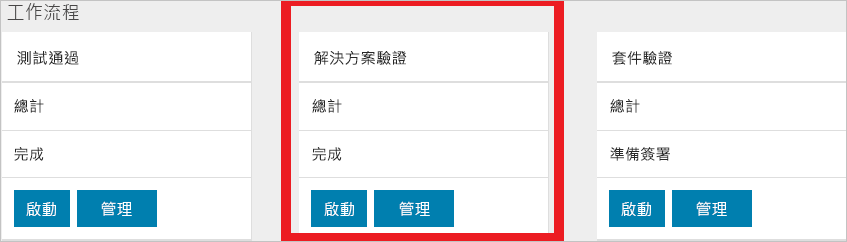
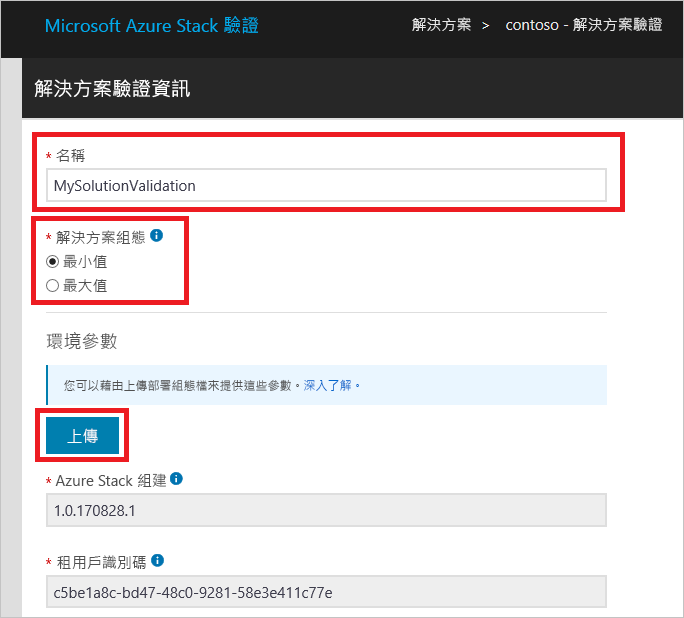

# 驗證新的 Azure Stack 解決方案

[!INCLUDE [Azure_Stack_Partner](./includes/azure-stack-partner-appliesto.md)]

了解如何使用**解決方案驗證**工作流程來認證新的 Azure Stack 解決方案。

Azure Stack 解決方案是一份硬體用料表 (BoM)，此用料表需在符合 Windows Server 標誌認證需求後，獲得 Microsoft 與合作夥伴的認同。 當硬體 BoM 有變更時，解決方案就必須重新進行認證。 若您想深入了解何時應重新認證解決方案，請與團隊聯絡：[vaashelp@microsoft.com](mailto:vaashelp@microsoft.com)。

若要認證您的解決方案，請執行解決方案驗證工作流程兩次。 首先針對*最低*支援組態執行一次。 其次再對「最高」支援組態執行一次。 如果這兩種組態都通過所有測試，Microsoft 即會認證解決方案。

[!INCLUDE [azure-stack-vaas-workflow-validation-completion](includes/azure-stack-vaas-workflow-validation-completion.md)]

## 建立解決方案驗證工作流程

1. [!INCLUDE [azure-stack-vaas-workflow-step_select-solution](includes/azure-stack-vaas-workflow-step_select-solution.md)]
2. 選取 [解決方案驗證] 圖格上的 [開始]。

    

3. [!INCLUDE [azure-stack-vaas-workflow-step_naming](includes/azure-stack-vaas-workflow-step_naming.md)]
4. 選取 [解決方案組態]。
    - **下限**：以支援的節點數目下限設定解決方案。
    - **上限**：以支援的節點數目上限設定解決方案。
5. [!INCLUDE [azure-stack-vaas-workflow-step_upload-stampinfo](includes/azure-stack-vaas-workflow-step_upload-stampinfo.md)]

    

6. [!INCLUDE [azure-stack-vaas-workflow-step_test-params](includes/azure-stack-vaas-workflow-step_test-params.md)]

    > [!NOTE]
    > 建立工作流程後即無法修改環境參數。

7. [!INCLUDE [azure-stack-vaas-workflow-step_tags](includes/azure-stack-vaas-workflow-step_tags.md)]
8. [!INCLUDE [azure-stack-vaas-workflow-step_submit](includes/azure-stack-vaas-workflow-step_submit.md)]
    系統會將您重新導向至測試摘要頁面。

## 執行解決方案驗證測試

在 [解決方案驗證測試摘要] 頁面中，您會看到完成驗證所需的測試清單。

[!INCLUDE [azure-stack-vaas-workflow-validation-section_schedule](includes/azure-stack-vaas-workflow-validation-section_schedule.md)]

## 後續步驟

- [監視和管理 VaaS 入口網站中的測試](azure-stack-vaas-monitor-test.md)