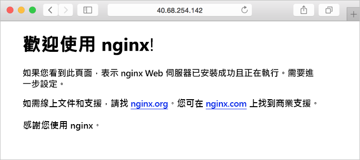

# <a name="quickstart-create-a-linux-server-virtual-machine-by-using-powershell-in-azure-stack"></a>快速入門：在 Azure Stack 中使用 PowerShell 建立 Linux 伺服器虛擬機器

*適用於：Azure Stack 整合系統和 Azure Stack 開發套件*

您可以使用 Azure Stack PowerShell 建立 Ubuntu Server 16.04 LTS 虛擬機器。 請遵循本文中的步驟建立和使用虛擬機器。  本文也提供下列操作的步驟：

* 使用遠端用戶端連線到虛擬機器。
* 安裝 NGINX 網頁伺服器，並且檢視預設首頁。
* 清除未使用的資源。

## <a name="prerequisites"></a>必要條件

* **Azure Stack 市集中的 Linux 映像**

   Azure Stack 市集預設並未包含 Linux 映像。 請求 Azure Stack 操作員提供您所需的**Ubuntu Server 16.04 LTS** 映像。 操作員可以使用[將 Marketplace 項目從 Azure 下載到 Azure Stack](../azure-stack-download-azure-marketplace-item.md) 一文中所述的步驟。

* Azure Stack 需要特定版本的 Azure PowerShell，才能建立和管理資源。 如果您尚未針對 Azure Stack 設定 PowerShell，請依照步驟來[安裝](azure-stack-powershell-install.md) PowerShell。

* 設定好 Azure Stack PowerShell 後，您必須連線到 Azure Stack 環境。 如需指示，請參閱[以使用者的身分使用 PowerShell 連線到 Azure Stack](azure-stack-powershell-configure-user.md)。

* 名稱為 id_rsa.pub 的公開 SSH 金鑰應儲存在 Windows 使用者設定檔的 .ssh 目錄中。 如需有關建立 SSH 金鑰的詳細資訊，請參閱[在 Windows 上建立 SSH 金鑰](../../virtual-machines/linux/ssh-from-windows.md)。

## <a name="create-a-resource-group"></a>建立資源群組

資源群組是您可以在其中部署和管理 Azure Stack 資源的邏輯容器。 從您的開發套件或 Azure Stack 整合系統，執行下列程式碼區塊來建立資源群組。 本文件中的所有變數都有指派值，您可以使用這些值或指派新的值。

```powershell
# Create variables to store the location and resource group names.
$location = "local"
$ResourceGroupName = "myResourceGroup"

New-AzureRmResourceGroup `
  -Name $ResourceGroupName `
  -Location $location
```

## <a name="create-storage-resources"></a>建立儲存體資源

建立儲存體帳戶，然後建立 Ubuntu Server 16.04 LTS 映像的儲存體容器。

```powershell
# Create variables to store the storage account name and the storage account SKU information
$StorageAccountName = "mystorageaccount"
$SkuName = "Standard_LRS"

# Create a new storage account
$StorageAccount = New-AzureRMStorageAccount `
  -Location $location `
  -ResourceGroupName $ResourceGroupName `
  -Type $SkuName `
  -Name $StorageAccountName

Set-AzureRmCurrentStorageAccount `
  -StorageAccountName $storageAccountName `
  -ResourceGroupName $resourceGroupName

# Create a storage container to store the virtual machine image
$containerName = 'osdisks'
$container = New-AzureStorageContainer `
  -Name $containerName `
  -Permission Blob
```

## <a name="create-networking-resources"></a>建立網路資源

建立虛擬網路、子網路和公用 IP 位址。 這些資源用來提供虛擬機器的網路連線能力。

```powershell
# Create a subnet configuration
$subnetConfig = New-AzureRmVirtualNetworkSubnetConfig `
  -Name mySubnet `
  -AddressPrefix 192.168.1.0/24

# Create a virtual network
$vnet = New-AzureRmVirtualNetwork `
  -ResourceGroupName $ResourceGroupName `
  -Location $location `
  -Name MyVnet `
  -AddressPrefix 192.168.0.0/16 `
  -Subnet $subnetConfig

# Create a public IP address and specify a DNS name
$pip = New-AzureRmPublicIpAddress `
  -ResourceGroupName $ResourceGroupName `
  -Location $location `
  -AllocationMethod Static `
  -IdleTimeoutInMinutes 4 `
  -Name "mypublicdns$(Get-Random)"

```

### <a name="create-a-network-security-group-and-a-network-security-group-rule"></a>建立網路安全性群組和網路安全性群組規則

網路安全性群組可透過使用輸入和輸出規則來保護虛擬機器。 建立連接埠 3389 的輸入規則以允許傳入的遠端桌面連線，並建立連接埠 80 的輸入規則以允許傳入的網路流量。

```powershell
# Create variables to store the network security group and rules names.
$nsgName = "myNetworkSecurityGroup"
$nsgRuleSSHName = "myNetworkSecurityGroupRuleSSH"
$nsgRuleWebName = "myNetworkSecurityGroupRuleWeb"


# Create an inbound network security group rule for port 22
$nsgRuleSSH = New-AzureRmNetworkSecurityRuleConfig -Name $nsgRuleSSHName -Protocol Tcp `
-Direction Inbound -Priority 1000 -SourceAddressPrefix * -SourcePortRange * -DestinationAddressPrefix * `
-DestinationPortRange 22 -Access Allow

# Create an inbound network security group rule for port 80
$nsgRuleWeb = New-AzureRmNetworkSecurityRuleConfig -Name $nsgRuleWebName -Protocol Tcp `
-Direction Inbound -Priority 1001 -SourceAddressPrefix * -SourcePortRange * -DestinationAddressPrefix * `
-DestinationPortRange 80 -Access Allow

# Create a network security group
$nsg = New-AzureRmNetworkSecurityGroup -ResourceGroupName $ResourceGroupName -Location $location `
-Name $nsgName -SecurityRules $nsgRuleSSH,$nsgRuleWeb
```

### <a name="create-a-network-card-for-the-virtual-machine"></a>建立虛擬機器的網路卡

網路卡可讓虛擬機器連線到子網路、網路安全性群組和公用 IP 位址。

```powershell
# Create a virtual network card and associate it with public IP address and NSG
$nic = New-AzureRmNetworkInterface `
  -Name myNic `
  -ResourceGroupName $ResourceGroupName `
  -Location $location `
  -SubnetId $vnet.Subnets[0].Id `
  -PublicIpAddressId $pip.Id `
  -NetworkSecurityGroupId $nsg.Id
```

## <a name="create-a-virtual-machine"></a>建立虛擬機器

建立虛擬機器組態。 此組態包括部署虛擬機器時使用的設定。 例如：使用者認證、大小和虛擬機器映像。

```powershell
# Define a credential object.
$UserName='demouser'
$securePassword = ConvertTo-SecureString ' ' -AsPlainText -Force
$cred = New-Object System.Management.Automation.PSCredential ($UserName, $securePassword)

# Create the virtual machine configuration object
$VmName = "VirtualMachinelatest"
$VmSize = "Standard_D1"
$VirtualMachine = New-AzureRmVMConfig `
  -VMName $VmName `
  -VMSize $VmSize

$VirtualMachine = Set-AzureRmVMOperatingSystem `
  -VM $VirtualMachine `
  -Linux `
  -ComputerName "MainComputer" `
  -Credential $cred

$VirtualMachine = Set-AzureRmVMSourceImage `
  -VM $VirtualMachine `
  -PublisherName "Canonical" `
  -Offer "UbuntuServer" `
  -Skus "16.04-LTS" `
  -Version "latest"

$osDiskName = "OsDisk"
$osDiskUri = '{0}vhds/{1}-{2}.vhd' -f `
  $StorageAccount.PrimaryEndpoints.Blob.ToString(),`
  $vmName.ToLower(), `
  $osDiskName

# Sets the operating system disk properties on a virtual machine.
$VirtualMachine = Set-AzureRmVMOSDisk `
  -VM $VirtualMachine `
  -Name $osDiskName `
  -VhdUri $OsDiskUri `
  -CreateOption FromImage | `
  Add-AzureRmVMNetworkInterface -Id $nic.Id

# Configure SSH Keys
$sshPublicKey = Get-Content "$env:USERPROFILE\.ssh\id_rsa.pub"

# Adds the SSH Key to the virtual machine
Add-AzureRmVMSshPublicKey -VM $VirtualMachine `
 -KeyData $sshPublicKey `
 -Path "/home/azureuser/.ssh/authorized_keys"

# Create the virtual machine.
New-AzureRmVM `
  -ResourceGroupName $ResourceGroupName `
 -Location $location `
  -VM $VirtualMachine
```

## <a name="quick-create-virtual-machine---full-script"></a>快速建立虛擬機器 - 完整指令碼

> [!NOTE]
> 大致如同以上合併的程式碼，但使用密碼而非 SSH 金鑰進行驗證。

```powershell
## Create a resource group

<#
A resource group is a logical container where you can deploy and manage Azure Stack resources. From your development kit or the Azure Stack integrated system, run the following code block to create a resource group. Values are assigned for all the variables in this document, you can use these values or assign new values.
#>

# Edit your variables here if required

# Create variables to store the location and resource group names.
$location = "local"
$ResourceGroupName = "myResourceGroup"

# Create variables to store the storage account name and the storage account SKU information
$StorageAccountName = "mystorageaccount"
$SkuName = "Standard_LRS"

# Create variables to store the network security group and rules names.
$nsgName = "myNetworkSecurityGroup"
$nsgRuleSSHName = "myNetworkSecurityGroupRuleSSH"
$nsgRuleWebName = "myNetworkSecurityGroupRuleWeb"

# Create variable for virtual machine password
$VMPassword = 'Password123!'

# End of Variables - no need to edit anything past that point to deploy a single VM

# Create Resource Group
New-AzureRmResourceGroup `
  -Name $ResourceGroupName `
  -Location $location

## Create storage resources

# Create a storage account and then create a storage container for the Ubuntu Server 16.04 LTS image.

# Create a new storage account
$StorageAccount = New-AzureRMStorageAccount `
  -Location $location `
  -ResourceGroupName $ResourceGroupName `
  -Type $SkuName `
  -Name $StorageAccountName

Set-AzureRmCurrentStorageAccount `
  -StorageAccountName $storageAccountName `
  -ResourceGroupName $resourceGroupName

# Create a storage container to store the virtual machine image
$containerName = 'osdisks'
$container = New-AzureStorageContainer `
  -Name $containerName `
  -Permission Blob


## Create networking resources

# Create a virtual network, subnet, and a public IP address. These resources are used to provide network connectivity to the virtual machine.

# Create a subnet configuration
$subnetConfig = New-AzureRmVirtualNetworkSubnetConfig `
  -Name mySubnet `
  -AddressPrefix 192.168.1.0/24

# Create a virtual network
$vnet = New-AzureRmVirtualNetwork `
  -ResourceGroupName $ResourceGroupName `
  -Location $location `
  -Name MyVnet `
  -AddressPrefix 192.168.0.0/16 `
  -Subnet $subnetConfig

# Create a public IP address and specify a DNS name
$pip = New-AzureRmPublicIpAddress `
  -ResourceGroupName $ResourceGroupName `
  -Location $location `
  -AllocationMethod Static `
  -IdleTimeoutInMinutes 4 `
  -Name "mypublicdns$(Get-Random)"


### Create a network security group and a network security group rule

<#
The network security group secures the virtual machine by using inbound and outbound rules. Create an inbound rule for port 3389 to allow incoming Remote Desktop connections and an inbound rule for port 80 to allow incoming web traffic.
#>

# Create an inbound network security group rule for port 22
$nsgRuleSSH = New-AzureRmNetworkSecurityRuleConfig -Name $nsgRuleSSHName -Protocol Tcp `
-Direction Inbound -Priority 1000 -SourceAddressPrefix * -SourcePortRange * -DestinationAddressPrefix * `
-DestinationPortRange 22 -Access Allow

# Create an inbound network security group rule for port 80
$nsgRuleWeb = New-AzureRmNetworkSecurityRuleConfig -Name $nsgRuleWebName -Protocol Tcp `
-Direction Inbound -Priority 1001 -SourceAddressPrefix * -SourcePortRange * -DestinationAddressPrefix * `
-DestinationPortRange 80 -Access Allow

# Create a network security group
$nsg = New-AzureRmNetworkSecurityGroup -ResourceGroupName $ResourceGroupName -Location $location `
-Name $nsgName -SecurityRules $nsgRuleSSH,$nsgRuleWeb

### Create a network card for the virtual machine

# The network card connects the virtual machine to a subnet, network security group, and public IP address.

# Create a virtual network card and associate it with public IP address and NSG
$nic = New-AzureRmNetworkInterface `
  -Name myNic `
  -ResourceGroupName $ResourceGroupName `
  -Location $location `
  -SubnetId $vnet.Subnets[0].Id `
  -PublicIpAddressId $pip.Id `
  -NetworkSecurityGroupId $nsg.Id

## Create a virtual machine
<#
Create a virtual machine configuration. This configuration includes the settings used when deploying the virtual machine. For example: user credentials, size, and the virtual machine image.
#>

# Define a credential object.
$UserName='demouser'
$securePassword = ConvertTo-SecureString $VMPassword -AsPlainText -Force
$cred = New-Object System.Management.Automation.PSCredential ($UserName, $securePassword)

# Create the virtual machine configuration object
$VmName = "VirtualMachinelatest"
$VmSize = "Standard_D1"
$VirtualMachine = New-AzureRmVMConfig `
  -VMName $VmName `
  -VMSize $VmSize

$VirtualMachine = Set-AzureRmVMOperatingSystem `
  -VM $VirtualMachine `
  -Linux `
  -ComputerName "MainComputer" `
  -Credential $cred

$VirtualMachine = Set-AzureRmVMSourceImage `
  -VM $VirtualMachine `
  -PublisherName "Canonical" `
  -Offer "UbuntuServer" `
  -Skus "16.04-LTS" `
  -Version "latest"

$osDiskName = "OsDisk"
$osDiskUri = '{0}vhds/{1}-{2}.vhd' -f `
  $StorageAccount.PrimaryEndpoints.Blob.ToString(),`
  $vmName.ToLower(), `
  $osDiskName

# Sets the operating system disk properties on a virtual machine.
$VirtualMachine = Set-AzureRmVMOSDisk `
  -VM $VirtualMachine `
  -Name $osDiskName `
  -VhdUri $OsDiskUri `
  -CreateOption FromImage | `
  Add-AzureRmVMNetworkInterface -Id $nic.Id

# Create the virtual machine.
New-AzureRmVM `
  -ResourceGroupName $ResourceGroupName `
 -Location $location `
  -VM $VirtualMachine
```

## <a name="connect-to-the-virtual-machine"></a>連接至虛擬機器

部署虛擬機器之後，設定虛擬機器的 SSH 連線。 使用 [Get-AzureRmPublicIpAddress](/powershell/module/azurerm.network/get-azurermpublicipaddress?view=azurermps-4.3.1) 命令，以傳回虛擬機器的公用 IP 位址。

```powershell
Get-AzureRmPublicIpAddress -ResourceGroupName myResourceGroup | Select IpAddress
```

從已安裝 SSH 的用戶端系統，使用下列命令來連線至虛擬機器。 如果您正在使用 Windows，可以使用 [Putty](http://www.putty.org/) 來建立連線。

```
ssh <Public IP Address>
```

出現提示時，輸入 azureuser 作為登入使用者。 如果您在建立 SSH 金鑰時使用複雜密碼，您必須提供複雜密碼。

## <a name="install-the-nginx-web-server"></a>安裝 NGINX 網頁伺服器

若要更新套件資源及安裝最新的 NGINX 套件，請執行下列指令碼：

```bash
#!/bin/bash

# update package source
apt-get -y update

# install NGINX
apt-get -y install nginx
```

## <a name="view-the-nginx-welcome-page"></a>檢視 NGINX 歡迎使用頁面

在已於虛擬機器上安裝 NGINX 並開啟連接埠 80 的情況下，您可以使用虛擬機器的公用 IP 位址存取網頁伺服器。 請開啟網頁瀏覽器，然後瀏覽至 ```http://<public IP address>```。



## <a name="clean-up-resources"></a>清除資源

清除您不再需要的資源。 您可以使用 [Remove-AzureRmResourceGroup](/powershell/module/azurerm.resources/remove-azurermresourcegroup?view=azurermps-4.3.1) 命令來移除這些資源。 若要刪除資源群組和其所有資源，請執行下列命令︰

```powershell
Remove-AzureRmResourceGroup -Name myResourceGroup
```

## <a name="next-steps"></a>後續步驟

在這個快速入門中，您已部署基本的 Linux 伺服器虛擬機器。 若要深入了解 Azure Stack 虛擬機器，請移至 [Azure Stack 中虛擬機器的考量](azure-stack-vm-considerations.md)。
