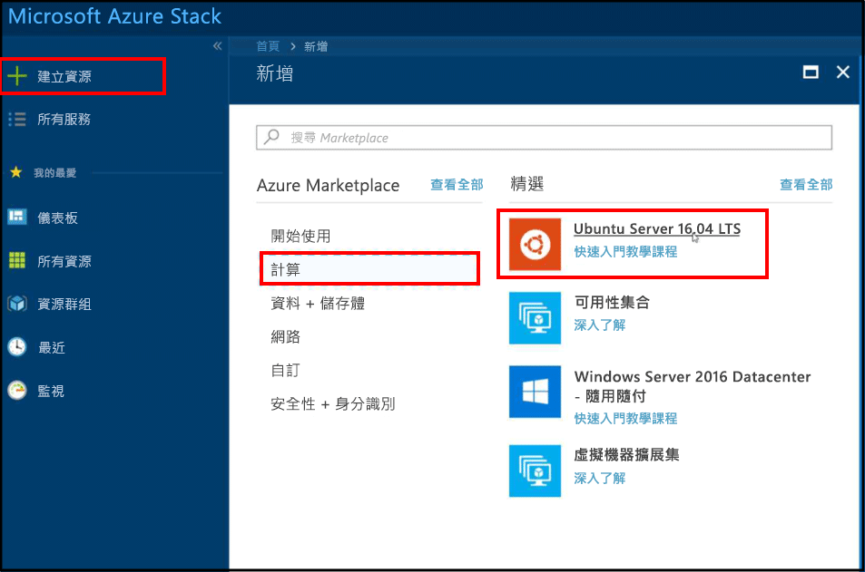
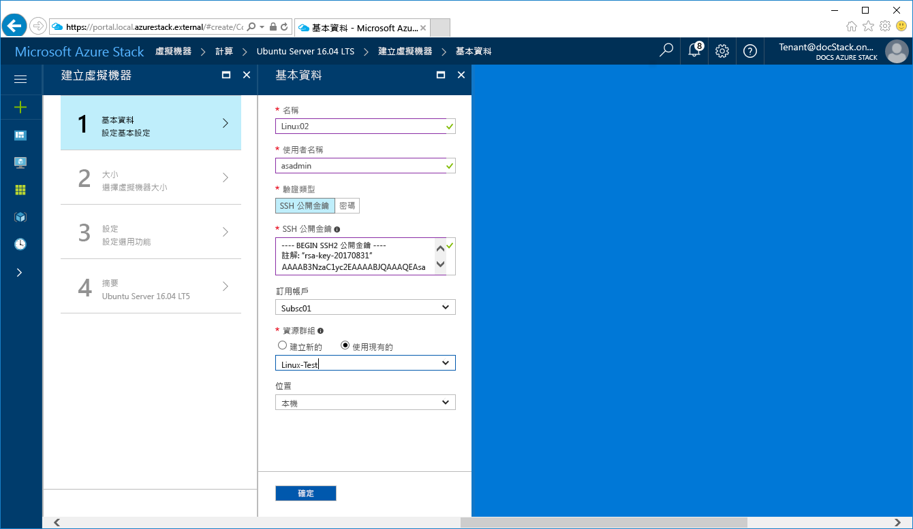
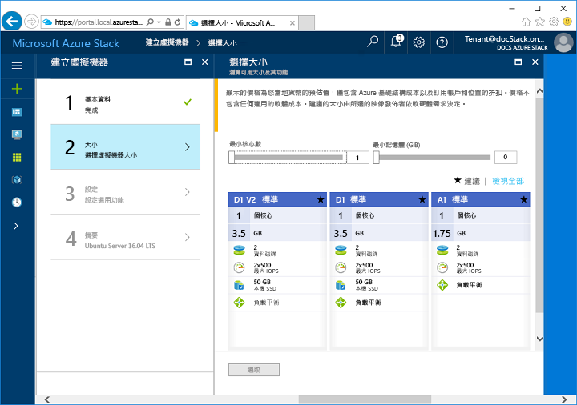
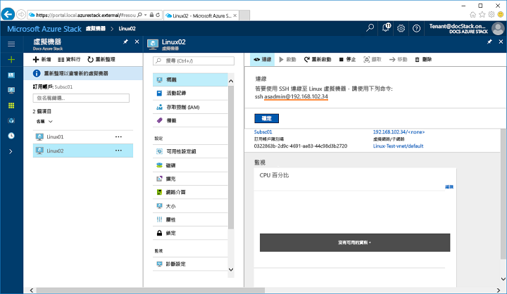
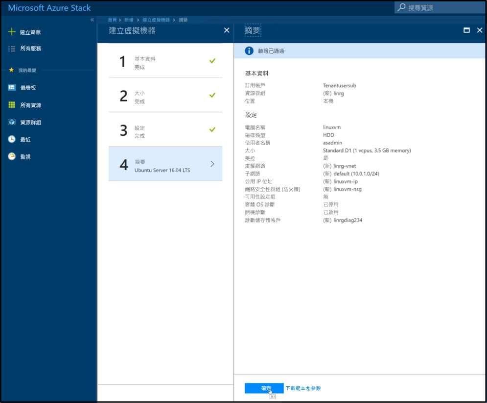

# <a name="quickstart-create-a-linux-server-virtual-machine-with-the-azure-stack-portal"></a>快速入門：使用 Azure Stack 入口網站建立 Linux 伺服器虛擬機器

*適用於：Azure Stack 整合系統和 Azure Stack 開發套件*

您可以使用 Azure Stack 入口網站建立 Ubuntu Server 16.04 LTS 虛擬機器。 請遵循本文中的步驟建立和使用虛擬機器。 本文也提供下列操作的步驟：

* 使用遠端用戶端連線到虛擬機器。
* 安裝 NGINX 網頁伺服器。
* 清除資源。

> [!NOTE]  
> 本文中的螢幕影像會更新為符合 Azure Stack 1808 版所導入的變更。 除了非受控磁碟之外，1808 加入對使用「受控磁碟」的支援。 若您使用較早的版本，某些工作影像 (例如磁碟選取) 將會與本文所顯示的影像不同。  


## <a name="prerequisites"></a>必要條件

* **Azure Stack 市集中的 Linux 映像**

   Azure Stack 市集預設並未包含 Linux 映像。 請先確定 Azure Stack 操作員提供您所需的 **Ubuntu Server 16.04 LTS** 映像，才可建立 Linux 伺服器虛擬機器。 操作員可以使用[將 Marketplace 項目從 Azure 下載到 Azure Stack](../azure-stack-download-azure-marketplace-item.md) 一文中所述的步驟。

* **SSH 用戶端存取權**

   如果您使用 Azure Stack 開發套件 (ASDK)，可能無法存取 SSH 用戶端。 如果您需要用戶端，有數個包含 SSH 用戶端的套件。 例如，PuTTY 包含 SSH 用戶端和 SSH 金鑰產生器 (puttygen.exe)。 如需有關可用套件的詳細資訊，請參閱下列 Azure 文章：[如何在 Azure 上搭配 Windows 使用 SSH 金鑰](https://docs.microsoft.com/azure/virtual-machines/linux/ssh-from-windows#windows-packages-and-ssh-clients)。

   本快速入門使用 PuTTY 來產生 SSH 金鑰及連線到 Linux 伺服器虛擬機器。 若要下載並安裝 PuTTY，請移至 [http://www.putty.org/](http://www.putty.org)。

## <a name="create-an-ssh-key-pair"></a>建立 SSH 金鑰組

您需要 SSH 金鑰組才能完成本文中的所有步驟。 如果您有現有的 SSH 金鑰組，則可略過此步驟。

1. 瀏覽至 PuTTY 安裝資料夾 (預設位置為 ```C:\Program Files\PuTTY```) 並執行 ```puttygen.exe```。
2. 在 [PuTTY Key Generator] \(PuTTY 金鑰產生器\) 視窗中，確定 [Type of key to generate] \(要產生的金鑰類型\) 已設定為 [RSA]，並且 [Number of bits in a generated key] \(所產生金鑰中的位元數\) 已設定為 **2048**。 準備好時，按一下 [Generate] \(產生\)。

   

3. 若要產生金鑰，請將您的滑鼠游標隨機移至 [PuTTY 金鑰產生器] 視窗內。
4. 完成金鑰產生程序時，按一下 [Save public key] \(儲存公開金鑰\)，然後按一下 [Save private key] \(儲存私密金鑰\) 將金鑰儲存至檔案。

   

## <a name="sign-in-to-the-azure-stack-portal"></a>登入 Azure Stack 入口網站

登入 Azure Stack 入口網站。 Azure Stack 入口網站的位址取決於您所連線的 Azure Stack 產品：

* 如需 Azure Stack 開發套件 (ASDK)，請前往： https://portal.local.azurestack.external。
* 針對 Azure Stack 整合系統，請移至您 Azure Stack 操作員所提供的 URL。

## <a name="create-the-virtual-machine"></a>建立虛擬機器

1. 按一下 Azure Stack 入口網站左上角的 [建立資源]。

2. 選取 [計算]，然後選取 [Ubuntu Server 16.04 LTS]。
   
   
1. 按一下頁面底部的 [新增] 。

4. 輸入虛擬機器資訊。 針對 [驗證類型] 選取 [SSH 公開金鑰]。 貼入您儲存的 SSH 公開金鑰，然後按一下 [確定]。

   >[!NOTE]
 請務必移除金鑰的任何開頭或尾端空格。

   

5. 針對虛擬機器，選取 [D1]。

   

6. 在 [設定] 頁面上，進行任何想要的變更以變更預設值。
   
    - 從 Azure Stack 1808 版開始，您可以在選擇使用 [受控磁碟] 時設定 [儲存體]。 在 1808 版之前，只能使用非受控磁碟。    
      
    
    當您的設定就緒時，請選取 [確定] 以繼續。

7. 在 [摘要] 頁面上，按一下 [確定] 來開始進行虛擬機器部署。  
   

## <a name="connect-to-the-virtual-machine"></a>連接至虛擬機器

1. 在虛擬機器頁面上，按一下 [連接]。 這會顯示連線到虛擬機器所需的 SSH 連接字串。 

2. 開啟 PuTTY。

3. 在 [PuTTY Configuration] \(PuTTY 組態\) 畫面上，您會使用 [Category] \(類別\) 視窗向上或向下捲動。 向下捲動至 [SSH]，依序展開 [SSH]，然後按一下 [Auth]。按一下 [Browse] \(瀏覽\)，然後挑選您所儲存的私密金鑰檔案。
   

4. 在 [Category] \(類別\) 視窗中向上捲動，然後按一下 [Session] \(工作階段\)。
5. 在 [Host Name (or IP address)] \(主機名稱 (或 IP 位址)\) 方塊中，貼上 Azure Stack 入口網站中顯示的連接字串。 在此範例中，該字串為 ```asadmin@192.168.102.34```。

   

6. 按一下 [Open] \(開啟\) 以開啟虛擬機器的工作階段。

   

## <a name="install-the-nginx-web-server"></a>安裝 NGINX 網頁伺服器

請使用下列 Bash 命令來更新套件來源，並在虛擬機器上安裝最新的 NGINX 套件。

```bash
#!/bin/bash

# update package source
sudo apt-get -y update

# install NGINX
sudo apt-get -y install nginx
```

當 NGINX 安裝完成時，請關閉 SSH 工作階段，然後開啟 Azure Stack 入口網站中的虛擬機器 [概觀] 頁面。

## <a name="open-port-80-for-web-traffic"></a>針對 Web 流量開啟連接埠 80

網路安全性群組 (NSG) 可保護輸入和輸出流量。 在 Azure Stack 入口網站中建立虛擬機器時，會在連接埠 22 上建立 SSH 連線的輸入規則。 由於這部虛擬機器裝載網頁伺服器，因此必須建立 NSG 規則才允許連接埠 80 上的 Web 流量。

1. 在虛擬機器的 [概觀] 頁面上，按一下「資源群組」的名稱。
2. 選取虛擬機器的「網路安全性群組」。 使用 [類型] 資料行可以識別 NSG。
3. 在左側功能表的 [設定] 底下，按一下 [輸入安全性規則]。
4. 按一下 [新增] 。
5. 在 [名稱] 中輸入 **http**。 確定 [連接埠範圍] 已設為 80 且 [動作] 已設為 [允許]。
6. 按一下 [檔案] &gt; [新增] &gt; [專案] 

## <a name="view-the-nginx-welcome-page"></a>檢視 NGINX 歡迎使用頁面

在已於虛擬機器上安裝 NGINX 並開啟連接埠 80 的情況下，您可以使用虛擬機器的公用 IP 位址存取網頁伺服器。 (公用 IP 位址會顯示在虛擬機器的 [概觀] 頁面上。)

請開啟網頁瀏覽器，然後瀏覽至 ```http://<public IP address>```。


## <a name="clean-up-resources"></a>清除資源

清除您不再需要的資源。 若要刪除虛擬機器及其資源，請在虛擬機器頁面上選取資源群組，然後按一下 [刪除]。

## <a name="next-steps"></a>後續步驟

在本快速入門中，您已使用網頁伺服器部署基本的 Linux 伺服器虛擬機器。 若要深入了解 Azure Stack 虛擬機器，請繼續移至 [Azure Stack 中虛擬機器的考量](azure-stack-vm-considerations.md)。
