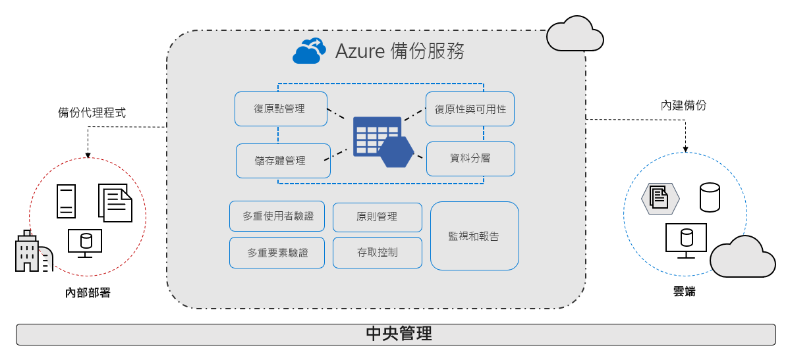

# 什麼是 Azure 備份服務？

Azure 備份服務提供簡單、安全且符合成本效益的解決方案來備份您的資料，並從 Microsoft Azure 雲端進行復原。

> [!VIDEO https://www.youtube.com/embed/elODShatt-c]

## 我可以備份什麼？

- **內部部署** - 使用 [Microsoft Azure 復原服務 (MARS) 代理程式](backup-support-matrix-mars-agent.md)來備份檔案、資料夾、系統狀態。 或者，使用 DPM 或 Azure 備份伺服器 (MABS) 代理程式來保護內部部署 VM ([Hyper-V](back-up-hyper-v-virtual-machines-mabs.md) 和 [VMWare](backup-azure-backup-server-vmware.md)) 和其他[內部部署工作負載](backup-mabs-protection-matrix.md)
- **Azure VM** - [備份整個 Windows/Linux VM](backup-azure-vms-introduction.md) (使用備份擴充功能)，或使用 [MARS 代理程式](backup-azure-manage-mars.md)來備份檔案、資料夾和系統狀態。
- **Azure 檔案儲存體共用** - [將 Azure 檔案共用備份和還原至儲存體帳戶](backup-azure-files.md)
- **Azure VM 中的 SQL Server** -  [備份在 Azure VM 上執行的 SQL Server 資料庫](backup-azure-sql-database.md)
- **Azure VM 中的 SAP HANA 資料庫** - [備份在 Azure VM 上執行的 SAP HANA 資料庫](backup-azure-sap-hana-database.md)

## 為何使用 Azure 備份？

Azure 備份可提供下列主要優點：

- **卸載內部部署備份**：Azure 備份提供了簡單的解決方案，可讓您將內部部署資源備份到雲端。 您不需部署複雜的內部部署備份解決方案，即可取得短期與長期備份。
- **備份 Azure IaaS VM**：Azure 備份提供獨立且隔離的備份，可防止原始資料意外毀損。 備份會儲存在復原服務保存庫中，並進行內建的復原點管理。 設定和調整都十分容易，且備份會最佳化，可在必要時輕易還原。
- **輕鬆調整** - Azure 備份使用 Azure 雲端的基礎功能及無限制調整來提供高可用性，沒有維護或監視的額外負荷。
- **取得無限制的資料傳輸**：Azure 備份不會限制輸入或輸出資料的傳輸，或對傳輸的資料收費。
  - 輸出資料是指還原作業期間傳輸自復原服務保存庫的資料。
  - 如果您使用 Azure 匯入/匯出服務執行離線初始備份以匯出大量資料，則會有輸入資料的相關費用。  [深入了解](backup-azure-backup-import-export.md)。
- **確保資料安全性**：Azure 備份提供解決方案來保護[傳輸中](backup-azure-security-feature.md)和[待用](backup-azure-security-feature-cloud.md)的資料。
- **集中監視和管理**：Azure 備份提供復原服務保存庫中的[內建監視和警示功能](backup-azure-monitoring-built-in-monitor.md)。 這些功能不需要任何額外的管理基礎結構即可供使用。 您也可以[使用 Azure 監視器](backup-azure-monitoring-use-azuremonitor.md)來擴大監視和報告的規模。
- **取得應用程式一致備份**：應用程式一致備份表示復原點具有還原備份複本所需的所有資料。 Azure 備份提供應用程式一致備份，確保資料還原不需要其他修正程式。 還原應用程式一致的資料會減少還原時間，讓您能夠快速回到執行狀態。
- **保留短期和長期資料**：您可以使用[復原服務保存庫](backup-azure-recovery-services-vault-overview.md)進行短期和長期資料保留。
- **自動儲存管理** - 混合式環境通常需要異質性儲存體 - 部份在內部部署，部份在雲端。 有了 Azure 備份，使用內部部署儲存體裝置無需成本。 Azure 備份會自動配置和管理備份儲存體，且採用使用時付費制。 因此，您只需針對使用的儲存體支付費用。 [深入了解](https://azure.microsoft.com/pricing/details/backup)定價。
- **多個儲存體選項** - Azure 備份提供兩種類型的複寫，讓您的儲存體/資料保有高可用性。
  - [本地備援儲存體 (LRS)](../storage/common/storage-redundancy-lrs.md) 會將資料複寫至資料中心的儲存體縮放單位三次 (建立三個資料複本)。 此資料的所有複本都存在於相同的區域內。 LRS 是保護資料免於本機硬體故障的低成本選項。
  - [異地備援儲存體 (GRS)](../storage/common/storage-redundancy-grs.md) 是預設且建議使用的複寫選項。 GRS 會將資料複寫到次要地區 (與來源資料主要位置距離數百英哩)。 GRS 的價格高於 LRS，但可為您的資料提供更高層級的持久性，即使遭受區域性中斷也不影響。

## 後續步驟

- [檢閱](backup-architecture.md)不同備份案例的架構和元件。
- [驗證](backup-support-matrix.md)備份 及 [Azure VM 備份](backup-support-matrix-iaas.md)的支援需求和限制。
