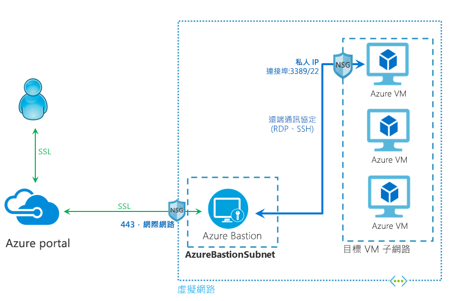

# 何謂 Azure Bastion？ (預覽)

Azure Bastion 服務是您可在虛擬網路內佈建的新完全平台受控 PaaS 服務。 直接在 Azure 入口網站中，透過 SSL 提供與虛擬機器之間安全且順暢的 RDP/SSH 連線。 透過 Azure Bastion 連線時，虛擬機器不需要公用 IP 位址。

 Bastion 為佈建所在虛擬網路中的所有 VM，提供安全的 RDP 和 SSH 連線。 使用 Azure Bastion 來保護您的虛擬機器免於向外公開 RDP/SSH 連接埠，同時提供使用 RDP/SSH 的安全存取。 使用 Azure Bastion，您可以從 Azure 入口網站直接連線到虛擬機器。 不需要額外用戶端、代理程式或軟體。

> [!IMPORTANT]
> 此公開預覽版是在沒有服務等級協定的情況下提供，不得用於生產工作負載。 可能不支援特定功能、可能已經限制功能，或者可能無法在所有 Azure 位置提供使用。 如需詳細資訊，請參閱 [Microsoft Azure 預覽專用的補充使用條款](https://azure.microsoft.com/support/legal/preview-supplemental-terms/)。
>

## 架構

Azure Bastion 是部署在您的虛擬網路中，一旦部署，它就會為您虛擬網路中的所有虛擬機器提供安全的 RDP/SSH 體驗。 您在虛擬網路中佈建 Azure Bastion 服務後，即可對同一個虛擬網路中的所有 VM 提供 RDP/SSH 體驗。 此部署依虛擬網路來進行，而非以訂用帳戶/帳戶或虛擬機器為依據。

RDP 和 SSH 是一些基本的方式，讓您可以與 Azure 中執行的工作負載連線。 透過網際網路公開 RDP/SSH 連接埠並非預期，而且會視為重大威脅。 這通常是因為通訊協定弱點。 若要控制這個威脅，您可以周邊網路的公用端部署堡壘主機 (也稱為跳板機)。 堡壘主機伺服器是設計及設定來防禦攻擊。 堡壘伺服器也會提供與位於堡壘後方 (以及進一步的網路內) 工作負載的 RDP 和 SSH 連線。

此圖顯示 Azure Bastion 部署的架構。 在此圖表中：

* 堡壘主機部署在虛擬網路中。
* 使用者使用任何 HTML5 瀏覽器連線到 Azure 入口網站。
* 使用者選取要連線的虛擬機器。
* 只要按一下，RDP/SSH 工作階段就會在瀏覽器中開啟。
* Azure VM 上不需要公用 IP。

## 主要功能

下列功能在公開預覽期間提供試用：

* **在 Azure 入口網站直接進行 RDP 和 SSH 連線：** 您可以使用按一下無縫體驗，在 Azure 入口網站中直接進入 RDP 和 SSH 工作階段。
* **RDP/SSH 透過 SSL 和防火牆周遊的遠端工作階段：** Azure Bastion 使用 HTML5 型 Web 用戶端，它會自動串流到您的本機裝置，讓您透過 SSL 在連接埠 443 上進入 RDP/SSH 工作階段，安全地周遊在公司防火牆上。
* **Azure VM 上不需要公用 IP：** Azure Bastion 會使用您 VM 上的私人 IP，開啟與您 Azure 虛擬機器的 RDP/SSH 連線。 您在虛擬機器上不需要公用 IP。
* **管理 NSG 不麻煩：** Azure Bastion 是 Azure 的完全受控平台 PaaS 服務，在內部經過強化，為您提供安全的 RDP/SSH 連線。 您在 Azure Bastion 子網路上不需要套用任何 NSG。 因為 Azure Bastion 是透過私人 IP 連線到您的虛擬機器，所以您可以設定您的 NSG 只允許來自 Azure Bastion 的 RDP/SSH。 這樣會減輕每次想要安全地連線到虛擬機器時就需要管理 NSG 的負擔。
* **針對連接埠掃描的保護：** 因為您不需要將虛擬機器公開到公用網際網路，所以您的 VMs 受到保護，免於位在虛擬網路外部惡意使用者所做的連接埠掃描。
* **保護免於零時差攻擊。僅在一個地方強化：** Azure Bastion 是完全平台受控 PaaS 服務。 因為它位在您虛擬網路的周邊網路，所以您不需要擔心要對虛擬網路中的每一部虛擬機器進行強化。 Azure 平台會藉由保持 Azure Bastion 強化及維持最新狀態，保護您免於零時差攻擊。

## 常見問題集

[!INCLUDE [Bastion FAQ](../../includes/bastion-faq-include.md)]

## 後續步驟

* [建立 Azure Bastion 主機資源](bastion-create-host-portal.md)
* 了解 Azure 的一些其他重要[網路功能](../networking/networking-overview.md)。
