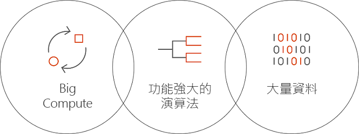

# Azure 中的 Batch AI 是什麼？
Batch AI 是一項受控服務，可讓資料科學家和 AI 研究人員在 Azure 虛擬機器 (包括具有 GPU 支援的 VM) 叢集上定型 AI 和其他機器學習模型。 您可描述您的作業需求、尋找輸入和儲存輸出的位置，而 Batch AI 會處理其餘部分。  
 
## 為何要使用 Batch AI？ 
開發強大的 AI 演算法需要大量計算且反覆運作的程序。 資料科學家和 AI 研究人員需要處理日漸變大的資料集。 他們正在開發具有多層的模型，並透過對超參數微調進行更多網路設計測試來執行此作業。 若要有效率地執行此作業，則每個模型中需有多個 CPU 和 GPU、以平行方式執行實驗，以及具備可供訓練資料、記錄和模型輸出的共用儲存體。   
 

資料科學家和 AI 研究人員都是其領域中的專家，然而對於大規模管理基礎結構卻可能是一大阻礙。 大規模開發 AI 需要進行執行許多基礎結構工作：佈建 VM 叢集、安裝軟體和容器、在工作排入佇列、設定作業的優先順序及排程、處理失敗、散發資料、共用結果、調整資源來管理成本以及與工具和工作流程整合。 Batch AI 會處理這些工作。 
 
## Batch AI 是什麼？ 

Batch AI 提供專為 AI 訓練和測試特製化的資源管理和作業排程。 主要功能包括： 

* 執行長時間執行的批次作業、反覆測試，以及互動式訓練 
* 使用 GPU 或 CPU 自動或手動調整 VM 叢集 
* 設定 VM 之間的 SSH 通訊，以供遠端存取 
* 任何深度學習或機器學習架構的支援，包含熱門工具組 (例如[Microsoft Cognitive Toolkit](https://github.com/Microsoft/CNTK) (CNTK)、[TensorFlow](https://www.tensorflow.org/), 和 [Chainer](https://chainer.org/)) 的最佳化組態 
* 以優先順序為基礎的作業佇列，可共用叢集並利用低優先順序的 VM 和保留執行個體  
* 彈性儲存體選項，包括 Azure 檔案服務和受控 NFS 伺服器 
* 將遠端檔案共用掛接到 VM 和選擇性容器 
* 提供作業狀態，並可在 VM 失敗時重新啟動 
* 輸出記錄、stdout、stderr 和模型的存取權，包括從 Azure 儲存體串流 
* Azure [命令列介面](/cli/azure) (CLI)、適用於 [Python](https://github.com/Azure/azure-sdk-for-python)[C#](https://www.nuget.org/packages/Microsoft.Azure.Management.BatchAI/1.0.0-preview) 和 Java 的 SDK、在 Azure 入口網站中監視，以及與 Microsoft AI 工具整合 

Batch AI SDK 支援撰寫指令碼或應用程式，以管理訓練管線與工具整合。 SDK 目前提供 Python、C#、Java 和 REST API。  
 

Batch AI 使用 Azure Resource Manager 來進行控制平面作業 (建立、列出、取得、刪除)。 Azure Active Directory 使用於驗證和角色型存取控制。  
 
## 如何使用 Batch AI 

若要使用 Batch AI，請定義和管理*叢集*和*作業*。 

 
**叢集**可描述您的計算需求： 
* 您要在其中執行的 Azure 區域 
* 要使用的 VM 系列和大小 - 例如，NC24 VM，其中包含 4 個 NVIDIA K80 GPU 
* VM 數目，或可供自動調整的最小和最大數目 
* VM 映像 - 例如 Ubuntu 16.04 LTS 或 [Microsoft 深度學習虛擬機器](https://azuremarketplace.microsoft.com/marketplace/apps/microsoft-ads.dsvm-deep-learning)
* 要掛接的任何遠端檔案共用磁碟區 - 例如，從 Azure 檔案服務或 Batch AI 所管理的 NFS 伺服器 
* 要在 VM 上設定的使用者名稱和 SSH 金鑰或密碼，以啟用互動式登入進行偵錯  
 

**作業**可描述： 
* 要使用的叢集和區域 
* 有多少部 VM 可供作業使用 
* 啟動時要傳遞給作業的輸入和輸出目錄。 通常會使用在叢集設定期間掛接的共用檔案系統 
* 要執行軟體或安裝指令碼的選擇性容器 
* 用來啟動作業的 AI 架構特有組態或命令列和參數 
 

開始使用 Batch AI 搭配 [Azure CLI](/cli/azure) 與叢集和作業的組態檔。 視需要使用此方式快速建立您的叢集，並執行作業來試驗網路設計或超參數。  
 

Batch AI 可讓您使用多個 GPU 輕鬆進行平行處理。 如果需要跨多個 GPU 調整作業，Batch AI 會設定 VM 之間的安全網路連線。 使用 InfiniBand 時，Batch AI 會設定驅動程式，並跨越作業中的節點啟動 MPI。  

## 資料管理
Batch AI 提供了訓練指令碼、資料和輸出的一些彈性選項：
  
* 將**本機磁碟**使用於早期測試和較小的資料集。 在此案例中，您可以透過 SSH 連線至虛擬機器，以編輯指令碼和讀取記錄。 

* 使用 **Azure 檔案服務**跨多項作業共用訓練資料，並將輸出記錄和模型儲存在單一位置 

* 設定 **NFS 伺服器** 以支援較大規模的資料和 VM 進行訓練。 Batch AI 可為您設定一部 NFS 伺服器，作為在 Azure 儲存體中支援磁碟的特殊叢集類型。 
 
* **平行檔案系統**可提供進一步的資料延展性和平行訓練。 雖然 Batch AI 不會管理平行檔案系統，但範例部署範本可供 Lustre、Gluster 及 BeeGFS 使用。  

## 後續步驟

* 使用 [Azure CLI](quickstart-cli.md) 或 [Python](quickstart-python.md)，開始建立第一個 Batch AI 訓練作業。
* 查看不同架構的範例[訓練配方](https://github.com/Azure/BatchAI)。

