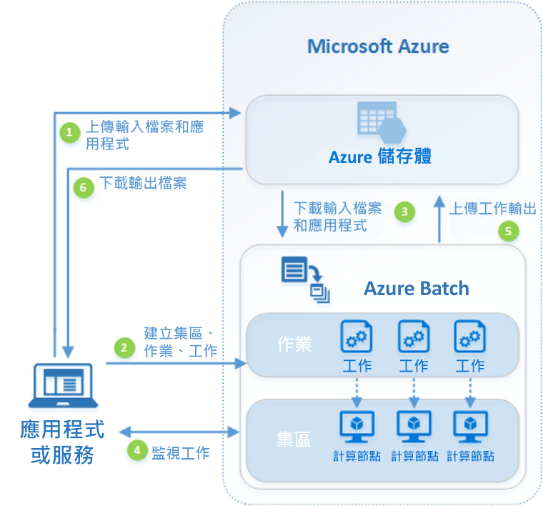

# 什麼是 Azure Batch？

使用 Azure Batch 在 Azure 中有效率地執行大規模的平行和高效能運算 (HPC) 批次作業。 Azure Batch 會建立和管理計算節點 (虛擬機器) 集區、安裝您要執行的應用程式，以及排定要在節點上執行的作業。 不需要安裝、管理或調整任何叢集或作業排程器軟體。 您會改用 [Batch API 和工具](batch-apis-tools.md)、命令列指令碼或 Azure 入口網站來設定、管理及監視您的作業。 

開發人員可以將 Batch 當作平台服務使用，以建置需要大規模執行的 SaaS 應用程式或用戶端應用程式。 例如，使用 Batch 建置一項可為金融服務公司執行 Monte Carlo 風險模擬的服務，或建置一項可處理許多影像的服務。

使用 Batch 不會額外收費。 您只須針對取用的基礎資源付費，例如虛擬機器、儲存體和網路。

如需 Batch 與 Azure 中其他 HPC 解決方案選項的比較，請參閱 [HPC、Batch 和 Big Compute 解決方案](../virtual-machines/linux/high-performance-computing.md)。

## 執行平行工作負載
Batch 很適合處理本質平行 (也稱為「超簡單平行」) 的工作負載。 本質平行的工作負載是指應用程式可獨立執行，且每個執行個體各自完成一部分的工作。 應用程式可能會在執行時存取一些通用資料，但不會與應用程式的其他執行個體進行通訊。 因此，本質平行的工作負載可大規模執行，而這是由可用來同時執行應用程式的計算資源數量所決定。

可以用 Batch 處理的一些本質平行工作負載範例：

* 使用 Monte Carlo 模擬的財務風險模型
* VFX 和 3D 影像轉譯
* 影像分析和處理
* 媒體轉碼
* 基因序列分析
* 光學字元辨識 (OCR)
* 資料擷取、處理和 ETL 作業
* 軟體測試執行

您也可以使用 Batch 來[執行緊密結合的工作負載](batch-mpi.md)；這些工作負載需要您執行的應用程式彼此通訊，而非獨立執行。 緊密結合的應用程式通常會使用訊息傳遞介面 (MPI) API。 您可以搭配 [Microsoft MPI](https://msdn.microsoft.com/library/bb524831(v=vs.85).aspx) 或 Intel MPI 來使用 Batch，以執行緊密結合的工作負載。 透過特定的 [HPC](../virtual-machines/linux/sizes-hpc.md) 和 [GPU 最佳化](../virtual-machines/linux/sizes-gpu.md)虛擬機器大小來改善應用程式效能。

一些緊密結合的工作負載範例：
* 有限元素分析
* 流體動力學
* 多重節點 AI 訓練

使用 Batch 可以平行執行許多緊密結合的作業。 例如，對流過管道 (管道寬度不同) 的液體執行多項模擬作業。

## 其他 Batch 功能

較高層級的工作負載專屬功能也適用 Azure Batch：
* Batch 支援使用轉譯工具的大規模[轉譯工作負載](batch-rendering-service.md)，轉譯工具包括 Autodesk Maya、3ds Max、Arnold 和 V-Ray。 
* R 使用者可以安裝 [doAzureParallel R 套件](https://github.com/Azure/doAzureParallel)，輕鬆地在 Batch 集區上相應放大 R 演算法的執行。

您也可以在 [Azure Data Factory](../data-factory/transform-data-using-dotnet-custom-activity.md) 等工具所管理的大型 Azure 工作流程中，使用 Batch 作業來轉換資料。

## 運作方式
Batch 的一個常見案例涉及在一組計算節點上相應放大本質平行工作，例如轉譯 3D 場景的影像。 這組計算節點可能是您的「轉譯伺服器陣列」，提供數十、數百或甚至數千個核心來轉譯作業。

下圖顯示常見 Batch 工作流程中的步驟，其中有一個用戶端應用程式或託管服務使用 Batch 執行平行工作負載。

|步驟  |說明  |
|---------|---------|
|1.將**輸入檔案**和處理這些檔案的**應用程式**上傳到您的 Azure 儲存體帳戶。     |輸入檔案可以是應用程式會處理的任何資料，例如財務模型化資料或要轉碼的視訊檔案。 應用程式檔案可以包含處理資料的指令碼或應用程式，例如媒體轉碼器。|
|2.在您的 Batch 帳戶中建立計算節點的 Batch **集區**、要在集區上執行工作負載的**作業**，以及作業中的**工作**。     | 集區節點就是執行工作的虛擬機器。 指定節點數目和節點大小等屬性、Windows 或 Linux 虛擬機器映像，以及將節點加入集區時要安裝的應用程式。 若要管理集區的成本與大小，可使用[低優先順序虛擬機器](batch-low-pri-vms.md)或隨著工作負載的變化[自動縮放](batch-automatic-scaling.md)節點數目。   當您將工作加入至作業時，Batch 服務會自動排程工作在集區中的計算節點上執行。 每一項工作會使用您上傳的應用程式來處理輸入檔。 |
|3.將**輸入檔案**和**應用程式**下載至 Batch     |每個工作在執行之前，可以將其要處理的輸入資料下載至指派的計算節點。 如果應用程式未安裝在集區節點上，您可以在這裡進行下載。 完成來自 Azure 儲存體的下載時，工作就會在指定的節點上執行。|
|4.監視**工作執行**     |執行工作時，請查詢 Batch 來監視作業及其工作的進度。 用戶端應用程式或服務可透過 HTTPS 來與 Batch 服務進行通訊。 因為您可能會監視在數千個計算節點上執行的數千個工作，請務必[有效率地查詢 Batch 服務](batch-efficient-list-queries.md)。|
|5.上傳**工作輸出**     |當工作完成時，它們可以將其輸出資料上傳至 Azure 儲存體。 您也可以直接從計算節點上的檔案系統擷取檔案。|
|6.下載**輸出檔案**     |當監視偵測到作業中的工作已完成時，用戶端應用程式或服務即可下載輸出資料來進一步處理。|

請記住，這只是使用 Batch 的一種方式，此案例只說明其部分功能。 例如，您可以在每個計算節點上[平行執行多項工作](batch-parallel-node-tasks.md)。 或者，使用[作業的準備與完成工作](batch-job-prep-release.md)為您的作業準備節點，並在之後加以清除。 

請參閱[適用於開發人員的 Batch 功能概觀](batch-api-basics.md)，以取得有關集區、節點、作業和工作的詳細資訊，以及在建置 Batch 應用程式時可使用的許多 API 功能。 另請參閱最新的 [Batch 服務更新](https://azure.microsoft.com/updates/?product=batch)。

## 後續步驟

透過下列其中一個快速入門開始使用 Azure Batch：
* [使用 Azure CLI 執行您的第一個 Batch 作業](quick-create-cli.md)
* [使用 Azure 入口網站執行您的第一個 Batch 作業](quick-create-portal.md)
* [使用 .NET API 執行您的第一個 Batch 作業](quick-run-dotnet.md)
* [使用 Python API 執行您的第一個 Batch 作業](quick-run-python.md)

